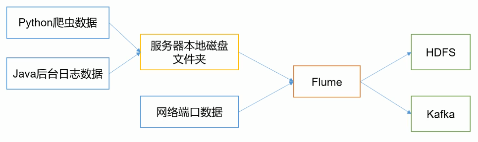
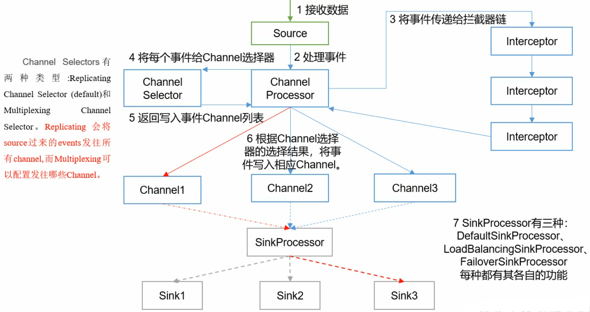
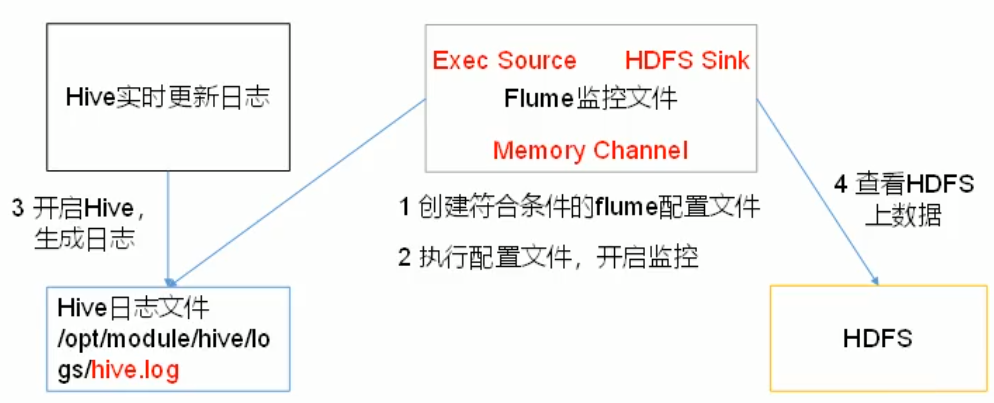
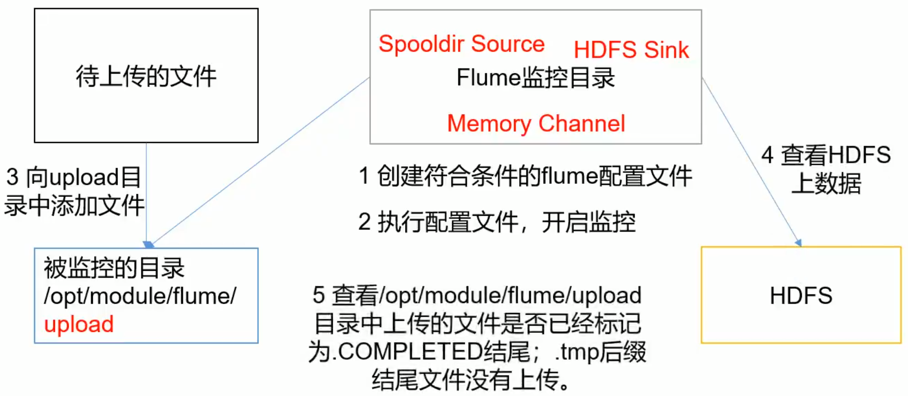
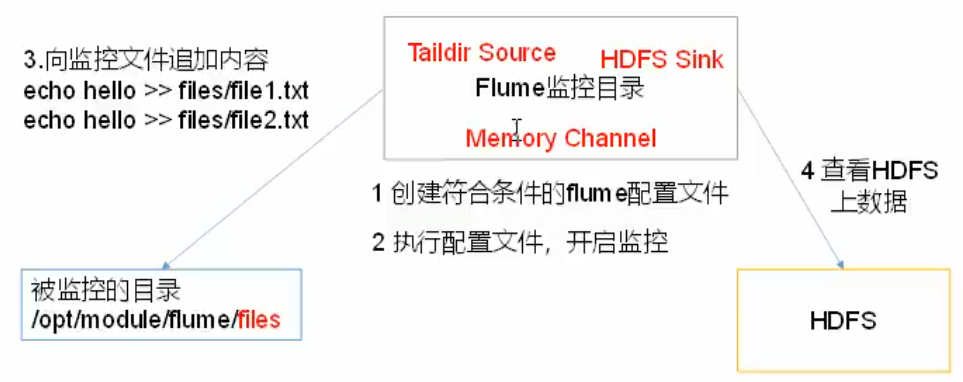
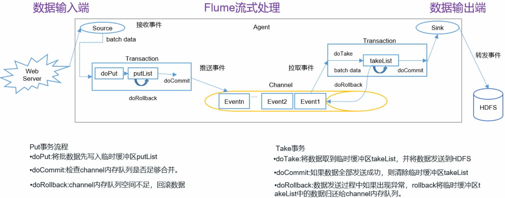
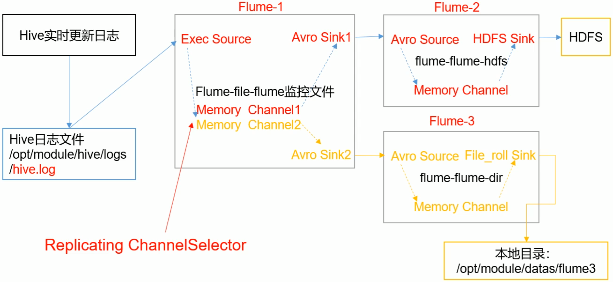
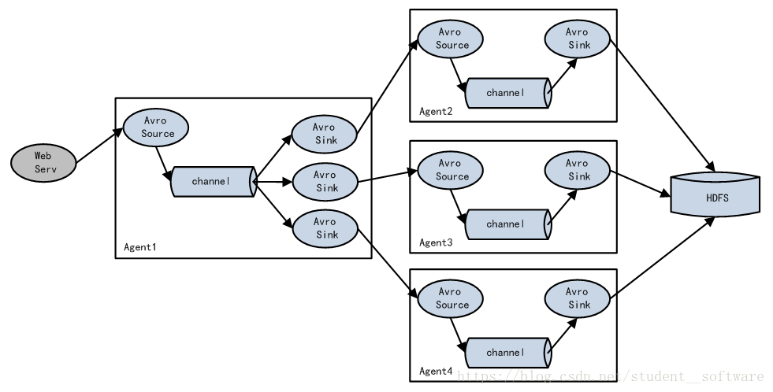
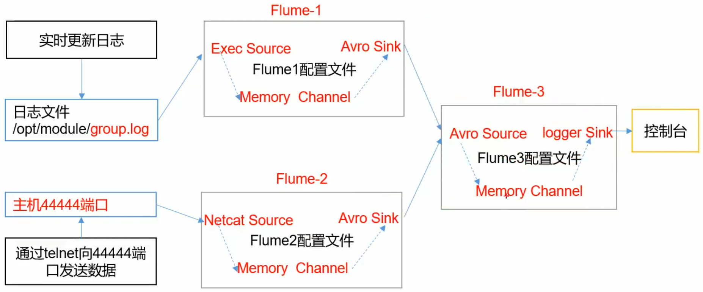
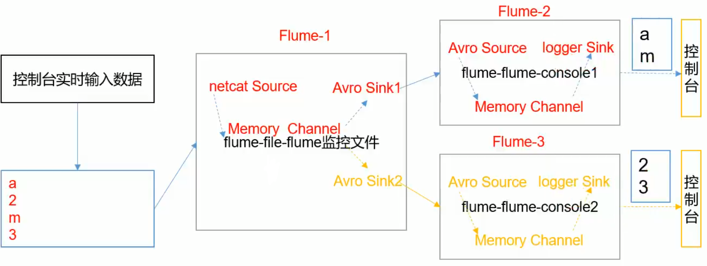

## 概述

https://www.cnblogs.com/qingyunzong/p/8994494.html



- 单一流
- 多代理流
- 合并流
- 多路复用流

## 组件

### Agent组件

本质就是一个JVM进程：以事件的形式，将数据从源头送至目的地；

主要有三个部分：

#### Source

负责接收数据到Flume Agent组件中；

Source可以处理各种格式，类型的日志：Avro，Thrift，JMS，HTTP，Exec等等

- Avro Source
- Netcat Source
- Thrift Source
- Exec Source
- JMS Source

#### Channel

位于Source和Sink之间的缓冲区，因此允许Source和Sink的处理速率不同；

**Channel线程安全，可以同时处理多个Source的写入操作和多个Sink的读取操作；**

主要两种Channel：

- Memory Channel：将事件写入内存，速度快，但是数据会因程序死亡，机器宕机而丢失；
- File Channel：将事件写入磁盘，速度慢，但是数据不会丢失；

#### Sink

不断的轮讯Channel中的事件，批量的移除他们，并将这些事件存储到指定的存储系统或发送至一个新的Agent;

- Sink是**完全事务性**的;
- Sink的一整个事务的逻辑：将事件从Channel中读取出来，发送给Sink的目标位置，当目标，接受完成，Sink将Channel中的事件移除；
- 详细看<Flume事务>

Sink组件的目的地：HDFS，Logger，Avro，Thrift，HBase

- HDFS Sink
- Kafka Sink
- Avro Sink
- HBase Sink

### Agent内部原理



## 配置

1. flume-env.sh

   ```shell
   export JAVA_HOME=/home/whr/workbench/jdk1.8
   ```

2. 具体的任务，使用具体的配置文件

3. 启动：

   ```shell、
   ./bin/flume-ng agent --conf conf --conf-file example.conf --name a1 -Dflume.root.logger=INFO,console
   ```

## 案例

### 监听NetCat

```properties
# 声明一个Agent：a1
a1.sources = r1
a1.channels = c1
a1.sinks = k1
# 配置每一个source的类型，监听的Ip，Port
a1.sources.r1.type = netcat
a1.sources.r1.bind=localhost
a1.sources.r1.port=9999

# 配置每个sink的类型
a1.sinks.k1.type = logger
# 配置Channel的类型，容量(单位：事件)，
a1.channels.c1.type = memory
a1.channels.c1.capacity = 1000
# 一次传输的数据量
a1.channels.c1.transactionCapacity=100

# 绑定(Source和Sink都可以有多个，需要绑定)
a1.sources.r1.channels=c1
a1.sinks.k1.channel=c1	
# sink的Channel只能有一个
```

Flume充当客户端；

```shell
# 启动Flume
$ ./bin/flume-ng agent --conf conf --conf-file ./conf/netcat-flume.conf --name a1 -Dflume.root.logger=INFO,console
# 使用下面命令传输数据
$ nc localhost 9999
```

### 实时监控单个追加文件



1. 要输出到HDFS，就需要Hadoop相关jar包

2. 创建file-flume-hdfs.conf文件

   ```properties
   # 声明一个Agent：a1
   a1.sources = r1
   a1.channels = c1
   a1.sinks = k1
   # Source的type：exec
   a1.sources.r1.type=exec
   # 监控的文件的路径 -F失败重试
   a1.sources.r1.command=tail -f /home/whr/workbench/hive/logs/hive.log
   
   # sink的类型
   a1.sinks.k1.type = logger
   # 配置Channel的类型，容量(单位：事件)，
   a1.channels.c1.type = memory
   a1.channels.c1.capacity = 1000
   # 一次传输的数据量
   a1.channels.c1.transactionCapacity=100
   
   # 绑定(Source和Sink都可以有多个，需要绑定)
   a1.sources.r1.channels=c1
   a1.sinks.k1.channel=c1	
   # sink的Channel只能有一个
   ```

3. 启动flume

   ```shell
   
   ```

4. 可以实时监控某一个文件的动态变化日志；

### 实时监控目录下多个新文件



1. 创建配置文件dir-flume-hdfs.conf

   ```properties
   a2.sources=r2
   a2.sinks=k2
   a2.channels=c2
   
   a2.sources.r2.type=spooldir
   # 监控目录
   a2.sources.r2.spoolDir=/home/whr/Desktop/update
   # 忽略.tmp文件
   a2.sources.r2.ignorePattern = ([^ ]*\.tmp)
   a2.sinks.k2.type=hdfs
   # hdfs路径
   a2.sinks.k2.hdfs.path=hdfs://master:9000/flume/data
   # 上传文件的前缀
   a2.sinks.k2.hdfs.filePrefix=logs-
   # 是否按时间滚动文件夹
   a2.sinks.k2.hdfs.round=true
   # 多长时间创建一个新的文件夹
   a2.sinks.k2.hdfs.roundValue=1
   # 重新定义时间单位
   a2.sinks.k2.hdfs.roundUnit=hour
   # 是否使用本地时间戳
   a2.sinks.k2.hdfs.useLocalTimeStamp=true
   # 积攒多少个Event才flush到hdfs一次
   a2.sinks.k2.hdfs.rollInterval=30
   # 设置每个文件的滚动大小
   a2.sinks.k2.hdfs.rollSize=134217700
   # 文件滚动与Event的数量无关
   a2.sinks.k2.hdfs.rollCount=0
   
   a2.channels.c2.type=memory
   a2.channels.c2.capacity=1000
   a2.channels.c2.transactionCapacity=100
   
   a2.sources.r2.channels=c2
   a2.sinks.k2.channel=c2
   ```

2. 启动flume

   ```shell
   $ ./bin/flume-ng agent -c conf/ -f ./conf/demo/dir-flume-hdfs.conf --name a2
   ```

3. 发现目标目录中的文件都会被添加一个后缀名：COMPLETED

   ```shell
   -rw-r--r-- 1 whr whr 11 11月 23 21:01 a.txt.COMPLETED
   -rw-r--r-- 1 whr whr 12 11月 23 21:01 b.txt.COMPLETED
   -rw-r--r-- 1 whr whr 12 11月 23 21:01 c.txt.COMPLETED
   -rw-r--r-- 1 whr whr  4 11月 23 21:07 d.txt.COMPLETED
   ```

4. 只能监控新增的文件，对于文件的修改是不允许，也监控不到的；

### 实时监控目录下多个追加文件



1. 创建配置文件files-flume-hdfs.conf

   ```properties
   # 声明一个Agent：a1
   a1.sources = r1
   a1.channels = c1
   a1.sinks = k1
   # Source的type：TAILDIR
   a1.sources.r1.type=TAILDIR
   a1.sources.r1.filegroups=f1
   a1.sources.r1.filegroups.f1=/home/whr/Desktop/update/.*.txt
   # 为每一个监控的文件保存一个inode绝对路径
   a1.sources.r1.positionFile=/home/whr/workbench/flume-1.9/position/position.json
   # sink的类型
   a1.sinks.k1.type = logger
   
   # 配置Channel的类型，容量(单位：事件)，
   a1.channels.c1.type = memory
   a1.channels.c1.capacity = 1000
   # 一次传输的数据量
   a1.channels.c1.transactionCapacity=100
   
   # 绑定(Source和Sink都可以有多个，需要绑定)
   a1.sources.r1.channels=c1
   a1.sinks.k1.channel=c1	
   # sink的Channel只能有一个
   ```

2. 启动Flume

   ```shell
   $ ./bin/flume-ng agent -c conf/ -f ./conf/demo/files-flume-hdfs.conf --name a1 -Dflume.root.logger=INFO,console
   ```

3. 实时追加文本到目录下的任意文件，控制台都能监控到

   ```shell
   $ echo hello >> update/b.txt
   ```

4. 看一下postion/position.json的文件内容

   定位了三个文件的绝对路径和唯一的inode

   实时添加新文件到监控路径下，position.json会实时增加新的inode

   ```json
   [{"inode":9571668,"pos":17,"file":"/home/whr/Desktop/update/a.txt"},{"inode":9571669,"pos":24,"file":"/home/whr/Desktop/update/b.txt"},{"inode":9571670,"pos":12,"file":"/home/whr/Desktop/update/c.txt"}]
   ```

## Flume事务



- Channel是完全被动的，只能被Source推送和被Sink拉取；
- 存在两个事务：Source到Channel（Put事务）和Channel到Sink（Take事务）；
  - Source到Channel：Source将采集的数据存入缓存，再从缓存中存入Channel中，则完成事务；
  - Channel到Sink：将事件从Channel中读取出来，发送给Sink的目标位置，当目标，接受完成，Sink将Channel中的事件移除；则完成事务；
- 事务的执行过程的中，都存在缓冲区；

## Flume拓扑结构

### 简单串联


### 复制和多路复用


这种结构可以实现多副本结构，对同一个资源，产生多个副本，用于不同的用途；

案例：



- Flume1：监控日志文件的变动，产生两个副本，分发给Flume2，Flume3
- Flume2：将日志存储在HDFS
- Flume3：将日志存储在本地文件目录

### 负载均衡和故障转移



- 负载均衡：使用多个sink进行负载均衡
- 故障转移：如果其中一个子Agent出现故障，依然可以使用其他的Agent

### 聚合


集群模式：将多个集群的数据采集，统一处理；



- Flume1，Flume2采集各个集群的数据，发送给Flume3；
- Flume3进行数据的聚合，打印到控制台；

1. 配置Flume-1

   ```Properties
   # Flume-1 采集文件数据
   a1.sources = r1
   a1.channels = c1
   a1.sinks = k1
   # Source的type：exec
   a1.sources.r1.type=TAILDIR
   a1.sources.r1.filegroups=f1
   a1.sources.r1.filegroups.f1=/home/whr/flumeData/flumeLog.txt
   # 为每一个监控的文件保存一个inode绝对路径
   a1.sources.r1.positionFile=/home/whr/workbench/flume-1.9/position/position.json
   # Channel
   a1.channels.c1.type = memory
   a1.channels.c1.capacity = 1000
   a1.channels.c1.transactionCapacity=100
   # Sink
   a1.sinks.k1.type=avro
   a1.sinks.k1.hostname=master
   a1.sinks.k1.port=9999
   # bind
   a1.sources.r1.channels=c1
   a1.sinks.k1.channel=c1	
   ```

2. 配置Flume-2

   ```Properties
   # Flume-2:监听netcat端口
   a2.sources = r1
   a2.channels = c1
   a2.sinks = k1
   # 读取本机netcat的数据
   a2.sources.r1.type = netcat
   a2.sources.r1.bind=localhost
   a2.sources.r1.port=9999
   # Channel
   a2.channels.c1.type = memory
   a2.channels.c1.capacity = 1000
   a2.channels.c1.transactionCapacity=100
   # Sink
   a2.sinks.k1.type=avro
   a2.sinks.k1.hostname=master
   a2.sinks.k1.port=9999
   # 绑定
   a2.sources.r1.channels=c1
   a2.sinks.k1.channel=c1	
   ```

3. 配置Flume-3

   这里可以配置两个source，分别监控不同的端口；

   ```Properties
   # Flume-3
   a3.sources = r1
   a3.channels = c1
   a3.sinks = k1
   # Source:接受Flume-1，Flume-2的数据
   a3.sources.r1.type=avro
   a3.sources.r1.bind=master
   a3.sources.r1.port=9999
   # Channel
   a3.channels.c1.type = memory
   a3.channels.c1.capacity = 1000
   a3.channels.c1.transactionCapacity=100
   # sink
   a3.sinks.k1.type = logger
   # 绑定
   a3.sources.r1.channels=c1
   a3.sinks.k1.channel=c1	
   ```

4. 顺序启动Flume-3，Flume-1，Flume-2

   ```shell
   # Flume-3
   $ ./bin/flume-ng agent -c conf/ -f conf/demo/flume3.conf -n a3 -Dflume.root.logger=INFO,console
   # Flume-1
   $ ./bin/flume-ng agent -c conf/ -f conf/demo/flume1.conf -n a1
   # Flume-2
   $ ./bin/flume-ng agent -c conf/ -f conf/demo/flume2.conf -n a2
   ```

5. 这样Flume3的控制台就可以监控Flume-1，Flume-2的数据变动；

## 自定义Intercept

主要是过滤不同类型的日志，分发给不同的分析系统；

下图Flume-1应该有两个Channel，分别绑定两个Sink



1. 自定义拦截器

   打成jar包，放到对应的Flume的lib目录下

   ```java
   /**
    * 自定义Flume的Interceptor
    * 1. 实现Interceptor接口
    * 2. 重写4个方法
    * 3. 定义静态内部Builder类实现Interceptor.Builder
    */
   public class TypeInterceptor implements Interceptor {
       // 声明一个事件集合
       private List<Event> headerEvents;
       public void initialize() {
           // 初始化事件集合
           headerEvents=new ArrayList<Event>();
       }
       /**
        * 单个事件拦截
        * @param event：接收的每个Event
        * @return
        */
       public Event intercept(Event event) {
           /**
            * 1. 获取事件的头信息(Key-Value)
            * 2. 获取事件的body信息(字节流)，包装成String
            * 3. 业务逻辑：根据body的日志类型，添加不同的头信息到headers
            */
           Map<String, String> headers = event.getHeaders();
           byte[] bodyBtyes = event.getBody();
           String body = new String(bodyBtyes);
           // 业务逻辑:全为英文返回event1,否则返回event2
           if (body.matches("[a-zA-Z]+")){
               headers.put("type","event1");
           }else {
               headers.put("type","event2");
           }
           return event;
       }
       /**
        * 批量事件的拦截
        * @param list
        * @return
        */
       public List<Event> intercept(List<Event> list) {
           /**
            * 1. 清空集合
            * 2. 为每一个事件添加头信息
            * 3. 返回处理过后的headers集合
            */
           headerEvents.clear();
           for (Event event:headerEvents){
               Event res = intercept(event);
               headerEvents.add(res);
           }
           return headerEvents;
       }
       public void close() {
       }
       // 静态内部类
       public static class Builder implements Interceptor.Builder{
           public Interceptor build() {
               return new TypeInterceptor();
           }
           public void configure(Context context) {
           }
       }
   }
   ```

2. 配置conf文件

   - Flume-1：需要配置两个sink，并将jar包放在此机器下

     ```properties
     # Flume-3
     a3.sources = r1
     a3.channels = c1 c2
     a3.sinks = k1 k2
     # Source:
     a3.sources.r1.type = netcat
     a3.sources.r1.bind = localhost
     a3.sources.r1.port = 9999
     # Interceptor
     a3.sources.r1.interceptors = i1
     a3.sources.r1.interceptors.i1.type= flume.interceptor.TypeInterceptor$Builder
     # channel selector
     a3.sources.r1.selector.type=multiplexing
     a3.sources.r1.selector.header=type
     # 不同事件绑定不同的Channel
     a3.sources.r1.selector.mapping.event1=c1
     a3.sources.r1.selector.mapping.event2=c2
     # Channel-1
     a3.channels.c1.type = memory
     a3.channels.c1.capacity = 1000
     a3.channels.c1.transactionCapacity=100
     # Channel-2
     a3.channels.c2.type = memory
     a3.channels.c2.capacity = 1000
     a3.channels.c2.transactionCapacity=100
     # sink1
     a3.sinks.k1.type = avro
     a3.sinks.k1.hostname=slave1
     a3.sinks.k1.port=9999
     # sink2
     a3.sinks.k2.type = avro
     a3.sinks.k2.hostname=slave2
     a3.sinks.k2.port=9999
     # 绑定
     a3.sources.r1.channels=c1 c2
     a3.sinks.k1.channel=c1
     a3.sinks.k2.channel=c2
     ```

   - Flume-2，Flume-3配置相同

     但是a1.sources.r1.bind = slave1绑定当前机器

     ```properties
     # Flume-1：监听master的9999端口信息
     a1.sources = r1
     a1.channels = c1
     a1.sinks = k1
     # Source:监听master
     a1.sources.r1.type = avro
     a1.sources.r1.bind = slave1
     a1.sources.r1.port = 9999
     # Channel-1
     a1.channels.c1.type = memory
     a1.channels.c1.capacity = 1000
     a1.channels.c1.transactionCapacity=100
     # sink1
     a3.sinks.k1.type = logger
     # 绑定
     a1.sources.r1.channels=c1
     a1.sinks.k1.channel=c1
     ```

3. 启动：

   先启动Flume2,3，最后启动flume1

   ```shell
   # 启动Flume-2,3
   $ ./bin/flume-ng agent -c conf/ -f conf/demo/flume-interceptor-1.conf -n a1 -Dflume.root.logger=INFO,console
   
   $ ./bin/flume-ng agent -c conf/ -f conf/demo/flume-interceptor-2.conf -n a2 -Dflume.root.logger=INFO,console
   # 启动Flume-1
   $ ./bin/flume-ng agent -c conf/ -f conf/demo/flume-interceptor-3.conf -n a3
   ```

4. 这样，启动netcat之后，输入文本，在Flume2,3中可以看到控制台过滤不同信息

## 自定义Source

1. 自定义Source

```java
public class MySource extends AbstractSource implements Configurable, PollableSource {
    // 定义前缀,后缀;工程中是从配置文件中读取
    private String prefix;
    private String subfix;
    /**
     * 1. 给事件定义一些前缀,来封装成我们需要的事件的格式
     * 2. 前缀是从配置文件中读取出来
     */
    public void configure(Context context) {
        context.getString("prefix","prefix");
        context.getString("subfix","subfix");
    }
    public Status process() throws EventDeliveryException {
        /**
         * 核心方法
         * 1. 接收数据
         * 2. 封装成事件(封装为Header和Boby)
         * 3. 将事件传给Channel
         */
        Status status=null;
        try {
            for (int i = 0; i < 5; i++) {
                // 拿到数据,封装成Event
                SimpleEvent event = new SimpleEvent();
                // 对Event进行自定义处理
                event.setBody((prefix+"<=====>message<=====>"+subfix).getBytes());
                // 将事件传给了Channel
                getChannelProcessor().processEvent(event);
                status = Status.READY;
            }
        } catch (Exception e) {
            e.printStackTrace();
            status = Status.BACKOFF;
        }
        // 让此方法有一些间隙,2秒执行一次
        try {
            Thread.sleep(2000);
        } catch (InterruptedException e) {
            e.printStackTrace();
        }
        return status;
    }
    public long getBackOffSleepIncrement() {
        return 0;
    }
    public long getMaxBackOffSleepInterval() {
        return 0;
    }
}
```

2. 配置文件(这里仅配置一个做测试)

```properties
a1.sources = r1
a1.channels = c1
a1.sinks = k1

a1.sources.r1.type = flume.source.MySource
a1.sources.r1.prefix=UserId
a1.sources.r1.subfix=log in

a1.sinks.k1.type = logger

a1.channels.c1.type = memory
a1.channels.c1.capacity = 1000
a1.channels.c1.transactionCapacity=100

a1.sources.r1.channels=c1
a1.sinks.k1.channel=c1	
```

3. 启动

```shell
$ ./bin/flume-ng agent -c conf/ -f conf/demo/flume-source-3.conf -n a1 -Dflume.root.logger=INFO,console
```

## 自定义Sink

Sink不断轮讯Channel,将事件从Channel中移除,

测试流程：Source（netcat）-----Channel------自定义Sink

1. Sink自定义代码

```java
public class MySink extends AbstractSink implements Configurable {

    // 自定义前后缀
    private String prefix;
    private String subfix;
    // 我们测试将sink输出到logger
    private Logger logger = LoggerFactory.getLogger(MySink.class);
    public void configure(Context context) {
        prefix=context.getString("prefix","prefix");
        subfix=context.getString("subfix","subfix");
    }
    public Status process() throws EventDeliveryException {
        /**
         * 1. 获取Channel
         * 2. 从Channel中获取事务，数据
         * 3. 发送数据
         */
        Status status =null;
        /**
         * 拿到Channel
         * 获取事务
         * 开启事务---->拿到Event------>业务处理Event
         * 回滚
         */
        Channel channel = getChannel(); // 是一个synchronized同步方法
        Transaction transaction = channel.getTransaction();
        transaction.begin();
        try {
            Event event = channel.take();
            // 业务处理Evnet
            String bobyString = new String(event.getBody());
            logger.info(bobyString+"==>MySink");
            transaction.commit();
            status=Status.READY;
        } catch (ChannelException e) {
            e.printStackTrace();
            // rollback
            transaction.rollback();
            status=Status.BACKOFF;
        }finally {
            // 关闭事务
            transaction.close();
        }
        return status;
    }
}
```

2. 置文件

```properties
a1.sources = r1
a1.channels = c1
a1.sinks = k1

a1.sources.r1.type=netcat
a1.sources.r1.bind=localhost
a1.sources.r1.port=9999

a1.sinks.k1.type = flume.sink.MySink
a1.sinks.k1.prefix = MySink
a1.sinks.k1.subfix = MySink

a1.channels.c1.type = memory
a1.channels.c1.capacity = 1000
a1.channels.c1.transactionCapacity=100

a1.sources.r1.channels=c1
a1.sinks.k1.channel=c1
```

3. 运行

```shell
$ ./bin/flume-ng agent --conf conf --conf-file ./conf/demo/flume-sink-3.conf --name a1 -Dflume.root.logger=INFO,console
```

## Flume数据流监控

Flume的数据流监控工具：Ganglia（一个工具）


## 面试

- Flume三个组件的作用

- Flume的事务机制

  见Flume事务

- Flume采集的数据会丢失吗

  根据Flume的架构，是不会丢失数据；

  内部有完善的事务机制——》Flume事务

  可能存在的数据丢失的情况：

  （1）Channel使用memoryChannel，Agent宕机，导致数据丢失；

  （2）Channel存储的数据已满，导致Source不能再写入，这些数据有可能丢失；

- Flume的数据重复

  数据已经由Sink发出，但是没有收到响应，Sink会再次发送数据，导致数据的重复；


