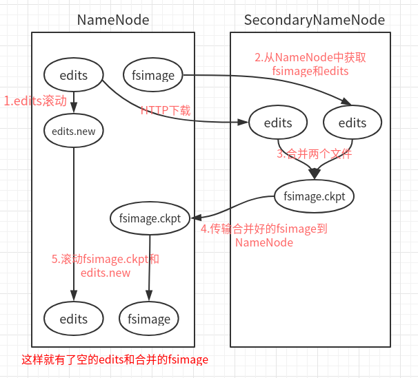
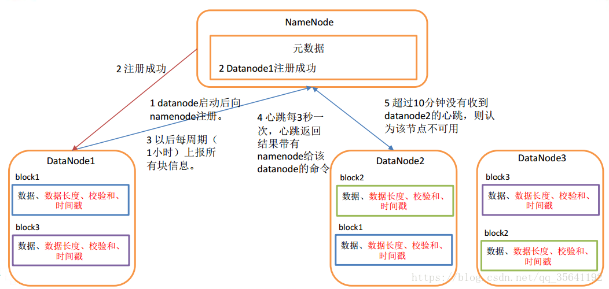
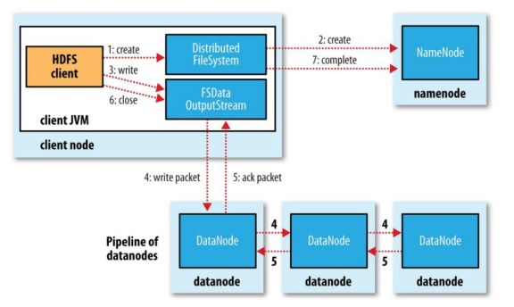
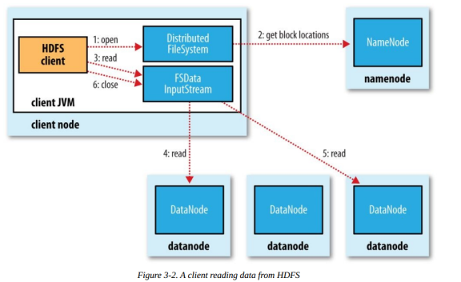

# HDFS

## 概述

基于**流数据模式访问**和**处理超大文件**的需求而开发的。

HDFS不适合的应用类型

- 低延时的数据访问 

  HDFS是为高吞吐数据传输设计的,因此可能牺牲延时HBase更适合低延时的数据访问。

- 大量小文件 

  文件的元数据保存在NameNode的内存中， 整个文件系统的文件数量会受限于NameNode的内存大小。 

- 多方读写，需要任意的文件修改 

  HDFS采用追加的方式写入数据。不支持文件任意修改。不支持多个写入器（writer）。

## 相关概念

### 块（Block）

HDFS文件系统的文件被分成块进行存储；HDFS被设计出来就是处理大文件的；

块默认大小：64M；小于一个块大小的文件不会占据整个块的空间；

好处：

1. 它将超大文件分成众多块，分别存储在集群的各个机器上；
2. 简化存储系统：块的大小固定，更利于管理，复制，备份，容错，并且便于元数据去统计、映射；

块的大小可以自行设置，但是必须是64M的整数倍（hdfs-site.xml）

```xml
<property>
    <name>dfs.block.size</name>
    <value>512000</value>
</property>
```

为什么块要设置这么大？

```
目的是：最小化寻址开销
比如：寻址时间需要10ms
1.块=1M，寻址64M文件，需要640ms
2.块=64M，需要10ms
```

块的设置不能太大，因为MapReduce任务是按块来处理的，块太大，任务少，作业效率就低了；

从用户角度看，存储一个文件在HDFS上，是通过NameNode看到的

从内部角度看，文件被切分之后存储在多个DataNode上，元数据存储在NameNode；

块存储位置：在datanode目录下

每个块由两个文件组成：文件信息和meta校验信息

```
-rw-r--r-- 1 root root    355 9月  10 18:21 blk_1073741839
-rw-r--r-- 1 root root     11 9月  10 18:21 blk_1073741839_1015.meta
```

### NameNode

NameNode、DataNode分别承担Master、Worker的角色；

##### 作用：

1. 维护元数据信息（内存）；即：管理文件的命名空间（哪个文件在哪个DataNode）

2. 维护文件系统树及整棵树内的所有文件和目录（磁盘）；通过这两个文件来管理
   
   - 命名空间镜像文件（NameSpace image）
   - 编辑日志文件（Edit log）：只有4M
   
   （存放目录：hadoop/data/tmp/dfs/name/current/）
   
3. 响应客户端请求（内存）；

##### 元数据形式：

存放目录：

```shell
# 目录	 副本数   Block数	       每个Block及副本位置，h为主机名
/test/a.log, 3, {blk_1,blk_2}, [{blk_1:[h1,h1,h2]}, {blk_2:[h0,h2,h4]}]
```

##### 元数据记录过程：

1. 首先记录在内存中，因为内存响应速度块；
2. 然后追加到Edit log文件中；
3. 定期再将Edit log文件内容，持久化到fsimage磁盘文件中；

##### CheckPoint：

（安全机制的一种考虑）

即：Edit log文件持久化到fsimage中的操作；此动作是在Secondary NameNode中进行的；

Secondary NameNode一般运行在一台单独的机器上，因为合并需要大量的CPU和内存，并且会一直存储合并过的命名空间镜像，以免NN宕机；

1. Edit log文件快满了，NN通知SN，进行CheckPoint；
2. NN停止写入Edit log，并生成新的New Edit log文件，来继续记录日志；
3. SN拿到Old Edit log和fsimage副本，并进行合并；
4. 合并完成，再上传给NN，并删除Old Edit log；



### DataNode

即：工作节点；

##### 作用：

1. 执行具体的任务：存储文件块，被客户端和NameNode调用；
2. 通过心跳（HeartBeat）定时向NameNode发送所存储的文件的块信息

##### 工作机制

1. DataNode启动，对本地磁盘扫描，上报Block信息给NameNode

2. 通过心跳机制（heartbeat.interval=3s）与NameNode保持联系，心跳的返回带有NameNode命令信息；

3. 如果NameNode 10分钟（2* heartbeat.recheck.interval）没有收到DataNode的心跳，则认为lost，复制其Block到其他DataNode

   

##### 数据的完整性

1. 创建Block的同时创建checksum，并周期性验证checksum值；
2. 当DataNode读取Block的时候，会计算checksum值，与创建时的值对比；
3. 如果值不一样，认为Block损坏；会继续读取副本Block

##### 目录结构

DataNode文件不需要格式化；

1. DataNode版本号：./data/tmp/dfs/data/current

   ```shell
   [root@hadoop1 current]# cat VERSION 
   #Tue Sep 10 17:51:35 CST 2019
   storageID=DS-cc66bc73-0d4d-47a3-8727-69f323c7ae89	# 存储id
   clusterID=CID-39e1d84b-8dad-4578-8fdf-f2207368b981	# 集群id，全局唯一
   cTime=0	# 记录创建时间
   datanodeUuid=b5c00298-fbc8-4666-8f35-cc27cb7316b1	# 此node唯一标识码
   storageType=DATA_NODE	# 存储类型
   layoutVersion=-56	# 版本号
   ```

2. 数据块Block版本号：

   data/tmp/dfs/data/current/BP-1551134316-192.168.238.129-1568108968205/current

   ```shell
   [root@hadoop1 current]# cat VERSION 
   #Tue Sep 10 17:51:35 CST 2019
   namespaceID=1573478873	# namenode通过此id区分不同的datanode
   cTime=0	#
   blockpoolID=BP-1551134316-192.168.238.129-1568108968205	# 唯一标识一个block pool
   layoutVersion=-56	# 版本号
   ```

##### 在集群中添加新的DataNode

参考：

https://blog.csdn.net/qq_35641192/article/details/80303879

## HDFS工作流程

读写流程

https://www.cnblogs.com/laowangc/p/8949850.html

下面提到的**FileSystem是DistributedFileSystem的一个实例对象**；

### 读



1. Client调用FileSystem.open()方法：

   FileSystem通过**RPC**与NN通信，NN返回该文件的**部分Block列表**（需要的每一个块在哪个DataNode）；

   Hadoop会自动算出Client与各个DataNode的距离，选出最短距离的DataNode；

   读取到FSDataInputStream输入流中，并返回给客户端；

2. Client调用FSDataInputStream.read()方法：

   开始读取Block，读取完一个Block，进行**checksum验证**，如果出现错误，就从下一个有该拷贝的DataNode中读取；

   每读取一个Block，就关闭此DataNode的输入流连接，并找到下一个最近的DataNode继续读取；

   如果**Block列表**读完了，总文件还没有结束，就继续从NN获取下一批Block列表，重复调用read；

3. Client调用FSDataInputStream.close()方法；结束读取

### 写



1. Client调用FileSystem的create()方法：

   FileSystem向NN发出请求，在NN的namespace里面创建一个新的文件，但是并不关联任何DataNode；

   NN检查文件是否已经存在、操作权限；如果检查通过，NN记录新文件信息，并在某一个DataNode上创建数据块；

   NN返回一个FSDataOutputStream对象，用于Client写入数据；

2. Client调用输出流的FSDataOutputStream.write()方法：

   开始写入数据，首先FSDataOutputStream会将数据分割成一个个包，放入数据队列；

   根据NN返回的副本数，以及DataNode列表，先写入第一个DataNode，此DataNode会推送给下一个DataNode，以此类推，直到副本数创建完毕；（每次都会向队列返回确认信息）

3. Client调用输出流的FSDataOutputStream.close()方法：

   完成写入之后，调用close方法，flush数据队列的数据包，NN返回成功信息；

## HDFS基本命令

命令行键入：hadoop fs 即可查看命令

```shell
1.创建目录：(/ 为根目录)
    hadoop fs -mkdir /test
    hadoop fs -mkdir /test/input (前提test目录必须存在)
2.查看文件列表：（查看根目录的文件列表）
    hadoop fs -ls /
3.上传文件到HDFS：
    hadoop fs -put /home/whr/a.dat /test/input/a.dat 
    复制：
    hadoop fs -copyFromLocal -f /home/whr/a.dat /test/input/a.dat 
4.下载文件到本地：
    hadoop fs -get /test/input/a.dat /home/whr/a.dat
    复制：
    hadoop fs -copyToLocal -f /test/input/a.dat /home/whr/a.dat
5.查看HDFS 文件内容：
    hadoop fs -cat /test/input/a.dat 
6.删除HDFS文件：
    hadoop fs -rm /test/input/a.dat
7.修改hdfs文件的用户：用户组
    hadoop fs -chown user_1:group_1 /a.txt
8.查看/test磁盘空间
    hadoop fs -df /test
9.删除全部
    hadoop fs -rm -r hdfs://whr-PC:9000/*
```

