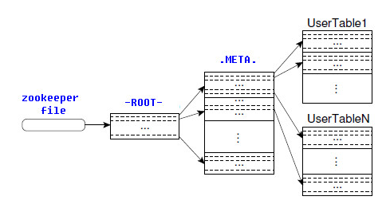

# HBase

一个NoSQL数据库

**HBase的表数据存储在hdfs文件系统中**

## 配置

1. hbase-env.sh

   ```shell
   export JAVA_HOME=
   export HBASE_MANAGES_ZK=false
   ```

2. hbase-site.xml

   ```xml
   <configuration>
   	<property>
   		<!-- HBase根目录 -->
   		<name>hbase.rootdir</name>
   		<value>hdfs://master:9000/HBase</value>
   	</property>
   	<property>
   　　　　<name>hbase.tmp.dir</name>
   　　　　<value>/home/whr/workbench/hbase/tmp</value>
   　　</property>
   	<property>
   		<!-- flase表示单机，true：分布式 -->
   		<name>hbase.cluster.distributed</name>
   		<value>true</value>
   	</property>
   	<property>
   		<!-- master端口，默认服务端口16000 -->
   		<name>hbase.master.port</name>
   		<value>16000</value>
   	</property>
   	<property>
   		<!-- zookeeper集群主机 -->
   		<name>hbase.zookeeper.quorum</name>
   		<value>master,slave1,slave2</value>
   	</property>
   	<property>
   		<name>hbase.zookeeper.property.dataDir</name>
   		<value>/home/whr/workbench/zookeeper/zkData</value>
   	</property>
   </configuration>
   ```

3. 将Hadoop的core-site.xml和hdfs-site.xml复制到Hbase/conf目录下

4. 配置高可用:

   新建backup-masters文件,添加备用master

   ```xml
   slave1
   slave2
   ```

### 启动

```shell
~/workbench/hbase/bin$ ./start-hbase.sh
```

进程

master：HMaster，HRegionServer

slave1：HRegionServer

slave2：HRegionServer

## 特点

1. 海量存储

2. 列式存储

   列族存储；

   列族下可以有很多列；

3. 极易扩展

   横向可以添加RegionServer的机器，进行水平扩展，提升处理能力；

   存储依靠HDFS，可以进行存储扩展；

4. 高并发

5. 稀疏性

   列族中，可以指定任意多的列，在列数据为空的情况下，不会占用存储空间；

所以HBase有它的优势:

- 存储容量可以先行扩展 ( 扩展更多的列 )
- 安全性可靠性极高

**每次查询需要指定坐标**

表名Table--->行键RowKey--->列族Family--->列名Column--->版本Version

## 配置

1. 将hadoop的hdfs-site.xml和core-site.xml放在 Hbase/conf/下

2. 修改hbase-env.sh


```shell
# 启动：
$ ./bin/start-hbase.sh

# 停止：
$ ./bin/hbase-daemon.sh stop master
$ ./bin/hbase-daemon.sh stop regionserver
```

## HBse成员:

- HBase由HMaster和HRegionServer组成，同样遵从**主从服务器架构**
- 表的每一个列族会被切割成多个**HRegion**存储在不同的**HRegionServer**中
- **HMaster**负责所有的**HRegionServer**,**HMaster**本身不存储任何数据,存储的是**元数据**(数据到HRegionServer的映射关系)


#### HMaster

DDL操作，Master完全不参与DML操作

管理所有的HRegionServer，告诉其需要维护哪些HRegion，并监控所有HRegionServer的运行状态。

#### HRegionServer

(HBase最核心的模块)

DML操作

- HBase中的所有数据从底层来说一般都是保存在HDFS中的，用户通过一系列HRegionServer获取这些数据
- HRegionServer主要负责响应用户I/O请求，向HDFS文件系统读写数据
- HRegionServer内部管理了一系列HRegion对象（维护多个Region）

#### HRegion

(表的切片，可以认为是表)

- 当表大小超过一定值,会被切分,每一块就是HRegion,在分割的时候,会标注**起始行,结束行**
- 一张完整的表数据是保存在多个HRegion中的
- HRegion由多个HStore组成，每个HStore对应了逻辑表中的一个列族的存储

#### Store

(可以认为是列族)

- 由**MemStore**和**StoreFiles(只读)**两部分组成（StoreFile物理层面是存储在HDFS上）

1. MemStore是内存缓冲区，用户写入的数据首先会放入MemStore，当MemStore满了以后会Flush成一个StoreFile
   - *(因为StoreFile是只读的,不能写,只能不断形成多个StoreFile,在进行合并)*
2. 当StoreFile的文件数量增长到一定阈值后，会触发**Compact合并操作**，将多个StoreFiles合并成一个StoreFile，合并过程中会进行版本合并和数据删除操作
3. 当StoreFiles Compact后，会逐步形成越来越大的StoreFile，当单个StoreFile大小超过一定阈值后，会触发**Split操作**，同时把当前的HRegion Split成2个HRegion，父HRegion会下线，新分出的2个子HRegion会被HMaster分配到相应的HRegionServer，使得原先1个HRegion的负载压力分流到2个HRegion上

#### HLog

(预写入日志，用作数据恢复)

- 每个HRegionServer中都有一个HLog对象
- 每次用户操作将数据写入MemStore的时候，也会写一份数据到HLog文件中，HLog文件会定期滚动刷新，并删除旧的文件（已持久化到StoreFile中的数据）

**数据恢复**

1. 当HMaster通过Zookeeper感知到某个HRegionServer意外终止时，HMaster首先会处理遗留的 HLog文件

2. 将这些HLog分配到其他的HRegionServer下

3. 被分配到的HRegionServer在加载HRegion的时候,会发现这些HLog,从而进行加载,完成数据恢复(重复HStore的存储过程)

---

### HBase表结构


RowKey用于**定位**和**唯一标示一行**

## HBase的存储结构

#### META表和ROOT表



## HBase读写流程

- 数据在更新时首先写入HLog和MemStore
- StoreFile是只读的，一旦创建后就不可以再修改,只能不断创建多个StoreFile,再进行合并

### 写操作


1. Client向Zookeeper请求meta表所在的RegionServer，zookeeper返回meta表所在主机；
2. client请求对应主机，拿到meta表，并做缓存，下次先读缓存，没有再请求zookeeper；
3. 找到要写入表所在RegionServer，发送put请求
4. 数据先被写入HLog，再被写入HRegion的MemStore，至此，Client的写入操作完成。

### 读操作


1. client访问Zookeeper，请求meta表
2. 从.META.表查找，获取存放目标数据的HRegion信息，从而找到对应的HRegionServer
3. 通过HRegionServer获取需要查找的数据
4. **HRegionserver的内存分为MemStore和BlockCache两部分**，MemStore主要用于写数据，BlockCache主要用于读数据。
5. 同时读取MemStore和StoreFile的数据，在BlockCache中进行merge操作，比较时间戳，返回时间戳最大的数据。

### Compact合并操作

Compact分为Minor Compact和Major Compact

- Minor Compact：将临近的若干小HFile合并为较大的HFile，不会清理过期和删除数据；因为不同时间戳的数据，存在于不同文件，则不会进行覆盖；delete标记也可认为是时间戳；

- Major Compact：将一个Store下的所有HFile合并为一个大HFile，并清理过期数据和删除数据；所有的时间戳的数据，都在同一个文件了，那么大时间戳，会对小时间戳进行覆盖，即删除；

  并且，对于已删数据的delete标记，所有数据存在与同一个文件时，发现有delete标记，即删除所有数据，可以认为delete标记也是一个时间戳，且最大；


1. MemStore中的数据增大，到达阈值，会Flush成一个StoreFile就是HFile（实际存储在HDFS）；
2. 随着StoreFile文件的不断增多，当其数量增长到一定阈值后，触发Compact合并操作，将多个StoreFile合并成一个StoreFile，同时进行**版本**合并和数据删除；
3. StoreFiles通过不断的Compact合并操作，逐步形成越来越大的StoreFile；

配置文件：

```xml
<property>  
    <!--默认7天，自动Major Compact，生产环境一般关闭此操作，设置为0-->  
     <!--生产环境，不允许自动突然进行合并，因为非常耗资源，一般手动合并-->  
    <name>hbase.hregion.majorcompaction</name>  
    <value>604800000</value>    
</property>
<property>  
    <!-- 一个抖动比例，意思是说上一个参数设置是7天进行一次合并，也可以有50%的抖动比例-->  
    <name>hbase.hregion.majorcompaction.jitter</name>  
    <value>0.50</value>  
</property>
<property>  
    <!--一个store里面允许存的hfile的个数，超过3会进行合并-->  
    <name>hbase.hstore.compactionThreshold</name>  
    <value>3</value>  
</property>
```

### Split切分

1. 经过多次Compact，单个StoreFile大小超过一定阈值后，触发Split操作，把当前HRegion Split成2个新的HRegion。
2. 父HRegion会下线，新Split出的2个子HRegion会被HMaster分配到相应的HRegionServer 上，使得原先1个HRegion的压力得以分流到2个HRegion上；

注意：

- 切分的阈值大小，随切分次数增大：（次数^2 * 128 ），即第二次切分的大小是4*128=512M；

  这里的128是MemStore的缓存大小；

- **split会引发数据倾斜**；split之后，相同的RowKey的数据，会到同一个Region中，此数据有可能一直增大，远超另一个Region；同一张表的数据，一般都在一台机器上，久而久之，发生数据倾斜，大部分数据都在其中一台机器上；**同时会引发大量的请求到同一台机器上**；

配置：

```xml
<property> 
    <!--StoreFile最大的大小，当某个region的某个列族超过这个大小会进行region拆分 --> 
    <name>hbase.hregion.max.filesize</name>  
    <value>10737418240</value>
</property>
```

### MemStore Flush

查看默认配置：

```xml
<!-- 前三个配置都是RegionServer级别 -->
<property>
    <!--所有的Region总MemStore内存，大小到达Heap×0.4，全局刷写-->
    <name>hbase.regionserver.global.memstore.size</name>  
    <value></value>
</property>
<property>  
    <name>hbase.regionserver.global.memstore.size.lower.limit</name>  
    <value></value> 
</property>
<!-- 内存中的文件在自动刷新之前能够存活的最长时间，默认是1h -->
<property>  
    <name>hbase.regionserver.optionalcacheflushinterval</name>  
    <value>3600000</value>  
</property>  
<!-- 下面是Region级别 -->
<!-- 单个region里memstore的缓存大小，超过那么整个HRegion就会flush,默认128M -->  
<property>  
    <name>hbase.hregion.memstore.flush.size</name>  
    <value>134217728</value>
    <description>
        Memstore will be flushed to disk if size of the memstore  
        exceeds this number of bytes. Value is checked by a thread that runs  
        every hbase.server.thread.wakefrequency.  
    </description>
</property>
```

- size：regionServer的全局memstore的大小，超过该大小会触发flush到磁盘的操作,默认是堆大小的40%,而且regionserver级别的；超过此值，阻塞客户端写操作；
- limit：阈值 = Heap×0.4*0.95，超过这个值，开始进行Flush操作，此时，并不阻塞客户端；但是，如果在刷写的过程中，由于写入速度太快，MemStore大小仍然在持续增长，当增长到Heap×0.4的时候，就开始阻塞客户端；
- optionalcacheflushinterval：内存文件在刷写之前的存活时间；默认1h，超过1h，开始持久化；计时开始是当前内存最后一次操作的时间，之后1个小时，没有操作，自动刷写；

## HBase和MapReduce


- HBase提供了配套的与MapReduce进行交互的API如TableInputFormat和TableOutputFormat
- 可以将HBase的数据表直接作为Hadoop MapReduce的输入和输出，从而方便了MapReduce应用程序的开发，基本不需要关注HBase系统自身的处理细节。

## HBase优化

### HBase预分区

HBase默认创建表，使用一个Region，即一个分区，在数据不断增大之后，Region越来越大，到达阈值，被分为两个分区；这种默认分区会存在问题：

- 数据倾斜：相同的RowKey的数据，会到同一个Region中，此数据有可能一直增大，远超另一个Region；同一张表的数据，一般都在一台机器上，久而久之，发生数据倾斜，大部分数据都在其中一台机器上；**同时会引发大量的请求到同一台机器上**；
- split操作将消耗大量的IO资源；避免此操作，将提高HBase性能

预分区：

根据业务，对要创建的表的RowKey提前规划好，创建的同时进行分区；

手动设定分区：

```shell
hbase(main):001:0> create 'staff','info1','info2',SPLITS=>['1000','2000','3000','4000']
```

根据文件分区：

```shell
hbase(main):001:0> create 'staff','info1','info2',SPLITS_FILE=>'splits.txt'
```

### RowKey设计原则：

首先应该先确定分区数，再进行RowKey的设计

1. 散列性

   如果rowkey按照时间戳的方式递增，不要将时间放在二进制码的前面，建议将rowkey的高位字节采用散列字段处理，由程序随即生成。低位放时间字段，这样将提高数据均衡分布，各个regionServer负载均衡的几率。

   如果不进行散列处理，首字段直接使用时间信息，所有该时段的数据都将集中到一个regionServer当中，这样当检索数据时，负载会集中到个别regionServer上，造成热点问题，会降低查询效率。

2. 唯一性

   必须在设计上保证其唯一性

3. 长度原则

   rowkey是一个二进制码流，**无论是MemStore存储，还是持久化HFile中，RowKey都要占用内存**，所以一般越短越好，不要超过16个字节，注意原因如下：

   （1）目前操作系统都是64位系统，内存8字节对齐，控制在16字节，8字节的整数倍利用了操作系统的最佳特性。

   （2）hbase将部分数据加载到内存当中，如果rowkey过长，内存的有效利用率就会下降。

加盐：

在rowkey的前面分配随机数，当给rowkey随机前缀后，它就能分布到不同的region中，这里的前缀应该和你想要数据分散的不同的region的数量有关。

### 基础优化

1. 允许在HDFS文件中追加内容

2. 优化DataNode允许的最大文件打开数（默认4096）

   因为Hbase会在同一时间，操作大量文件，调大这个参数，可以提高性能；

   ```xml
   dfs.datanode.max.transfer.threads
   ```

3. 优化延迟高的数据操作的等待时间<hbase-site.xml>

4. 优化数据库的写入效率<mared.sit.xml>

   开启mr的压缩，提高写入效率，减少写入时间

   ```xml
   mapreduce.map.output.compress
   mapreduce.map.output.compress.codec	压缩方式
   ```

5. 设置RPC监听数量<hbase-site.xml>

   客户端和服务端的通信，使用RPC，默认值30，如果读写请求比较多，可以适当增大；

   ```xml
   hbase.regionserver.handler.count
   ```

6. 优化HStore的文件大小<hbase-site.xml>

   默认10GB；

   一个region对应一个map任务，单个region过大，map运行时间会很长，可以适当减小此值

   ```xml
   Hbase.hregion.max.filesize
   ```

7. 优化Hbase客户端缓存<hbase-site.xml>

   默认值20M，增大此值，提高客户端缓存，减少RPC的调用次数，但是会消耗更多内存

   ```xml
   hbase.client.write.buffer
   ```

8. 指定scan.next的获取行数<hbase-site.xml>

   值越大，消耗内存越大

   ```xml
   fhbase.client.scanner.caching
   ```

9. flush，compact，split机制的优化

## HBase Java API

- 详见 hadoop_code.Hbase

##　HBase Shell交互

```shell
$ ./bin/hbase shell   # 进入交互界面
```

### DDL操作：

1. create：创建表（默认命名空间为default）

   ```shell
   # create '表名','列族1','列族2'...
   hbase(main):005:0> create 'student','info'
   0 row(s) in 1.4250 seconds
   => Hbase::Table - student
   ```

2. list：列出所有table

   ```shell
   hbase(main):005:0> list		# 列出所有的Table
   TABLE                                                                                 
   student                                                                               
   1 row(s) in 0.0160 seconds
   => ["student"]
   ```

3. describe '表名'：查看表详细信息

   ```shell
   # 查看表详细信息describe
   hbase(main):007:0> describe 'student'
   Table student is ENABLED                                                               
   student                                                                               
   COLUMN FAMILIES DESCRIPTION                                                           
   {NAME => 'info', BLOOMFILTER => 'ROW', VERSIONS => '1', IN_MEMORY => 'false', KEEP_DELETED_CELLS => 'FALSE', DATA_BLOCK_ENCODING => 'NONE', TTL => 'FOREVER', COMPRESSION => 'NONE', MIN_VERSIONS => '0', BLOCKCACHE => 'true', BLOCKSIZE => '65536', REPLICATION_SCOPE => '0'} 
   1 row(s) in 0.1090 seconds
   ```

   - NAME：列族名
   - BLOOMFILTER：布隆过滤器
   - VERSIONS：版本数，当前列族可以存多少版本

4. alter：修改某列族的信息：

   ```shell
   # alter '表名',{NAME=>'列族名' ....}
   # 比如：修改VERSION版本数
   hbase(main):011:0> alter 'student',{NAME=>'info',VERSIONS=>3}
   hbase(main):012:0> describe 'student' # 再次查看
   {NAME => 'info', BLOOMFILTER => 'ROW', VERSIONS => '3',....
   ```

5. 删除表，需要先disabled

   ```shell
   # 删除表，需要先disabled，再drop
   hbase(main):016:0> disable 'student'
   hbase(main):017:0> drop 'student'
   ```

命名空间：

1. 查看命名空间：list_namespace

   ```shell
   hbase(main):019:0> list_namespace
   NAMESPACE                                                                             
   default                                                                               
   hbase
   2 row(s) in 0.0330 seconds
   ```

2. 创建命名空间：create_namespace '空间名'

   ```shell
   hbase(main):020:0> create_namespace 'bigdata'
   ```

3. 创建表到指定命名空间

   ```shell
   hbase(main):022:0> create 'bigdata:student','info'
   0 row(s) in 2.2200 seconds
   => Hbase::Table - bigdata:student
   ```

4. 删除命名空间：drop_namespace （必须是空的命名空间，要先删表）

   ```shell
   hbase(main):023:0> disable 'bigdata:student'
   0 row(s) in 2.2510 seconds
   hbase(main):024:0> drop 'bigdata:student'
   0 row(s) in 1.2370 seconds
   hbase(main):026:0> drop_namespace 'bigdata'
   0 row(s) in 0.8750 seconds
   ```

### DML

1. put：增加，修改数据

   ```shell
   # put '表名','RowKey','列族：列名','数据'
   hbase(main):030:0> put 'test','1001','info1:name','zhangsan'
   ```

2. scan：扫描查询（最大范围是查整个table）

   ```shell
   # 注意：下面查询结果为3条数据
   hbase(main):040:0> scan 'test'
   ROW                     COLUMN+CELL                                              
    1001                   column=info1:age, timestamp=1571381227061, value=17
    1001                   column=info1:name, timestamp=1571380877053, value=zhangsan     
    1001                   column=info2:addr, timestamp=1571381241065, value=shanghai     
    1002                   column=info1:age, timestamp=1571381266364, value=16
    1002                   column=info1:name, timestamp=1571381256744, value=lily   
    1002                   column=info2:addr, timestamp=1571381276540, value=beijing 
    1003                   column=info2:addr, timestamp=1571381290769, value=nanjing 
   3 row(s) in 0.0590 seconds
   # 查看，左闭右开区间
   hbase(main):044:0> scan 'test',{STARTROW=>'1001',ENDROW=>'1003'}
   # 查看，覆盖的版本，已经type
   hbase(main):059:0> scan 'test',{RAW=>TRUE,VERSIONS=>3}
   ROW                     COLUMN+CELL                                               
    1001                   column=info1:age, timestamp=1571381227061, value=17       
    1001                   column=info1:name, timestamp=1571382287224, type=DeleteColumn 
    1001                   column=info1:name, timestamp=1571382179439, value=zhangsansan 
    1001                   column=info1:name, timestamp=1571382130052, value=zhang   
    1001                   column=info2:addr, timestamp=1571381241065, value=shanghai     
    1002                   column=info1:age, timestamp=1571381266364, value=16       
    1002                   column=info1:name, timestamp=1571381256744, value=lily   
    1002                   column=info2:addr, timestamp=1571381276540, value=beijing 
    1003                   column=info2:addr, timestamp=1571381290769, value=nanjing
   ```

3. get：查询（最大范围是查RowKey）

   ```shell
   # 查看一条数据，一个RowKey
   hbase(main):041:0> get 'test','1001'
   COLUMN                  CELL                                                     
    info1:age              timestamp=1571381227061, value=17                         
    info1:name             timestamp=1571380877053, value=zhangsan                   
    info2:addr             timestamp=1571381241065, value=shanghai                  
   1 row(s) in 0.0050 seconds
   # 查看某列
   hbase(main):042:0> get 'test','1001','info1:name'
   COLUMN                  CELL                                                     
    info1:name             timestamp=1571380877053, value=zhangsan
   ```

4. delete：删除数据，在shell命令中必须指定到列，API中可以指定到列族

   ```shell
   # 指定到列
   hbase(main):054:0> delete 'test','1001','info1:name'
   ```

5. alter：变更表信息

   ```shell
   # 将info列族修改为可以存放3个版本
   hbase(main):004:0> alter 'stu',{NAME=>'info',VERSIONS=>3}
   ```

6. 多版本查询

   ```shell
   hbase(main):007:0> get 'stu','1001',{COLUMN=>'info:name',VERSIONS=>3}
   COLUMN                  CELL                                                       
    info:name              timestamp=1571383299883, value=lucy                       
    info:name              timestamp=1571383293258, value=lily
   ```

7. flush '表名'：持久化到HFile

   