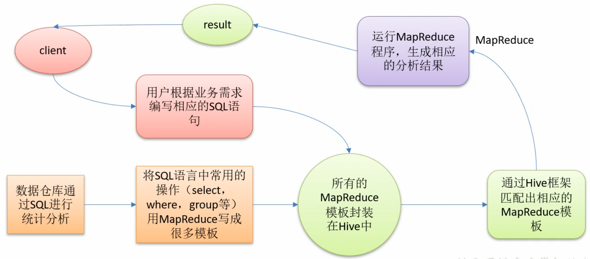
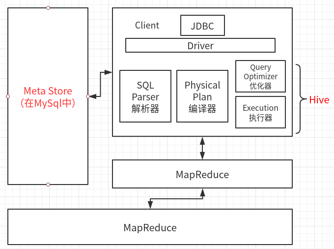

# Hive

基于Hadoop的数据仓库工具；就是用SQL的方式封装运行MapReduce；

将结构化的数据文件，映射为一张表，并提供类SQL查询功能；

**本质：将HQL转化为MapReduce程序；**



- Hive处理的数据存储在HDFS；
- Hive分析数据底层的默认实现是MapReduce；
- 执行程序是在Yarn上；

## 特点

1. Hive执行延迟高，适用于对实时性要求不高的场景；优势在于处理大数据，不适合处理小数据
2. （MR）不适合迭代式运算，不适合数据挖掘；
3. （MR）效率低；
4. 调优困难，粒度太粗；
5. 作为数据仓库的Hive，是读多写少，基本不修改；
6. 没有索引，查询数据，要暴力扫描所有的数据（分区表可以减少搜索范围），延迟较高（主要由于MapReduce的框架本身延迟较高）；

## Hive架构图



## Hive配置

##### 准备

1. hive-site.xml

   ```xml
   <?xml version="1.0" encoding="UTF-8" standalone="no"?>
   <?xml-stylesheet type="text/xsl" href="configuration.xsl"?>
   <configuration>
   <property>
     <name>javax.jdo.option.ConnectionURL</name>
     <value>jdbc:mysql://master:3306/metastore?createDatabaseIfNotExist=true</value>
     <description>metastore地址</description>
   </property>
   <property>
     <name>javax.jdo.option.ConnectionDriverName</name>
     <value>com.mysql.jdbc.Driver</value>
     <description>Driver name</description>
   </property>
   <property>
     <name>javax.jdo.option.ConnectionUserName</name>
     <value>whr</value>
     <description>username</description>
   </property>
   <property>
     <name>javax.jdo.option.ConnectionPassword</name>
     <value>123456</value>
     <description>password</description>
   </property>
   <property>
     <name>hive.cli.print.header</name>
     <value>true</value>
   </property>
   <property>
     <name>hive.cli.print.current.db</name>
     <value>true</value>
   <!--交互界面显示数据库名-->
   </property>
   </configuration>
   ```

2. hive.env.sh

   ```shell
   # 添加两个配置
   HADOOP_HOME=/home/whr/workbench/hadoop
   export HIVE_CONF_DIR=/home/whr/workbench/hive/conf
   ```

3. 初始化:(前提mysql中没有对应库)

   ```sql
   schematool -dbType mysql -initSchema
   ```

##### 元数据

将derby元数据，放进mysql；

在mysql的hivedb中存在很多张表,**记录着元数据**代表着各种信息:

```sql
COLUMNS_V2  # 记录着列的信息
TBLS        # 记录着已创建的表名以及创建时间,OWNER...
VERSION     # hive版本信息
...
```

## Hive数据结构

除了基本数据类型（与java类似），hive支持三种集合类型

### Hive集合类型数据

array、map、structs

```sql
hive (default)> create table test(
              > name string,
              > friends array<string>,
              > children map<string,int>,
              > address struct<street:string,city:string>)
              > row format delimited		-- 限制多个字段分段符
              > fields terminated by ','	-- 字段之间以','分割
              > collection items terminated by '_'	-- 字段内部用'_'分割（包括array、map）
              > map keys terminated by ':'			-- map内key-value用'：'
              > lines terminated by '\n';			-- 不同行，用回车'\n'
```

按表格式，写一份数据，传到hdfs对应的hive-test表下，

```txt
Lili,bingbing_xinxin,Lucifa:18_Jack:19,Nanjing_Beijing
```

然后查询数据库，即可得到查询结果；

```sql
test.name		test.friends		test.children			test.address
Lili		["bingbing","xinxin"]	{"Lucifa":18,"Jack":19}	{"street":"Nanjing","city":"Beijing"}
```

- 所以Hive的数据，一定是要按设计的格式，严格排列才能读取的！！！

查询集合数据

```sql
hive (default)> select friends[0] from test;	-- 可以像java数组那样访问
OK
bingbing
```

查询map数据

```sql
hive (default)> select children['Lucifa'] from test;	-- 只能用key来访问
OK
18
```

查询结构体数据

```sql
hive (default)> select address.street from test;		-- address.street访问
OK
street
Nanjing
```

## DDL操作

库、表的增删改查

### 数据库

1. 创建数据库

   除了location参数，其他跟mysql一样，支持like，desc

   ```sql
   hive (default)> create database if not exists hive;
   OK
   -- 同时HDFS增加文件/user/hive/warehouse/hive.db
   ```

   ```sql
   hive (default)> create database if not exists hive location /hive;
   OK
   -- 自定义创建的数据库在HDFS的路径
   ```

   ```sql
   -- 查看库信息
   hive (default)> desc database hive;
   OK
   db_name	comment	location	owner_name	owner_type	parameters
   hive		hdfs://master:9000/user/hive/warehouse/hive.db	whr	USER	
   ```

2. 修改数据库

   无法修改数据库名和目录位置；

   alter

3. 删库

   ```sql
   -- 库必须为空
   hive (default)> drop database test;
   -- 强制删除cascade
   hive (default)> drop database test cascade;
   ```

### 表

1. 查看一下表信息

   ```sql
   hive (default)> show create table test;
   
   CREATE TABLE `test`(
     `name` string, 
     `friends` array<string>, 
     `children` map<string,int>, 
     `address` struct<street:string,city:string>)
   ROW FORMAT DELIMITED 	--分隔符
     FIELDS TERMINATED BY ',' 
     COLLECTION ITEMS TERMINATED BY '_' 
     MAP KEYS TERMINATED BY ':' 
     LINES TERMINATED BY '\n' 
   STORED AS INPUTFORMAT 	--输入格式
     'org.apache.hadoop.mapred.TextInputFormat' 
   OUTPUTFORMAT 			--输出格式
     'org.apache.hadoop.hive.ql.io.HiveIgnoreKeyTextOutputFormat'
   LOCATION				--存储位置
     'hdfs://master:9000/user/hive/warehouse/test'
   TBLPROPERTIES (			
     'transient_lastDdlTime'='1569750450')
   ```

2. 已有表新增列

   ```shell
hive (default)> alter table sex_test add columns(deptno string);
   ```

3. 内部表（管理表）、外部表

   内部表：删除，同时删除元数据和hdfs数据；

   外部表：删除，只会删除元数据信息，不删hdfs数据；

   修改student内部表为外部表：

   ```sql
   alter table student set tblproperties('EXTERNAL'='TRUE');--后面必须大写
   ```

   修改外部表为内部表：

   ```sql
   alter table student set tblproperties('EXTERNAL'='False');--后面必须大写
   ```

   查询表类型

   ```sql
   desc formatted student;
   ```

4. 分区表

   避免暴力扫描；

   一个分区就是hdfs上的一个独立文件夹；Hive的分区就是hdfs的目录分割；

   创建一个分区表：（在元数据PARTITIONS表中存有分区信息）

   ```sql
   hive (default)> create table dept_partition(
                 > deptno int,dname string, loc string)
                 > partitioned by (month string)	-- 以month分区,month默认也算作一个字段
                 > row format delimited 
                 > fields terminated by '\t';
   ```

   加载数据：

   ```sql
   hive (default)> load data local inpath '/home/whr/Desktop/dept.txt' into table dept_2 partition(month='2019-9');
   ```

   查询：

   ```sql
   -- 分区查询where
   hive (default)> select * from dept_partition where month = '2019-9-31';
   ```

   单独添加分区

   ```sql
   -- 可添加多个分区
   hive (default)> alter table dept_partition add partition(month='2019-9-29') partition(month='2019-9-28');
   ```

   删除分区

   ```sql
   -- add改成drop，每个分区间加 ','
   hive (default)> alter table dept_partition drop partition(month='2019-9-29'),partition(month='2019-9-28');
   ```

   查看有多少分区

   ```sql
   hive (default)> show partitions dept_partition;
   ```

5. 二级分区表：

   其实就是以两个字段来分区

   ```sql
   hive (default)> create table dept_2(
                 > deptno int,dname string,loc string)
                 > partitioned by (month string,day string)
                 > row format delimited fields terminated by '\t';
   ```

   上传数据

   在hdfs是显示两层目录：/user/hive/warehouse/dept_2/month=2019-9/day=30/dept.txt

   ```sql
   -- 这里分区，要写两个
   hive (default)> load data local inpath '/home/whr/Desktop/dept.txt' into table dept_2 partition(month='2019-9',day='30');
   ```

6. 分区表的数据加载的三种方式：

   （1）load命令，自动创建文件夹，以及元数据；（常用）

   ```sql
   load data [local] inpath 'path'  [overwrite] into table [partition_psc];
   local：
       有==>从linux本地加载数据
       无==>从hdfs加载数据，相当于执行mv操作(无指的是没有local参数时，而不是本地中没有这个文件)
   overwrite
       有==>覆盖掉表中原来的数据
       无==>在原来的基础上追加新的数据
   ```

   （2）手动添加分区文件夹以及分区数据，需要修复元数据，才能查询；（了解）

   这里会自动根据hdfs文件，来修复，如果说**存在大量的没有元数据的数据**，可以用此命令；

   ```sql
   hive (default)> msck repair table dept_parition;
   ```

   （3）手动添加分区文件夹以及分区数据，使用**添加分区命令**，自动补充元数据；（常用）

   第三种例子：

   ```shell
   # 通过hadoop命令，创建了文件夹，并上传数据
   $ hadoop fs -mkdir -p /user/hive/warehouse/dept_partition/month=2019-9-17
   $ hadoop fs -put '/home/whr/Desktop/dept.txt' /user/hive/warehouse/dept_partition/month=2019-9-17
   ```

   添加分区

   ```sql
   -- 添加分区
   hive (default)> alter table dept_partition add partition(month='2019-9-17');
   OK
   Time taken: 0.1 seconds
   -- 查询所有分区
   hive (default)> show partitions dept_partition;
   OK
   partition
   month=2019-9-17	--存在
   month=2019-9-30
   month=2019-9-31
   ```

7. 分桶表

   创建分桶表

   ```shell
   hive (default)> create table stu_buck(id int , name string)
                 > clustered by(id)
                 > into 3 buckets
                 > row format delimited
                 > fields terminated by '\t';
   ```

   ```shell
   # 数据分桶的前提：
   hive (default)> set hive.enforce.bucketing=true;
   hive (default)> set mapreduce.job.reduces=1;
   hive (default)> insert into table stu_buck
                 > select * from stu;	# 会用id%桶数 进行分桶
   stu_buck.id	stu_buck.name
   9	s9
   6	s6
   3	s3	#
   7	s7
   4	s4
   1	s1	#
   8	s8
   5	s5
   2	s2
   ```

   分桶表用处：针对于非常大的数据集，进行抽样查询

   ```shell
   hive (default)> select * from stu_buck tablesample(bucket x out of y on id);
   # 必须：x <= y
   ```

   - x：指从x个桶开始抽样

   - y：必须为桶数的倍数或因子；

     比如：4个桶，y=2时，抽取4/2=2个bucket数据；

     y=4时，4/4=1个bucket数据；

8. 修改表（不常用）

   重命名表明

   ```sql
   hive (default)> alter table dept_partition rename to dept_1;
   ```

   增加、修改列信息

   ```sql
   -- 增加列，可增加多列
   hive (default)> alter table dept_1 add columns (func string);
   -- change修改单个列，包括列名，数据类型
   
   -- replace 替换所有列
   hive (default)> alter table dept_1 replace columns (id int,name string);
   ```

## DML数据操作

1. 添加数据：

   （1）load

   （2）insert（不管数据是否重复，只管追加，多次insert，追加重复数据）

   ```sql
   hive (default)> insert into table test
                 > select id,name from mess;	-- 从mess表查询，插入test
   -- 会执行MR程序            
   2019-09-30 14:53:55,879 Stage-1 map = 0%,  reduce = 0%
   2019-09-30 14:54:01,365 Stage-1 map = 100%,  reduce = 0%, Cumulative CPU 2.68 sec        
   ```

   （3）overwrite（重复->覆盖；不重复->追加）

   ```sql
   hive (default)> insert overwrite table test
                 > select * from mess;
   ```

   （4）as select（在创建表的时候，导入数据）

   ```sql
   hive (default)> create table pika
                 > as select id,name from test;
   ```

   （5）location（创建的时候通过location，指定加载数据路径）

   ```sql
   hive (default)> create table jieni(
                 > id int,name string)
                 > location 'user/hive/warehouse/mess/dept.txt';	--hdfs文件目录
   ```

   （6）import（讲数据导入Hive表中，很少用，前提有export数据，需要export的数据格式）

   - 必须列完全相同并且是个空表，才能导入；

2. 数据导出

   （1）insert（insert到本地，可以认为是导出）

   ```sql
   -- 导出到本地，也可以导出到hdfs（删掉local）
   hive (default)> insert overwrite local directory '/home/whr/Desktop/data' select * from test;
   -- 导出数据为一个目录，数据在000000_0文件中，并且没有分隔符
   ```

   （2）用hadoop命令，下载数据

   （3）export导出（少用）

   （4）sqoop导出：实现MySql和HDFS（Hive）数据之间导入导出；

3. 清空表：truncate

   只会清除数据，表结构不变，只能删除内部表（管理表），不能删除外部表

## 查询

1. 查询支持算数运算符

   ```sql
   hive (default)> select salary+1000 from emp;
   ```

2. 常用函数

   count、max、min、sum、avg

3. where语句

4. like、rlike（可以用正则）

## 分组

1. group by

2. having：分组后再进行having过滤

   与where的区别：

   （1）where对表中的列发挥作用，查询数据；having对查询结果中的列发挥作用；

   （2）where后不能跟分组函数，having可以；

   （3）having只用于group by分组统计语句；

## join

on的时候：只支持等值（=）链接；不支持非等值（!=、<、>）连接

### 内连接

两个表都存在的数据，并且与on连接条件匹配，才会保留

### 左（右）外连接

左（右）表中符合Where子句的所有记录都会被保留。右表（左）没有的数据，以null返回；

### 满外连接

不分左右表，只要符合where，存在数据就会返回，不存在就返回null；

## 排序

1. order by

   全局有序，只有一个Reduce；

   ASC升序

   DESC降序

2. sort by

   每个reduce内部进行排序，对全局的结果集不是排序；

3. distribute by

   先分区再sort by

## 函数

1. 空字段赋值

   NVL：给值为NULL的数据赋值

   ```shell
   hive (default)>select nvl(salary,0) from emp;
   # 查询salary列，如果为NULL，赋值为0
   hive (default)>select nvl(salary,empno) from emp;
   # 查询salary列，如果为NULL，赋值为员工编号empno列的值
   ```

2. 时间类

   1）date_format

   ```shell
   hive (default)> select date_format('1999-10-3','yyyy-MM-dd HH:mm:ss');
   OK
   _c0
   1999-10-03 00:00:00
   ```

   2）date_add

   ```shell
   hive (default)> select date_add('2019-9-9',3);
   2019-09-12
   hive (default)> select date_add('2019-9-9',-3);	# 相减
   2019-09-06
   ```

   3）date_sub（同上）

   4）datediff：时间相减

3. 替换字段

   regexp_replace

   ```shell
   hive (default)> select regexp_replace('1999/11/9','/','-');
   1999-11-9
   ```

4. case when

   ```sql
   select 	-- 查询三个字段：deptno，male_count,female_count；后两个自定义
   deptno,
   sum(case sex when '男' then 1 else 0 end) male_count,	-- 男返回1，否则0
   sum(case sex when '女' then 1 else 0 end) female_count 
   from 
   sex_test 
   group by 
   deptno;
   ---------查询结果：按部门查询男女人数
   deptno	male_count	female_count
   A	3	2
   B	2	2
   ```

5. if 语法

   操作、结果同上：

   ```sql
   select
   deptno,
   sum(if(sex='男',1,0)) male_count,
   sum(if(sex='女',1,0)) female_count
   from
   sex_test
   group by
   deptno;
   ```

6. concat、concat_ws

   多个列拼接

   ```sql
   elect 
   concat(name,'-',sex) 	-- concat_ws('-',name,sex) '-'只用写一次
   from 
   sex_test;
   ----------
   lizi-男
   niu-女
   qing-女
   ```

7. 列转行（P42）

   将一列数据，以行的形式输出

   collect_set( )

   ```sql
   
   ```

8. 窗口函数：==================================================

   数据：

   ```shell
   business.name	business.orderdate	business.cost
   jack	2017-01-01	10.0
   tony	2017-01-02	15.0
   jack	2017-02-03	23.0
   tony	2017-01-04	29.0
   jack	2017-01-05	46.0
   jack	2017-04-06	42.0
   tony	2017-01-07	50.0
   jack	2017-01-08	55.0
   mart	2017-04-08	62.0
   mart	2017-04-09	68.0
   neil	2017-05-10	12.0
   mart	2017-04-11	75.0
   neil	2017-06-12	80.0
   mart	2017-04-13	94.0
   ```

   1）查询4月份消费过的顾客以及消费次数：

   ```sql
   -- 不加窗口函数：
   select
   name,count(*)
   from business
   where substring(orderdate,1,7) = '2017-04'
   group by name;
   -----------
   name	_c1
   jack	1
   mart	4
   ```
   
   ```sql
   -- 加窗口函数：
   select
   name,count(*) over()
   from business
   where substring(orderdate,1,7) = '2017-04'
   group by name;
   -----------
   name	count_window_0
   mart	2
   jack	2
   ```
   
   2）查询顾客的购买明细和购买总额

## 自定义函数UDF

可以分为三种：

- UDF：自定义函数；一进一出

  ```java
  public class MyUDF extends UDF {
      public int evaluate(int data){
          return data+5;
      }
  }
  ```

- UDTF：自定义Table函数；一进多出；

  ```java
  public class MyUDTF extends GenericUDTF {
      private List<String> dataList = new ArrayList<>();
  	// 定义输出数据的列名和数据类型
      @Override
      public StructObjectInspector initialize(StructObjectInspector argOIs)
              throws UDFArgumentException {
          // 定义输出数据的列名
          List<String> fieldName = new ArrayList<>();
          fieldName.add("word");
          // 定义输出数据的类型
          List<ObjectInspector> fieldOIs = new ArrayList<>();
          fieldOIs.add(PrimitiveObjectInspectorFactory.javaStringObjectInspector);
          //
          return ObjectInspectorFactory.getStandardStructObjectInspector(fieldName, fieldOIs);
      }
      /**
       * 函数处理逻辑:函数需要两个参数：
       * 1.args[0]：一个字符数组，
       * 2.args[1]：字符数组的分隔符
       * 使用方法：select myudtf('hello,word,qqq,new',',');
       */
      @Override
      public void process(Object[] args) throws HiveException {
          /**
           * 1.获取数据
           * 2.获取分隔符
           * 3.切分数据
           * 4.输出数据
           */
          String data = args[0].toString();
          String splitKey = args[1].toString();
          String[] words = data.split(splitKey);
          for (String word : words) {
              dataList.clear();
              dataList.add(word);
              forward(dataList);
          }
      }
      @Override
      public void close() throws HiveException {
      }
  }
  ```

- UDAF：自定义聚合函数；多进一出；

使用：

```shell
# 添加jar包，建议添加到hive/lib下，不需要add，可以直接使用
hive (default)> add jar /home/whr/Desktop/notes/Hadoop_notes/Hive_code/target/MyUDTF.jar;
# 创建函数
hive (default)> create function myudtf as 'UDF.MyUDTF';
# 传参
hive (default)> select myudtf('hello,word,qqq,new',',');
OK
word # 这里是自定义的列名
hello
word
qqq
new
```

## Hive的文件格式

1. textfile

   行存储；

   数据不进行压缩，网络开销大；

2. sequencefile

   二进制文件；

   数据以<Key，Value>的形式序列化在文件中；

3. ORC file（**速度最快，占用空间最少**）

   数据按行分块，每块按**列存储**；

4. parquet（**速度与ORC接近，占用空间较少**）

文件格式使用：

在创建表的结尾添加：

```sql
stored as textfile;	-- 默认textfile
stored as orc; -- 默认ZLIB压缩，比SNARRY小；
stored as orc tblproperties ("orc.compress" = "None"); --不进行压缩
stored as orc tblproperties ("orc.compress" = "SNARRY"); --使用SNARRY压缩
stored as parquet;
```

## 练习

用户访问数据表：

```sql
hive (default)> create table action(userId string,visitDate string,visitCount int)
              > row format delimited fields terminated by '\t';
-----------------
action.userid	action.visitdate	action.visitcount
u01	2019/1/21	5
u02	2019/1/23	6
u03	2019/1/22	8
u04	2019/1/20	3
u01	2019/1/23	6
u01	2019/2/21	8
u02	2019/1/23	6
u01	2019/2/22	4
--需求：
用户		时间	   月访问量	 累加访问量
u01		2019-01		11		11
u01		2019-02		12		23
u02		2019-01		12		12
u03		2019-01		8		8
u04		2019-01		3		3
```

1）统计：每个用户，每月访问总次数：（分三步来做：）

```sql
select userId,date_format(regexp_replace(visitDate,'/','-'),'yyyy-MM') visitdate,sum(visitcount) 
from action 
group by 
visitdate;
------------- 第1步.格式化时间
userid	visitdate	_c2
u01	2019-01	5
u01	2019-01	6
u01	2019-02	8
u01	2019-02	4
u02	2019-01	12
u03	2019-01	8
u04	2019-01	3
```

```sql
select userId,df,sum(visitcount)
from
(select userId,date_format(regexp_replace(visitDate,'/','-'),'yyyy-MM') df,visitcount 
 from action)t1
group by
userId,df;
-------------第2步：id，时间分组，并sum
userid	df	_c2
u01	2019-01	11
u01	2019-02	12
u02	2019-01	12
u03	2019-01	8
u04	2019-01	3
```

```sql
select userId,df,sum_visitcount,sum(sum_visitcount) over(partition by userId order by df)
from
(select userId,df,sum(visitcount) as sum_visitcount
from
(select userId,date_format(regexp_replace(visitDate,'/','-'),'yyyy-MM') df,visitcount 
 from action)t1
group by
userId,df)t2;
-------------- 最终结果：外层嵌套窗口函数
userid	df	sum_visitcount	sum_window_0
u01	2019-01	11	11
u01	2019-02	12	23
u02	2019-01	12	12
u03	2019-01	8	8
u04	2019-01	3	3
```

