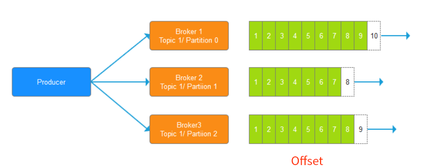
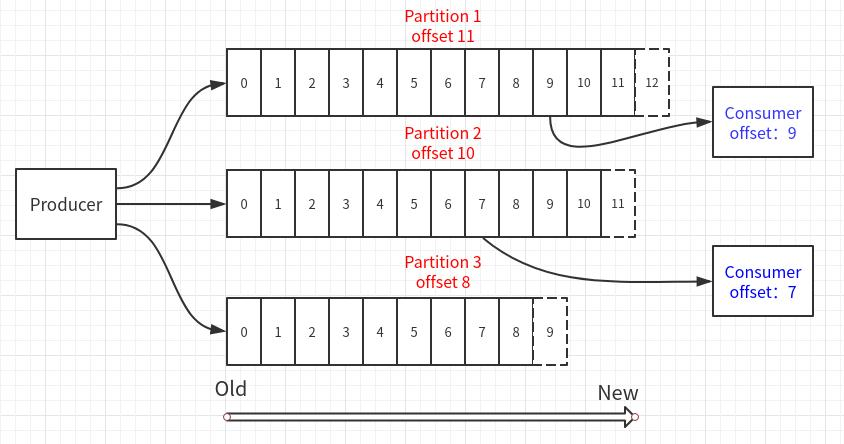
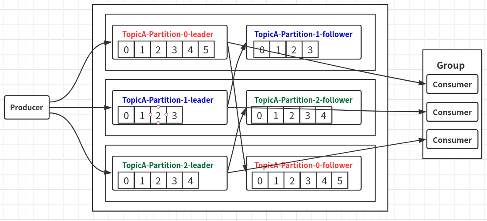
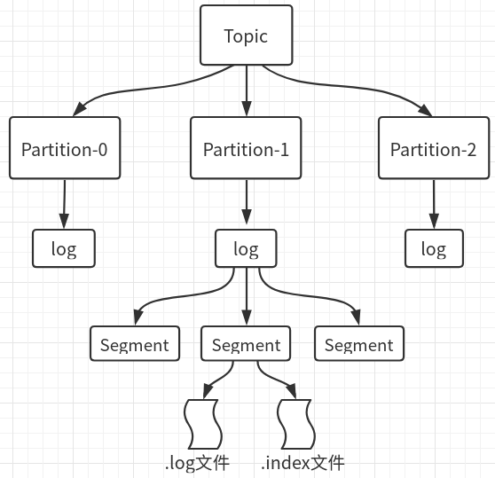
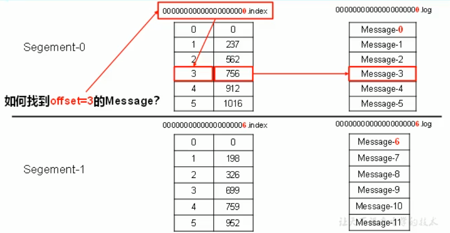
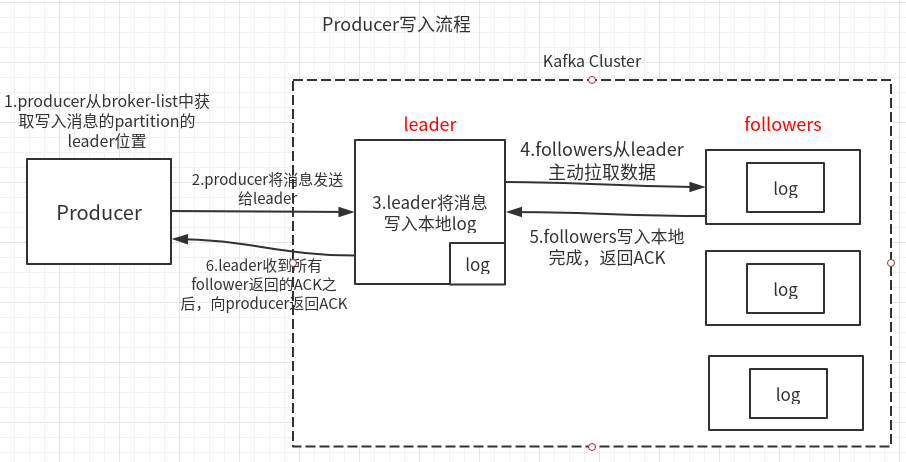
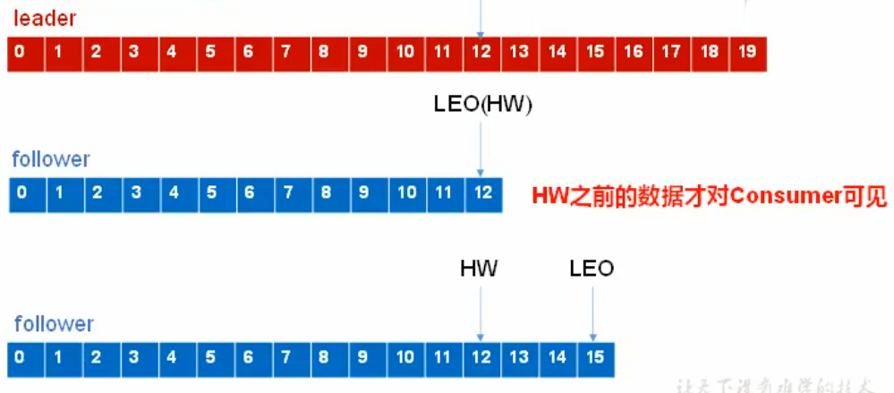
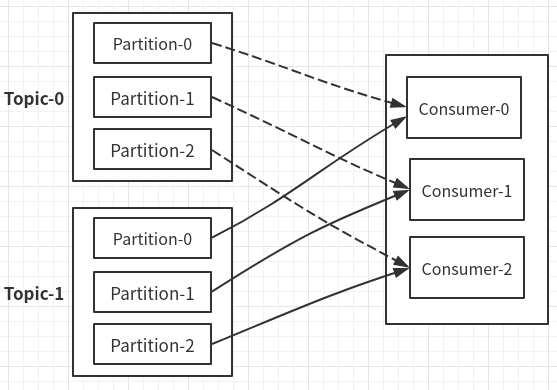
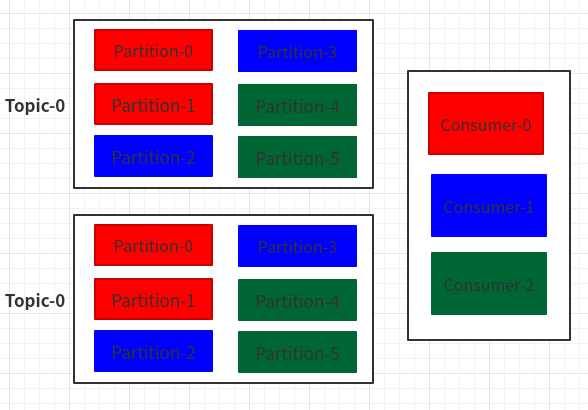
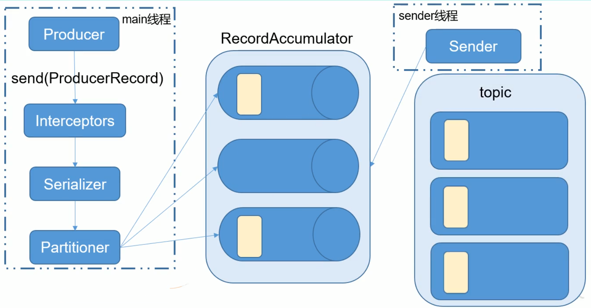

# Kafka

参考：

<https://yq.aliyun.com/articles/626540?utm_content=m_1000013712>

<https://blog.csdn.net/dapeng1995/article/details/81536862>

## 消息系统的两种模式

##### 1.生产者/消费者模式：

Producer（生产者）：在数据管道一段生产消息的应用程序。

Consumer（消费者）：在数据管道一端消费消息的应用程序。

- 生产者将消息发送至队列，如果此时没有任何消费者连接队列、消费消息，那么消息将会保存在队列中，直到队列满或者有消费者上线。
- 生产者将消息发送至队列，如果此时有多个消费者连接队列，那么对于同一条消息而言，仅会发送至其中的某一个消费者。因此，当有多个消费者时，实际上就是一个天然的负载均衡。

##### 2.发布/订阅模式：

Publisher（发布者）：在数据管道一端生成事件的应用程序。

Subscriber（订阅者）：在数据管道一端响应事件的应用程序。

- 发布者发布事件，如果此时队列上没有连接任何订阅者，则此事件丢失，即没有任何应用程序对该事件作出响应。将来如果有订阅者上线，也不会重新收到该事件。
- 发布者发布事件，如果此时队列上连接了多个订阅者，则此事件会广播至所有的订阅者，每个订阅者都会收到完全相同的事件。所以不存在负载均衡。

**Kafka是分布式发布-订阅消息系统**

三个主要作用：

- 发布&订阅：和其他消息系统一样，发布订阅流式数据。
- 处理：编写流处理应用程序，对实时事件进行响应。
- 存储：在一个分布式、容错的集群中安全地存储流式数据。

## Kafka角色

#### Broker

集群的一台机器，就是一个Broker

#### Topic

即：逻辑概念上的消息；一个Topic可分为多个Partition分区，每个Partition又会进行备份（备份到别的Broker上）；

#### Partition

生产者发送消息，只会发送到topic的其中一个分区内！！

但是会经过同步到不同节点的同一个partition的副本下！！

也就意味着，一个topic下的，某条消息，只会被同一组内的某一个消费者消费！

- **分区内的数据是有序的，维护着offset**

- 分区越多，并行处理数就越多。通常的建议是主机数x2，例如如果集群中有3台服务器，则对每个主题可以创建6个分区。

- 当消息被写入分区后，就**不可变**了，无法再进行修改。除非重建主题，修改数据后重新发送。

- 当没有key时，数据会被发往主题的任意一个分区；当有key时，相同key的数据会被发往同一个分区。

- **发往Partition的每条消息将获得一个递增id，称为offset（偏移量）。**

  

## offset

消息队列里的数据，是不会因为消费而被删除的，是一直存在的；

- patition和Consumer都维护这自己的offset；

- 消费者默认从自己记录的offset开始消费;

- 想要从Partition最早记录开始消费,需要两个条件:(API)

  1. 设置AUTO_OFFSET_RESET_CONFIG为 "earliest"
  2. 消费者换组,无法获得自己的offset；或者消费者当前的offset的数据已经不存在了；

- 这里还涉及到自动提交，手动提交，提交延迟的设置问题

  **提交延迟高：已经写入数据，还没提交，机器故障，恢复之后，会重新读取数据，造成重复数据；**

  **提交延迟低：数据还没读完，已经提交完成，这时候故障，恢复之后就会丢数据；**

(图画错了，消费者只能消费到offset 8)



#### 自定义存储offset

kafka0.9之前，offset存储在zk，之后存在kafka的内置topic中，除此之外，可以自定义存储offset；

消费者的Rebalance：

当有新的消费者加入消费组，或者消费组的消费者故障或移除，都会触发所订阅的Topic的Partition的重新分配，这个重新分配的过程叫做Rebalance；

#### 查看offset

```shell
$ kafka-run-class.sh kafka.tools.GetOffsetShell --broker-list localhost:9092 --topic bigdata
bigdata:0:119
bigdata:1:129
```

#### Message

Partition中存储的消息即Message

每条Message包含有三个属性：

- Offset：消息的唯一标示（long类型）上图所示，每一个标示都是一条消息
- MessageSize：消息长度（Int类型）
- data：Message具体内容

#### Producer

​	发布消息的对象，往某个topic中发布消息，也负责选择发布到topic中的哪个分区。

- Producer只需要指定Topic的名称（Name）Kafka会**自动进行负载均衡**，并将对写入操作进行路由，从而写入到正确的Partition当中

#### Consumer

详见后面分区策略；

### Zookeeper

1. Kafka配置文件，需要指定zookeeper.connect
2. 创建Topic需要指定参数 --zookeeper
3. 消费者消费数据，需要指定参数 --zookeeper

所以这些操作都是需要向Zookeeper注册消息的！producer不向zk注册

新版本的Kafka消费数据不需要向Zookeeper注册了，使用--bootstrap-server，消息是保存在本地的(Kafka中)；

## 集群架构方式



上图是：一个Topic，3个分区，2份备份的流程：

- **Producer生产一个Topic，创建了3个分区，每个分区都会先有一个Leader，然后在其他机器中，创建自己分区的follower（副本）；**

## Kafka存储系统



- 一个Topic分为多个Partitions，每个Partition分为多个Segment片段，一个Segment片段对应两个文件：

  **.log文件（只存放消息），.index文件（存放offset）**

1. 生产者不断向.log文件追加消息；
2. 每一个Segment下的.log和.index相互对应，通过offset查询(二分查找).index，进而找到.log中对应的消息；



## Kafka生产过程

1. 写入方式：

   producer采用push模式发送消息到broker，每条消息都被append（追加）到partition（分区）中，属于**顺序写磁盘**，保证吞吐率；

2. 为什么分区Partition

   - 降低每个broker（服务器）的负载；
   - 方便地在集群中扩展；
   - 读数据的时候，提高并发

3. **分区原则**：

   - 指定了partition，则直接使用此分区；
   - 未指定分区，指定key，通过key的value进行hash出一个partition；
   - partition和key都没有指定，使用轮讯选出一个partition，来发送消息；三台机器broker为0,1,2;，先随机出顺序，2,1,0，之后一直按照这个顺序2,1,0,2,1,0....

## ack应答机制



有三个值：

- 0：producer不需要确认消息，直接发送消息给leader，有没有收到消息，producer不管；

  上图中去掉5、6步；速度块，安全性最低（当broker故障，会**丢失数据**）。

- 1：producer发送消息，确保leader写入成功，followers不管；上图中，去掉5步；

  （在follower同步成功之前leader故障，就会**丢失数据**）

- -1（all）：leader和followers全部确认发送到；上图即all机制；

  （如果follower同步完成后，leader还没发送ack给Producer的时候，出现了故障，这时候会重新选出一个leader，Producer因为没有收到ack，就会重新发送给新的leader，造成**数据重复**）

## Kafka保持数据一致

LEO：每个副本的最大offset；针对每一个副本而言；

高水位（HW）：同一个Partition的所有副本的最小LEO，即最小offset；HW是针对整个Partition而言的。

- 消费者只能看到HW之前的数据；
- 数据一致性，只保证数据一致，不保证数据不会重复，或丢失；



存在这样两种故障，offset会需要维护：

1. follower故障后恢复：

   follower故障，会被踢出ISR，恢复后，会读取本地磁盘，恢复故障前的HW之前的数据，然后开始向leader进行同步，一直同步到整个partition的HW，此时消息可认为是追上了leader，就可以重新加入ISR了；

2. leader故障后重新选出leader：

   解决：比如leader故障，现在选第二个follower为leader；

   那么除了新leader之外的所有follower都将数据截取到HW：这样除了leader外，所有的offset都为HW；

   然后follower向leader同步数据；

## Kafka幂等性

换种说法就是：如何保持数据一致，如何保证数据0丢失；

所谓幂等：执行一个操作，无论执行多少次，最后的结果或者说状态都是一致的；

幂等写入：即为同样的请求被执行一次与连续执行多次的效果是一样的 ；

kafka启用幂等性：

```shell
enable.idompotence = true	# 启用之后，默认ack模式为-1
```

保证不会产生重复数据，但是基于pid，如果Producer重启，pid会变，还是会产生重复数据；

## Kafka消费者

Consumer采取pull模式，从broker中拉取数据；

缺点：如果broker中没有数据，消费者会一直返回空数据；针对这点，kafka会在消费者消费的时候给出一个时长参数timeout，如果broker没数据，Consumer会等待timeout时长，之后再返回；

### 分区分配策略

一个消费者组有多个Consumer，一个Topic有多个Partition；

一个组内的Consumer不能消费同一个Partition，那么如何分配Partition给不同的消费者？

有两种策略：

1. RoundRobin（轮讯）：

   使用前提：此消费者组内Consumer订阅的Topic一致；因为轮讯会把订阅的Topic当成整体进行分发；

   按顺序，每个Topic的第一个分区，分给Consumer-0；

   然后第二个分区分给Consumer-1，依次类推；

   

2. Range（默认分区策略）：

   

   先根据Partition数量和消费者数量，算出，每个消费者应该分几个Paritition，然后，按顺序分发；

### 消费者故障维护

消费者故障，恢复之后，需要维护offset，从故障前的offset重新开始消费；

所以：Consumer需要实时记录自己消费到的offset，故障恢复后，继续消费；

在Kafka0.9之后，消费者的offset默认保存在了Kafka本地的topic中；

## Kafka配置

### config

集群每台机器需要配置server.properties

broker.ID必须唯一，每台设置一个

```properties
# 集群唯一,每一台机器拥有一个broker.ID
broker.id=0
# log日志记录位置
log.dirs=/home/whr/wokrbench/kafka/logs
# 数据存储的时间--7天，超时清除
log.retention.hours=168
# 存储容量1G.满则清除
log.segment.bytes=1073741824
# zookeeper的集群ip和端口
zookeeper.connect=master:2181,slave1:2181,slave2:2181
```

### bin

```shell
# 启动关闭（需要写脚本，集群启动）：
kafka-server-start.sh
kafka-server-stop.sh
# 有关于topic的操作命令
kafka-topics.sh
# 测试用：生产者、消费者
kafka-console-consumer.sh
kafka-console-producer.sh
```

## 启动

（下面操作，都已配置环境变量）

1. 先启动zookeeper

   ```shell
   $ zkServer.sh status	# 查看zookeeper状态
   JMX enabled by default
   Using config: /home/whr/workbench/zookeeper/bin/../conf/zoo.cfg
   Mode: follower
   ```

2. 启动kafka

   ```shell
   # 后台启动，需要配置参数
   # 不加-daemon，会是一个阻塞进程，可以方便看日志
   $ kafka-server-start.sh -daemon config/server.properties
   ```

3. 关闭kafka

   ```shell
   $ kafka-server-stop.sh config/server.properties
   ```

## kafka命令行

#### 创建一个topic

topic的分区会被创建在当前主机，每个分区的副本会分配到集群的其他机器；

比如下面例子：

- 在master上创建了两个分区：first-0、first-1
- 在slave1上会存放分区之一的一个副本：first-0
- 在slave2上会存放分区之一的一个副本：first-1

```shell
# -create创建
# --zookeeper master:2181；信息写入zookeeper（新版：--bootstrap-server）
# --partitions 2；partition数量
# --replication-factor 2；副本数，根据集群数量来定，不能超过集群数
# --topic first；topic的名字
$ kafka-topics.sh --create --zookeeper master:2181 --partitions 2 --replication-factor 2 --topic first
Created topic "first".
```

#### 查看topic

```shell
# 查看所有topic
$ kafka-topics.sh --list --zookeeper master:2181
first
# 查看某一个topic详细信息
$ kafka-topics.sh --zookeeper master:2181 --describe --topic first
Topic:first	PartitionCount:2	ReplicationFactor:2	Configs:
	Topic: first	Partition: 0	Leader: 2	Replicas: 2,1	Isr: 2,1
	Topic: first	Partition: 1	Leader: 0	Replicas: 0,2	Isr: 0,2
```

#### 查看分区offset

```shell
$ kafka-run-class.sh kafka.tools.GetOffsetShell --broker-list localhost:9092 --topic test
test:0:16
test:1:18
```


#### 删除topic

并不能真正删除，会被标记为删除

```shell
$ kafka-topics.sh --delete --zookeeper master:2181 --topic first
Topic first is marked for deletion.
```

若想真正删除：

```shell
# 启动zookeeper客户端
$ zkCli.sh
# 找到目录
ls /brokers/topics
# 删除
rmr /brokers/topics/first
```

### 生产消费流程

1. 创建producer

   ```shell
   $ kafka-console-producer.sh --broker-list master:9092 --topic first
   >hello	# 发送消息
   ```

2. 创建consumer

   连接的是zookeeper

   ```shell
   $ kafka-console-consumer.sh --bootstrap-server master:9092 --topic first --from-beginning
   hello	# 收到消息
   ```

3. 再次查看topic

   ```shell
   whr@master:~/workbench/kafka$ kafka-topics.sh --list --zookeeper master:2181
   __consumer_offsets	# 多出一个offset
   test
   ```


## API

分为高级API（封装层次高，可操作性低）、低级API（可操作性高）

### 发送消息流程



### Key为null时,Kafka如何确定分区?==========================


## 错误处理

1. 修改broker,id之后，需要修改logs/meta.properties的broker.id，不然无法启动。