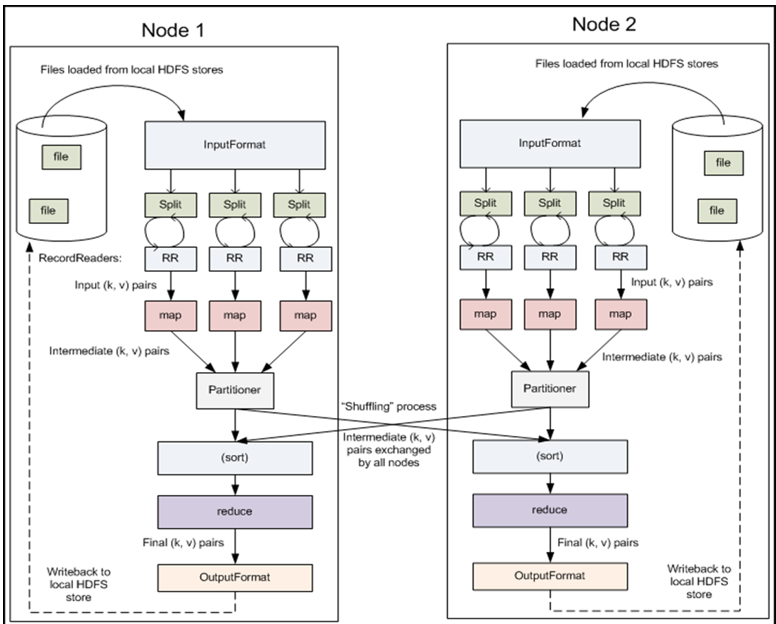
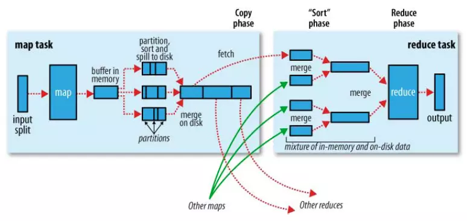
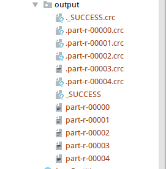

# MapReduce

### 两个概念：

### 1. JobTracker

用于管理和调度工作；

- **整个句群只有一台JobTracker**

### 2. TaskTracker

用于执行任务；



### Map task

- 程序会根据InputFormat将输入文件分割成splits，每个split会作为一个map task的输入
- 每个map task会有一个内存缓冲区，输入数据经过map阶段处理后的中间结果会写入内存缓冲区，并且决定数据写入到哪个partition，当写入的数据到达内存缓冲区的的阀值(默认是0.8)，会启动一个线程将内存中的数据溢写入磁盘（**新建溢出写文件**），同时不影响map中间结果继续写入缓冲区。
- 在溢写过程中，MapReduce框架会对key进行排序，如果中间结果比较大，会形成多个溢写文件，最后的缓冲区数据也会全部溢写入磁盘形成一个溢写文件(最少有一个溢写文件)，如果是多个溢写文件，则最后合并所有的溢写文件为一个文件。

### Reduce task

- reduce任务启动之前，一个map task完成后，就会启动线程来拉取map结果数据到相应的reduce task，不断地合并数据（shuffle），为reduce的数据输入做准备
- 当所有的map tesk完成后，数据也拉取合并完毕后，reduce task 启动，最终将输出输出结果存入HDFS上。

### shuffle过程（Map输出到Reduce的中间过程）：



partition：就是为Partitioner的功能，将map结果按key值分组（分区），一个组的map结果，传入同一个Reduce任务；spill会将多个map任务产生的相同patition的磁盘文件经由Sort放在一起；

（1）Map产生输出后（**Partition→Sort→spill**）：

- Map端会处理输入数据并产生中间结果，**输出会先写到内存缓冲区（默认100M，可以自定义）中，当写入的数据达到设定的阈值0.8时，系统将会启动一个线程将缓冲区的数据写到磁盘，这个过程叫做Spill**。
- 在Spill写入磁盘之前，会先对Partition进行排序，然后再对Partition按key进行排序（Sort）。**目的是：相同的key，放在一起，分配到同一个Reduce上；**
- 每个Map任务可能产生多个spill文件，在每个Map任务完成前，会通过多路归并算法将这些spill文件归并成一个文件。至此，Map的shuffle过程就结束了。

（2）Reduce阶段（**copy→merge→reduce**）

- copy：在对Partition排序的时候，已经指定了每个Partition对应的Reduce，此时，Reduce从对应的Partition下载数据（HTTP方式），拿到Map的输出结果。

  **不同Map任务下的Partition送入同一个对应的Reduce任务**

- merge：也就是排序阶段（sort）。这个阶段主要进行**归并排序**，Map端传来的每个Partition，已经是排序好的，所以很适合归并排序。

- reduce：最后就是reduce阶段，可自定义合并因子，多步合并，产生最终结果，写到HDFS上；

# MapReduce任务执行方式

1. （集群）打成jar包，提交集群运行，执行的job任务进程为**RunJar**，在Yarn的执行过程中有详细讲解；

2. （本地）在IDE中，**不添加配置文件**，使用本地路径，直接在IDE中运行，执行的任务进程是**LocalJobRunner**：本地任务，也是通过HDFS拿到任务，但是实在本地执行任务，与Yarn无关；

3. （集群）在IDE中，**添加配置文件**（mapred.site.xml和yarn-site.xml）：但是需要jar包：

   ```java
   // 添加如下，让configuration实例对象，读取jar包
   conf.set("mapreduce.job.jar","target/hadoop_code-1.0-SNAPSHOT.jar");
   ```

顾名思义：RunJar就是需要Jar包才能Run

# 程序编写

### 数据封装为JavaBean进行序列化

- 需要创建JavaBean并实现WritableComparable\<JavaBean>接口；
- 如果需要自定义排序，就要重写compareTo方法

### 数据自定义分组输出

- 本身MR就是按照每个key进行分组的，通过HashPartition类下的getPartition方法进行分组；

  MapReduce为什么相同的Key能分到一组，进行整合，就是通过此类

  ```java
  public class HashPartitioner<K2, V2> implements Partitioner<K2, V2> {
      public HashPartitioner() {}
      public void configure(JobConf job) {}
      public int getPartition(K2 key, V2 value, int numReduceTasks) {
          return (key.hashCode() & 2147483647) % numReduceTasks;
      }
  }
  // 2147483647的二进制是32位全1；
  ```

- 需要自定义分组，就重写此类，即可；

  详见hadoop_code下/FlowSumGroup/AreaPartitioner.java

- 并添加

  ```java
  // 重写的排序方法
  job.setPartitionerClass(AreaPartitioner.class);
  ```

### 并发任务数量

```java
// 设置reduce的并发任务数量，跟分组数保持一致
job.setNumReduceTasks(5);
```

- 并发任务数量不可少于partitioner的分组数量，会报错；

- 每个并发任务，会产生相应的part-r-xxxxx文件；

  

- 每个并发任务，会有一个YarnChild进程执行：

  ```shell
  whr@master:~/Desktop$ jps
  5219 YarnChild
  11940 NodeManager
  5286 YarnChild
  11143 NameNode
  4999 YarnChild
  11275 DataNode
  5075 YarnChild
  5142 YarnChild
  4443 FlowSumGroup
  4700 MRAppMaster
  11645 ResourceManager
  11486 SecondaryNameNode
  ```

# MapReduce调优

### 1. 输入采用大文件

多个小文件会在HDFS中占用过多的块，如果先进行讲多个小文件合并为大文件，占用的HDFS的块会大量减少；

可针对性提前做一些数据的与处理工作；

### 2. 压缩Map输出文件

Map阶段的输出大小，影响着整个MapReduce的执行时间；

Map阶段的输出首先写到内存缓冲区，超过一定阈值，就会spill到磁盘中，这个磁盘写入的过程是会占用很多时间的；

如果能对Map的输出，进行压缩，讲减少磁盘写入所占用的时间；

- 通过将mapred.compress.map.output属性设置为true，来对数据进行压缩；
- 压缩格式通过mapred.map.output.compress.codec属性进行设置

### 3. 过滤数据（预处理）

提前处理掉无用数据、噪声数据、异常值；

### 4. Combine函数

每个Map任务会产生成千上万个\<the, 1>，将这些记录传给Reduce会很耗时；

让MR运行用户写的combine函数，在本地合并，减少网络IO的消耗；

```java
job.setCombineClass(combine.class)
```

也可以指定Reduce类充当Combine函数；

### 5. Shuffle参数调优

| 属性                             | 默认值       |                             内容                             |
| -------------------------------- | ------------ | :----------------------------------------------------------: |
| io.sort.mb                       | 100MB        |                   Map输出内存缓冲区的大小                    |
| io.sort.spill.percent            | 0.8          |                       spill操作的阈值                        |
| io.sort.factor                   | 10           | Reduce任务一次合并的数量；比如50个map输出，需要5次合并来完成任务；但是并不是每次都是合并10个map输出； |
| mapred.compress.map.output       | false        |                         压缩map输出                          |
| mapred.map.output.compress.codec | DefaultCodec |                        压缩使用的编码                        |
| mapred.reduce.parallel           | 5            |              用于把map输出复制到reducer的线程数              |

# MapReduce存在的问题

1. 一个Job只能进行一次性计算

   MapReduce面向数据计算，获取数据，进行计算，存储结果，主要应用于一次性计算；不适合迭代性计算；

   多次计算需要启动多个job；

2. 性能问题

   性能欠缺，MR基于文件的操作，磁盘IO较多，速度慢；

3. MR和Hadoop紧密耦合

   在Hadoop框架下，无法替换MapReduce；没有扩展性；