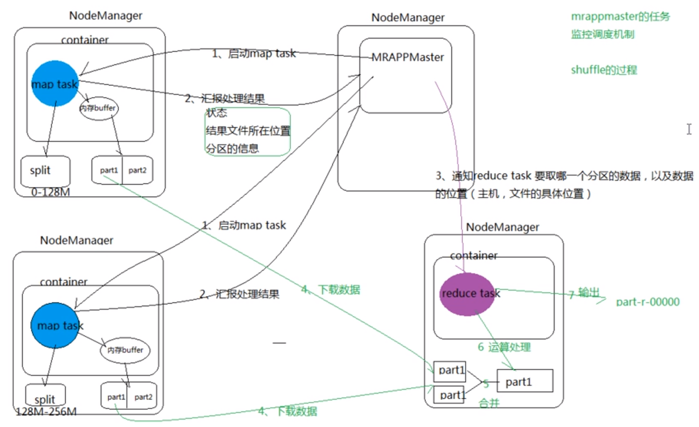

# Yarn

传统的MapReduce：

- JobTracker既调度资源又分配任务；
- taskTracker：没有考虑cpu、内存，有可能把两个消耗大内存task调度到一起，容易出现OOM；

Yarn改变了传统的MapReduce框架；

#### ResourceManager-控制整个集群,管理资源分配

1).处理客户端请求
2).启动,监控ApplicationMaster
3).监控NodeManager

#### MR App Master（MapReduce任务的领导者）-->动态生成，管理任务执行

1）负责数据切分split
2）为程序申请资源并分配给内部任务
3）任务的监视与容错

#### NodeManager(NM)

1）管理单个节点上的资源
2）处理来自RM的命令
3）处理来自AM的命令

#### container(资源容器)-->内部执行Map任务

1).对任务运行环境进行抽象
2).封装CPU，内存等多维度资源以及环境变量，启动命令等任务运行的相关信息

## Yarn作业过程


1. Client**启动RunJar进程**将任务提交给**ResourceManager**，ResourceManager返回job的提交路径（staging-dir）和本次job的jobID；
2. Client提交资源到HDFS文件系统中；完成后通知ResourceManager，ResourceManager将此次job加入任务队列；
3. ResourceManager找到一个**NodeManager**节点，为应用创建应用的管理者**MR App Master**（MapReduce的应用管理者：掌控整个MapReduce的具体任务）；
4. MR App Master向ResourceManager进行注册，并申请资源，申请使用多个NodeManager，在多个NodeManager上产生多个**Container容器**；
5. MR App Master找这些NodeManager，在Container中启动任务（先启动Map任务，再进行Reduce任务）；
7. MR App Master监控每个任务：每个任务都要给MR App Master进行反馈。
8. 当程序运行结束，MR App Master要告诉ResourceManager进行销毁；此次任务结束；



### 通过jps进程观察Yarn的作业流程：

```shell
# 启动进程RunJar
whr@master:~/Desktop$ jps
20628 RunJar
11940 NodeManager
11645 ResourceManager
---------------------------------
# 紧接着动态生成了 MRAppMaster（MapReduce的管理者）
whr@master:~/Desktop$ jps
20628 RunJar
20890 MRAppMaster
11940 NodeManager
11645 ResourceManager
---------------------------------
# 又多了YarnChild（向ResourceManager申请Map、Reduce任务的一个进程；在一整个过程中会启动多个YarnChild
# FsShell：操作HDFS的shell命令的进程
whr@master:~/Desktop$ jps
11940 NodeManager
21125 FsShell
21235 YarnChild
20628 RunJar
20890 MRAppMaster
11645 ResourceManager
---------------------------------
# 结束之后：MRAppMaster就被销毁了，RunJar进程也没有了
```

