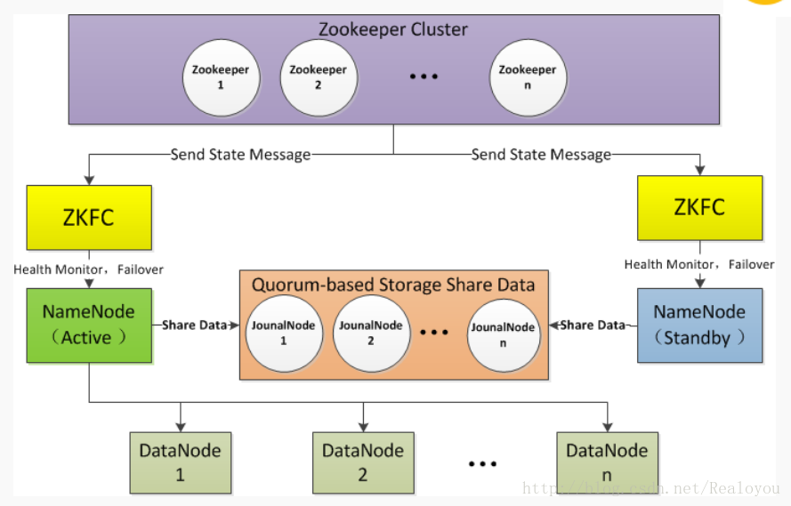
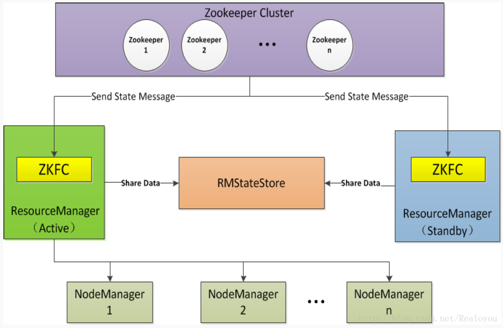

# ZooKeeper

Zookeeper 最早起源于雅虎研究院的一个研究小组,试图开发一个通用的无单点问题的分布式协调框架，以便让开发人员将精力集中在处理业务逻辑上.

```
分布式系统是由独立的计算机通过网络连接在一起，并且通过一些组件来相互交流和协作来完成一个共同的目标。
```

分布式系统的特性:

- **资源共享**，例如存储空间，计算能力，数据，和服务等等
- **扩展性**，从软件和硬件上增加系统的规模
- **并发性** 多个用户同时访问
- **性能** 确保当负载增加的时候，系统想要时间不会有影响
- **容错性** 尽管一些组件暂时不可用了，整个系统仍然是可用的
- **API抽象** 系统的独立组件对用户隐藏，仅仅暴露服务

有了Zookeeper，可以实现：

- 配置管理
- 命名服务
- 分布式锁
- 集群关系操作，检测节点的加入和离开

#### Zookeeper配置

```cfg
# 心跳联络间隔 每两秒联络一次
tickTime=2000

# 启动时候超过10s则认为节点启动失败
initLimit=10

# 超过5s默认失联
syncLimit=5

# 本地数据目录(需要手动创建)(data/下需要一个myid.txt文件唯一标识标识主机)
# myid.txt内id对应server.id
dataDir=/usr/local/lib/zookeeper-3.4.5-cdh5.15.2/data

# 监听端口(客户端端口)
clientPort=2181

# 指定集群
# server.1=主机名1:通信端口:选举端口
server.1=master:2888:3888
server.2=slaver1:2888:3888
server.3=slaver2:2888:3888
```

#### 启动停止

```shell
$ ./zKServer.sh start
```

查看启动状态：

```shell
$ zkServer.sh status
```

如果没有启动成功，查看报错信息：

```shell
$ cat zookeeper.out
```

停止

```shell
$ zkServer.sh stop
```

#### ZooKeepe的数据节点

ZooKeepe的数据节点类似linux文件系统

每一个节点即类似于一个文件，每一个子目录都称作znode

有四种znode：

- PERSISTENT（持久化目录节点）

  客户端与zookeeper断开连接后，该节点依旧存在

- PERSISTENT_SEQUENTIAL（持久化顺序编号目录节点）

  客户端与zookeeper断开连接后，该节点依旧存在，只是Zookeeper给该节点名称进行顺序编号

- EPHEMERAL（临时目录节点）

  客户端与zookeeper断开连接后，该节点被删除

- EPHEMERAL_SEQUENTIAL（临时顺序编号目录节点）

#### 监听通知机制

客户端注册监听它关心的目录节点，当目录节点发生变化（数据改变、被删除、子目录节点增加删除）时，zookeeper会通知客户端。

## HA架构

对于只有一个NameNode的集群，如果NameNode机器出现意外情况，将导致整个集群无法使用，直到NameNode重新启动

- NameNode机器宕机，将导致集群不可用，重启NameNode之后才可使用
- 计划内的NameNode节点软件或硬件升级，导致集群在短时间内不可用

为了解决上述问题，Hadoop给出了HDFS的高可用HA方案：HDFS通常由两个NameNode组成，一个处于active状态，另一个处于standby状态。

### HDFS HA架构

在一个HA集群中,会配置两个独立的NameNode。在任意时刻,只有一个节点会作为活动的节点,另一个节点则处于备份状态。活动的NameNode负责执行所有修改命名空间以及删除备份数据块的操作,而备份的NameNode则执行同步操作以保持与活动节点命名空间的一致性。

##### Standy NameNode 如何与Active NameNode保持一致

1. 为了使备份节点与活动节点的状态能够同步一致，两个节点都需要与一组独立运行节点（**JournalNodes, JNS**）通信
2. 当Active Namenode执行了修改命名空间的操作时，它会定期将执行的操作记录在edit log中，并写入JNS的多数节点中，而Standby  NameNode会一直监听JNS上edit log的变化，如果发现edit log有改动， Standby NameNode就会读取edit log并与当前的命名空间合并
3. 当发生了错误切换时， Standby节点会先保证已经从JNS上读取了所有的edit log并与命名空间合并，然后才会从Standby状态切换为Active状态。
4. **DataNode会同时向这两个NameNode发送心跳以及块汇报信息。**这样Active NaneNode和Standby NameNode的元数据就完全同步了，一旦发生故障，就可以马上切换

##### 脑裂

- 可能出现两个NameNode同时服务于整个集群的情况，这种情况称之为脑裂。

##### 为了防止脑裂，HDFS提供三个隔离级别

- 共享存储隔离：同一时间只允许一个NameNode向JournalNodes写入edit log数据。
- 客户端隔离：一时间只允许一个NameNode响应客户端请求。
- DataNode隔离：同一时间只允许一个NameNode向DataNode下发名字节点指令,例如删除、复制数据块指令等。

 #### HA切换的方式

- 管理员手动通过命令执行状态切换
- 自动状态切换机制触发状态切换（由**ZKFailoverController**控制切换流程 ）




- **Active NameNode**：接收客户端请求
- **Standby NameNode**: 同样会接到来自DataNode的Block report, block location updates和heartbeat，同时会从共享存储的Editlog上读取并执行这些log操作，使得自己的NameNode中的元数据（Namespcaeinformation + Block locations map）都是和Active NameNode中的元数据是同步的。
- **JounalNode**:用于Active NameNode，Standby NameNode同步数据
- **ZKFC** (单独进程):
  - **监控状态**--->监控NN是否正常工作
  - **选举Active**--->向zookeeper定期发送心跳,如果NN工作出现异常,zookeeper可以随时选取另一个ZKFC转换相应的NN为Active


### Yarn HA架构




