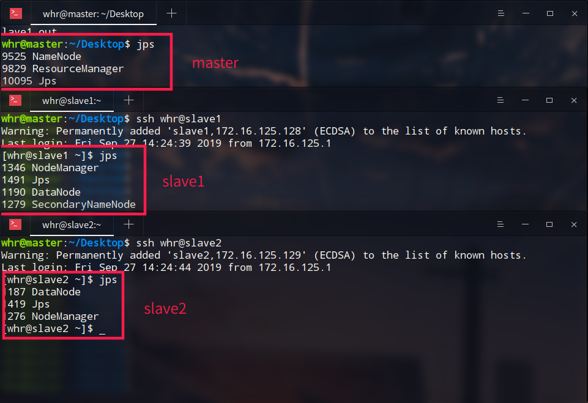

# hadoop完全分布式搭建

### 建议（遇到的坑）：

1. 如果自己用的操作系统就是linux，我本身是deepin系统，装了两台虚拟机，结果，用户名没有配置，导致启动不了，因为hadoop的master节点启动的时候，默认slave的用户名为master机器的用户名。所以，要保证三台机器，用户名是一致的！！
2. windows下的调试MapReduce程序会有点不方面，需要装winutils。
3. 建议在一台上搭建完整（包括环境、配置），再克隆，或者scp复制。
4. 如果想连zookeeper和kafka都一起的话，可以也直接配置了。不装的话，之后用scp传，也挺方面的。
5. 克隆完修改hostname！
6. 整体过程还有点粗糙，有些遇到的细节，也忘记记录了。欢迎指教，如果有问题，请通知，我会及时改正。

### 虚拟机安装

1. VMware中安装多台CentOS-7虚拟机（这里安装了2台slave，因为我自己用的操作系统就是deepin）
2. 传文件到虚拟机：我使用scp传的，很快。windows下的用户建议xshell，sftp。
3. 虚拟机的网络配置就默认的NAT，CentOS最小安装

### 配置：

1. 关闭防火墙

   ```shell
   $ systemctl status firewalld			# 查看防火墙状态
   $ systemctl stop firewalld				# 临时停止firewall
   $ systemctl disable firewalld			# 禁止firewall开机启动
   ```

2. 关闭SELinux

   安全增强型 Linux（Security-Enhanced Linux）简称 SELinux，它是一个 Linux 内核模块，也是 Linux 的一个安全子系统。

   ```shell
   $ vim /etc/selinux/config
   # 将SELINUX=enforcing改为SELINUX=disabled
   ```

3. 安装ntp时间同步服务

   ```shell
   yum install -y ntp
   # 设置开机自启
   systemctl enable ntpd.service	# 启动
   systemctl enable ntpd
   systemctl status ntpd	# 查看是否启动
   ```

   有可能无法启动，原因是：与**chronyd**冲突：

   **systemctl disable chronyd**：关掉，在启动ntp，即可

4. 修改主机名、配置静态ip

   （克隆之后，这些要稍作修改，主机名要改，ip要改一下即可）

   第一步：修改 /etc/sysconfig/network-scripts/ifcfg-xxx文件

   主要修改下面几个参数：
   
   ```shell
   BOOTPROTO="static"
   ONBOOT="yes"
   IPADDR="172.16.125.128"
   NETMASK="255.255.255.0"
   GATEWAY="172.16.125.2"
   ```

   第二部：修改文件 /etc/sysconfig/network的内容

   内容同上
   
   ```shell
   # Created by anaconda
   GATEWAY=172.16.125.2
   DNS=172.16.125.2
   ```

   第三步：重启网络
   
   ```shell
service network restart
   ```

5. 配置ssh

   master能够免密登录到slave节点

   ```shell
   $ ssh-keygen -t rsa
   ```

   打开~/.ssh 下面有三个文件

   ```shell
   -rw-r--r--. 1 root root  392 9月  26 21:05 authorized_keys	# 已认证的keys
   -rw-------. 1 root root 1679 9月  26 20:57 id_rsa			# 私钥
   -rw-r--r--. 1 root root  393 9月  26 20:57 id_rsa.pub		# 公钥
   ```

   在master上将**三台机器的公钥**放到authorized_keys里。命令：

   ```shell
   $ sudo cat id_rsa.pub >> authorized_keys
   ```

   将master上的authorized_keys放到其他linux的~/.ssh目录下

   ```shell
   $ sudo scp authorized_keys hadoop@10.10.11.192:~/.ssh
   ```

   修改authorized_keys权限，命令：

   ```shell
   $ chmod 644 authorized_keys
   ```

   测试是否成功

   ssh host2 输入用户名密码，然后退出，再次ssh host2不用密码，直接进入系统。这就表示成功了。

   如果在登录ssh的时候出现：

   The authenticity of host 'hadoop2 (192.168.238.130)' can't be established

   则需要修改/etc/ssh/ssh_config文件中的配置，添加如下两行配置：

   ```shell
   StrictHostKeyChecking no
   UserKnownHostsFile /dev/null
   ```

6. 最后：安装配置jdk、hadoop

   core-stie.xml

   ```xml
   <configuration>
       <property>
           <name>fs.defaultFS</name><!--默认文件系统位置-->
           <value>hdfs://master:9000/</value>
       </property>
       <property>
           <name>hadoop.tmp.dir</name><!--hadoop的工作目录，namenode、datanode的数据-->
           <value>/home/whr/workbench/hadoop/data/</value>
       </property>
   </configuration>
   ```

   hdfs.site.xml

   ```xml
   <configuration>
       <property>
           <name>dfs.replication</name><!--副本数量-->
           <value>2</value>
       </property>
       <property><!--secondary的位置，子节点的其中一个配置-->
           <name>dfs.namenode.secondary.http-address</name>
           <value>slave1:50090</value>
       </property>
   </configuration>   
   ```

   mapreduce.site.xml

   ```xml
   <configuration>
       <property><!--指定mapreduce程序用yarn集群运行，才能实现分布式-->
           <name>mapreduce.framework.name</name>
           <value>yarn</value>
       </property>
   </configuration>
   ```

   yarn.site.xml

   ```xml
   <configuration>
       <property>
           <name>yarn.resourcemanager.hostname</name>
           <value>hadoop1</value>
       </property>
       <property>
           <name>yarn.nodemanager.aux-services</name>
           <value>mapreduce_shuffle</value>
       </property>
   </configuration>
   ```

   配置slaves文件

   ```xml
   slave1
   slave2
   ```

   配置masters文件（如果有的话，我用的CDH版本，没有此文件）

   ```xml
   master
   ```

### 克隆

1. vmware克隆没什么说的
2. 克隆完成，先修改 /etc/hostname文件下的主机名！
3. 添加三台机器的ip地址映射：/etc/hosts

### 启动集群

1. 先格式化节点（我是一台格式化之后，克隆的）

```shell
 $ hadoop namenode -format
 # 最后出现,即成功，也可以看最后状态码为0
 Storage directory /tmp/hadoop-root/dfs/name has been successfully formatted.
```

2. 启动:到sbin目录下(可以先把sbin目录配置到环境变量中;就不需要切换目录了)

```shell
start-dfs.sh
start-yarn.sh
```

3. jps命令

   全部启动完成之后，查看结果：(在master上ssh登录slave)

   可以看到master的NameNode、两个DataNode、一个SecondaryNameNode都已经启动完毕

   yarn下的ResourceManager、两个slave中的NodeManager也都启动完成

4. 这样就可以通过浏览器访问了50070端口了



可以跑一下mapreduce样例程序：

```shell
$ hadoop jar hadoop-mapreduce-examples-2.6.0-cdh5.15.2.jar pi 5 5
```

### Hadoop配置文件

参考配置文件

https://www.cnblogs.com/xhy-shine/p/10530729.html


