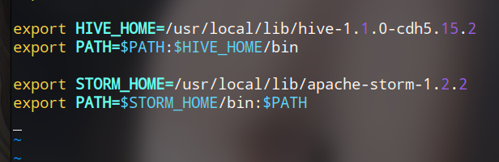
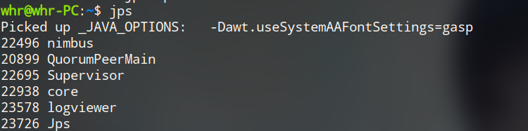
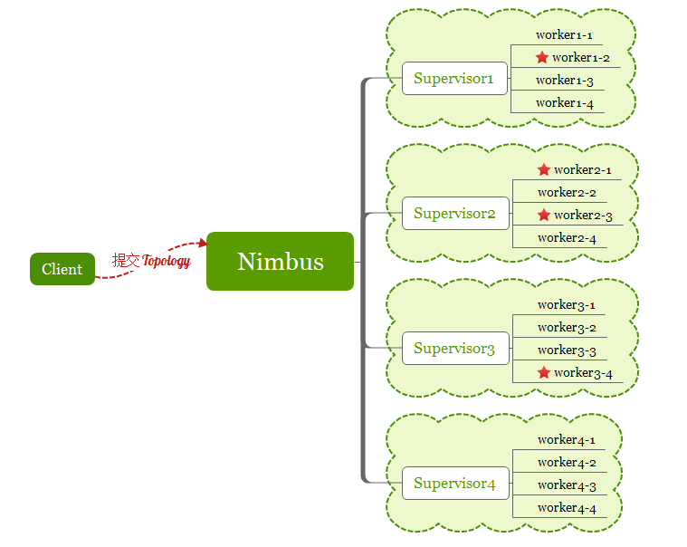
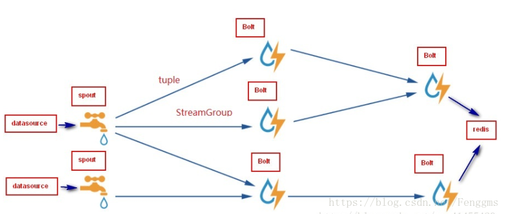

# Storm

Storm是一个分布式的、高容错的**实时计算系统**

Storm对于实时计算的意义类似于Hadoop对于批处理的意义

Storm可以用来处理源源不断流进来的消息，处理之后将结果写入到某个存储中去。


| Stom                            |       Hadoop        |
| ------------------------------- | :-----------------: |
| 实时流处理                      |       批处理        |
| 无状态                          |       有状态        |
| 使用**Zookeeper**协同的主从框架 | 无主从Zookeeper框架 |
| 每秒处理数万消息                |       HDFS/MR       |
| 不会主动停止                    |    job完成即停止    |


Storm:

- 跨语言,可伸缩,低延迟,秒级 ,容错高


#### 配置文件

storm.yarm

```yaml
# 配置集群主机
storm.zookeeper.servers:
     - "master"
     - "slave1"
     - "slave2"
     
# 配置storm的文件系统地址（需要权限）
storm.local.dir: "/root/storm"

# 说明nimbus在哪个机器
nimbus.seeds: ["master"]

# 每个supervisor的work进程在哪个端口上
supervisor.slots.ports:
    - 6700
    - 6701
    - 6702
    - 6703
```

##### 配置环境变量



##### 启动

```bash
$ ./bin/zkServer.sh start   # 启动zookeeper
$ storm nimbus &			# 在配置nimbus的主机，启动nimbus
$ storm supervisor &    	# 在启动Supervisor的主机，启动Supervisor
$ storm ui &				# 启动ui
$ storm logviewer &			# 启动日志
```




## 核心组件

#### Nimbus(雨云)

即Storm的Master，负责资源分配和任务调度。**一个Storm集群只有一个Nimbus**


#### Supervisor(监管者)

即Storm的Slave，负责接收Nimbus分配的任务，管理所有Worker，**一个Supervisor节点中包含多个Worker进程**


#### Worker

一个工作进程，**每个工作进程中都有多个Task**


#### Task

任务

在 Storm 集群中每个 Spout 和 Bolt 都由若干个任务（tasks）来执行

每个任务都与一个执行线程相对应


#### Topology (类似于MapReduce)

计算拓扑，Storm 的拓扑是对实时计算应用逻辑的封装

区别: MapReduce的job任务执行完毕就结束,而拓扑会一直在集群中运行,直到手动终止它


#### Stream

数据流（Streams）是 Storm 中最核心的抽象概念

一个数据流指的是在分布式环境中并行创建、处理的一组**元组（tuple）**的无界序列


#### Spout(水柱)

数据源（Spout）是拓扑中数据流的来源,一个 Spout可以发送多个数据流

根据需求的不同，Spout 既可以定义为可靠的数据源，也可以定义为不可靠的数据源

一个可靠的 Spout能够在它发送的元组处理失败时重新发送该元组，以确保所有的元组都能得到正确的处理

不可靠的 Spout 就不会在元组发送之后对元组进行任何其他的处理


#### Bolt(闪电)

拓扑中所有的数据处理均是由 Bolt 完成的,,,几乎能够完成任何一种数据处理需求

步骤:

数据过滤（filtering）、函数处理（functions）、聚合（aggregations）、联结（joins）、数据库交互等功能

复杂的数据流变换通常需要使用多个 Bolt 并通过多个步骤完成





