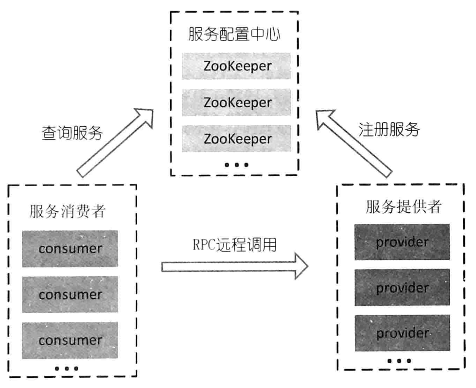
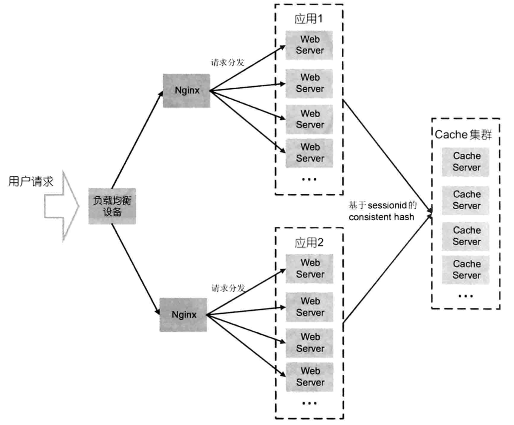
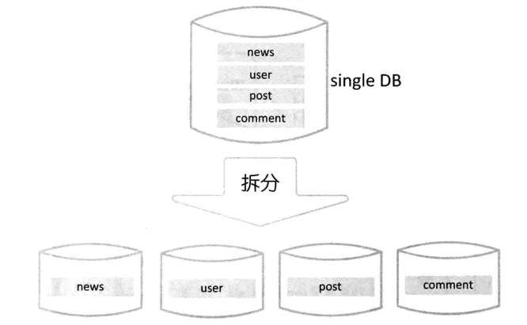
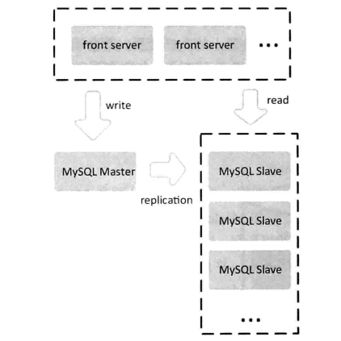
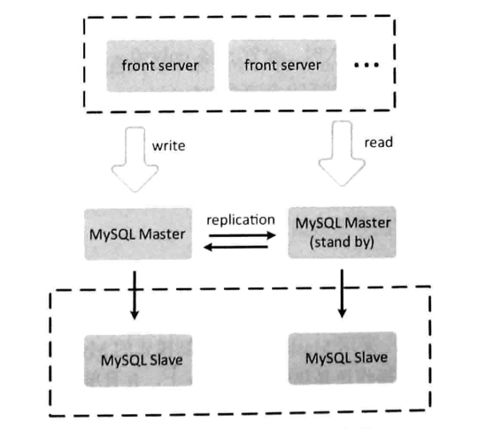
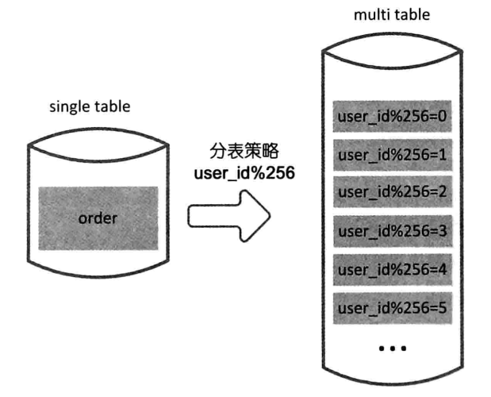
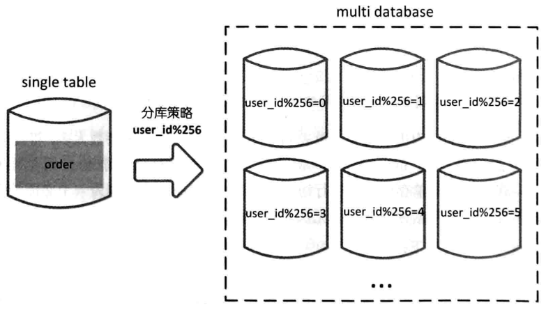

# 分布式

参考

《大型分布式网站架构设计与实践》

#### 分布式基础设施

- 均衡负载系统

- 分布式缓存系统

- 持久化存储

- 分布式消息系统

- 搜索引擎

  

## 负载均衡

对于负载较高的服务来说，往往对应多台服务器组成的集群，在请求到来的时候，为了将请求均衡的分配到后端服务器，负载均衡程序将从服务对应的地址列表中，通过响应的负载均衡算法和规则，选取一台服务器进行访问，这个过程称为**服务的负载均衡。**

当服务越来越多，规模越来越大，对应的机器数量也越来越多，人工管理和维护服务的配置信息，就会变得越来越困难。

此时，需要一个能够动态注册和获取服务信息的地方，来统一管理服务名称和其对应的服务器列表信息，称之为**服务配置中心**。

**基于Zookeeper的服务配置中心**的搭建，来实现服务动态注册，机器上线和下线的动态感知，扩容方便，容错性好。




#### 负载均衡算法

消费者从服务配置中心获取服务地址列表后，对其中一台发起了RPC调用，如何选择选中的主机，则取决于具体的负载均衡算法。对于不同的场景，选择的负载均衡算法也不尽相同。

##### 1. 轮询法

将请求按顺序轮流的分配到后端服务器上，它均衡地对待后端每一台服务器，不关心实际连接数和当前的系统负载。

##### 2. 随机法

通过系统随机函数，根据后来服务器列表的大小值，随机选取其中一台进行访问。理论上随着访问量的增大，实际效果就会越来越平均到每一台后端服务器上。

##### 3. 源地址哈希法

获取客户端访问的IP地址，通过哈希函数计算得到一个数值，用该数值对服务器列表的大小进行取模运算，这样就可以做到，同一个IP地址，每次都会被映射到同一台后端服务器进行访问。

（这种特性，就可以在消费者和服务提供者之间建立有状态的Session会话）

##### 4.加权轮询法

不同的后端服务器的抗压和负载能力不尽相同，此算法，给配置高、负载低的机器更高的权重，让其处理更多的请求；而配置低、负载高的机器，给其较低的权重。

##### 5. 加权随机法

按照权重来随机选取服务器，并非完全随机

##### 6. 最小连接数法

此方法比较灵活、智能，由于服务器的配置不尽相同，对于请求的处理有快有慢；

此算法，根据服务器的当前连接情况，动态选取其中当前积压连接数最少的一台服务器来处理当前请求。将负载合理分流到每一台机器。设计实现比较麻烦。


### 分布式缓存

分布式缓存主要用于高并发环境下，减轻数据库的压力，提高系统的响应速度和并发吞吐量。当大量的读写、涌向数据库的时候，磁盘的处理速度与内存显然差距很大，因此，在数据库之前，加上一层缓存，能够显著提高响应速度，降低数据库压力。

#### memcache

开源的高性能的分布式对象缓存系统。使用key-value存储和访问数据

减少对数据库的访问，提高应用访问速度，降低数据库的负载。


## 分布式Session

对于分布式网站，支撑业务的远远不止一台服务器，如何保持各个服务器之间的Session同步呢？

传统网站通过将数据存储在cookie中，来规避分布式环境下的session操作，这种做法弊端很多：cookie大小有限、随着发展，移动端的session越来越重要。

- **基于memcache的分布式session：**通过将Session以SessionId作为key，保存在后端的缓存集群中，既可以实现集群间的session同步，有提高了WebServer的容错性。



## 持久化存储

### 一、MySql

#### 1. 业务拆分

在分布式的架构下，随着业务规模的扩展，使得系统越来越复杂，越来越难以维护，开发效率低，并且系统的资源消耗也越来越大，硬件提升的成本也很大。

**因此，系统业务的拆分是很有必要的。**

如下图，对于一个新闻板块的数据表，拆分为多个模块



这种做法：

- 提高系统的可扩展性
- 单个系统的复杂度降低，提高开发测试的效率
- 原来的一个库的压力，现在分摊到四个库，吞吐能力自然就提高了


#### 2. 复制策略

即使拆分数据库，随着业务不断扩大，数据库压力还是在不断提高。

- **这时候可以使用MySql的replication策略对系统进行扩展**

思想：

​	通过数据库的复制，将一台MySql的数据，复制到集群中的另一台机器上，这样，前端对数据库的访问压力就被分摊了。从而提高整个集群的负载能力。

#### Master-Slaves架构



- 前端服务器通过Master来执行数据写入的操作，数据的更新通过Binary log同步到Slave集群。
- 对于读，则交给Slave处理，多台数据相同的Slave分摊了read 的压力
- **这样的读写分离，还保障了数据的最终一致性。**
- 读的压力比写的压力大，所以扩展Slave能够显著减轻单库读取数据的压力


存在一个问题：Master宕机的单点故障问题，Master停机，整个系统都无法写入，难以接受


####　Master-Master架构（Dual-Master架构）



两个Master互为对方的Slave，互相同步数据。

如果写入的Master宕机，首先将数据进行同步到另一台Master，然后开启写入操作。


#### 3. 分表与分库

基于**复制策略**的MySql架构，只能解决读操作，并且Slave增多，Master也会压力很大。

- **分表**：对于访问频繁，数据量大的单表，我们要做的是**减少单表的记录条数。**以此提高吞吐。



- **分库**：与分表类似，通过一个关键字的取模方式，对数据的访问，进行路由




### 二、HBase

- 详见 HBase.md

### 三、Redis

- 详见 Redis.md


## 消息系统

**在分布式系统中，消息是作为应用间通信的一种方式**

消息被保存在队列中，直接被接受者取出

Kafka


## 数据分析

### 日志收集

在线运行的系统，每天都会产生大量的日志信息，这些信息包含系统运行的错误信息，系统的敷在信息，用户访问路径、以及响应时间、用户搜索的关键字、接口的调用信息。

- **这些信息经过一定的加工，可以提供极为重要的参考决策依据**

例如：

通过用户的搜索关键字，得出用户喜好。

通过负载信息日志，可以查看某个时间点系统的各方面的指标信息。

通过错误信息日志，可以对系统的开发有帮助。

通过接口调用路径日志，可以分析接口的访问链路，进行服务治理。


#### inotify机制

对于日志手机，最常用的是文件轮询：设置时间间隔，不断读取日志文件。

但是对于写入不频繁的文件，如错误日志，显得效率低下。

inotify机制：

​	响应性的处理机制。能够对文件系统的变化进行监控，文件的修改，删除，都可以及时通知应用程序进行处理，提高了处理的效率。

```bash
# 查看是否支持inotify
$ grep INOTIFY_USER /boot/config-4.15.0-29deepin-generic
CONFIG_INOTIFY_USER=y
```


