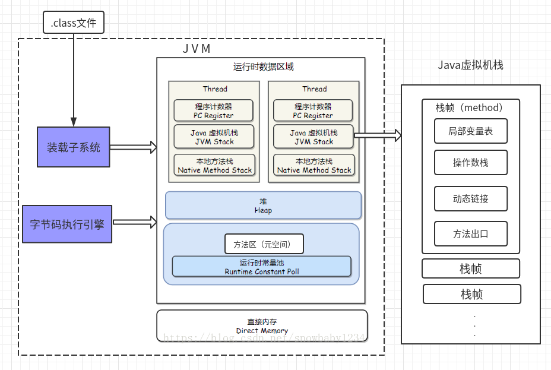
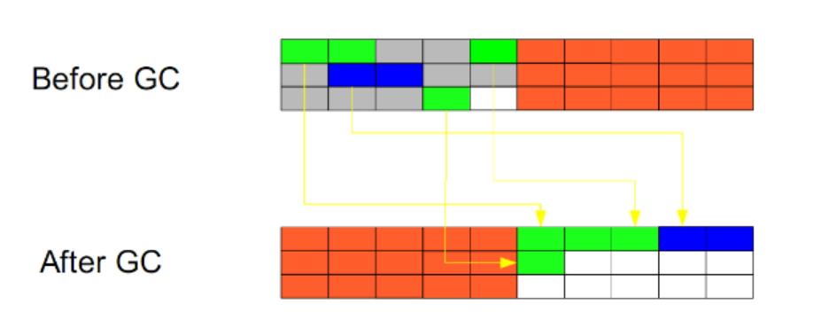
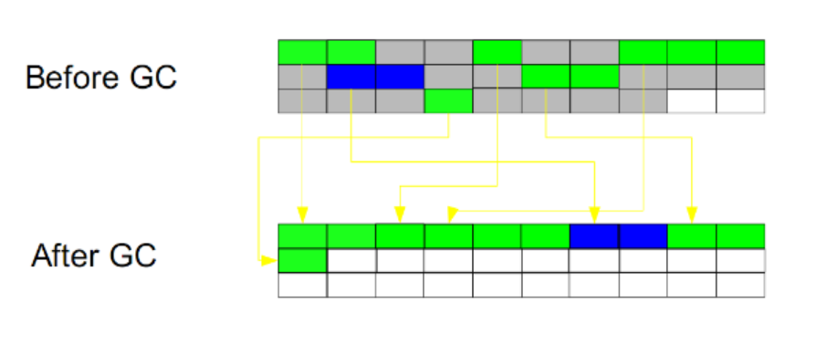
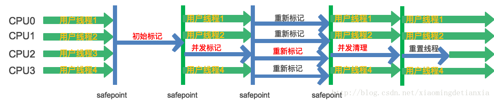
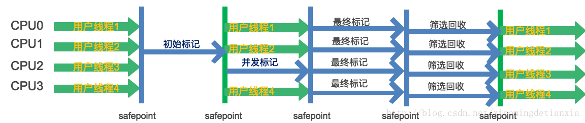
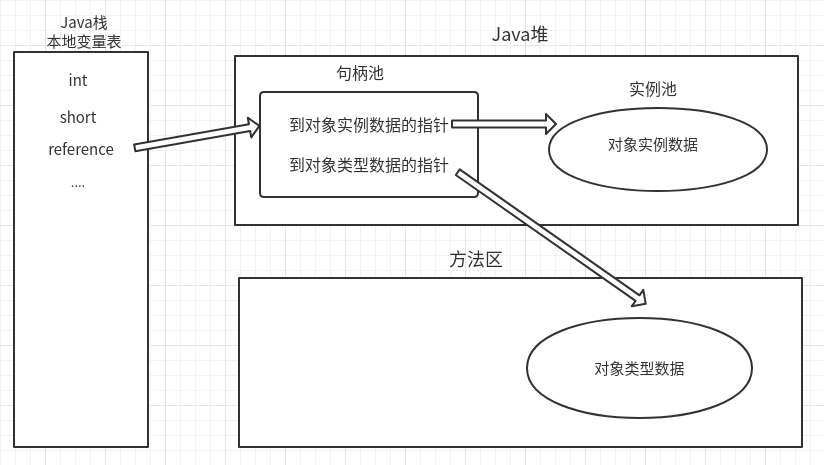
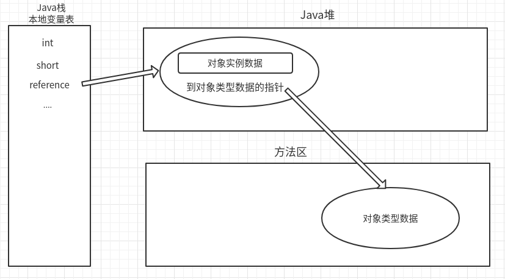
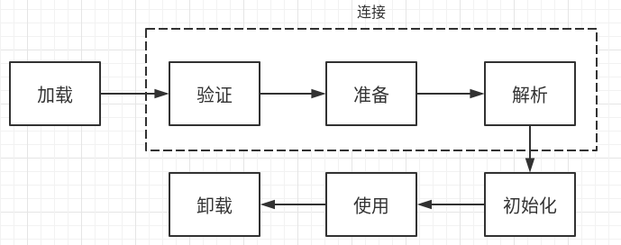
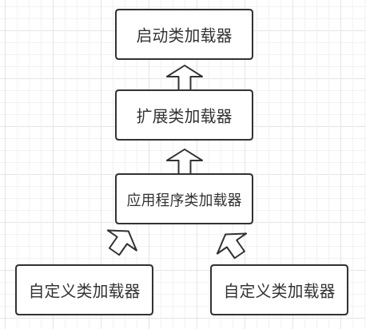

# JVM

参考：

<https://www.cnblogs.com/andy-zhou/p/5327288.html>  **强烈推荐**

《深入理解java虚拟机》

## JVM 参数配置

| 参数                      |                                                         |
| :------------------------ | :-----------------------------------------------------: |
| -Xmx3550m                 |            设置JVM的 **最大堆内存** 为3550M             |
| -Xms3550m                 |             设置JVM **初始堆内存** 为3550M              |
| -Xss128k                  | 设置 **每个线程的栈** 大小(减小这个值能生成更多的线程)  |
| -Xmn2g                    |                   设置新生代大小为2G                    |
| **-**XX:SurvivorRatio=4   | 设置年轻代中Eden区与Survivor区的比值(Eden:Survivor=4:1) |
| -XX:MetaspaceSize=256m    |               设置**元空间初始值**为256M                |
| -XX:MaxMetaspaceSize=256m |               设置**元空间最大值**为256M                |
| -XX:NewSize=1024m         |               设置**新生代初始值**为1024M               |
| -XX:MaxNewSize=1024m      |               设置**新生代最大值**为1024M               |
| -Xloggc:./gc.log          |                    配置gc日志到文件                     |

## JVM 运行时数据区


栈代表了处理逻辑，而堆代表了数据

#### 1.程序计数器（线程私有）

**程序计数器是一块较小的内存，通过这个计数器来选取下一条需要执行的字节码指令。**

Java虚拟机的多线程是通过线程之间切换来轮流获得处理器的执行时间的，每个线程都有自己独立的程序计数器，它们互不影响，也就是**线程私有**的。确保了线程切换，仍能正常执行；

如果执行的是Java方法，这里存放的是指令地址，如果执行的是Native方法，这里的值为空（Undefined）。

这个区域不会出现OutOfMemoryError 

#### 2.（虚拟机）栈（VM Stack）（线程私有）

虚拟机栈也是**线程私有的**，也叫**栈内存**，在线程创建的时候创建，生命周期跟随线程，线程结束，栈内存释放。

虚拟机栈描述的是**Java方法执行的内存模型**；存取速度比堆快，仅次于寄存器。

执行每个方法的时候都会创建一个栈帧，**用来存储局部变量表、操作数栈、方法出口等信息。**

这个区域有两种异常情况：

- StackOverflowError异常：栈帧过多，或栈帧内存过大，超过虚拟机栈的内存大小；
- OutOfMemoryError异常：栈帧过多，虚拟机栈动态扩展，但是扩展时无法申请到足够的内存；

#### 3.本地方法栈（线程私有）

本地方法栈与虚拟机栈的作用类似，只不过是虚拟机栈是为执行Java方法服务，而本地方法栈是为执行Native方法服务。本地方法：调用非Java方法的接口；

JVM需要与操作系统底层交互，并且JVM本身也有一部分是C语言完成的，所以Native方法帮助实现与底层交互；

#### 4.堆（heap）（线程共享）

Java堆是由所有线程共享的一块内存区域，在虚拟机启动时创建，并且也是Java虚拟机管理管理的内存中最大的一块。

动态分配内存，速度较慢。

**Java堆主要用于存放对象实例以及数组**

Java堆是垃圾回收的主要区域，也被成为“GC”堆。

#### 5.方法区（元空间）

**方法区（又叫静态区）也是各个线程共享的内存区域，用于存储已经被虚拟机加载的类信息、常量、静态变量等数据。**

JDK移除了方法区（永久代）；取而代之的是元空间（占用本地内存，不占用JVM内存）原因：

1. 字符串在永久代中，容易出现性能问题和溢出；
2. 类及方法信息比较难确定大小，
3. 永久代垃圾回收效率低下，给GC带来不必要的复杂度；

使用本地内存的元空间，不会出现上面问题。

### 一个Java类的信息到底是怎么样存放的：

```java
public class Student {
    private String name;
    private static int ID = 1;	// 存在方法区

    public Student(String name) {
        this.name = name;
    }
    public static void main(String[] args) {
        // 入栈
        Student s = new Student("zhangsan"); // 堆中创建实例
        int age = 10;
        System.out.println(age);
    }
}
```



- 可以说方法区存放 类级别 的信息
- 堆存放 对象级别 信息

## 堆(分代收集)


### 新生代

使用**复制算法**（每次收集，大批对象死去，少量存活）

所有新生成的对象首先都是放在新生代的。新生的对象，会有一个年龄属性（Age），一个计数器，开始为0；

**新生代的目标就是尽可能快速的收集掉那些生命周期短的对象。**

新生代分三个区：

- Eden区：

  大部分对象在Eden区中生成。当Eden区满时，触发**MinorGC**，还存活的对象将被复制到Survivor区（两个中的一个），并且，存活进入Survivor区的对象年龄变为1；之后每经历一次MinorGC，年龄+1；

- 两个Survivor区：

  当这个Survivor区满时，此区的存活对象将被复制到另外一个Survivor区，当这个Survivor区也满了的时候，从第一个Survivor区复制过来的并且此时还存活的对象，将被复制到“年老代”。

### 老年代

**标记整理** 或**标记清除**算法（对象存活率高）

在年轻代中经历了15次垃圾回收（也就是年龄15，此值默认15，可调）后仍然存活的对象，就会被放到年老代中。

因此，可以认为年老代中存放的都是一些**生命周期较长的对象**。

## GC 算法

### 一、标记 - 清除


此方法分为两个阶段：

- 先标记所有被引用的对象
- 遍历整个堆，把没有标记的对象清除

**此方法需要暂停整个应用，不会压缩堆，同时，还会产生内存碎片**

### 二、复制算法



此算法把内存空间划为两个相等的区域，每次只使用其中一个区域。

垃圾回收时，遍历当前使用区域，把正在使用中的对象复制到另外一个区域中。

同时复制过去以后还能进行相应的内存整理，不会出现“碎片”问题。

**缺点：需要两倍的内存空间**

### 三、标记 - 整理




此算法结合了“标记-清除”和“复制”两个算法的优点。

分两个阶段：

- 第一阶段从根节点开始标记所有被引用对象
- 第二阶段遍历整个堆，清除未标记对象并且把存活对象“压缩”到堆的其中一块，按顺序排放。

**此算法避免了“标记-清除”的碎片问题，同时也避免了“复制”算法的空间问题**。

### 四、分代收集算法（最常用）

#### 为什么要分代？

不同的对象的生命周期是不一样的。因此，不同生命周期的对象可以采取不同的收集方式，以便提高回收效率。

- 在不进行对象存活时间区分的情况下，每次垃圾回收都是对整个堆空间进行回收，花费时间相对会长，
- 同时，因为每次回收都需要遍历所有存活对象，对于生命周期长的对象而言，这种遍历是没有效果的，他们依旧存在

因此，分代垃圾回收采用分治的思想，进行代的划分，把不同生命周期的对象放在不同代上，不同代上采用最适合它的垃圾回收方式进行回收。

### MinorGC

新生代GC，JVM中最频繁的GC；

1. 当新生代中的Eden区满了（仅Eden区，Survivor区不会触发），会触发MinorGC；
2. 即新来的对象，JVM无法为其分配足够的内存的时候，就会触发MinorGC；
3. MinorGC期间会触发STOP-THE-WORLD，所有线程停止运行，但是这个延迟，很小，可以忽略不计。而且，回收的是Eden区，基本是不怎么使用的对象，大部分Eden区对象被认为是垃圾；
4. 此GC不会影响到老年代，也不会影响Survivor区，不会影响永久代，仅针对Eden区；
5. 此GC效率高，速度快，使用频率高。

### FullGC

老年代GC，JVM的调优，很大一部分的工作就是对Full GC的调优

**此方法，比较慢，应该尽量减少Full GC的次数**

1. 调用System.gc时，系统建议执行Full GC，但是不必然执行；
2. 老年代空间不足，方法区空间不足，都会触发MajorGC
3. 元空间满时也会引发Full GC，会导致Class、Method元信息的卸载；
4. 上一次GC之后，Heap的各区域分配策略动态变化，需要调整，就会触发Full GC；

## JVM调优

根据应用的场景的不同，来调优，一般可以分为两种应用场景：

- 响应时间优先的应用：

  1. **应将新生代尽可能的设置大，直到接近系统的最低响应时间**

     这样，新生代收集发生的频率也是最小的，同时也可以减少到达老年代的对象。

  2. 年老代使用并发收集器，需要小心设置内存，要考虑多方面因素

- 吞吐量优先的应用：

  **需要一个很大的新生代，和一个较小的老年代**

  可以尽可能的回收掉大部分的短期对象，减少中期对象，让老年代尽可能存放长期对象

## 垃圾收集器

### Serial

（本意就是串行） 收集器

- Serial
- Serial Old


单线程，简单高效

它进行垃圾收集时，必须暂停其他所有的工作线程，直到它收集结束（Stop The World）;

Client模式下，新生代的默认收集器。

在用户场景下，JVM管理的内存不会很大，Serial收集器在整理200M以内的内存，可以控制在100ms以内，可以接受。

### ParNew 收集器


Serial 收集器的多线程版本

Server 模式下的虚拟机首选新生代收集器，主要是因为除了 Serial 收集器，只有它能与 CMS 收集器配合工作

默认开启的线程数量与 CPU 数量相同，可以使用 -XX:ParallelGCThreads 参数来设置线程数。

### Parallel Scavenge 收集器

与 ParNew 一样是并行的多线程收集器。关注点是尽可能缩短垃圾收集时用户线程的停顿时间；

“吞吐量优先”收集器。这里的吞吐量指 CPU 用于运行用户代码的时间占总时间的比值。

控制最大垃圾收集停顿时间： -XX:MaxGCPauseMillis

直接设置吞吐量大小： -XX:GCTimeRatio 

 GC 自适应的调节策略开关：-XX:+UseAdaptiveSizePolicy；不需要手工指定新生代的大小（-Xmn）、Eden 和 Survivor 区的比例（-XX:SurvivorRatio）、晋升老年代对象年龄（-XX:PretenureSizeThreshold）等细节参数了，JVM会监控运行情况，动态调整。

### Serial Old 收集器

Serial Old是Serial收集器的老年代版本，它同样是一个单线程收集器，使用标记－整理算法。

如果用在 Server 模式下，它有两大用途：

- 在 JDK 1.5 以及之前版本（Parallel Old 诞生以前）中与 Parallel Scavenge 收集器搭配使用。
- 作为 CMS 收集器的后备预案，在并发收集发生 Concurrent Mode Failure 时使用。

### Parallel Old 收集器

Parallel Scavenge 收集器的老年代版本。

注重吞吐量以及 CPU 资源敏感的场合，都可以优先考虑 Parallel Scavenge 加 Parallel Old 收集器。

### CMS （Concurrent Mark Sweep）收集器



并发标记—清除算法：并发收集，低停顿

收集流程：

- 初始标记：仅仅只是标记一下 GC Roots 能直接关联到的对象，速度很快，需要停顿；
- 并发标记：进行 GC Roots Tracing 的过程，它在整个回收过程中耗时最长，不需要停顿；
- 重新标记：为了修正并发标记期间因用户程序继续运作而导致标记产生变动的那一部分对象的标记记录，需要停顿；
- 并发清除：不需要停顿，耗时略长；

缺点：

- 吞吐量低：低停顿时间是以牺牲吞吐量为代价的，导致 CPU 利用率不够高；
- 在并发清除时，用户线程仍会产生垃圾，这些CMS无法处理；
- 收集算法导致：会产生内存碎片

### G1 收集器



G1（Garbage-First）是一款面向服务端应用的垃圾收集器。

与CMS的“标记—清理”算法不同，G1从整体来看是基于“标记—整理”算法实现的收集器，从局部（两个Region之间）上来看是基于“复制”算法实现的

- **不会产生内存空间碎片**

- **可预测的停顿** 

  它将整个Java堆划分为多个大小相等的独立区域（Region），虽然还保留有新生代和老年代的概念，但新生代和老年代不再是物理隔离的了，它们都是一部分Region（不需要连续）的集合。

  G1跟踪各个Region里面的垃圾堆积的价值大小，在后台维护一个优先列表，每次根据允许的收集时间，优先回收价值最大的Region（这也就是Garbage-First名称的来由）。

执行过程：

- 初始标记
  初始标记阶段仅仅只是标记一下GC Roots能直接关联到的对象，并且修改TAMS（Next Top at Mark Start）的值，让下一阶段用户程序并发运行时，能在正确可用的Region中创建新对象，这阶段需要停顿线程，但耗时很短。
- 并发标记
  并发标记阶段是从GC Root开始对堆中对象进行可达性分析，找出存活的对象，这阶段耗时较长，但可与用户程序并发执行。
- 最终标记
  最终标记阶段是为了修正在并发标记期间因用户程序继续运作而导致标记产生变动的那一部分标记记录，虚拟机将这段时间对象变化记录在线程Remembered Set Logs里面，最终标记阶段需要把Remembered Set Logs的数据合并到Remembered Set中，这阶段需要停顿线程，但是可并行执行。
- 筛选回收
  筛选回收阶段首先对各个Region的回收价值和成本进行排序，根据用户所期望的GC停顿时间来制定回收计划，这个阶段其实也可以做到与用户程序一起并发执行，但是因为只回收一部分Region，时间是用户可控制的，而且停顿用户线程将大幅提高收集效率。

## JVM中的对象

参考下面链接。很详细

<https://blog.csdn.net/smileiam/article/details/80364641>

#### HotSpot虚拟机的对象的内存分布主要分为三个部分：


- 对象头（分为两部分，存储着锁状态标志位）

  1. 第一部分（Mark Word）：用于存储对象自身的运行时数据，如哈希吗，GC分代年龄；
  2. 第二部分（Class Pointer类型指针）：用于存储指向方法区对象类型数据的指针。即是对象指向它的类的元数据的指针，虚拟机通过这个指针来确定这个对象是哪个类的实例。如果对象是一个Java数组，那在对象头中还必须有一块用于记录数组长度的数据。

- 实例数据（真正存储有效信息）

- 对齐填充（非必须，仅起着占位符的作用）

  HotSpot虚拟机的自动内存管理系统要求对象起始地址必须是8字节的整数倍，即对象大小必须是8字节的整数倍。而对象头正好是8字节的整数倍，而对象实例数据部分没有对齐，需要通过对齐填充来补全。

#### 对象的访问定位

我们知道Java程序是通过栈上的引用来访问堆中的对象。但是具体是如何定位堆中的对象位置？取决于虚拟机实，有两种方式：**（HotSpot使用的是直接指针访问）**

- **使用句柄**

  

  **优点**：稳定。对象如果被移动，只需要改变句柄池中的对象实例数据指针，reference本身不需要修改。

- **直接指针访问（HotSpot使用的是这种访问定位）**

  

  **优点**：速度快，reference能直接定位对象实例数据，节省了一次指针定位的开销。

## 对象创建的过程

#### 1.类加载检查

虚拟机遇到一条 new 指令时，会检查这个符号引用代表的类是否已被加载过、解析和初始化过。如果没有，那必须先执行相应的类加载过程。

#### 2.分配内存

在类加载检查通过后，接下来虚拟机在Heap区域将为新生对象分配内存。

两种分配方式：（**使用哪种方式取决于堆内存是否规整，而堆内存是否规整则由使用的垃圾收集算法决定**）

- 指针碰撞：（堆内存规整的方法）

  **在连续剩余空间中分配内存**。用一个指针指向内存已用区和空闲区的分界点，需要分配新的内存时候，只需要将指针向空闲区移动相应的距离即可。

- 空闲列表：（堆内存不规整的方法）

  **在不规整的剩余空间中分配内存**。如果剩余内存是不规整的，就需要用一个列表记录下哪些内存块是可用的，当需要分配内存的时候就需要在这个列表中查找，找到一个足够大的空间进行分配，然后在更新这个列表。

#### 3.设置初始值

内存分配完成后，虚拟机需要将分配到的内存空间都初始化为零值

#### 4.设置对象头

初始化零值完成之后，虚拟机要对对象进行必要的设置，例如这个对象是那个类的实例、如何才能找到类的元数据信息、对象的哈希吗、对象的 GC 分代年龄等信息。

这些信息存放在对象头中。 

#### 5.执行init方法

在上面工作都完成之后，从虚拟机的视角来看，一个新的对象已经产生了，但从 Java 程序的视角来看，对象创建才刚开始。

继续执行<init>方法，把对象按照程序员的意愿进行初始化，这样一个真正可用的对象才算完全产生出来。

## 对象是否已死？

要进行垃圾收集，首先需要判断对象是否已经没用，才能进行收集。

在主流的程序语言（Java、C#）中，都是使用**可达性分析算法**来判断对象是否存活，还有一种叫做**引用计数算法**，但是Java没有使用它。

### 一、引用计数算法

一个对象，增加一个引用，就增加一个计数，删除一个引用，就减少一个计数。

此算法效率高，实现简单。

垃圾回收时，只用收集计数为0的对象。此算法最致命的是**无法处理循环引用**的问题。

循环引用：

现在有两个对象objA、objB；都有字段instance，且objA.instance=objB，objB.instance=objA

这样两个对象：objA、objB，互相引用对方的实例，则无法使用此算法进行回收。

### 二、可达性分析算法

基本思路：通过一系列的称为“GC Roots”的对象作为起始点，从这些节点向下搜索，搜索所走过的路径成为引用链，如果没有引用链到达GC Roots对象，那么就被认为是可以回收的对象。


在Java语言中，可以作为GC Roots的对象的有下面几种：

- 虚拟机栈中的引用对象（栈帧中的本地变量表）；
- 方法区中类静态属性引用的对象；
- 方法区中常量引用的对象；

### 对象的引用类型

参考

<https://www.cnblogs.com/liyutian/p/9690974.html>

1. **强引用**

**只要强引用存在，垃圾回收器将永远不会回收被引用的对象，哪怕内存不足时，JVM也会直接抛出OutOfMemoryError，不会去回收。**

```java
Object obj = new Object(); // 只要obj还指向Object对象，Object对象就不会被回收
obj = null; // 赋值null，即脱离引用
```

2. **软引用SoftReference**

**在内存足够的时候，软引用对象不会被回收，只有在内存不足时，系统则会回收软引用对象，如果回收了软引用对象之后仍然没有足够的内存，才会抛出内存溢出异常。**

测试需要调整下Vm options:

> -Xms1m -Xmx10m

```java
// 创建软引用的数组
public class Reference_Type {
    private static List<Object> list = new ArrayList<>();
    public static void main(String[] args) {
        /*
        创建十个1M的数组,理论上超出内存限制,
        通过软引用,在超出内存的时候,并不会报错,而是会被回收
         */
        for (int i = 0; i < 10; i++) {
            byte[] buff = new byte[1024 * 1024];
            SoftReference<byte[]> sr = new SoftReference<>(buff);
            list.add(sr);
        }
        // 通知资源回收
        System.gc();
        /*
        打印出刚刚创建的对象
         */
        for(int i=0; i < list.size(); i++){
            Object obj = ((SoftReference) list.get(i)).get();
            System.out.println(obj);
        }
    }
}
// 运行结果,只留下了三个引用没有回收
null
null
null
null
null
null
null
[B@511d50c0
[B@60e53b93
[B@5e2de80c
```

3. **弱引用WeakReference**

**无论内存是否足够，只要 JVM 开始进行垃圾回收，那些被弱引用关联的对象都会被回收**。

```java
// 创建弱引用
byte[] buff = new byte[1024 * 1024];
WeakReference<byte[]> sr = new WeakReference<>(buff); 
```

4. **虚引用PhantomReference**

虚引用是最弱的一种引用关系，如果一个对象仅持有虚引用，那么它就和没有任何引用一样，它随时可能会被回收

5. **引用队列**

**引用队列可以与软引用、弱引用以及虚引用一起配合使用，当垃圾回收器准备回收一个对象时，如果发现它还有引用，那么就会在回收对象之前，把这个引用加入到与之关联的引用队列中去。**

程序可以通过判断引用队列中是否已经加入了引用，来判断被引用的对象是否将要被垃圾回收，这样就可以在对象被回收之前采取一些必要的措施。

```java
String str = new String("reference");
ReferenceQueue rq = new ReferenceQueue(); // 创建一个引用队列
/*
在创建虚引用对象的时候,传入要引用的对象(str)和引用队列(rq),
那么在这个虚引用对象,失去引用之后,会进入队列
*/
PhantomReference pr = new PhantomReference(str , rq);
// 令str失去引用
str = null;
// gc
System.gc();
// 可以从引用队列中拿出 pr 对象
System.out.ptint(rq.poll() == pr); // 输出 true
```

### 真正确定对象的死亡

不可达的对象，并不是一定会死。只是暂时处于“缓刑”阶段。

要确定一个对象的死，还需要至少两次标记过程：

1. 第一次标记：如果对象在可达性分析中判定为不可达，则会被标记，并进行筛选，如果此对象覆盖了finalize()方法或者已经使用过了finalize()方法，则将此对象直接回收。否则：将此对象放置在F-Queue队列中。
2. 第二次标记：针对F-Queue队列中的对象，在队列中，如果对象使用了finalize()方法，并重新与引用链上的任意对象建立了关联；第二次标记的时候，重新判断队列中的对象是否有可达，如果可达，存活；否则，进行回收。 

finalize()方法只能使用一次。

## 类加载机制

类的生命周期：



类加载分为三个部分：加载，连接，初始化；

### 1. 加载

完成三件事：

- 通过一个类的权限定名来获取定义此类的二进制字节流
- 将这个字节流所代表的静态存储结构转化为方法区和运行时数据结构（现在是元数据空间，本地内存）
- 在内存中生成一个代表这个类的java.lang.Class对象，作为方法区这个类的各种数据的访问入口

### 2. 连接

（1）验证：

此阶段只有一个目的：确保Class文件的字节流中包含的信息符合当前虚拟机的要求，并且不会危害虚拟机自身；

（2）准备：

给（类变量）静态变量分配内存，并设置初始化默认值，并非用户自定义的值；（此时没有对象，实例变量不再这里准备）

（3）解析：

将符号引用替换成直接引用；（得到类或者字段、方法在内存中的指针或者偏移量，以便直接调用该方法）

### 3. 初始化

即初始化静态变量；

为类的静态变量赋予正确的初始值（用户自定义的值）；

### 触发初始化的5种情况：

1. 为一个类型创建一个新的对象实例时（比如new、反射、序列化）
2. 读取、设置一个类的静态字段，调用类的静态方法；
3. 使用反射对类进行调用的时候，如果没有进行过初始化，则触发初始化；
4. 初始化一个类，发现其父类还没有初始化，那么会初始化其父类；
5. 虚拟机启动，需要指定主类，那么这个主类，会被首先初始化；

## 双亲委派模型



### 类加载器的种类

- 启动类加载器（Bootstrap ClassLoader）：

  加载JAVA_HOME\lib，或者被-Xbootclasspath参数限定的类

- 扩展类加载器（Extension ClassLoader）：

  加载\lib\ext，或者被java.ext.dirs系统变量指定的类

- 应用程序类加载器（Application ClassLoader）：

  加载ClassPath中的类库

- 自定义类加载器（User ClassLoader）：

  加载自己定义的类

### 工作过程

一个类加载器收到类加载的请求，不会自己去尝试加载这个类，而是将这个请求委派给父类加载器去完成；

每一层的类加载器，都是如此，最终家在请求都会传送到顶层的启动类加载器；

只有父类加载器无法完成加载请求（比如Bootstrap ClassLoader只能加载rt.jar），自类加载器才会尝试自己加载；

#### 举个例子：

能不能自己写一个Object类，String类？

不能，Java的String类，在rt.jar中，如果自己写一个String类，任何类加载器都会将加载请求提交给Bootstrap ClassLoader，在同一个加载器中，自己写的类，与Java的String类，出现冲突，无法完成加载；

#### 双亲委派的好处

1. 避免同一个类被多次加载；
2. 使得Java的类随着类加载器一起具备了优先级的层次关系；
3. 保证了Java的类型体系中最基础的行为；如：基础类不得用户定义；

### JDBC如何破坏双亲委派

首先JDBC的核心类，是在rt.jar中的；但是其实现，是mysql-connector-java.jar中；

既然rt.jar的类调用外部jar包，那么，外部jar包也应由Bootstrap ClassLoader来加载，

但是Bootstrap ClassLoader只能加载rt.jar包，无法实现；

所以，引入了线程上下文类加载器（Thread Context ClassLoader）

该类加载器通过Thread类的getContextClassLoader( )获取线程上下文对象来加载Driver实现类；


