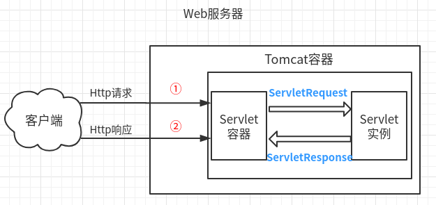
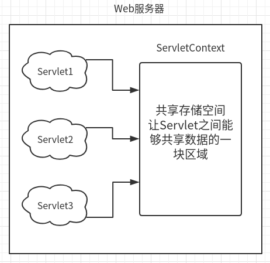

# JavaEE

## Servlet

#### Servlet和Tomcat

Tomcat是Web应用服务器,是一个Servlet/JSP容器.。Tomcat 作为Servlet容器,负责处理客户请求，把请求传送给Servlet，并将Servlet的响应传送回给客户。

Servlet是一种运行在支持Java语言的服务器上的组件。


#### 服务器响应请求过程：

web服务器收到一个http请求后，判断请求内容，若是静态页面数据，自行处理，若为动态数据，交给Servlet容器，Servlet容器找到相应Servlet实例处理；处理结果交给web服务器，再转交给客户端。

针对同一个Servlet，Servlet容器会在第一次收到HTTP请求时建立一个Servlet实例，然后启动一个线程，第二次收到http请求后，Servlet容器无需创建相同Servlet ,仅开启第二个线程来处理请求。



1. Tomcat将http请求文本接收并解析，然后封装成HttpServletRequest类型的request对象，所有的HTTP头数据读可以通过request对象调用对应的方法查询到。
2. Tomcat同时会要响应的信息封装为HttpServletResponse类型的response对象，通过设置response属性就可以控制要输出到浏览器的内容，然后将response交给tomcat，tomcat就会将其变成响应文本的格式发送给浏览器。(图中②箭头方向反了)


#### web.xml注册

让浏览器访问RUL的时候，可以通过Xml找到对应的Servlet，再找到此Servlet的Class文件，处理请求。

```xml
<servlet>
    <servlet-name>FirstServlet</servlet-name>			<!--Servlet名字-->
    <servlet-class>com.FirstServlet</servlet-class>		<!--Servlet位置-->
</servlet>
<servlet-mapping>
    <servlet-name>FirstServlet</servlet-name>			<!--Servlet名字对应上面-->
    <url-pattern>/FirstServlet</url-pattern>			<!--Servlet映射的URL-->
</servlet-mapping>
```


#### Servlet 生命周期

```java
/* 
Tomcat刚启动，并没有访问内容，也就没有Servlet对象被创建
当有请求提交
1.在第一个请求的时候，创建Servlet对象，只会在启创建一次
2.初始化，只会初始化一次
3.开始服务 每次有请求都会调用Service方法
4.当停止或重启Tomcat，销毁Servlet对象
*/
public class FirstServlet extends HttpServlet {    
    public FirstServlet() {
        System.out.println("创建Servlet对象...");
    }
    @Override
    public void init() throws ServletException {
        System.out.println("初始化Servlet对象...");
    }
    protected void service(HttpServletRequest request, HttpServletResponse response) throws ServletException, IOException {
        ....
    }
    protected void doGet(HttpServletRequest request, HttpServletResponse response) throws ServletException, IOException {
        ....
    }
    protected void doPost(HttpServletRequest request, HttpServletResponse response) throws ServletException, IOException {
        doGet(request, response);
    }
    @Override
    public void destroy() {
        System.out.println("销毁Servlet对象...");
    }
}

```

#### 请求转发

```java
/*
请求转发:不改变地址栏
之后产生一次请求，进行转发而已
*/
request.getRequestDispatcher("/index").forward(request, response);
/*
响应重定向:需要增加工程名字，改变地址栏
请求给check返回响应
之后产生一个新的请求发给index，返回第二个响应
*/	
response.sendRedirect("/JavaWeb/index");
```

#### ServletContext对象

一个web项目，就存在一个ServletContext实例，每个Servlet读可以访问到它。

也叫servlet上下文对象，全局应用程序共享对象。**全局唯一**



```java
public class defaultServlet extends HttpServlet {

	protected void doGet(HttpServletRequest request, HttpServletResponse response) throws ServletException, IOException {
		// 获取ServletContext对象，一个项目只有一个ServletContext
		ServletContext context=(ServletContext)request.getServletContext();
		// 设置Value
        context.setAttribute("copyright", "@2019 com");
        // 拿到Value
		String copyright=(String)context.getAttribute("copyright");
		response.setContentType("text/html;charset=utf-8");
		response.getWriter().println("<h2>"+copyright+"<h2>");
        // 获取全局参数
        Enumeration<String> enumeration =  getServletContext().getInitParameterNames();
	}
}
```

```xml
<!--全局参数-->
<context-param>
    <param-name>app_name</param-name>
    <param-value>Listener Web</param-value>
</context-param>
<context-param>
    <param-name>version</param-name>
    <param-value>1.0</param-value>
</context-param>
```


#### ServletConfig对象

```java
// 顾名思义：此类是参数信息
public interface ServletConfig {
    String getServletName();				// 获取Servlet名字
    ServletContext getServletContext();		
    String getInitParameter(String var1);
    Enumeration<String> getInitParameterNames();
}
```

#### POST和GET

1. GET是从服务器获取数据；POST是向服务器传送数据；

2. GET把参数队列（name=value形式，&连接）加到URL后面；

   POST是将数据放在HTTP协议的请求头或消息体中；

3. GET传送数据量小，小于2KB；POST一般不受限制；

4. GET是安全和幂等的；

   安全：不会修改数据，只是获取资源，像是数据库中的查询操作。

比如：典型的搜索引擎搜索关键字就是用的GET。


#### 转发和重定向的区别

- 转发（Forword）：**服务器行为**。**不改变地址栏**，是服务器自主地访问另一个RUL，拿到资源，返回给浏览器。所以浏览器看不到地址栏的变化。**效率较高**。

```java
request.getRequestDispatcher("/index").forward(request, response);
```

- 重定向（Redirect）：**客户端行为**。**改变地址栏**。是服务器告诉浏览器（客户端）去访问另一个RUL，然后浏览器就主动访问URL，改变了地址栏。**效率较低**。

```java
response.sendRedirect("/JavaWeb/index");
```


### Servlet监听器

监听器就是监听某个对象的的状态变化的组件

几个概念：

- 事件源：即被监听的对象。
- 监听器：事件源的状态变化，就会触发监听器。
- 注册监听器：将事件源与监听器进行绑定。
- 响应行为：检测到事件源变化的时候，如何处理。

监听器通常用处:

- 统计在线人数
- 实现访问监控

三大域对象(分类)：

**ServletRequest域、HttpSession域、ServletContext域**


#### web.xml注册监听器

```xml
<listener>
    <listener-class>Listener.FirstListener</listener-class>
</listener>
<!--为全局配置两个参数，让监听器，监听这两个参数-->
<context-param>
    <param-name>app_name</param-name>
    <param-value>Listener Web</param-value>
</context-param>
<context-param>
    <param-name>version</param-name>
    <param-value>1.0</param-value>
</context-param>
```

```java
// ServletContext监听器
public class FirstListener implements ServletContextListener {
    @Override
    public void contextInitialized(ServletContextEvent sce) {
        // 监听的两个参数
		String appName=
                sce.getServletContext().getInitParameter("app_name");
        String version =
                sce.getServletContext().getInitParameter("version");
        // 设置监听的参数，可以设置为别的内容
        sce.getServletContext().setAttribute("app_name",appName);
        sce.getServletContext().setAttribute("version",version);
        System.out.println("MyServletContextListener init,appName"+appName+",version");
    }

    @Override
    public void contextDestroyed(ServletContextEvent sce) {
    
    }
}
```


## 会话

参考

<https://github.com/doGdx/JavaGuide/blob/master/docs/java/J2EE%E5%9F%BA%E7%A1%80%E7%9F%A5%E8%AF%86.md>

### Cookie

用Cookie模拟一个登录场景：

1. 服务端包装Cookie发给客户端

```java
// 创建Cookie
Cookie cookie=new Cookie("user", "admin");
//设置cookie七天有效
cookie.setMaxAge(60*60*24*7);
//将cookie随着响应发回浏览器
response.addCookie(cookie);
```

2. 从客户端中读取Cookie

```java
Cookie[] c=request.getCookies();
String user=null;
for(Cookie c1:c) {
    if(c1.getName().equals("user")) {
        user=c1.getValue();
        break;
    }
}
if(user==null) {
    response.getWriter().println("user not login");
}else {
    response.getWriter().println("user:"+user);
}
```

- Cookie的数据可以持久保存；但是大小受限；

### Session

1. 服务端包装Session

```java
//获取用户会话Session对象
HttpSession session=request.getSession();
// 添加属性
session.setAttribute("name", "张");
```

2. 服务端获取Session

```java
HttpSession session=request.getSession();
// 提取属性
String name=(String)session.getAttribute("name");
```

- 用户访问某个网站自动创建Session，每个用户都有自己的HttpSession对象。
- HttpSession**是存放于服务器端的**。
- 如果将Java对象，作为值放入HttpSession，此对象需要实现Serializable接口，以实现序列化。


### Cookie和Session的的区别

1. 由于HTTP协议是无状态的协议，所以服务端需要记录用户的状态时，就需要用某种机制来识具体的用户，这个机制就是Session.典型的场景比如购物车，当你点击下单按钮时，由于HTTP协议无状态，所以并不知道是哪个用户操作的，所以服务端要为特定的用户创建了特定的Session，用用于标识这个用户，并且跟踪用户，这样才知道购物车里面有几本书。这个Session是保存在服务端的，有一个唯一标识。在服务端保存Session的方法很多，内存、数据库、文件都有。集群的时候也要考虑Session的转移，在大型的网站，一般会有专门的Session服务器集群，用来保存用户会话，这个时候 Session 信息都是放在内存的，使用一些缓存服务比如Memcached之类的来放 Session。
2. 思考一下服务端如何识别特定的客户？这个时候Cookie就登场了。每次HTTP请求的时候，客户端都会发送相应的Cookie信息到服务端。实际上大多数的应用都是用 Cookie 来实现Session跟踪的，第一次创建Session的时候，服务端会在HTTP协议中告诉客户端，需要在 Cookie 里面记录一个Session ID，以后每次请求把这个会话ID发送到服务器，我就知道你是谁了。有人问，如果客户端的浏览器禁用了 Cookie 怎么办？一般这种情况下，会使用一种叫做URL重写的技术来进行会话跟踪，即每次HTTP交互，URL后面都会被附加上一个诸如 sid=xxxxx 这样的参数，服务端据此来识别用户。
3. Cookie其实还可以用在一些方便用户的场景下，设想你某次登陆过一个网站，下次登录的时候不想再次输入账号了，怎么办？这个信息可以写到Cookie里面，访问网站的时候，网站页面的脚本可以读取这个信息，就自动帮你把用户名给填了，能够方便一下用户。这也是Cookie名称的由来，给用户的一点甜头。

所以，总结一下：

- Session是在服务端保存的一个数据结构，用来跟踪用户的状态，这个数据可以保存在集群、数据库、文件中；
- Cookie是客户端保存用户信息的一种机制，用来记录用户的一些信息，也是实现Session的一种方式。


---

### JSP内置对象

- request：封装客户端的请求，其中包含来自GET或POST请求的参数；
- response：封装服务器对客户端的响应；
- pageContext：通过该对象可以获取其他对象；
- session：封装用户会话的对象；
- application：封装服务器运行环境的对象；
- out：输出服务器响应的输出流对象；
- config：Web应用的配置对象；
- page：JSP页面本身（相当于Java程序中的this）；
- exception：封装页面抛出异常的对象。

### JSP四种作用域

- **page**：代表与一个页面相关的对象和属性。
- **request**：代表与Web客户机发出的一个请求相关的对象和属性。一个请求可能跨越多个页面，涉及多个Web组件；需要在页面显示的临时数据可以置于此作用域。
- **session**：代表与某个用户与服务器建立的一次会话相关的对象和属性。跟某个用户相关的数据应该放在用户自己的session中。
- **application**：代表与整个Web应用程序相关的对象和属性，它实质上是跨越整个Web应用程序，包括多个页面、请求和会话的一个全局作用域。