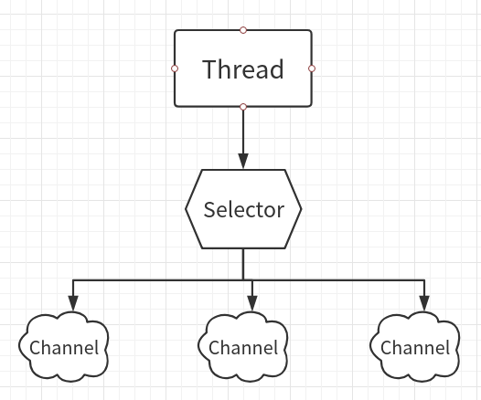
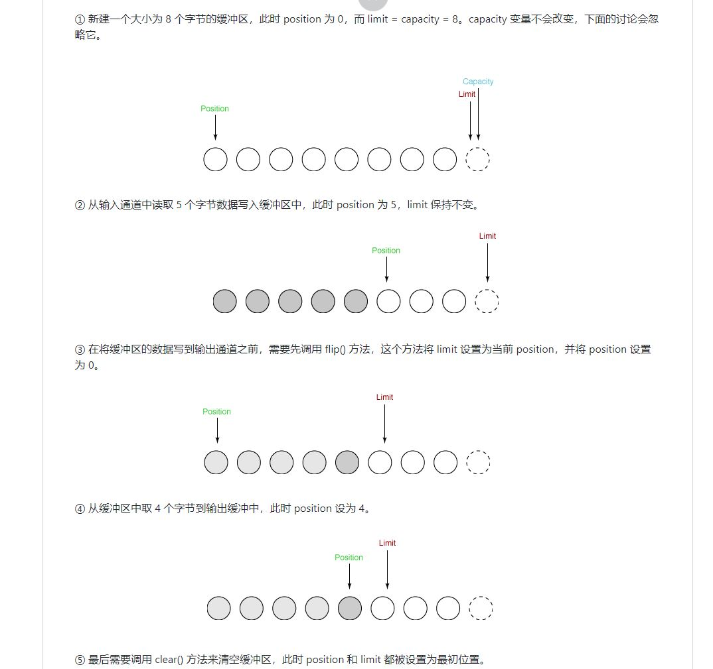

# JavaIO-装饰者模式

### 总览

- 磁盘IO：文件操作（File）
- 字节操作：InputStream 和 OutputStream
- 字符操作：Reader 和 Writer
- 对象操作：Serializable
- **网络IO的模型：BIO（同步阻塞）、NIO（同步非阻塞）、NIO2（异步非阻塞，也叫AIO）**

### File类

```java
public class demo_File {
    public static void main(String[] args) throws IOException {
        //通过路径字符串来创建File实例
        File file=new File("."); // "."表示当前路径
        //获取相对路径的父路径
        System.out.println("相对路径的父路径:"+file.getParent());
        //获得绝对路径
        System.out.println("绝对路径"+file.getAbsoluteFile());
        //获得上一级路径
        System.out.println("上一级路径"+file.getAbsoluteFile().getParent());
        //在当前路径下创建一个临时文件
        File tmpFile=File.createTempFile("aaa",".txt",file);
        //指定当JVM退出时，删除该文件
        tmpFile.deleteOnExit();
        //将file对象路径下的所有文件，放在String[]中,然后遍历输出当前路径所有文件
        String[] fileList=file.list();
        System.out.println("--------当前路径下所有文件和路径如下-------");
        for (String fileName:fileList){
            System.out.println(fileName);
        }
        //打印系统根路径
        File[] roots=File.listRoots();
        System.out.println("--------------系统所有根路径如下-----------");
        for (File root:roots){
            System.out.println(root);
        }
    }
}
```

### 流的分类

1. 输入流和输出流

   输入流：InputStream、Reader

   输出流：OutputStream、Writer

2. 字节流和字符流

   InputStream、OutputStream方法read（byte[ ] b）读取的是字节数据。

   Reader、Writer方法read（char[ ] b）读取的是字符数据。

   

3. 节点流和处理流

   节点流负责拿到数据。处理流负责进行处理。

   处理流要建立在节点流之上。

### 重定向标准输入、输出

```java
// 重定向标准输入
public class Redirect_In {
    public static void main(String[] args) {
        try (
                FileInputStream fis = 
            new FileInputStream("./Notes/src/main/java/IO/demo_File.java");
                )
        {   /*
            将标准输入重定向到fis输入流
            不再接受键盘的输入，而是接受fis输入流的输入，即打印fis的数据
            */
            System.setIn(fis);
            Scanner sc = new Scanner(System.in);
            sc.useDelimiter("\n");
            while(sc.hasNext()){
                System.out.println(sc.next());
        }
        } catch (FileNotFoundException e) {
            e.printStackTrace();
        } catch (IOException e) {
            e.printStackTrace();
        }
    }
}	// 结果打印demo_File.java的代码
```

```java
// 重定向标准输出
public class Redirect_Out {
    public static void main(String[] args) {

        try(	// 创建节点流和处理流
                PrintStream ps = 
            new PrintStream(
                new FileOutputStream("./Notes/src/main/java/IO/newFile.txt"));
                )
        {
           /**
             * 将标准输出重定向为ps处理流
             * 之后打印的信息，不会打印到控制台
             * 而是打印重定向之后的处理流中，再写入文件
             */
            System.setOut(ps);
            System.out.println("重定向标准输出流");
        } catch (FileNotFoundException e) {
            e.printStackTrace();
        }
    }
}
```

### 对象序列化

对象序列化的目的：**将对象保存在磁盘中 ，或者允许在网络中直接传输对象**

本质上就是：**将java对象写入IO流**

对象必须实现两个接口之一：

- Serializable
- Externalizable

```java
public class Person implements java.io.Serializable{
    ...
}
// 使用对象流，将对象写入输出流
ObjectOutputStream oos = new ObjectOutputStream(new FileOutputStream("object.txt"));
oos.writeObject(new Person("Li"));
```

**如果对象中的成员变量是引用类型，这个引用类型也必须是可序列化的。**

#### transient关键字

让序列化的过程忽略transient修饰的成员变量。

```java
try(
    //创建一个ObjectOutputStream输出流，需要建立在节点流上
    ObjectOutputStream oos=
    	new ObjectOutputStream(
        	new FileOutputStream("object.txt"));
    //创建一个ObjectInputStream输入流，需要建立在节点流上
    ObjectInputStream ois=
   	 	new ObjectInputStream(
        	new FileInputStream("object.txt"))
)
{
    //将person对象写入输出流，保存进object.txt
    Person per1=new Person(1,"Zhang",19);
    oos.writeObject(per1);

    //从object.txt中读取java对象，并强转为Person类
    Person per2=(Person)ois.readObject();
    //将person对象写入输出流,无法得到ID属性，因为ID属性被关键字transient修饰
    System.out.println(
        "ID:"+per2.getID()+"\n"+"名字："+per2.getName()+"\n"+"年龄："+per2.getAge());
}catch (Exception e){
    e.printStackTrace();
}
// 输出结果，ID在序列化的时候被忽略了
构造器初始化对象
ID:0
名字：Zhang
年龄：19
```


## IO的一些概念

**同步与异步**

- **同步：** 同步就是发起一个调用后，被调用者未处理完请求之前，调用不返回。
- **异步：** 异步就是发起一个调用后，立刻得到被调用者的回应表示已接收到请求，但是被调用者并没有返回结果，此时我们可以处理其他的请求，被调用者通常依靠事件，回调等机制来通知调用者其返回结果。

同步和异步的区别最大在于异步的话调用者不需要等待处理结果，被调用者会通过回调等机制来通知调用者其返回结果。

**阻塞和非阻塞**

- **阻塞：** 阻塞就是发起一个请求，调用者一直等待请求结果返回，也就是当前线程会被挂起，无法从事其他任务，只有当条件就绪才能继续。
- **非阻塞：** 非阻塞就是发起一个请求，调用者不用一直等着结果返回，可以先去干其他事情。

举个生活中简单的例子，你妈妈让你烧水，小时候你比较笨啊，在那里傻等着水开（**同步阻塞**）。等你稍微再长大一点，你知道每次烧水的空隙可以去干点其他事，然后只需要时不时来看看水开了没有（**同步非阻塞**）。后来，你们家用上了水开了会发出声音的壶，这样你就只需要听到响声后就知道水开了，在这期间你可以随便干自己的事情，你需要去倒水了（**异步非阻塞**）。

<https://blog.csdn.net/anxpp/article/details/51512200>各个模型示例代码

### BIO（Blocking IO同步阻塞）

同步阻塞I/O模式，数据的读取写入必须阻塞在一个线程内等待其完成。

传统BIO的通信方式：**请求-应答通信模型。**

服务端调用accept（）方法，等待接收客户端的请求，然后处理请求。

可以通过多线程的方式，支持多个客户端的连接。然后输出流返回应答对应的客户端，线程销毁。

可以通过线程池进行改善（即：**伪异步IO模型**）。

#### 伪异步IO

伪异步IO实在堵塞IO的基础上将每个client发送过来的请求由新创建的线程来处理改进为用线程池来处理。因此避免了为每个client请求创建一个新线程造成的资源耗尽问题。

## NIO（同步非阻塞）

新IO采用**内存映射文件的方式处理输入、输出流**。

**它支持面向缓冲的，基于通道的I/O操作方法。**

与传统BIO对应，Socket、ServerSocket对应SocketChannel、ServerSocketChannel

不过（JDK）原生NIO基本不用，难用！变成复杂，模型难，还有Bug

学习这个是为Netty打基础。

**那么NIO与IO的区别：**

- NIO 流是非阻塞 IO 而 IO 流是阻塞 IO
- 从NIO三个核心组件（Channels、Buffer、Selector）带来的特性来说：
  1. IO通过单向流读写；NIO通过Channel通道双向读写，可读可写。
  2. IO面向流；NIO面向Buffer缓冲区。
  3. IO没有选择器；NIO有选择器。

#### CPU密集型和IO密集型

先了解一下，操作系统上的**CPU密集型和IO密集型**这两种状态：

1. CPU密集型（适合运行效率高的语言开发）

   系统的内存、磁盘读写性能要高于CPU，此时的CPU效率可能已经100%。（这种情况，大概率是
   CPU在进行大量的计算任务。）

   这个时候，CPU已经不再适合多线程，应该减少线程，降低线程切换开销。

2. IO密集型（适合脚本语言开发）

   系统的CPU性能要高于内存、磁盘读写性能，导致读写程序已经达到性能极限，CPU使用率依然很低，大量时间都在等待IO完成，常见的是Web应用。

   CPU利用率不高的时候，适合多线程，反正CPU很闲，多点线程切换也无所谓。

#### Selector（选择器）

下图 是单线程下Selector处理三个Channel的图示



选择器用于使用**单个线程处理多个通道。**因此，它需要较少的线程来处理这些通道。线程之间的切换对于操作系统来说是昂贵的。 因此，为了提高系统效率选择器是有用的。

NIO的非阻塞就是在Selector这里实现的。（**Reactor模型**）

Selector会轮询Channel，所以不会阻塞等待某个IO事件的结果。

只有SocketChannel可以配置为非阻塞，FileChannel不能配置为非阻塞。

```java
// Selector的创建
Selector selector = Selector.open();
// 静态方法返回一个实例
ServerSocketChannel ssChannel = ServerSocketChannel.open();
// 注册非阻塞Channel到Selector
ssChannel.configureBlocking(flase);
// 注册Channel
ssChannel.register(selector, SelectionKey.OP_ACCEPT);
```

注册Channel的同时，需要指定要注册的具体事件，有四类事件：

- SelectionKey.OP_CONNECT（连接就绪，某个Channel成功连接一个服务器）
- SelectionKey.OP_ACCEPT（接受就绪，一个ServerSocketChannel准备接受新的连接）
- SelectionKey.OP_READ（读就绪，一个数据通道可以读了）
- SelectionKey.OP_WRITE（写就绪，一个通道等待输入数据）

**只要ServerSocketChannel注册了事件，Selector就会监听这些事件是否发生**

SelectionKey类下定义了四类事件：（每一个位表示一个事件）

```java
public static final int OP_READ = 1 << 0;
public static final int OP_WRITE = 1 << 2;
public static final int OP_CONNECT = 1 << 3;
public static final int OP_ACCEPT = 1 << 4;
```

可以使用 '|' 位或运算，组成事件集。

```java
int interestSet = SelectionKey.OP_READ | SelectionKey.OP_WRITE;
```

SelectionKey有四种方法可以检测什么事件已经就绪：

```java
selectionKey.isAcceptable();
selectionKey.isConnectable();
selectionKey.isReadable();
selectionKey.isWritable();
```

实例演示一遍流程：

1. Selector.select（）方法，可以返回一个int值，代表有多少个Channel准备就绪了
2. 虽然可以直到有多少个通道就绪，但是不知道，都是什么事件就绪了，那么我们用Selector.selectedKeys（）方法，拿到结果集Set<SelectionKey>，里面的每一个SelectionKey就代表了一个就绪事件。
3. 然后通过Set的迭代器，遍历SelectionKey。并通过四种检测事件的方法，分别处理每一个事件的情况。

```java
Selector selector = selector.open();
ServerScoketChannel ssChannel = ServerSocketChannel.open();
ssChannel.configureBlocking(false);
ssChannel.register(Selector, SelectorKey.OP_ACCEPT);

ServerSocket sSocket = ssChannel.socket();
InetSocketAddress address = new InetSocketAddress("127.0.0.1", 9999);
sSocket.bind(address);
// 开始轮询
while(true){
    
   	int readChannels = selector.select();
    if(readChannels == 0)
        continue;
    // 有通道就绪了，返回结果集，创建迭代器
    Set<SelectionKey> keys = selector.selectedKeys();
    Iterator<SelectionKey> keyIterator = selectedKeys.iterator();
    // 开始迭代每一种事件
    while(keyIterator.hasNext()){
        SelectionKey key = keyIterator.next();
        // 判断事件就绪类型：
        if(key.isAcceptable()){
            ...
        }
        else if(key.isConnectable()){
            ...
        }
        else if(key.isReadable()){
            ...
        }
        else if(key.isWritable()){
            ...
        }
        // 需要手动移除事件
        keyIterator.remove();
    } 
}
```

#### Buffer（缓冲区）

一个容器，本质是数组类型的一块内存区

子类：ByteBuffer、CharBuffer

三个属性：capacity、position、limit

```java
//创建Buffer,CharBuffer是一个抽象类，allocate是创建一个缓冲区,分配空间
CharBuffer buff=CharBuffer .allocate(8);
System.out.println("Buffer容量："+buff.capacity());	  // 8
System.out.println("limit指针的位置："+buff.limit());		// 8
System.out.println("position的位置："+buff.position());  // 0
//放入元素
buff.put("a");
buff.put("b");
buff.put("c");
System.out.println("加入三个元素之后，position="+buff.position()); // 3 原理图②
//不执行flip，position位置指向最后，无法get
//System.out.println(buff.get());

//flip方法，封锁缓冲区，将position指向第一个字符，将limit指针指向最后一个字符
buff.flip();	// 原理图③
System.out.println("执行flip之后，limit="+buff.limit());
System.out.println("执行flip之后，position= "+buff.position());

//取出第一个元素，不需要指定索引，根据position位置读取
System.out.println("取出第一个元素"+buff.get());
System.out.println("取出第一个元素后，position="+buff.position());

//clean方法,并非清空缓冲区，而是修改limit指针，与flip对应，
// 并把position重新指向第一个元素
buff.clear();
System.out.println("执行clean后，limit="+buff.limit());
System.out.println("执行clean后，position="+buff.position());
System.out.println(buff.get());
// clean之后需要指定索引
System.out.println("执行clean后，用绝对读取取得第三个元素:"+buff.get(2));
```

Buffer的原理图




#### Channel（通道）

几种通道的实现：

- FileChannel：从输入流中读取数据（阻塞）
- SocketChannel：通过TCP读取网络中的数据
- DatagramChannel：通过UDP读取网络数据
- ServerSocketChannel：监听TCP连接，每个新连接，都可以返回一个SocketChannel。

```java
try(
    FileInputStream fis=new FileInputStream("./src/IO/NIO/a.txt");
    FileChannel fc=fis.getChannel()
)
{
    //创建Buffer,CharBuffer是一个抽象类，allocate是创建一个缓冲区,分配空间
    //充当竹筒缓冲，用于取水
    ByteBuffer byteBuffer=ByteBuffer.allocate(256);
    //将fc中的数据放到buffer中
    while((fc.read(byteBuffer))!=-1){
        //每一次读取都要锁一次，目的：position和limit位置准备，读取
        byteBuffer.flip();
        //创建GBK解码器
        Charset charset=Charset.forName("GBK");
        //创建解码器对象
        CharsetDecoder decoder=charset.newDecoder();
        //使用解码器，将buffer中的内容，转化到新的charbuffer中
        CharBuffer charBuffer=decoder.decode(byteBuffer);
        System.out.println(charBuffer);
        //将buffer初始化，便于下次读取
        byteBuffer.clear();
    }
    fis.close();
    fc.close();
} catch (FileNotFoundException e) {
    e.printStackTrace();
} catch (IOException e) {
    e.printStackTrace();
}
```

### Charset


