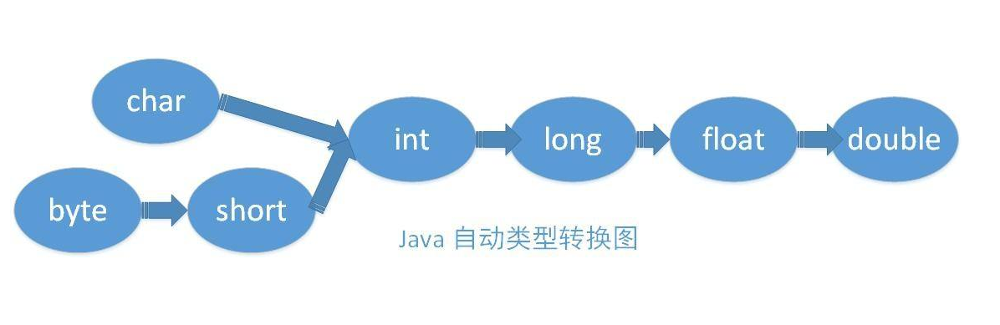
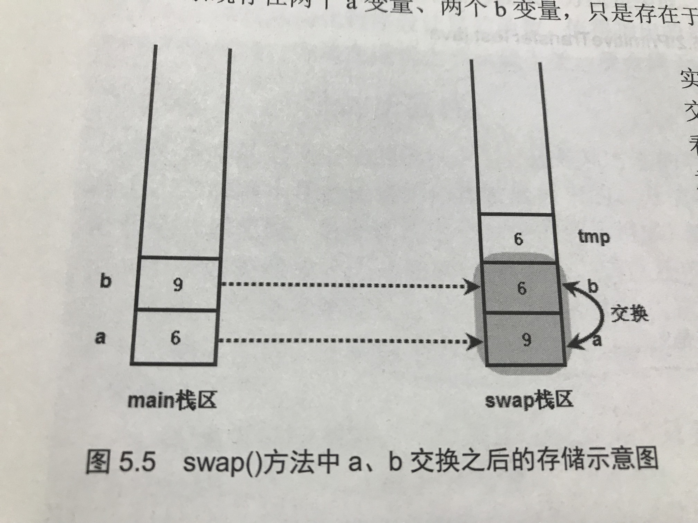

# Java

## 一、数据类型

**java提供两种类型：基本数据类型 和 引用类型**

引用类型：

- **强引用：是指创建一个对象并把这个对象赋给一个引用变量**

  当一个实例对象具有强引用时，垃圾回收器不会回收该对象，当内存不足时，宁愿抛出OutOfMemeryError异常也不会通过回收强引用的对象，因为JVM认为强引用的对象是用户正在使用的对象，它无法分辨出到底该回收哪个，强行回收有可能导致系统严重错误。

- **软引用**：

  如果一个对象只有软引用，那么只有当内存不足时，JVM才会去回收该对象，其他情况不会回收

- **弱引用**：

  只有弱引用的对象，当JVM触发gc时，就会回收该对象

- **虚引用**：

  如果一个对象只有虚引用在引用它，垃圾回收器是可以在任意时候对其进行回收的。

### 基本数据类型

##### 整型

- byte	 8位（-128~127）
- short       16位
- int            32位
- long         64位

##### 字符型

- char

##### 浮点型：存在计算丢失精度问题

- float       32位
- double   64位

##### 布尔型

- boolean

### 机器数

- **计算机系统中，数值一律用补码来表示和存储。**

#### 1.原码

即：符号位+真值

+1 = 0000 0001

-1  = 1000 0001

byte八位表示范围：[1111 1111 , 0111 1111]	即：[-127 , 127]

**但是：-0为1000 0000；+0为0000 0000。所以0用+0表示；而-0则表示为-128**

**所以byte八位表示范围：[-128 , 127]**

#### 2.反码

正数的反码是其本身

负数的反码是在其原码的基础上, 符号位不变，其余各个位取反

+1 的反码：0000 0001

-1 的反码：1111 1110

#### 3.补码

正数的补码就是其本身

负数补码=反码+1

-1 的补码（也就是计算机真正存放的-1表示方法）：1111 1111

### 包装类

包装类提供的静态方法：

- parseXxx（）
- valueOf（）

```java
String str1 = "123";
int a = Integer.parseInt(str1);
int b = Integer.valueOf(str1);	// a = 123,b =123
String str2 = "4.5";
float c = Float.parseFloat(str2);
float d = Float.valueOf(str2);	// c=4.5f,d=4.5f
```

#### 缓存池

valueOf() 方法的实现比较简单，就是先判断值是否在缓存池中，如果在的话就直接返回缓存池的内容。

此方法是一个**自动装箱的过程**：

编译器会在自动装箱过程调用 valueOf() 方法，因此多个值相同且值在缓存池范围内的 Integer 实例使用自动装箱来创建，那么就会引用相同的对象。

```java
Integer a=new Integer(123);
Integer b =Integer.valueOf(123);
System.out.println(a==b);   //false

String c =new String("asd");
String d=String.valueOf("asd");
String e="asd";
System.out.println(c==d);   //false
System.out.println(d==e);   //true
```

### 类型转换

#### 1、自动转换




#### 2、隐式类型转换

```java
short s1 = 1;     // 本质上是将int类型的 1 转换成了short
float s2 = 1.1；  // 1.1默认是double类型
int x = 1;
float y = 2;
x/y == 0.5 // 返回true
```

#### 3、强制类型转换

```java
double a = 3.98;
int b = (int)a;  // b=3

// 32位int转换为8为byte溢出
int c = 233;
byte d = (byte)c; // d=-23 
```

32为的int：0~0 11101001

八位的byte：11101001，最高位被当成符号位，所以是负数

**负数以补码形式保存，补码减1得反码，反码求反，得真实原码：10010111（-23）**

#### 4、表达式类型的自动提升

当算术表达式中包含多个基本类型的时候，整个算术表达式的基本数据类型将发生自动提升：

- byte、short、char自动提升到int类型
- 整个算术表达式的数据类型，自动提升到表达式中最高等级操作数的类型（等级排列如上图所示）

### 运算符

#### 算术运算符

+、-、×、÷、%（求余运算符）、++、-- 。

#### 比较运算符

<、>、<=、>=、==、!=

#### 位运算符

- &：按位与。两个同时为1，返回1
- |：按位或。有一个为1，返回1
- ～：按位非。单目运算符，将操作数，每位取反（包括符号位）
- ^：按位异或。两位相同返回0，不同返回1
- <<：左移。

```java
>>：右移。右移之后，最高位仍然以原来的符号位补充
>>>：无符号右移。右移之后，左边的空位，全部补0
a = -5 >> 2;   // a=-2
b = -5 >>> 2;  // b=1073741822
```

#### 逻辑运算符

- &&：**短路与**（第一个操作数为false，不会执行第二个操作数）。前后两个操作数，都为true，才返回true
- &：**不短路与**（两个操作数都执行）。
- ||：**短路非**（第一个操作数为true，不执行第二个操作数）。
- |：**不短路非**（两个操作数都执行）。
- !：非
- ^：异或

```java
int a = 5;
int b = 10;
if(a > 4 || b++ > 10)
    System.out.print(b); //b = 10

int a = 5;
int b = 10;
if(a > 4 | b++ > 10)
    System.out.print(b); //b = 11
// &&同理
```

#### 三目运算符

？：


## 二、流程控制

#### swich

对表达式求值，依次匹配condition，都不匹配执行default

```java
swich(表达式){		// 表达式只能是：byte、short、char、int、枚举、String。不能为boolean
    case condition1：
    {
        ...
        break;
    }
    case condition2：
    {
        ...
        break;
    }
    default:
    {
        ...
    }
}
```

#### break

直接跳出循环体，执行循环体之后的语句

#### continue

结束本次循环，继续下次循环


## 数组类型

数组是一种引用类型的变量。

**一个数组内，只能存储一种数据类型的数据**

#### 初始化

1. 静态初始化：显示指定数组的元素

```java
arr = new int[]{1,2,3,4};
```

1. 动态初始化：只指定长度

```java
arr = new int[4];
```

#### foreach

```java
books = new String[]{"mysql","java","php"};
for(String book : books){
    Systme.out.print(book);
}
```

#### 工具类Arrays

java.util.Arrays类中提供了很多static方法来直接操作数组

**Arrays.asList(T… data)** ：返回Arrays内部静态类ArrayList，而不是我们平常使用的ArrayList

```java
static int binarySearch(type[] a,type key) // 二分搜索，返回key的索引、   
static type[] copyOf(type[] a,int length)    // 复制数组    
static type[] copyOf(type[] a,int start,int end)    // 复制数组的一部分start到end    
static boolean equals(type[] a,type[] b)    // 完全相同的数组，返回true    
static void fill(type[] a,int start,int end,type val) // 从start到end，全部赋值val    
static void sort(type[] a)	// 排序  
static String toString(type[] a) // 转化为字符串
```

java8增强了Arrays的方法，提供了多个并行操作的方法

```java
public static void main(String[] args) {
    int[] a ={1,2,8,4,6,0,3};
    // 默认生序排列
    Arrays.sort(a);
    System.out.println(Arrays.toString(a));
    // 二分查找，返回索引位置
    int index = Arrays.binarySearch(a, 6);
    System.out.println(index);
    // 复制长度为3
    int[] c =Arrays.copyOf(a,3);
    System.out.println(Arrays.toString(c));
}
// 运行结果
[0, 1, 2, 3, 4, 6, 8]
5
[0, 1, 2]
```


## 三、面向对象

### 封装

1. 减少耦合

   可以独立开发，测试，优化，修改，使用

2. 有效调节性能

   可以剖析哪些模块影响了性能

3. 提高软件可重用性

4. 提高软件可重用性

### 继承

1. 父类可以引用子类对象（向上转型）

   Animal animal = new Cat ( ) ;

   编译时类型为Animal，运行时类型为Cat

2. **子类获得所有父类属性和方法**

### 多态

1. 编译时多态

   主要指方法的重载

2. 运行时多态（三个条件：）

   **指程序中定义的对象引用所指向的具体类型在运行期间才确定**

   - 继承
   - 方法覆盖（重写）
   - 向上转型

### 面向对象五大原则（solid）

- 单一职责（SRP）

- 开放封闭原则（OCP）

- 里氏替换原则（LSP）

  子类对象必须能够替换掉所有父类对象

- 接口隔离原则（ISP）

- 依赖倒置原则（DIP）


### Java方法的参数传递只有：值传递

即：将实际参数值的副本传入方法内，参数本身不会受到任何影响

```java
public class test {
    public static void swap(int a, int b) {  
        a^=b;
        b^=a;
        a^=b;
    }
    public static void main(String[] args) {
        int a = 9;
        int b = 6;
        swap(a, b);
        System.out.println(a + "," + b);  // 结果 9,6
    }
}
```



- 引用类型的参数传递

```java
public class Test {
    private int a;
    private int b;
    public static void swap(Test test) {
        int tmp;
        tmp = test.a;
        test.a = test.b;
        test.b = tmp;
        test = null;	
// 将test最后指向null，main方法的打印也能有结果，说明方法体内的test和main方法的test是两个变量
    }
    public static void main(String[] args) {
        Test test = new Test();
        test.a = 9;
        test.b = 6;
        swap(test);
        System.out.println(test.a + "," + test.b);  // 结果 6,9
    }
}
```


### 成员变量和局部变量

所有变量：

- 成员变量
  - 实例变量：不以static修饰的变量
  - 类变量：以static修饰的变量
- 局部变量
  - 形参：方法的形参列表
  - 方法局部变量：方法内定义的变量
  - 代码块局部变量：在代码块内定义的变量

```java
public static void main(String[] args) {
    {
        int a = 5;  // 代码块局部变量
    }
    System.out.print(a);  // 编译报错，无法访问
}
```

### 抽象类

- 抽象类必须有“abstract class”修饰

抽象类和抽象方法都使用 abstract 关键字进行声明。抽象类一般会包含抽象方法，抽象方法一定位于抽象类中。

(也可以含有非抽象方法)

抽象类和普通类最大的区别是，抽象类不能被实例化，需要继承抽象类才能实例化其子类。

### 接口

Java 8 开始，接口也可以拥有默认的方法实现，这是因为不支持默认方法的接口的维护成本太高了。

- 接口的成员（字段 + 方法）默认都是 public 的，并且不允许定义为 private 或者 protected。
- 接口的字段默认都是 static 和 final 的。
- 支持多继承

### super

- 访问父类的构造函数：可以使用 super() 函数访问父类的构造函数，从而委托父类完成一些初始化的工作。
- 访问父类的成员：如果子类重写了父类的某个方法，可以通过使用 super 关键字来引用父类的方法实现。

### 重写与重载

1. 重写(Override)

存在于继承体系中，指子类实现了一个与父类在方法声明上完全相同的一个方法。

1. 重载(Overload)

存在于同一个类中，指一个方法与已经存在的方法名称上相同，但是**参数类型、个数、顺序**至少有一个不同。

**返回值不同，其它都相同不算是重载**。


### 继承结构中的加载过程

```java
public class ClassLoad {
    public static void main(String[] args) {
        Son son = new Son("son名字");
        son.speak();
    }
}
class father {
    private String name;
    A a = new A();
    static {
        System.out.println("--父类的静态代码块--");
    }
    {
        System.out.println("--父类的非静态代码块--");
    }
    father() {
        System.out.println("--父类的无参构造函数--");
    }
    father(String name) {
        this.name = name;
        System.out.println("--父类的有参构造函数--" + this.name);
    }
    public void speak() {
        System.out.println("--父类的方法--");
    }
}
class Son extends father {
    private String name;
    B b = new B();
    static {
        System.out.println("--子类的静态代码块--");
    }
    {
        System.out.println("--子类的非静态代码块--");
    }
    Son() {
        System.out.println("--子类的无参构造函数--");
    }
    Son(String name) {
        this.name = name;
        System.out.println("--子类的有参构造函数--" + this.name);
    }
    @Override
    public void speak() {
        System.out.println("--子类Override了父类的方法--");
    }
}
class A{
    A(){
        System.out.println("--加载了父类的属性A--");
    }
}
class B{
    B(){
        System.out.println("--加载了子类的属性B--");
    }
}
```

运行结果：

父类的静态代码块
子类的静态代码块
加载了父类的属性A（ A a = new A() ）
父类的非静态代码块
父类的无参构造函数
加载了子类的属性B（ B b = new B() ）
子类的非静态代码块
子类的有参构造函数son名字
子类Override了父类的方法


## 四、Lambda表达式

```java
interface Eatable{
    void taste();	// 函数式接口（只包含一个抽象方法的接口）
    ...
}
public class Lambda{
    public void eat(Eatable e){
        System.out.println(e);
        e.taste();
    }
    public static void main(String[] args){
        Lambda la = new Lambda();
        // 这里Lambda表达式的目标类型被当做Eatable对象
        la.eat(
            ()->System.out.println("苹果味道不错") 	
        )；
    }
}
```

- Lambda表达式的类型：目标类型。必须是函数式接口（只包含一个抽象方法的接口，因为Lambda只能实现一个方法）
- Lambda表达式会被当成“任意类型”的对象。取决于运行环境。在上面例子被当做Eatable对象
- Lambda表达式就是一个对象。()->System.out.println("苹果味道不错") 就是一个Eatable对象

#### Lambda表达式语法

```java
(parameters)->{
	expression
}
```

- 形参列表：只有一个参数，可以省略（ ）

- ->

- 表达式（代码块）：只有一行代码，可以省略{ }

  ​				   表达式的返回值要与方法的返回值一致

#### Lambda的使用

```java
/*
定义一个函数式接口，所知道的信息只有：
参数为String，返回Integer
*/
interface Converter{
    Integer convert(String from);	
}
interface Test{
    String test(String a , int b , int c);
}
```

```java
/*
我们知道创建接口实例，要实现抽象方法
Lambda表达式的代码块即 convert()方法的执行体
from:参数列表
Integer.valueOf(from)：代码块，即方法体(表达式的返回值要与方法的返回值一致)
*/
Converter c = from -> Integer.valueOf(from);
Integer val = c.convert("99");  // val = 99

Test t = (a , b , c) -> a.substring(b , c);
String str = t.test("Java", 1 , 3);    // str = "av"
```

#### Lambda表达式与Arrays类方法

Arrays类，经常需要Comparator、XxxOperator接口，这些都是函数式接口，很适合Lambda表达式来写

```java
// Lambda表达式目标类型是Comparator
String[] arr = new String[]{"java","php","scala","c"};
Arrays.parallelSort(arr , (o1,o2) -> o1.length() - o2.length());
```


#### Lambda表达式与匿名内部类的区别

- 匿名内部类可以为任何接口、抽象类、普通类创建实例；Lambda表达式只能为函数式接口创建实例。
- 匿名内部类允许调用接口的default方法；Lambda表达式不行。


## 五、Object通用方法

```java
public native int hashCode()

public boolean equals(Object obj)

protected native Object clone() throws CloneNotSupportedException

public String toString()

public final native Class<?> getClass()

....
```

### equals( )

- **对于基本类型，== 判断两个值是否相等，基本类型没有 equals() 方法。**
- **对于引用类型，== 判断两个变量是否引用同一个对象，而 equals() 判断引用的对象是否等价。**

```java
Integer x = new Integer(1);
Integer y = new Integer(1);
System.out.println(x.equals(y)); // true  两个1是等价的
System.out.println(x == y);      // false 判断两个变量是否引用同一个对象
```

```java
String s1 = "abc";
String s2 = "a";
String s3 = "bc";
String s4 = "a" + "bc";		// 编译期就确定了
String s5 = s2 + s3;		// 不能在编译期确定，所以s5相当于new String
System.out.println(s1 == s4);	// true
System.out.println(s1 == s5);	// false
```

#### 重写equals

```java
class Person {
    private String name;
    private int age;
	// 省略getter、setter
    ...
    @Override
    public boolean equals(Object obj) {
        // 1.判断这两个变量是否引用同一个对象
        if (this == obj) {
            return true;
        }
        // 2.判断是否属于同一个类(obj instanceof Person)
        if (obj != null && obj.getClass() == Person.class) {
            Person p = (Person) obj;
            // 3.依次判断属性是否都相同
            return this.getName()==(p.getName()) && 
                this.getAge()==((Person) obj).getAge();
        }
        return false;
    }
}
```

### hashCode( )

hashCode() 返回散列值,等价的两个对象散列值一定相同，但是散列值相同的两个对象不一定等价。

**在覆盖 equals() 方法时应当总是覆盖 hashCode() 方法，保证等价的两个对象散列值也相等。**

```java
EqualExample e1 = new EqualExample(1, 1, 1);
EqualExample e2 = new EqualExample(1, 1, 1);
System.out.println(e1.equals(e2)); // true
HashSet<EqualExample> set = new HashSet<>();
set.add(e1);
set.add(e2);
System.out.println(set.size());   // 2
```

新建了两个等价的对象，并将它们添加到 HashSet 中。我们希望将这两个对象当成一样的，只在集合中添加一个对象，但是因为 EqualExample 没有实现 hasCode() 方法，因此这两个对象的散列值是不同的，最终导致集合添加了两个等价的对象。

#### hashCode重写

理想的散列函数应当具有均匀性，即不相等的对象应当均匀分布到所有可能的散列值上。这就要求了散列函数要把所有域的值都考虑进来。

**不相等的对象，体现在对象属性，所以在重写hashCode，需要考虑通过对象属性字段a，来构建散列值**

- 字段为boolean类型，a?1:0
- 字段为byte/short/int/char，强转为(int)a
- 字段long，计算(int)(a^(a>>>32))
- 字段double，先转化为long，Double.doubleToLongBits(a)；在计算long
- 字段为对象引用（数组），直接拿到对象的hash值

```java
class Person {
    private String name;
    private int age;
	// 省略getter、setter
    ...
    @Override
    public int hashCode() {
        // 定义一个初始值，一般17
        int result = 17;
        // 通过属性，构造哈希值
        result = 31 * result + name.hashCode();
        result = 31 * result + age;
        return result;
    }
    // 一个数与 31 相乘可以转换成移位和减法：31*x == (x<<5)-x，编译器会自动进行这个优化。
}
```

### equals和hashCode

为什么有了equals判断对象是否相等，还需要hashCode？

因为查找对象位置和判断对象是否相同的效率太低，hashCode使用散列表，效率很高！

那为什么有了hashCode，还需要equals？

hashCode不一定完全可靠，不同的对象，哈希值也有可能相同！equals是判断对象是否相同，最可靠的方法！

**重写原则**：

1. equals返回true，那么hashCode也应当返回true！
2. hashCode相同，equals不一定返回true，hashCode方法并不可靠。

**那么这两个方法是怎么运作的？**

1. **在添加元素的时候，先调用hashCode方法（效率大大提升），判断哈希值是否相同，或者说是否已经存在，如果已经存在（相同），就没必要调用eqauls了。**
2. **如果hashCode相同，那么继续调用equals方法判断，两个对象是否相同如果返回true，那就确定这是重复的对象。如果返回false，确定为不同对象，继续存储。比如在HashMap中，就会在同一个bucket中产生链表或红黑树。**

### clone( )

1. **浅拷贝**

   拷贝对象和原始对象的引用类型引用同一个对象。

2. **深拷贝**

   拷贝对象和原始对象的引用类型引用不同对象。


## String

String 被声明为 final，因此它不可被继承。

#### String不可变的好处：

1. **String Pool 的需要**

   如果一个 String 对象已经被创建过了，那么就会从 String Pool 中取得引用。只有 String 是不可变的，才可能使用 String Pool。

2. **可以缓存 hash 值**

   因为 String 的 hash 值经常被使用，例如 String 用做 HashMap 的 key。不可变的特性可以使得 hash 值也不可变，因此只需要进行一次计算。

3. **安全性**

   String 经常作为参数，String 不可变性可以保证参数不可变。

4. **线程安全**

   String 不可变性天生具备线程安全，可以在多个线程中安全地使用。

### String, StringBuffer and StringBuilder

**1. 可变性**

- String 不可变
- StringBuffer 和 StringBuilder 可变

**2. 线程安全**

- String 不可变，因此是线程安全的
- StringBuilder 不是线程安全的
- StringBuffer 是线程安全的，内部使用 synchronized 进行同步

**3. 效率**

String < StringBuffer < StringBuilder

### String Pool（在堆内存中）

参考

<https://blog.csdn.net/u013366617/article/details/83618361>

字符串常量池（String Pool）保存着所有字符串字面量（literal strings），这些字面量在编译时期就确定。

不仅如此，还可以使用 String 的 intern() 方法在运行过程中将字符串添加到 String Pool 中。

```java
String s1 = new String("aaa");   // aaa存放在堆
String s2 = new String("aaa");
System.out.println(s1 == s2);           // false
String s3 = s1.intern();	// 添加到缓存池
String s4 = s1.intern();	// 这个方法可以省略直接用 String s = "aaa" 也可以加入缓存池
System.out.println(s3 == s4);           // true
```

### String常用方法

java9之前，采用char[ ]数组来保存字符，字符串的每个字符，占用两个字节

java9之后，采用byte[ ]数组+encoding-flag来保存字符，并使用指定字符集。每个字符占用一个字节。（更省空间了） 


#### 构造器：

- String（String original）：根据**字符串直接量**来创建一个String对象，**新创建的对象是该参数的字符串副本。**
- String（byte[ ] bytes , Charset charset）：使用指定字符集将指定的byte[ ]数组解码为一个新的String对象。
- String（StringBuilder builder）：根据StringBuilder对象，创建String对象。
- String（StringBuffer builder）：根据StringBuffer对象，创建String对象。
- ........

#### 常用方法：

- char charAt（int  index）：获取字符串中指定位置的字符。

- int indexOf（int char）：获取字符的第一次出现的索引。

- int lastIndexOf（int char）：返回字符最后一次出现的索引。

- int compareTo（String string）：如果两个字符串完全相同，返回0；否则返回第一个不相等的字符差

  ​							（'k'-'a'）

- String concat（String string）：连接字符串。

- String reverse（）：反转字符串。

- boolean startsWith（String prefix）：是否以prefix开头。

- boolean endsWith（String suffix）：是否以suffix结尾。

## BigDecimal

java.Math.BigDecimal

解决浮点数计算中丢失精度的问题

所有整数都可以精确的转化为二进制，不存在丢失精度的问题，但是小数却不行。

小数转化为二进制，是通过乘以2，取正数部分；比如说0.9

```java
0.9*2=1.8  // 取整1
0.8*2=1.6  // 取整1
0.6*2=1.2  // 取整1
0.2*2=0.4  // 取整0
....// 一直计算下去,无法得到精确值
```

所以我们需要BigDecimal类来计算一些商业运算。

BigDecimal构造器：

```java
public BigDecimal(String val) {	// 禁止使用
    this(val.toCharArray(), 0, val.length());
}
// 常用
public BigDecimal(double val) { 
    this(val,MathContext.UNLIMITED);
}
```

建议使用静态方法：

```java
public static BigDecimal valueOf(double val) {
    return new BigDecimal(Double.toString(val));
}
```

使用BIgDecimal来封装加减乘除

```java
public static BigDecimal add(double v1,double v2){
    BigDecimal b1 = BigDecimal.valueOf(v1);
    BigDecimal b2 = BigDecimal.valueOf(v2);
    return b1.add(b2);
}
public static BigDecimal sub(double v1,double v2){
    BigDecimal b1 = BigDecimal.valueOf(v1);
    BigDecimal b2 = BigDecimal.valueOf(v2);
    return b1.subtract(b2);
}
public static BigDecimal mul(double v1,double v2){
    BigDecimal b1 = BigDecimal.valueOf(v1);
    BigDecimal b2 = BigDecimal.valueOf(v2);
    return b1.multiply(b2);
}
public static BigDecimal div(double v1,double v2){
    BigDecimal b1 = BigDecimal.valueOf(v1);
    BigDecimal b2 = BigDecimal.valueOf(v2);
    //除不尽的情况
    return b1.divide(b2,2,BigDecimal.ROUND_HALF_UP);//四舍五入,保留2位小数
}
```

## 关键字

### final

1. **final 数据**

声明数据为常量，可以是编译时常量，也可以是在运行时被初始化后不能被改变的常量。

- 对于基本类型，final 使数值不变；
- 对于引用类型，final 使引用不变，也就不能引用其它对象，但是被引用的对象本身是可以修改的。

2. **final 方法**

声明方法不能被子类重写。

3. **final 类**

声明类不允许被继承。

### static

**1. 静态变量**

**2. 静态方法**

- 静态方法在类加载的时候就存在了，它不依赖于任何实例。所以静态方法必须有实现，也就是说它不能是抽象方法。
- 只能访问所属类的静态字段和静态方法，方法中不能有 this 和 super 关键字。

```java
public class A {
    private static int x;
    private int y;
    public static void func1(){
        int a = x;
        // int b = y;   // 报错
    }
}
```

**3. 静态语句块**

- 静态语句块在类初始化时运行一次。

**4. 静态内部类**

- **非静态内部类依赖于外部类的实例，而静态内部类不需要。**

**5. 静态导包**


## 反射

notes代码中详解

Class 和 java.lang.reflect 一起对反射提供了支持
java.lang.reflect 类库主要包含了以下三个类：
    Field ：可以使用 get() 和 set() 方法读取和修改 Field 对象关联的字段；
    Method ：可以使用 invoke() 方法调用与 Method 对象关联的方法；
    Constructor ：可以用 Constructor 创建新的对象。


#### **反射的优点：**

- **可扩展性** ：应用程序可以利用全限定名创建可扩展对象的实例，来使用来自外部的用户自定义类。
- **类浏览器和可视化开发环境** ：一个类浏览器需要可以枚举类的成员。可视化开发环境（如 IDE）可以从利用反射中可用的类型信息中受益，以帮助程序员编写正确的代码。
- **调试器和测试工具** ： 调试器需要能够检查一个类里的私有成员。测试工具可以利用反射来自动地调用类里定义的可被发现的 API 定义，以确保一组测试中有较高的代码覆盖率。

#### **反射的缺点：**

- **性能开销** ：反射涉及了动态类型的解析，所以 JVM 无法对这些代码进行优化。因此，反射操作的效率要比那些非反射操作低得多。我们应该避免在经常被执行的代码或对性能要求很高的程序中使用反射。
- **安全限制** ：使用反射技术要求程序必须在一个没有安全限制的环境中运行。如果一个程序必须在有安全限制的环境中运行，如 Applet，那么这就是个问题了。
- **内部暴露** ：由于反射允许代码执行一些在正常情况下不被允许的操作（比如访问私有的属性和方法），所以使用反射可能会导致意料之外的副作用，这可能导致代码功能失调并破坏可移植性。反射代码破坏了抽象性，因此当平台发生改变的时候，代码的行为就有可能也随着变化。


