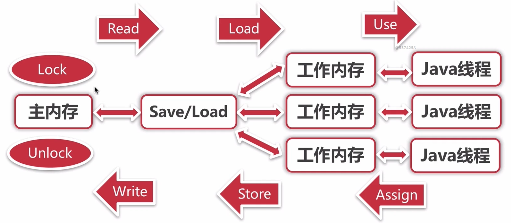
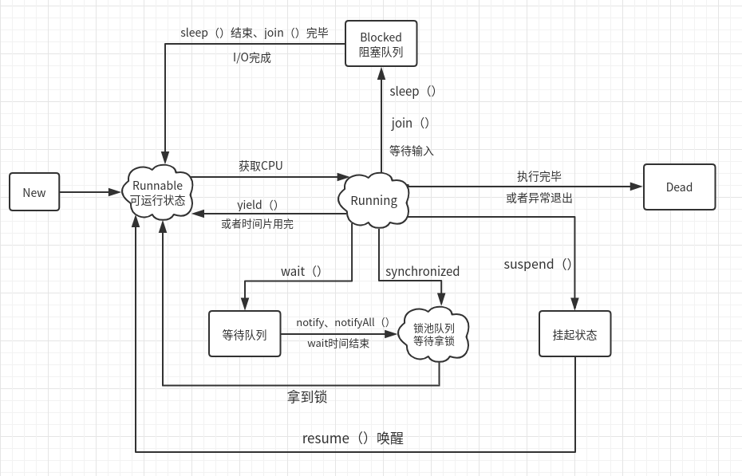

# 多线程

参考

<https://www.cnblogs.com/kexianting/p/8566318.html>

<https://baijiahao.baidu.com/s?id=1626410873162104506&wfr=spider&for=pc>

<https://www.cnblogs.com/dolphin0520/p/3932921.html>

<https://blog.csdn.net/qq_38293564/article/details/80459827>

《深入理解Java虚拟机》

## Java进程间通信的方式

1. 管道（Pipe）
2. 命名管道
3. 信号
4. 消息队列
5. 共享内存
6. 内存映射
7. 信号量
8. Socket（套接口）

## Java线程的内存模型

#### 主内存与工作内存

Java内存模型主要定义了程序中各个变量的访问规则

- 所有的变量都在主内存，Java堆**（线程共享）**

- 每条线程都有自己的工作内存，虚拟机栈的部分区域**（线程私有）**

- **线程的工作内存保存了该线程使用到的变量的主内存副本，线程对变量的所有操作都必须在工作内存中进行，而不能直接读写主内存的变量**




### 内存间的交互操作

**交互：即一个变量如何从主内存拷贝到工作内存、如何从工作内存同步回主内存的实现细节。**

内存交互的操作，是所有线程问题的根源

Java内存模型定义了八种方法来实现这个细节。

- 必须保证下面的操作都是原子性的、不可再分的。

​       1：lock：把主内存变量标识为一条线程独占，此时不允许其他线程对此变量进行读写。

​       2：unlock：解锁一个主内存变量。

​       3：read：把一个主内存变量值读入到线程的工作内存，强调的是读入这个过程。

​       4：load：把read到变量值保存到线程工作内存中作为变量副本，强调的是读入的值的保存过程。

​       5：use：线程执行期间，把工作内存中的变量值传给字节码执行引擎。

​       6：assign（赋值）：字节码执行引擎把运算结果传回工作内存，赋值给工作内存中的结果变量。

​       7：store：把工作内存中的变量值传送到主内存，强调传送的过程。

​       8：write：把store传送进来的变量值写入主内存的变量中，强调保存的过程。

## volatile关键字

当一个变量定义为volatile之后，他将具备两种特性：

- **第一是保证此变量对所有的线程的可见性**。(只能保证其可见性，不能保证其原子性，volatile int a = 0

  ，之后有一个操作 a++，a具有可见性，但是a++ 依然是一个非原子操作)

  过程：线程A修改了一个普通变量，立即向主内存进行回写，另外一条线程B在线程A回写完成之后，再从主内存进行读取操作，更新这个变量。

  这里的**可见性**是指，当一个线程对此变量进行了修改，JVM就会更新所有CPU的此变量，其他线程立刻可知

  **（而普通线程做不到，普通线程之间的变量传递，必须经由主内存来完成）**

- **禁止指令重排序优化**（volatile修饰的变量，修改后，会增加内存屏障）

**但是volatile并不能真正实现同步效果：**

- 在线程修改了此变量，到JVM更新主内存中的此变量的过程中，并不是原子性的，其他线程有可能修改此值，或者拿到未修改前的值

#### Volatile原理

每个线程都有一个CPU缓存，用来存储从主内存中读取的资源。被volatile修饰的变量，在线程读取此变量时，会被强制从主内存中进行读取，但是仍然不能保证拿到最新的值，可能值已经被其他线程更改，还没有重新write进主内存，此时读到的值，仍然不是安全的。

#### Volatile性能

volatile的读性能与普通变量几乎相同，但是写性能较差，因为它需要在本地代码中插入很多内存屏障来保证处理器不发生乱序执行。即使如此，在大多数场景volatile的总开销还是比锁要低（深入理解java虚拟机原话）

#### 指令重排序

指令重排序的意义在于：JVM能根据处理器的特性，充分利用多级缓存，多核等进行适当的指令重排序，使程序在保证业务运行的同时，充分利用CPU的执行特点，最大的发挥机器的性能！

### 原子性、可见性、有序性

- 原子性：基本数据类型的读写操作是原子性的；更大范围的原子性可以用lock，unlock进行操作

  ​		表现到代码层，就是使用synchronized来同步

- 可见性：当一个线程修改了被多线程共享的一个主内存变量值时，其他线程能立刻知道这个修改。

- 有序性：多线程之间对共享数据的操作的有序性，可以通过volatile和syncrhoized关键字来保证。**volatile关键字禁止了指令重排序**，而**syncrhoized关键字规定了多个线程每次只能有一个线程对共享数据进行操作。**

## 线程状态



其中状态：

- **New：新建状态**，线程中的任务代码还没有开始运行

- **Runnable：就绪状态**（可执行状态）。新建线程调用start（）方法，此时线程就处于**就绪状态**

  处于就绪状态的线程，并不一定立刻执行run方法，还需要同其他就绪线程竞争CPU，由**Java的线程调度程序**来调度执行线程。

- **Running**：线程获得CPU使用权，开始执行run方法

  - 正在运行的线程，如果调用**yield()方法**，则强制进入Runnable就绪状态

- **Blocked：阻塞状态。**几种进入阻塞的情况：

  - sleep方法：**释放CPU，不释放锁。**
  - join方法：A线程内调用B.join()，则串行执行，B线程先执行，A线程阻塞，底层是wait，并且释放锁。当B线程执行完毕，A线程继续执行。
  - 等待用户输入

  当sleep结束，join中断，或者用户输入（I/O完成），则线程进入**Runnable就绪状态**

- **Wating：等待队列。**

  - 此线程调用了wati（）方法，**释放CPU，释放锁**，进入等待队列。
  - 当其他线程调用notify（）、notifyAll（）方法，可以唤醒等待队列中的线程，进入锁池队列。

- **锁池队列：**如果此线程获取锁失败，则进入锁池队列，**等待拿锁线程释放锁。**

- **线程挂起：**一种主动行为，需要主动resume（）进行恢复。**不释放CPU**

- **死亡状态**：线程run方法结束，或因异常退出run方法。线程生命周期结束。8

#### Java线程调度

指系统为线程分配处理器使用权的过程。

主要调度方式有两种：

- **协同式：**线程的执行时间由线程本身来控制，线程自己的工作执行完毕，主动通知系统切换到另一个线程上。

  优点：实现简单。切换线程的操作是线程自己控制的，所以不存在线程同步的问题。

  缺点：不可控制。如果线程出了问题，就会一直阻塞。

- **抢占式：**每个线程将由系统来分配执行时间，系统决定线程的切换。

Java使用的线程调度方式为**抢占式**，线程调度是由系统自动完成的。但是用户程序可以给出“建议”：比如设置线程优先级。

但是，java线程优先级，与操作系统的优先级，并不匹配。

## 实现线程的方法

1. 实现Callable接口

   执行call方法之后，可以获取一个Future对象，此对象调用get方法，即可获得返回的Object。

   此get方法阻塞，如果没有返回结果，就会阻塞；

2. 实现Runnable接口(对任务的抽象)

3. 继承Thread类(对线程的抽象)

Runnable和Thread区别:<https://blog.csdn.net/Tszching_Leung/article/details/85175098>

```java
// 继承Thread——对Thread类的抽象
public class MyThread extends Thread {
    @Override
    public void run() {
        super.run();
        System.out.println("继承Thread");
    }
}
// 实现Runnable接口——对任务的抽象
public class MyRunnable implements Runnable {
    @Override
    public void run() {
        System.out.println("实现Runnable接口");
    }
}
// 实现Callable接口——有返回值的任务
public class MyCallable implements Callable {
    @Override
    public String call() throws Exception {
        return "实现Callable接口";
    }

    public static void main(String[] args) {
        
        MyThread t1 = new MyThread();
        t1.start();

        MyRunnable myRunnable = new MyRunnable();
        Thread t2 = new Thread(myRunnable);
        t2.start();

        MyCallable t3 = new MyCallable();
        try {
            String res = t3.call();
            System.out.println(res);
        } catch (Exception e) {
            e.printStackTrace();
        }
    }
}
```

#### wait、notify、notifyAll

**（Java强制要求这些方法必须在同步代码块中调用）**

- wait方法，是进入等待队列，是等待被唤醒，而不是等待拿到锁。被wait的线程，需要先被唤醒，才去争取锁。
- notify：随机唤醒一个等待队列中的线程
- notifyAll：唤醒等待队列中的所有线程，一起争夺锁

#### 实现三个线程的顺序执行

T1，T2，T3三个线程如何顺序执行：

- T3先执行start，在T3中调用 T2.join（）,
- 在T2中调用 T1.join（）
- 这样，当T1执行完毕，T2才会执行，T3最后执行完毕

#### interrupt（）线程中断（并非真正的中断，可以中断阻塞中的线程）

参考：<https://www.jianshu.com/p/e0ff2e420ab6>

**此方法并不能中断正在运行的线程，而是通知线程需要中断（即将中断标志位设置为true），但是具体什么时候中断，线程自行决定**。

线程会有一个中断标志位，来决定是否需要中断。

**interrup方法调用的几种情况**：

1. interrupt 中断操作时，非自身打断需要先检测是否有中断权限，这由jvm的安全机制配置；
2. 如果线程处于sleep, wait, join 等状态，那么线程将立即退出被阻塞状态，并抛出一个InterruptedException异常；
3. 如果线程处于I/O阻塞状态，将会抛出ClosedByInterruptException（IOException的子类）异常；
4. 如果线程在Selector上被阻塞，select方法将立即返回；
5. 如果非以上情况，将直接标记 interrupt 状态；

注意：interrupt 操作不会打断所有阻塞，只有上述阻塞情况才在jvm的打断范围内，如处于锁阻塞（也就是线程状态处于锁池队列中）的线程，不会受 interrupt 中断；

##### 中断阻塞中的线程：

```java
public class Thread_Interrupt_1 {
    public static void main(String[] args) {
        Runnable task = () -> {
            try {
                // 获取线程的中断标志位
                System.out.println("InterruptedState: " 
                                   + Thread.currentThread().isInterrupted());
                Thread.sleep(2000);
            } catch (InterruptedException e) {
                System.out.println("线程被打断了,并抛出异常！");
            } finally {
                System.out.println("InterruptedState: " 
                                   + Thread.currentThread().isInterrupted());
            }
        };
        Thread thread = new Thread(task);
        thread.start();
        thread.interrupt();
    }
}
//运行结果：
InterruptedState: true
线程被打断了,并抛出异常！
InterruptedState: false	// 线程没有运行完毕，中断标志位被清空
```

**既然中断无法中断线程，那到底应该怎么用interrupt（）方法来中断线程呢？？？？ **

答案：return（并不能很好的掌握interrupt的时机，不一定每次都能return）

 ```java
public class Thread_Interrupt_2 {
    public static void main(String[] args) {
        Runnable task = () -> {
            System.out.println("线程已启动");
            System.out.println("InterruptedState: " 
                               + Thread.currentThread().isInterrupted());
            // 判断是否被中断了
            if (Thread.currentThread().isInterrupted()) {
                System.out.println("线程已被中断标记，进行终止线程");
                return;
            } else {
                System.out.println("InterruptedState: " 
                                   + Thread.currentThread().isInterrupted());
                System.out.println("线程继续运行");
            }
        };
        Thread thread = new Thread(task);
        thread.start();
        thread.interrupt();
    }
}
//运行结果：
线程已启动
InterruptedState: true
线程已被中断标记，进行终止线程
 ```

#### 线程的上下文切换

CPU通过给每个线程分配CPU时间片来实现这个机制，时间片非常短，所以CPU通过不停地切换线程执行，让我们感觉多个线程时同时执行的，时间片一般是几十毫秒。

这就像我们同时读两本书，当我们在读一本英文的技术书籍时，发现某个单词不认识， 于是便打开中英文词典，但是在放下英文书籍之前，大脑必须先记住这本书读到了多少页的第多少行，等查完单词之后，能够继续读这本书。这样的切换是会影响读 书效率的，同样上下文切换也会影响多线程的执行速度。

- **线程的上下文切换是有开销的**

减少上下文切换：

- 减少锁的使用，能用CAS代替锁的情况，尽量用CAS代替
- 减少线程数量

## ThreadLocal类

参考

<https://blog.csdn.net/qq_38293564/article/details/80459827>

ThreadLocal保证在多线程的情况下，每个线程的某个变量，相互隔离，相互独立

ThreadLocal用于保存某个线程共享变量：对于同一个static ThreadLocal，不同线程只能从中get，set，remove自己的变量，而不会影响其他线程的变量。

```java
public class ThreadLocalTest {
    static class MyThread extends Thread {
        private static ThreadLocal<Integer> threadLocal = new ThreadLocal<>();
        @Override
        public void run() {
            super.run();
            for (int i = 0; i < 3; i++) {
                threadLocal.set(i);
                System.out.println(getName() + " threadLocal.get() = " + threadLocal.get());
            }
        }
    }
    public static void main(String[] args) {
        MyThread myThreadA = new MyThread();
        myThreadA.setName("ThreadA");
        MyThread myThreadB = new MyThread();
        myThreadB.setName("ThreadB");
        myThreadA.start();
        myThreadB.start();
    }
}
```

运行结果：

```
Picked up _JAVA_OPTIONS:   -Dawt.useSystemAAFontSettings=gasp
ThreadA threadLocal.get() = 0
ThreadA threadLocal.get() = 1
ThreadA threadLocal.get() = 2
ThreadB threadLocal.get() = 0
ThreadB threadLocal.get() = 1
ThreadB threadLocal.get() = 2
```

- 每个线程都有自己的变量，实现了变量的隔离效果

#### Thread类的start和run方法的区别：

1. start方法启动线程，真正实现多线程。此方法无需等待run方法体执行完毕，就可以继续执行之后的代码；

   通过start启动线程，此时线程处于**就绪状态**，并没有运行，然后通过此Thread类的run方法来完成具体方法体。

2. run方法是一个普通方法体，必须顺序执行，此方法体执行完毕，才可以执行下一个run方法。


## 发生死锁的四个条件

- 互斥条件：一个资源每次只能被一个进程使用。
- 请求与保持条件：一个进程因请求资源而阻塞时，对已获得的资源保持不放。
- 不剥夺条件：进程已获得的资源，在末使用完之前，不能强行剥夺。
- 循环等待条件：若干进程之间形成一种头尾相接的循环等待资源关系。

**避免死锁最简单的方法就是阻止循环等待条件**，将系统中所有的资源设置标志位、排序，规定所有的进程申请资源必须以一定的顺序（升序或降序）做操作来避免死锁。

#### 线程饥饿

即一个线程得不到CPU的运行时间。

原因：

1. 高优先级线程吞噬所有低优先级线程的CPU访问时间。

2. 线程被永久阻塞在一个等待进入同步块的状态。

   同步代码块对哪个线程能够进入的次序没有任何保障，有可能存在线程永远无法进入。

3. 线程在等待一个本身也处于永久等待完成的对象。

   如果一个线程调用wait（），另一个线程在等待它执行完毕，那么就会饥饿。

解决：

1. 使用锁，而非同步块
2. 使用公平锁
3. 

#### 同步集合 和 并发集合的区别

首先，他们都能实现线程安全。

同步集合：HashMap、Hashtable、HashSet、Vector、ArrayList

并发集合：ConcurrentHashMap、CopyOnWriteArrayList、CopyOnWriteHashSet

- 同步集合之所以慢：是因为同步集合是将整个Map或者List锁起来。执行效率低
- 并发集合：是将Map或者List内部的某一部分代码锁起来，未上锁的片段，允许多线程访问。

#### 为什么要使用线程池（线程池见JUC）

1. 重用存在的线程，减少对象创建、消亡的开销，性能佳。
2. 可有效控制最大并发线程数，提高系统资源的使用率，同时避免过多资源竞争，避免堵塞。
3. 提供定时执行、定期执行、单线程、并发数控制等功能。

### synchronized关键字

主要用法：

- 修饰实例方法：
- 修饰静态方法：
- 修饰代码块：

### 说说 synchronized 关键字和 volatile 关键字的区别

synchronized关键字和volatile关键字比较

- **volatile关键字**是线程同步的**轻量级实现**，所以**volatile性能肯定比synchronized关键字要好**。但是**volatile关键字只能用于变量而synchronized关键字可以修饰方法以及代码块**。synchronized关键字在JavaSE1.6之后进行了主要包括为了减少获得锁和释放锁带来的性能消耗而引入的偏向锁和轻量级锁以及其它各种优化之后执行效率有了显著提升，**实际开发中使用 synchronized 关键字的场景还是更多一些**。
- **多线程访问volatile关键字不会发生阻塞，而synchronized关键字可能会发生阻塞**
- **volatile关键字能保证数据的可见性，但不能保证数据的原子性。synchronized关键字两者都能保证。**
- **volatile关键字主要用于解决变量在多个线程之间的可见性，而 synchronized关键字解决的是多个线程之间访问资源的同步性。**

# 

 