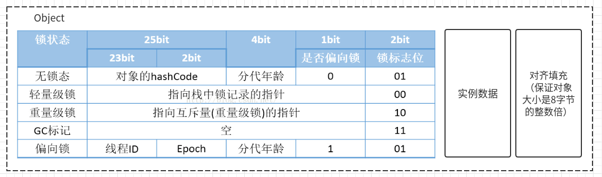
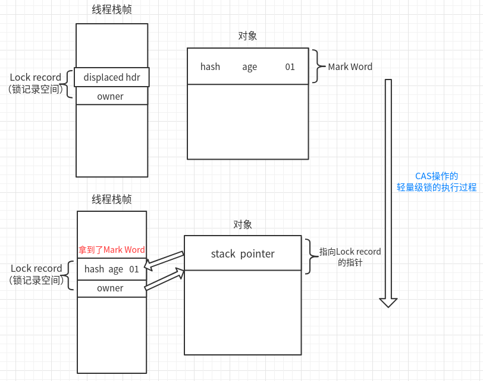
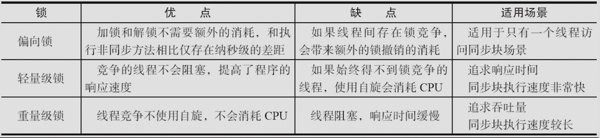

# 锁

参考

<https://blog.csdn.net/varyall/article/details/79698145>

《深入理解Java虚拟机》

**锁状态：**无锁、偏向锁、轻量级锁、重量级锁（**具体是何种状态，取决于竞争情况**）

这三个只是代表锁的状态。而非动作。

首先了解为什么锁的是对象

HotSpot虚拟机的对象的内存分布主要分为三个部分：

- 对象头（分为两部分）

  1. 第一部分用于存储对象自身的运行时数据，如哈希吗，GC分代年龄（又称为Mark Word）
  2. 第二部分用于存储指向方法区对象类型数据的指针。即是对象指向它的类的元数据的指针，虚拟机通过这个指针来确定这个对象是哪个类的实例。如果对象是一个Java数组，那在对象头中还必须有一块用于记录数组长度的数据。

- 实例数据（真正存储有效信息）

- 对齐填充（非必须，仅起着占位符的作用）

  HotSpot虚拟机的自动内存管理系统要求对象起始地址必须是8字节的整数倍，即对象大小必须是8字节的整数倍。而对象头正好是8字节的整数倍，而对象实例数据部分没有对齐，需要通过对齐填充来补全。

虚拟机通过Mark Word的信息来区分锁的状态：



Epoch：偏向时间戳

#### 轻量级锁、重量级锁、偏向锁

这四种状态都不是Java语言中的锁，而是Jvm为了提高锁的获取与释放效率而做的优化

**四种状态会随着竞争的情况逐渐升级，而且是不可逆的过程，即不可降级。**

- 轻量级锁：本意是在没有多线程竞争的前提下，**通过CAS操作而避免了使用互斥量的开销。**

  在只有两个线程的情况下，提高性能。

- 偏向锁：大多数情况下，锁不存在多线程竞争，而是总是由同一线程多次获得时，为了使线程获得锁的代价更低而引入了偏向锁。**提高了带有同步，但无竞争的程序性能。**

  在只有一个线程的情况下，进一步提高性能。

#### 轻量级锁的原理

1. 虚拟机首先将在当前线程的栈帧中建立一个名为锁记录（Lock Record）的空间。
2. 将还没有被锁定的同步对象的对象头中的Mark Word拷贝到锁记录空间中
3. 拷贝成功后，使用CAS操作将对象头中的Mark Word修改为一个指针（指向此线程的锁记录空间）
4. 如果CAS操作成功，这个线程就拥有了该对象锁，并将锁标志“01”改为“00”，即表示此对象处于轻量级锁的状态。此时，如果有另一个线程竞争轻量级锁，则会发生**自旋。**
5. 如果失败了，说明这个Mark Word已经被别的线程拿走了，如果存在两条以上的线程争夺同一个锁，那么轻量级锁就会膨胀为重量级锁。锁标志则被修改为“10”。膨胀之后，不可逆转。变成重量级锁之后，其他竞争失败的线程不会自旋，而是**阻塞**。（大量线程自旋，极大浪费CPU）



解锁过程：

1. 依然是CAS操作，将上面被替换的Mark Word再替换回对象头中。
2. 替换失败，说明轻量级锁已经膨胀成了重量级锁，所以CAS操作替换失败，此时，一定有其他线程在抢夺锁的过程中被阻塞，这时候，释放锁的同事，唤醒被挂起的线程。

### 偏向锁

轻量级锁的获取和释放都依赖于CAS原子操作，而偏向锁是在无竞争的情况下，连CAS操作都不做了。只有在需要置换ThreadID的时候，执行一次CAS原子操作。在只有一个线程执行同步块的情况下，进一步提高性能。

偏向锁的获取过程：

1. 在对象第一次被线程获取的时候，查看Mark Word中偏向锁标志是否为1，锁标志是否为01。是否已经确定Thread ID，如果已经确定，则不需要CAS操作，直接执行同步代码块。
2. 如果没有确定Thread ID，则通过CAS操作竞争锁，成功：则将Mark Word中的Thread ID设置为当前线程ID，然后执行同步代码块
3. 如果竞争失败：则说明有线程一同竞争，偏向锁会升级为轻量级锁。竞争失败的线程自旋。

偏向锁的释放：

如果没有竞争，线程不会主动释放偏向锁，只有在有竞争的情况下，偏向锁会被撤销，提升为轻量级锁。

#### 三种锁的转化


#### 三种锁对比



#### 自旋锁

线程的阻塞，挂起，唤醒，都会给系统性能带来压力。

有时候线程只需要等待很短的时间，这个时间将线程挂机，就很不值得。

所以自旋技术：让线程执行一个忙循环（自旋），稍等一下。这就是自旋锁。

-XX:+UseSpinning开启自旋锁。JDK1.6之后，默认开启。

**自旋锁的效果：**避免了线程切换的开销，但是在自旋过程中要占用CPU。如果锁被占用很短，自旋时间很短，自旋等待的效果就会很好，反之，如果锁占用时间长，自旋就会很浪费资源。

JDK1.6之前自旋默认循环次数为10次。可以使用参数-XX:PreBlockSpin来修改。

JDK1.6之后，次数不在固定，可以自适应，由同一个锁的前一个自旋时间来决定。比如：上一个等待此锁的线程自旋了多久，这次系统就会让此线程自旋多久。

#### 锁消除

对于堆内存中永远不会逃逸，不会被其他线程访问到的变量，就认为是线程私有的，无需同步加锁。

虚拟机即时编译器在运行时，如果检测到不可能存在共享数据竞争的锁，说明这个锁无意义，就会自动进行消除这个锁。这就是锁消除。

```java
// 看起来没有同步的方法
public String concatString(String str1,String str2,String str3){
    return str1 + str2 + str3;
}
// 在JDK1.5之前，会自动转化为StringBuffer进行append（）操作
public String concatString(String str1,String str2,String str3){
    StringBuffer sb = new StringBuffer();
    sb.append(str1);
    sb.append(str2);
    sb.append(str3);
    return sb.toString();
}
```

#### 锁粗化

原则上，将同步块的作用范围限制的尽量小，在多线程中的互斥同步的操作数量就会尽可能的小，如果存在锁竞争，那等待锁的线程也能尽快拿到锁。

大部分情况下，这是正确的。但是，如果一系列的连续操作都对同一个对象反复加锁和解锁，甚至加锁操作在循环体中，即使没有竞争，频繁互斥同步也会导致不必要的性能损耗。

**锁粗化：**如果虚拟机检测到有这样一连串零碎操作（如上面的代码）都对同一个对象加锁，将会把加锁同步的范围扩大到整个操作序列的外部。

### 乐观锁与悲观锁

参考：

<https://mp.weixin.qq.com/s?__biz=Mzg2OTA0Njk0OA==&mid=2247484911&idx=1&sn=1d53616437f50b353e33edad6fda2e4f&source=41#wechat_redirect>

#### 悲观锁（多写场景）：

总是假设最坏的情况，每次去拿数据的时候都认为别人会修改，所以每次在拿数据的时候都会上锁，这样别人想拿这个数据就会阻塞直到它拿到锁。

Java中 `synchronized`和 `ReentrantLock`等独占锁就是悲观锁思想的实现。

#### 乐观锁（多读场景）：

总是假设最好的情况，每次去拿数据的时候都认为别人不会修改，所以不会上锁，但是在更新的时候会判断一下在此期间别人有没有去更新这个数据，可以使用**版本号机制和CAS算法实现。**

在Java中 `java.util.concurrent.atomic`包下面的原子变量类就是使用了乐观锁的一种实现方式**CAS**实现的。

两种乐观锁的常用实现方式：

- **版本号机制：**

一般是在数据表中加上一个数据版本号version字段，表示数据被修改的次数，当数据被修改时，version值会加一。当线程A要更新数据值时，在读取数据的同时也会读取version值，在提交更新时，提交版本必须大于记录的当前版本。

**举一个简单的例子：**假设数据库中帐户信息表中有一个 version 字段，当前值为 1 ；而当前帐户余额字段（ balance ）为 $100 。

1. 操作员 A 此时将其读出（ version=1 ），并从其帐户余额中扣除 $50（ $100-$50 ）。
2. 在操作员 A 操作的过程中，操作员B 也读入此用户信息（ version=1 ），并从其帐户余额中扣除 $20 （ $100-$20 ）。
3. 操作员 A 完成了修改工作，将数据版本号加一（ version=2 ），连同帐户扣除后余额（ balance=$50 ），提交至数据库更新，此时由于提交数据版本大于数据库记录当前版本，数据被更新，数据库记录 version 更新为 2 。
4. 操作员 B 完成了操作，也将版本号加一（ version=2 ）试图向数据库提交数据（ balance=$80 ），但此时比对数据库记录版本时发现，操作员 B 提交的数据版本号为 2 ，数据库记录当前版本也为 2 ，不满足 “ 提交版本必须大于记录当前版本才能执行更新 “ 的乐观锁策略，因此，操作员 B 的提交被驳回。

这样，就避免了操作员 B 用基于 version=1 的旧数据修改的结果覆盖操作员A 的操作结果的可能。

- **CAS算法（compare and swap比较再交换）：**

一种无锁算法。即不适用锁的情况下，实现多线程之间的变量同步。

JDK1.5之后，java.util.concurrent包下的类，使用CAS算法实现了区别于synchronized同步锁的一种乐观锁。

CAS的三个操作数：

内存值V，旧的预期值A，要修改的新值B。当且仅当预期值A和内存值V相同时，将内存值V修改为B，否则什么都不做。

线程A拿到value为3，线程被挂起；线程B拿到value，修改内存值为2。线程A恢复之后，会检查比较手上的value和内存的value，发现不一样，那么重新再来，拿到内存的value继续执行。

CAS的缺陷：ABA问题

有可能value被改了，又被改回来了，那么CAS算法是无法发现value已经被修改过了，误认为没有被修改。

#### 公平锁与非公平锁

ReentrantLock支持两种锁：**公平锁**和**非公平锁**

这里**公平锁**和**非公平锁**的效率问题，有关于上下文切换（非公平锁效率高于公平锁）

两者的区别：

- **非公平锁下的后来线程可以插队**，减少了一定的线程上下文切换

- **公平锁下后来的线程必须排队等待锁的释放**，多进行了一步判断，线程挂起的几率比较高，所以效率略低

  满足FIFO（先进先出队列）

  公平锁下的线程，先运行，先拿锁。后续看例子实现

```java
// 默认非公平锁
public ReentrantLock() {
    sync = new NonfairSync();
}
// 传入一个true,构造公平锁
public ReentrantLock(boolean fair) {
    sync = fair ? new FairSync() : new NonfairSync();
}
```

实现一个栗子：（**先运行的线程，总能先拿到锁**）

```java
// 公平锁实现
public class FairLock {
    private final Lock lock = new ReentrantLock(true);
    public void test(){

        lock.lock();
        try{
            System.out.println(Thread.currentThread().getName()+"拿到了锁");
        }catch (Exception e){
            e.printStackTrace();
        }finally {
            lock.unlock();
        }
    }
    public static void main(String[] args) {
        FairLock fairLock =new FairLock();
        Runnable task = new Runnable() {
            @Override
            public void run() {
                System.out.println(Thread.currentThread().getName()+"运行了");
                try {
                    Thread.sleep(1000);
                } catch (InterruptedException e) {
                    e.printStackTrace();
                }
                // 拿锁
                fairLock.test();
            }
        };
        Thread t1 = new Thread(task);
        Thread t3 = new Thread(task);
        Thread t2 = new Thread(task);
        Thread t4 = new Thread(task);
        Thread t5 = new Thread(task);
        Thread[] threads ={t1,t2,t3,t4,t5};
        // 一起运行，但不一定谁先拿到锁
        for (int i = 0; i < threads.length; i++) {
            threads[i].start();
        }
    }
}

运行结果：  // 先运行的线程，总能先拿到锁
Thread-2运行了
Thread-3运行了
Thread-0运行了
Thread-1运行了
Thread-4运行了
Thread-2拿到了锁
Thread-3拿到了锁
Thread-0拿到了锁
Thread-1拿到了锁
Thread-4拿到了锁
```

#### 读写锁

先了解一下独占锁和共享锁：

**独占锁（互斥锁、排它锁、写锁）**：一次只能有一个线程持有。（synchronized和ReentrantLock）是一种悲观锁，假如说，只读线程拿到锁，那么别的读线程，无法拿到锁，就浪费了时间，因为读操作不存在不安全问题。

**共享锁（读锁）**：该锁可以被多个线程持有。

读写锁中，读锁可以共享，写锁只能被独占。也就是提高了读的效率。高并发下，读往往比写要多，这样就提高了高并发下读的效率。

ReadWriteLock接口：只有两个方法，读锁、写锁。

```java
public interface ReadWriteLock {
    Lock readLock();
    Lock writeLock();
}
```

**具体例子看：JUC.md--ReentrantReadWriteLock类下的具体代码实现**

#### 可重入锁

重入锁，是实现Lock接口的一个类，也是在实际编程中使用频率很高的一个锁

**支持重入性，表示能够对共享资源能够重复加锁，即当前线程获取该锁再次获取不会被阻塞**

通过继承，展示可重入锁
在子类同步方法中，进入父类的同步方法

```java
public class Reentrant {
    static class Father {
        public int i = 100;
        synchronized public void fathermethod() {
            try {
                i--;
                System.out.println("父类father方法：" + i);
                Thread.sleep(100);
            } catch (Exception e) {
                e.printStackTrace();
            }
        }
    }
    static class Son extends Father {
       synchronized public void sonmethod()
        {
            try {
                while (i > 0) {
                    i--;
                    System.out.println("子类son方法：" + i);
                    Thread.sleep(100);
                    // 在子类中，进入父类的同步方法
                    fathermethod();
                }
            } catch (Exception e) {
                e.printStackTrace();
            }
        }
    }
    static class MyThread extends Thread{
        @Override
        public void run() {
            super.run();
            Son son = new Son();
            son.sonmethod();
        }
    }
    public static void main(String[] args) {
        MyThread thread = new MyThread();
        thread.start();
    }
}
```

```
子类son方法：9
父类father方法：8
子类son方法：7
父类father方法：6
子类son方法：5
父类father方法：4
子类son方法：3
父类father方法：2
子类son方法：1
父类father方法：0
```
