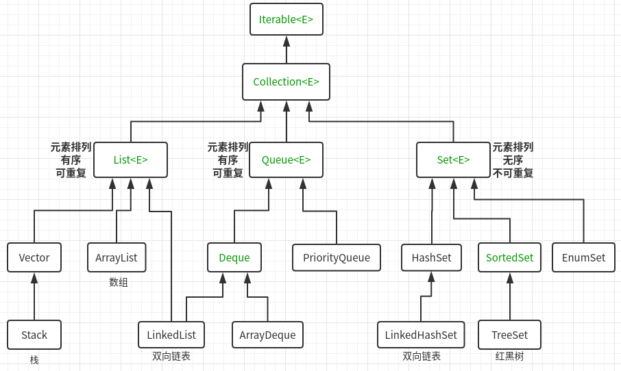
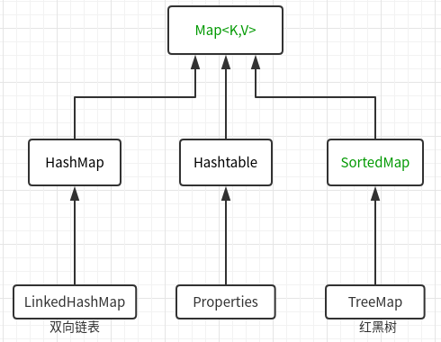
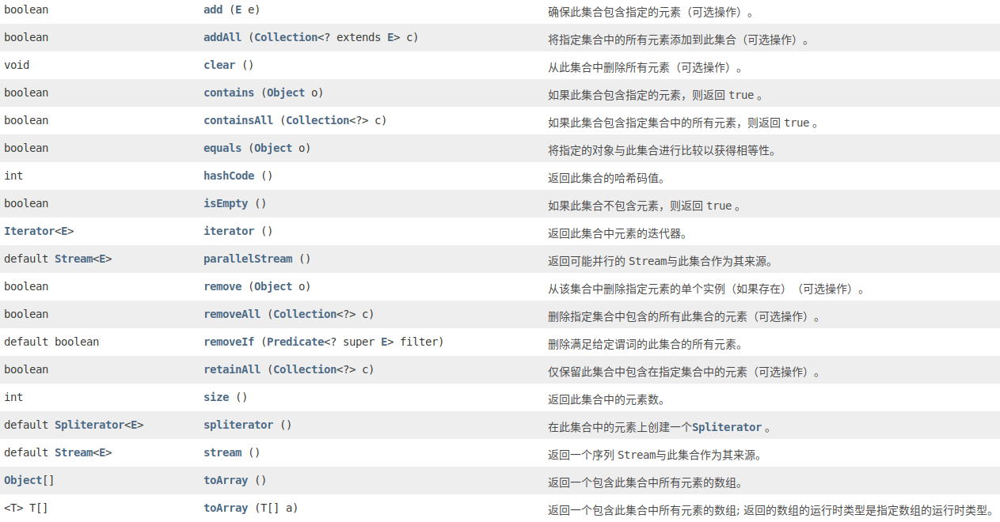

# Java集合

参考：

<https://github.com/CyC2018/CS-Notes/blob/master/docs/notes/Java%20%E5%AE%B9%E5%99%A8.md>

<https://www.cnblogs.com/bingyimeiling/p/10255037.html>

### Java.util







### Collection<E>

参考文档，可以看到Collection的所有方法：



#### Collections工具类常用方法

有很多对数组的静态操作方法

```java

```


### Set<E>

基本和Collection接口方法类似，但其实现类，实现了特性

- 不允许添加重复的元素，add方法会返回false。

#### （1）HashSet

- **基于哈希表实现（所以元素必须实现HashCode），快速查找（时间复杂度O(1)）**
- **无序(输出顺序按哈希码)、非线程安全、集合元素可以是null**

内部使用HashMap来存储数据，调用HashMap的方法来实现各项功能。

通过Hash值来决定存储位置，判断元素是否相同的标准：1.equals（）返回true；2.HashCode（）返回值相同。

```java
public class HashSet<E> extends AbstractSet<E>
	implements Set<E>, Cloneable, java.io.Serializable{
	
	private transient HashMap<E,Object> map;
    private static final Object PRESENT = new Object();
    // 常用的三种构造器
    // 无参构造器，默认创建大小为16的HashMap，loadFactor为0.75（自动扩容）
    // 另外两个构造器，可以修改参数
    public HashSet() {
        map = new HashMap<>();
    }
    public HashSet(int initialCapacity, float loadFactor) {
        map = new HashMap<>(initialCapacity, loadFactor);
    }
    public HashSet(int initialCapacity) {
        map = new HashMap<>(initialCapacity);
    }
    // add方法：将要添加到集合的元素，设置为HashMap的Key，调用HashMap的put方法添加元素
    public boolean add(E e) {
        return map.put(e, PRESENT)==null;
    }
}
```

#### （2）LinkedHashSet

HashSet的子类，调用HashSet的构造器，保证了以元素的添加顺序来存储元素。性能略差。


#### （3）TreeSet

- **内部使用TreeMap存储元素，调用TreeMap方法。**
- **基于红黑树实现，支持有序操作、不允许null值（因为没法比较）。查找效率不如HashSet**
- **添加的元素必须实现Comparable接口，TreeSet实现了自然排序，添加元素，相当于添加到二分搜索树。**

TreeSet实现了NavigableSet接口，NavigableSet接口继承SortedSet接口。

间接实现了SortedSet接口。先看一下SortedSet

```java
public interface SortedSet<E> extends Set<E> {
    SortedSet<E> tailSet(E fromElement);
    // 返回首位元素
    E first();
    E last();
}
```

下面看一哈TreeSet

```java
public class TreeSet<E> extends AbstractSet<E>
    implements NavigableSet<E>, Cloneable, java.io.Serializable
{
    private transient NavigableMap<E,Object> m;
    private static final Object PRESENT = new Object();
    // 构造器
    TreeSet(NavigableMap<E,Object> m) {
        this.m = m;
    }
    // 无参构造器，实际上就是新建一个TreeMap
    public TreeSet() {
        this(new TreeMap<E,Object>());
    }
    // 实现了SortedSet接口方法，调用TreeMap方法，返回首位元素
    public E first() {
        return m.firstKey();
    }
    public E last() {
        return m.lastKey();
    }
    // add方法，调用TreeMap的put，将元素作为Key保存。key已经存在，返回false
    public boolean add(E e) {
        return m.put(e, PRESENT)==null;
    }
}
```

#### （4）对比

1. HashSet的性能比TreeSet的性能好（特别是添加，查询元素时），因为TreeSet需要额外的红黑树算法维护元素的次序，如果需要一个保持排序的Set时才用TreeSet，否则应该使用HashSet。
2. LinkedHashSet是HashSet的子类，由于需要链表维护元素的顺序，所以插入和删除操作比HashSet要慢，但遍历比HashSet快。
3. EnumSet是所有Set实现类中性能最好的，但它只能 保存同一个枚举类的枚举值作为集合元素。


### List<E>

List集合是一个有序、可重复的集合。每个元素都可以通过索引来访问。

#### （1）ArrayList

动态数组（自动扩容）

详见 源码—ArrayList

**如何安全的删除List数据**？

在删除List元素的时候，一定要维护Index，否则会出现问题,如：

```java
public static void main(String[] args) {
    ArrayList<Integer> list = new ArrayList<>();
    list.add(1);
    list.add(2);
    list.add(3);
    list.add(3);
    // 如果不对index进行维护,就会出现下面这种情况:
    // 我们想删除前两个元素
    for (int i = 0;i<2;i++){
        list.remove(i);
    }
    System.out.println(list); // 结果为[2,3]
    
    // 再比如,要删除3,不维护index,是访问不到最后一个元素的
    for (int i = 0;i<list.size();i++){
        if (list.get(i)==3){
            list.remove(i);
        }
    }
    System.out.println(list); // 结果为[1,2,3]
}
```

安全删除，有下面几种方法：

1. Lambda

```java
ArrayList<Integer> list = new ArrayList<>();
list.add(1);
list.add(2);
list.add(3);
list.add(3);
list.removeIf(e->3==e);
System.out.println(list); // 结果[1,2]
```

2. 维护index,每次删除,index-1

```java
ArrayList<Integer> list = new ArrayList<>();
list.add(1);
list.add(2);
list.add(3);
list.add(3);
for (int i = 0;i<list.size();i++){
    if (list.get(i)==3){
        list.remove(i--);
    }
}
System.out.println(list); // 结果为[1,2]
```

3. 迭代器（迭代器遍历中，不能使用list.remove）

```java
ArrayList<Integer> list = new ArrayList<>();
list.add(1);
list.add(2);
list.add(3);
list.add(3);
for (Iterator iterator = list.iterator();iterator.hasNext();){
    if (iterator.next().equals(3)){
        iterator.remove();	// 禁止使用list.remove
    }
}
System.out.println(list);
```


#### （2）LinkedList

双向链表。

- 提供了索引访问节点，但是性能差。
- 因为是链表，所以插入添加元素的性能比较好。

#### （3）Vector

线程安全的动态数组。

#### （4）Stack

继承了Vector，封装了Vector的方法来维护栈

```java
public class Stack<E> extends Vector<E> {
    public E push(E item) {...}
    public synchronized E pop() {...}
    public synchronized E peek() {...}
}
```


### Map<K,V>

参考

<https://github.com/CyC2018/CS-Notes/blob/master/docs/notes/Java%20%E5%AE%B9%E5%99%A8.md>

- TreeMap：基于红黑树实现。
- HashMap：基于哈希表实现。
- HashTable：和 HashMap 类似，但它是线程安全的，这意味着同一时刻多个线程可以同时写入 HashTable 并且不会导致数据不一致。它是遗留类，不应该去使用它。现在可以使用 ConcurrentHashMap 来支持线程安全，并且 ConcurrentHashMap 的效率会更高，因为 ConcurrentHashMap 引入了分段锁。
- LinkedHashMap：使用双向链表来维护元素的顺序，顺序为插入顺序或者最近最少使用（LRU）顺序。
- Properties：Properties类时Hashtable类的子类，它相当于一个key、value都是String类型的Map，主要用于读取配置文件。

#### （1）HashMap

详见 源码—HashMap

#### （2）LinkedHashMap

参考：

<https://github.com/CyC2018/CS-Notes/blob/master/docs/notes/Java%20%E5%AE%B9%E5%99%A8.md>

继承HashMap，具有HashMap的快速查找特点。

内部维护了一个双向链表。默认迭代顺序即插入顺序。

每次访问结点，都会对链表进行LRU顺序维护（需要用参数开启，按照应用次数排序）

（LRU：least recently used，最近最少使用，缓存淘汰策略。）

```java
public class LinkedHashMap<K,V> extends HashMap<K,V> implements Map<K,V>
{
// 在HashMap中Node的基础上，增加了before和after双向结点
    static class Entry<K,V> extends HashMap.Node<K,V> {
        Entry<K,V> before, after;
        Entry(int hash, K key, V value, Node<K,V> next) {
            super(hash, key, value, next);
        }
    }
// 构造方法：增加了一个布尔参数，代表了迭代顺序
    public LinkedHashMap() {
        super();
        accessOrder = false;
    }
    // 重写了HashMap的get方法
    public V get(Object key) {
        Node<K,V> e;
        if ((e = getNode(hash(key), key)) == null)
            return null;
        if (accessOrder)
            afterNodeAccess(e); // 一旦访问某一节点，将此节点，放到链表尾部
        return e.value;
    }
}
```


#### (4)WeakHashMap


#### LRU缓存

见 JavaCode—notes—Container—LRU_Test.java


#### （4）TreeMap

插入的元素，必须实现Comparable接口，插入之后，默认生序排列。可以重写compareTo方法，自定义排序规则。


## 常见面试题

### Arraylist 与 LinkedList 异同

- **1. 是否保证线程安全：** ArrayList 和 LinkedList 都是不同步的，也就是不保证线程安全；
- **2. 底层数据结构：** Arraylist 底层使用的是Object数组；LinkedList 底层使用的是双向链表数据结构
- **3. 插入和删除是否受元素位置的影响：** ① **ArrayList 采用数组存储，所以插入和删除元素的时间复杂度受元素位置的影响。** 比如：执行`add(E e) `方法的时候， ArrayList 会默认在将指定的元素追加到此列表的末尾，这种情况时间复杂度就是O(1)。但是如果要在指定位置 i 插入和删除元素的话（`add(int index, E element) `）时间复杂度就为 O(n-i)。因为在进行上述操作的时候集合中第 i 和第 i 个元素之后的(n-i)个元素都要执行向后位/向前移一位的操作。 ② **LinkedList 采用链表存储，所以插入，删除元素时间复杂度不受元素位置的影响，都是近似 O（1）而数组为近似 O（n）。**
- **4. 是否支持快速随机访问：** LinkedList 不支持高效的随机元素访问，而 ArrayList 支持。快速随机访问就是通过元素的序号快速获取元素对象(对应于`get(int index) `方法)。
- **5. 内存空间占用：** ArrayList的空 间浪费主要体现在在list列表的结尾会预留一定的容量空间，而LinkedList的空间花费则体现在它的每一个元素都需要消耗比ArrayList更多的空间（因为要存放直接后继和直接前驱以及数据）。