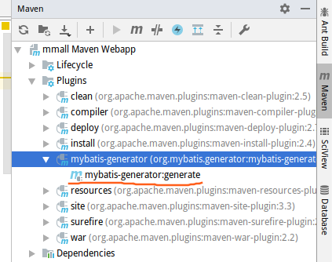
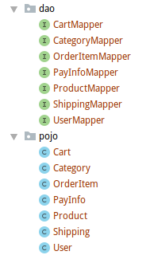
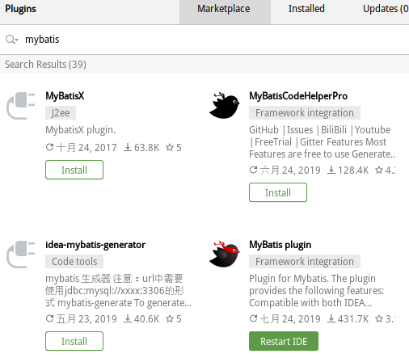
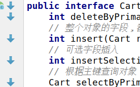

# MyBatis

## MyBatis三剑客

### （1）MyBatis-gennerator

自动生成dao接口方法、pojo对象、mapper.xml文件

首先配置MyBatis-gennerator：

注意<plugins>标签，需要与<pluginManagement>同级别，不能放在Management内部

```xml
<build>
    <plugins>
        <plugin>
            <groupId>org.mybatis.generator</groupId>
            <artifactId>mybatis-generator-maven-plugin</artifactId>
            <version>1.3.2</version>
            <configuration>
                <verbose>true</verbose>
                <overwrite>true</overwrite>
            </configuration>
        </plugin>
    </plugins>
</build>
```

2. 配置datasource.properties

   ```properties
   db.driverLocation=/home/whr/.m2/repository/mysql/mysql-connector-java/5.1.47/mysql-connector-java-5.1.47.jar
   db.driverClassName=com.mysql.jdbc.Driver
   db.url=jdbc:mysql://localhost:3306/mall?characterEncoding=utf-8
   db.username=root
   db.password=123456
   db.initialSize=20
   db.maxActive=50
   db.maxIdle=20
   db.minIdle=10
   db.maxWait=10
   db.defaultAutoCommit=true
   db.minEvictableIdleTimeMillis=3600000
   ```

3. 配置generatorConfig.xml文件（这里还需要datasource.properties文件，自行配置即可）

```xml
<?xml version="1.0" encoding="UTF-8"?>
<!DOCTYPE generatorConfiguration
        PUBLIC "-//mybatis.org//DTD MyBatis Generator Configuration 1.0//EN"
        "http://mybatis.org/dtd/mybatis-generator-config_1_0.dtd">
<generatorConfiguration>
    <!--找到.properties文件-->
    <properties resource="datasource.properties"></properties>
    <!--我们如果用maven插件运行MyBatis-gennerator，就需要配置此项-->
    <classPathEntry location="${db.driverLocation}"/>
    <context id="default" targetRuntime="MyBatis3">
        <commentGenerator>
            <!-- 创建class的时候，是否去除自动生成的注释-->
            <property name="suppressDate" value="true" />
            <property name="suppressAllComments" value="true"/>
        </commentGenerator>
        <!-- 数据库连接 -->
        <jdbcConnection driverClass="${db.driverClassName}"
                        connectionURL="${db.url}"
                        userId="${db.username}"
                        password="${db.password}">
        </jdbcConnection>
        <!--默认false，把JDBC DECIMAL 和 NUMERIC 类型解析为 Integer
            true，把JDBC DECIMAL 和 NUMERIC 类型解析为java.math.BigDecimal-->
        <javaTypeResolver>
            <property name="forceBigDecimals" value="false" />
        </javaTypeResolver>
        <!--targetPackage生成目标存放位置，targetProject生成目标存在的项目位置-->
        <javaModelGenerator targetPackage="com.pojo" targetProject="./src/main/java">
            <!--是否允许子包 -->
            <property name="enableSubPackages" value="false"/>
            <!--是否添加构造函数 -->
            <property name="constructorBased" value="true"/>
            <!-- 从数据库返回的值被清理前后的空格  -->
            <property name="trimStrings" value="true" />
            <!--建立的对象是否不可改变。即没有setter方法-->
            <property name="immutable" value="false" />
        </javaModelGenerator>
        <!--mapper映射文件生成所在目录，对每一个表生成对应的mapper.xml文件  -->
        <sqlMapGenerator targetPackage="mappers" targetProject="./src/main/resources">
            <property name="enableSubPackages" value="false"/>
        </sqlMapGenerator>
        <!-- 生成对应的Mapper接口类文件，即dao接口文件 -->
        <javaClientGenerator type="XMLMAPPER" targetPackage="com.dao" targetProject="./src/main/java">
            <property name="enableSubPackages" value="false"/>
        </javaClientGenerator>
        <!--生成全部表tableName设为%-->
        <table tableName="%"/>
    </context>
</generatorConfiguration>
```

3. 这样，我们就可以在Maven插件中，找到MyBatis-gennerator插件



运行之后，我们再来看dao包和pojo包：

dao接口方法和pojo对象都已经生成，并且mapper.xml以及每个dao方法对应的sql语句也都生成了



4. 如果我们的表中有create_time、update_time这些字段，我们需要维护一下；将维护这两个时间字段的任务交给MySql而不是我们自己去用代码维护。

找到自动生成的mapper.xml文件，找到这两个字段的value值的位置，修改为MySql的内置函数：now()，自动生成当前时间。

```xml
<insert id="insert" parameterType="com.pojo.Cart" >
    insert into mmall_cart (id, create_time, update_time)
    values (#{id,jdbcType=INTEGER} #{createTime,jdbcType=TIMESTAMP}, 
    #{updateTime,jdbcType=TIMESTAMP})
</insert>
```

```sql
<insert id="insert" parameterType="com.pojo.Cart" >
    insert into mmall_cart (id, create_time, update_time)
    values (#{id,jdbcType=INTEGER} ,now(),now())
</insert>
```

### （2）MyBatis-plugin

实现接口方法和mapper文件的对应sql语句的切换。



点击 箭头 直接跳转对应的mapper文件，很方便




### （3）MyBatis-pagehelper

一个GitHub开源项目，内部使用SpringAOP，截获sql，分页之后再填充返回。

1. 首先在pom.xml引入插件

   ```xml
   <dependency>
       <groupId>com.github.pagehelper</groupId>
       <artifactId>pagehelper</artifactId>
       <version>5.1.2</version>
   </dependency>
   <dependency>
       <groupId>com.github.miemiedev</groupId>
       <artifactId>mybatis-paginator</artifactId>
       <version>1.2.15</version>
   </dependency>
   <dependency>
       <groupId>com.github.jsqlparser</groupId>
       <artifactId>jsqlparser</artifactId>
       <version>1.2</version>
   </dependency>
   ```

根据SpringAOP特性，来实现动态分页。

mybatis-config.xml

```xml
<!--mybatis的session工厂配置-->
<bean id="sqlSessionFactory" class="org.mybatis.spring.SqlSessionFactoryBean">
    <property name="dataSource" ref="dataSource"/>
    <property name="mapperLocations" value="classpath*:mappers/*.xml"></property>
    <!-- 分页插件 -->
    <property name="plugins">
        <array>
            <bean class="com.github.pagehelper.PageHelper">
                <property name="properties">
                    <value>
                        dialect=mysql
                    </value>
                </property>
            </bean>
        </array>
    </property>
</bean>
```

使用PageHelper，查询语句不需要使用limit，只需要返回list就可以了，比如：

```xml
<sql id="Base_Column_List" >
    id, order_no, user_id, shipping_id, payment, payment_type, postage, status, payment_time, send_time, end_time, close_time, create_time, update_time
</sql>
<select id="selectAllOrder" resultMap="BaseResultMap">
    SELECT
    <include refid="Base_Column_List"/>   <!--这里是在上面定义好，复用方便，相当于 *-->
    from mmall_order
    ORDER BY  create_time desc
</select>
```

再看Controller接口：

我们需要传入额外两个参数：pageNum（开始页数）、pageSize（每页最大容量）

```java
// @RequestParam:就是不传此参数，就报错；并且可以设置默认值。
// 如果不加此注解，此参数没有传，就默认传null
public ServerResponse<PageInfo> list(
    HttpSession session,
    @RequestParam(value = "pageNum",defaultValue = "1")int pageNum,
    @RequestParam(value = "pageSize",defaultValue = "10")int pageSize){
    ....
    // 开始分页
    PageHelper.startPage(page, pageSize);
    // 订单集合,通过userId,查询所有订单
    List<Order> orderList = orderMapper.selectByUserId(userId);
    // 组装为Vo对象
    List<OrderVo> orderVoList = assembleOrderVoList(orderList,userId);
    // 动态分页
    PageInfo pageResult = new PageInfo(orderList);
    pageResult.setList(orderVoList);
    return ServerResponse.createBySuccess(pageResult);
}
```

这里为什么会传值两次？

```java
PageInfo pageResult = new PageInfo(orderList);
pageResult.setList(orderVoList);	
```

是因为，PageHelper使用的是SpringAOP实现，起初的order对象，才是数据库的真实操作对象，但是此项目的真正返回值，不是pojo对象，而是，我们又一次重新构建的对象。

**也就是PageInfo的构造器，只能传入dao层的pojo对象**！不然，连数据库都无法使用，就不能分页了。

如果，要返回自己构建的Vo对象，就要再次 **setList** 一次。

所以：setList方法就是使用了Spring的AOP特性。动态代理了分页方法，实现动态分页。


## MyBatis标签

### where标签

当我们想where连接两个条件，但是这两个条件都有可能为空

比如下面这个sql，我们首先想到 if 标签

```sql
select
<include refid="Base_Column_List"/>
rom mmall_product
<if test="productName!=null">
  where name like #{productName}
</if>
<if test="productId!=null">
  and id=#{productId}
</if>
```

显然，如果name为空，这个sql是不成立的

修改为下面的形式，就完全没问题了

```sql
select
<include refid="Base_Column_List"/>
rom mmall_product
where 1=1
<if test="productName!=null">
  and name like #{productName}
</if>
<if test="productId!=null">
  and id=#{productId}
</if>
```

但是MyBatis为我们提供了\<where>标签，解决了这个问题。where会自动替换第一个条件成立的and。

```xml
<select id="selectByNameAndProductId" resultMap="BaseResultMap" parameterType="map">
    select
    <include refid="Base_Column_List"/>
    from mmall_product
    <where>
        <if test="productName!=null">
            and name like #{productName}
        </if>
        <if test="productId!=null">
            and id=#{productId}
        </if>
    </where>
</select>
```

