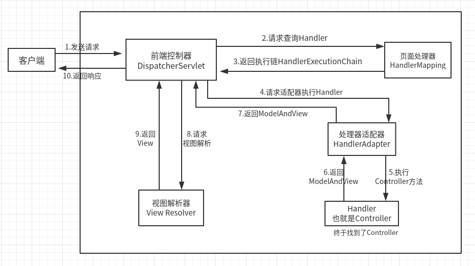
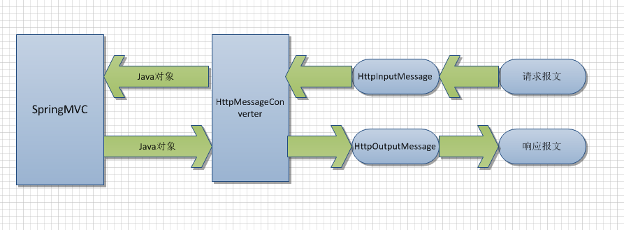

# SpringMVC

## Spring UML

SpringMVC时序图

相较于传统MVC，将业务逻辑层（Model）和视图层（View）进行解耦，交由Controller层统一调度，由DispatcherServlet作为统一的访问点，进行全局的流程控制。



基本配置：

1. web.xml

```xml
<!DOCTYPE web-app PUBLIC
 "-//Sun Microsystems, Inc.//DTD Web Application 2.3//EN"
 "http://java.sun.com/dtd/web-app_2_3.dtd" >
<web-app>
  <display-name>Archetype Created Web Application</display-name>
  <!--处理中文乱码的过滤器-->
  <filter>
    <filter-name>encodingFilter</filter-name>
    <filter-class>org.springframework.web.filter.CharacterEncodingFilter</filter-class>
    <init-param>
      <param-name>encoding</param-name>
      <param-value>UTF-8</param-value>
    </init-param>
    <init-param>
      <param-name>forceEncoding</param-name>
      <param-value>true</param-value>
    </init-param>
  </filter>
  <filter-mapping>
    <filter-name>encodingFilter</filter-name>
    <url-pattern>/*</url-pattern>
  </filter-mapping>
    
  <!--注册DispatcherServlet-->
  <servlet>
    <servlet-name>springmvc</servlet-name>
    <servlet-class>org.springframework.web.servlet.DispatcherServlet</servlet-class>
    <init-param>
      <param-name>contextConfigLocation</param-name>
      <param-value>classpath:springmvc.xml</param-value>
    </init-param>
  </servlet>
  <servlet-mapping>
    <servlet-name>springmvc</servlet-name>
    <url-pattern>/</url-pattern>
  </servlet-mapping>
  <servlet-mapping>
    <servlet-name>default</servlet-name>
    <url-pattern>*.css</url-pattern>
  </servlet-mapping>
</web-app>
```

2. springmvc.xml

```xml
<?xml version="1.0" encoding="UTF-8"?>
<beans xmlns="http://www.springframework.org/schema/beans"
       xmlns:xsi="http://www.w3.org/2001/XMLSchema-instance"
       xmlns:context="http://www.springframework.org/schema/context"
       xmlns:mvc="http://www.springframework.org/schema/mvc"
       xsi:schemaLocation="http://www.springframework.org/schema/beans
       http://www.springframework.org/schema/beans/spring-beans.xsd
       http://www.springframework.org/schema/context
       http://www.springframework.org/schema/context/spring-context.xsd
       http://www.springframework.org/schema/mvc
       http://www.springframework.org/schema/mvc/spring-mvc-3.2.xsd">

    <mvc:annotation-driven >
        <!-- 消息转换器 -->
        <mvc:message-converters register-defaults="true">
            <bean class="org.springframework.http.converter.json.MappingJackson2HttpMessageConverter"></bean>
        </mvc:message-converters>
    </mvc:annotation-driven>

	<!-- 配置自动扫描 -->
    <context:component-scan base-package="com"></context:component-scan>
	<!-- 视图解析 前缀+逻辑试图+后缀（.jsp）-->
    <bean class="org.springframework.web.servlet.view.InternalResourceViewResolver">
        <property name="prefix" value="/"></property>
        <property name="suffix" value=".jsp"></property>
    </bean>
</beans>
```

消息转换器的作用




### SpringMVC RESTful

什么是RESTful架构：（Representational state transfer **表现层状态转移**）

前端设备层出不穷，必须有统一的机制，方便前后端通信，导致了API架构的流行，RESTFUL API是当前比较流行的API设计理论。

资源（Resource）：就是表现层，就是一个URL。

表述性（表现层）：就是服务器拿到客户端请求的资源（URL）。

状态转移：客户端通过HTTP的四种操作（GET，POST，PUT，DELETE）来表现层页面的操作。

GET：获取资源

POST：新建资源

PUT：更新资源

DELETE：删除资源

项目演示：./Java/spring/SpringMVCRESTful


### SpringMVC拦截器实现

类似于Servlet过滤器，拦截用户请求，并作出相应处理。例如：用户是否登录，权限验证。

详见 Java/Spring/springMVCInterceptor