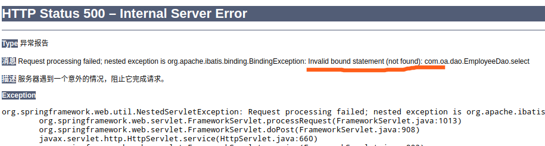
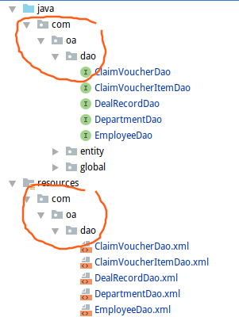

# 异常汇总

## Java

1. **java.lang.UnsupportedOperationException**

   经常发生在（目前只遇到一次）使用Arrays.asList()后调用add，remove这些方法时。

   原因是：

   Arrays.asList()返回的是java.util.Arrays$ArrayList，而不是ArrayList。

   两者都是继承了AbstractList，都具有add，remove方法，但是ArrayList重写了这两个方法。

   java.util.Arrays$ArrayList没有重写remove，add等方法，调用会抛出异常。

   解决：

   换用ArrayList，或者用迭代器

2. **java.lang.IllegalMonitorStateException**

   原因：当前线程没有拥有锁，但是调用了此锁的wait、notify、notifyAll方法

   但是我写的：Concurrent项目中的LockInterruptibly文件，也出现此问题，目前不晓得为什么。

## Spring

1. 启动报错：org.apache.tomcat.util.modeler.BaseModelMBean.invoke Exception invoking method

   jar包版本问题。将5.1.7.RELEASE更换为5.1.5.RELEASE，正常启动。

   具体原因尚不明确。

2. MyBatis数据绑定问题：

   

   MyBatis找不到数据绑定，绑定出了问题

   （1）检查包名是否导入错误

   （2）检查MyBatis配置文件的namespace路径。这里如果配置错误，编译也能通过。所以容易被忽略。

   （3）DAO接口的目录结构一定要和resources下的配置文件的目录结构完全相同！！！！

   

3. org.springframework.beans.factory.BeanCreationException: Error creating bean with name **'org.springframework.web.servlet.mvc.method.annotation.RequestMappingHandlerAdapter'**: Cannot create inner bean 'org.springframework.http.converter.json.MappingJackson2HttpMessageConverter#0' of type [org.springframework.http.converter

大致是对象通过@ResponseBody转化为json格式出了问题.

```xml
<bean class="org.springframework.http.converter.json.MappingJackson2HttpMessageConverter">
    <property name="supportedMediaTypes">
        <list>
            <value>application/json;charset=UTF-8</value>
        </list>
    </property>
</bean>
```

不知道是不是这个bean出了问题.

应该是jackson-mapper-asl和Springframework的版本问题,我降低了Spring的版本,又出现了下面的报错4,

添加了三个jar包


4. org.springframework.beans.factory.BeanCreationException: **Error creating bean with name 'org.springframework.web.servlet.mvc.method.annotation.RequestMappingHandlerAdapter#0'**: **Initialization of bean failed; nested exception is java.lang.NoClassDefFoundError: com/fasterxml/jackson/core/JsonProcessingException**

这个也是json问题

网上查到,添加jackson的三个jar包就解决了

```
jackson-core
jackson-annotations
jackson-databind
```

至此,项目没有问题了.

5. **org.springframework.beans.factory.BeanCreationException: Error creating bean with name** 'cartController': Injection of autowired dependencies failed;

很明显：bean注入失败。

排查：

1. 查看注解有没有标注：@Service，@Autowired
2. 查看注解导包有没有导错。
3. 不要既注解声明，又配置xml中声明，会出问题

## MyBatis

1. 再一次测试接口中遇到了问题:

org.apache.ibatis.binding.BindingException: **Invalid bound statement (not found)**: com.dao.UserMapper.checkUsername

大概是说,找不到此绑定,就是找不到这个持久化方法.具体是找不到xml文件,还是Dao层和Mapper映射不上,没有头绪,

在网上找了,此类问题出现的可能的几个情况:

(1)Mapper没有编译

(2)各种包名,类名,出错, 匹配不上

(3)函数名写错(一般,MyBatis的插件,可以自己找出来)

最后发现:

```xml
<bean id="sqlSessionFactory" class="org.mybatis.spring.SqlSessionFactoryBean">
    <property name="dataSource" ref="dataSource"/>
    <property name="mapperLocations" value="classpath*:mappers/*.xml"></property>
```

其中的mapperLocation,大意,写错了!


2. org.apache.ibatis.builder.IncompleteElementException: Could not find result map com.dao.CartMapper.int

这个就是 返回类型写错了

```xml
<select id="getCartProductCount" parameterType="int" resultType="int">
写成了：
<select id="getCartProductCount" parameterType="int" resultMap="int"> 
```


## MySql

1. Expression #1 of SELECT list is not in GROUP BY clause and contains nonaggregated column 'mooc.user.id' which is not functionally dependent on columns in GROUP BY clause; **this is incompatible with sql_mode=only_full_group_by**

   出现这种错误的解决方法；

   从Mysql的默认模式列表中删除ONLY_FULL_GROUP_BY；

   （1）我们先查看一下默认模式列表：

    select @@global.sql_mode

   ```sql
   ONLY_FULL_GROUP_BY,STRICT_TRANS_TABLES,NO_ZERO_IN_DATE,NO_ZERO_DATE,ERROR_FOR_DIVISION_BY_ZERO,NO_AUTO_CREATE_USER,NO_ENGINE_SUBSTITUTION 
   ```

   （2）可以看到其中有ONLY_FULL_GROUP_BY，我们要删除这个，也就是重新set以下

   set@@global.sql_mode= 'STRICT_TRANS_TABLES,NO_ZERO_IN_DATE,NO_ZERO_DATE,ERROR_FOR_DIVISION_BY_ZERO,NO_AUTO_CREATE_USER,NO_ENGINE_SUBSTITUTION'; 

   （3）然后重启MySql


2. ERROR 1215 (HY000): Cannot add foreign key constraint

   在添加外键时，出现了不能添加的情况：

   原因：关联的两个键，约束应该相同，比如：如果主表 主键有UNSIGNED，子表的外键也需要UNSIGNED。

3. **记一次部署阿里云服务器中部署CentOS7下的Mysql安装，遇到的坑！！！**

具体见：部署云服务器.md

各种问题，废了将近三个小时。

4. ERROR 2002 (HY000): Can't connect to local MySQL server through socket '/var/lib/mysql/mysql.sock' (2)

   在登录数据库的时候出现这个问题，连接不上sock

   由于mysql的socket文件是由mysqld服务启动时创建的，如果mysqld服务未正常启动，socket文件自然也不会被创建，当然会找不到socket文件了。

