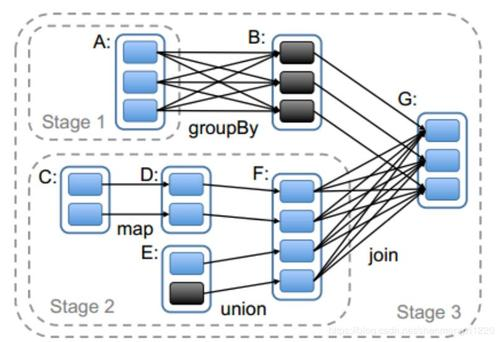

## 概述

**WordCount逻辑**：


### 概念

RDD（Resilient Distributed Dataset）—**弹性分布式数据集**；

它将Spark的计算过程进行了抽象封装；

代表着一个**不可变**（数据在处理过程中不可修改，只读），**可分区**（将数据分区，分配给不同Executor执行，为并行计算提供前提），内部元素可以**并行计算**的集合；

### RDD属性

- RDD数据集的基本组成单位：一组分区；（分区是为了能够分配给不同的任务，并行计算）

- 每个分区有一个计算函数；

- RDD存在依赖关系；比如WordCount的封装逻辑，层层封装，依次依赖；（血缘 Lineage ）

- 分片函数：Partitioner；有两种：基于哈希的HashPartitioner；基于范围的RangePartitioner。

  分片函数决定了RDD的分片数量；

- 有一个列表，存储着每个分区的**优先位置**；

  比如说：存在多个Executor，现在有一个任务，应该先分配给谁，这里就存在优先级，

  如果分区的数据在DataNode1中，那么会优先讲此分区任务分配给DataNode1的Executor；

  **移动数据不如移动计算原则**：尽量不移动数据的位置，数据在哪就把计算任务给最近的位置的Executor

### RDD特点

- RDD表示只读分区的数据集，不可变，能允许RDD生成新的RDD；
- 对RDD的改动，只能通过RDD的转换操作（参照WordCount），即由一个RDD得到一个新的RDD；
- 数据按key进行分区；
- RDDs之间存在有依赖关系（Lineage）；
- 但是如果血缘关系太长，即层层依赖过长，可以通过持久化操作（持久到磁盘）切断血缘关系；

### RDD执行流程

1. 输入：拿到数据（创建RDD）
2. 计算：通过Action算子启动job，通过Transformation算子，不断计算，完成任务；
3. 输出：运行结束，数据存储（HDFS，Scala集和）

## RDD创建

创建的三种方式：

1. 从集合中创建RDD；

   提供两个函数：parallelize、makeRDD

   ```scala
   // makeRDD底层调用了parallelize方法
   def makeRDD[T: ClassTag](
       seq: Seq[T],
       numSlices: Int = defaultParallelism): RDD[T] = withScope {
       parallelize(seq, numSlices)
   }
   // defaultParallelism是有默认值的
   ```

   ```scala
   def parallelize[T: ClassTag](
       seq: Seq[T],
       numSlices: Int = defaultParallelism): RDD[T] = withScope {
       assertNotStopped()
       new ParallelCollectionRDD[T](this, seq, numSlices, Map[Int, Seq[String]]())
   }
   ```

   -  seq: Seq[T]：必须是Seq的子类，比如Tuple不可以传进来；
   - numSlices：分区

   defaultParallelism是多少？

   ```scala
   override def defaultParallelism(): Int = {
       conf.getInt("spark.default.parallelism", math.max(totalCoreCount.get(), 2))
   }
   // 可以知道，分区数，是并行线程数决定的 。
   ```

2. 从外部存储中创建RDD；

   比如：WordCount从文件中读取数据创建RDD：textFile（"xxxxx", 3）

   这里"xxxxxx"为文件地址；3：为分区数；本质上是Hadoop的MR操作

   这里的分区，是与Hadoop的MapReduce的切片规则一致的。

   ```scala
   def textFile(
       path: String,
       minPartitions: Int = defaultMinPartitions): RDD[String] = withScope {
       assertNotStopped()
       hadoopFile(path, classOf[TextInputFormat], classOf[LongWritable], classOf[Text],
                  minPartitions).map(pair => pair._2.toString).setName(path)
   }
   ```

3. 从其他RDD创建新的RDD；

## Transformation

### 常用算子

以一个RDD为例子：

```scala
val rdd = sc.parallelize(List("spark","scala","kafka","docker","hadoop","kafka"), 3)

scala> rdd.partitions.length
res1: Int = 3
```

#### map

简单来说就是：对所map的RDD内的所有元素进行一次操作；

mapValues：只对K-V对中的V进行操作；

```scala
val rddMap = rdd.map(_ + "-a")

scala> rddMap.collect
res2: Array[String] = Array(spark-a, scala-a, kafka-a, docker-a, hadoop-a, kafka-a)
```

**注意：这里的所有元素，并不是最小单元元素！而是当前RDD的组成单元！**

如果是下面rdd，组成单元则是单个Array，而不是单词

```scala
val rddArray = sc.parallelize(
    Array(Array("hello", "world"), Array("kafka","spark"),Array("spark","hadoop"))
)
```

#### flatMap

进行扁平化（有降维的的感觉），用新的RDD测试

下面的例子，有一种二维降一维的意思；

```scala
val rdd = sc.parallelize(
    Array(Array("hello", "world"), Array("kafka","spark"),Array("spark","hadoop"))
)
scala> rdd.flatMap(x=>x).collect
res11: Array[String] = Array(hello, world, kafka, spark, spark, hadoop)
```

#### mapPartitions

与map类型，但是map的输入函数针对每个元素操作；

而mapPartitions的输入函数针对分区操作；

最大差异：数据量的情况下，mapPartitions对一个分区的操作，只会连接一次

```scala
// 需要传入的是一个迭代器，以分区为单位进行元素迭代

```

#### filter

判断每个元素，返回判断为True的元素，生成新的RDD；

```scala
val rddFilter = rdd.filter(_.contains("s"))

scala> rddFilter.collect
res3: Array[String] = Array(spark, scala)
```

#### distinct

去重

```scala
scala> rdd.distinct.collect
res13: Array[String] = Array(scala, kafka, hadoop, docker, spark)
```

#### glom

返回每个分区的数据；

```scala
scala> rdd.glom.collect
res5: Array[Array[String]] = Array(Array(spark, scala), Array(kafka, docker), Array(hadoop, kafka))
```

#### zip

将两个RDD 的对应分区，对应元素，进行组合

要求：

1. RDD分区数相同；
2. 分区内元素数相同；
3. 不要求元素类型相同；

```scala
val rdd1 = sc.parallelize(11 to 20,2)
val rdd2 = sc.parallelize(1 to 10,2)

scala> rdd1.zip(rdd2).collect
res52: Array[(Int, Int)] = Array((11,1), (12,2), (13,3), (14,4), (15,5), (16,6), (17,7), (18,8), (19,9), (20,10))
```

#### zipPartitions

同map和mapPartitions

以上算子，不改变分区；

### 重新分区算子

#### coalesce

（在filter之后，数据量减少，可以考虑重新分区）

```scala
def coalesce ( numPartitions : Int , shuffle : Boolean = false ): RDD [T]
```

- numPartitions：重新分区数
- shuffle：是否shuffle
  - 如果重新分区 < 原分区：`shuffle=false`
  - 如果重新分区 > 原分区：`shuffle=true`

#### repartition

底层调用`coalesce`，并且`shuffler = true`

```scala
def repartition(numPartitions: Int): RDD[T] = withScope {
    coalesce(numPartitions, shuffle = true)
}
```

### 集和算子

下面是几个批量求集和的算子：union（改变分区），subtract（不改变分区），intersection

#### union

求并集，不去重，分区数为原RDD的分区和

```scala
val rdd1 = sc.parallelize(1 to 8, 2)
val rdd2 = sc.parallelize(4 to 10, 2)
val rdd3 = rdd1.union(rdd2)

scala> rdd3.collect
res8: Array[Int] = Array(1, 2, 3, 4, 5, 6, 7, 8, 4, 5, 6, 7, 8, 9, 10)
scala> rdd3.partitions.length
res15: Int = 4
```

#### subtract

求差集，不改变分区；

既然是差集，注意rdd4和rdd5是不一定相等的

```scala
val rdd4 = rdd1.subtract(rdd2)
val rdd5 = rdd2.subtract(rdd1)

scala> rdd4.collect
res22: Array[Int] = Array(2, 1, 3)
scala> rdd4.partitions.length
res23: Int = 2
```

#### intersection

求交集（结果会按原分区数，进行分区，不改变分区数）

```scala
val rdd6 = rdd1.intersection(rdd2)

scala> rdd6.collect
res25: Array[Int] = Array(4, 6, 8, 7, 5)
scala> rdd6.glom.collect
res26: Array[Array[Int]] = Array(Array(4, 6, 8), Array(7, 5))
```

### join算子

```scala
rdd1 = {(1,2),(3,4),(3,6)} rdd2={(7,8)}
```


#### join

两个RDD进行内连接

#### rightOuterJoin

两个RDD进行连接，确保第一RDD的键一定存在（右外连接）


#### leftOuterJoin

两个RDD进行连接，确保第二RDD的键一定存在（左外连接）

## Action

### 输出HDFS

#### saveAsTextFile

#### saveAsObject

### 输出scala集和

#### collect 

将Executor的数据返回驱动程序，数据量太大，会导致内存溢出！

触发 runJob

```scala
def collect(): Array[T] = withScope {
    val results = sc.runJob(this, (iter: Iterator[T]) => iter.toArray)
    Array.concat(results: _*)
}
```

collectAsMap：以Map形式返回Map((1 -> 3), (2 -> 4))

#### sum

求和

```scala
// 对key求和
sum(_1)
// 对value求和
sum(_2)
```

### foreach算子

如果需要将RDD的数据存入数据库：

错误代码（1）：

```scala
dstream.foreachRDD { rdd =>
  val connection = createNewConnection()  // executed at the driver
  rdd.foreach { record =>
    connection.send(record) // executed at the worker
  }
}
```

- 上面代码，在每一个RDD中进行创建连接，是创建在了Driver中，每个woker节点中并没有连接对象

错误代码（2）：

```scala
dstream.foreachRDD { rdd =>
  rdd.foreach { record =>
    val connection = createNewConnection()
    connection.send(record)
    connection.close()
  }
}
```

- 在每一个RDD下的每条记录中创建Connection是极其耗费资源的；

正确代码：使用`foreachPartition`

```scala
dstream.foreachRDD { rdd =>
  rdd.foreachPartition { partitionOfRecords =>
    val connection = createNewConnection()	 
    partitionOfRecords.foreach(record => connection.send(record))
    connection.close()
  }
}
```

- 针对每一个RDD下的每一个Partition，创建Connection对象，即：在每一个Worker中创建连接；

```scala
dstream.foreachRDD { rdd =>
  rdd.foreachPartition { partitionOfRecords =>
    val connection = ConnectionPool.getConnection()
    partitionOfRecords.foreach(record => connection.send(record))
    ConnectionPool.returnConnection(connection)
  }
}
```

## RDD分区

Spark支持Hash分区（默认分区）和Range分区；

并且只有Key-Value类型RDD才有分区器；

分区器直接决定了

1. 分区个数
2. shuffle之后，每条数据归于哪个分区
3. Reduce的个数

```scala
scala> resRDD.partitioner
res12: Option[org.apache.spark.Partitioner] = Some(org.apache.spark.HashPartitioner@4)
```

### Hash分区

存在分区弊端：

可能导致数据倾斜；某些分区数据量大大超过别的分区，别的分区执行完毕，还要等待大分区执行；

### Range分区

使用此分区，前提：数据可排序比较；

会尽量保证数据量的均匀，并且分区之间是有序的：1分区：{a,b,c}，2分区：{d,e,f}；分区之间是排序的；

### 自定义分区

自定义类实现org.apache.spark.Partitioner，并实现三个方法：

- numPartitions：[Int]：返回创建的分区数
- getPartition(Key : Any)：[Int]：返回给定Key的分区编号；
- equals( )：分区器对象的equals方法，spark内部会比较两个分区是否一样；

## RDD依赖

RDD在依赖方面分为两种：窄依赖(Narrow Dependencies)与宽依赖(Wide Dependencies）

宽依赖称之为：Shuffle

### 窄依赖

两种：

1. 一个RDD分区对应一个父RDD分区（map，filter）
2. 一个RDD分区对应多个父RDD分区（partitioned）

### 宽依赖

1. 一个父RDD分区对应多个子RDD分区（groupByKey）
2. 一个父RDD分区对应所有子RDD分区



- 窄依赖之间可以并行执行；
- 宽依赖必须所有父RDD执行完毕，才能执行子RDD；
- 数据恢复问题：窄依赖只需要一个RDD来恢复数据，宽依赖需要多个RDD一起来恢复数据，所以，宽依赖需要适当设置**数据检查点**；

## RDD持久化

RDD通过persist方法或cache方法（这是两个缓存算子），将计算结果缓存；

默认persist会把数据以序列化的形式缓存在JVM的Heap中；

### 持久化级别

默认缓存级别是在内存中存一份；

Spark的缓存级别在StorageLevel类中定义：

- ONLY：表示仅放内存，或仅放DISK
- _2：表示存放份数，副本数；
- AND：优先内存，内存不足，放DISK
- SER：序列化再存放（为了减少占用的内存）

```scala
object StorageLevel {
  val NONE = new StorageLevel(false, false, false, false)	// 不缓存
  val DISK_ONLY = new StorageLevel(true, false, false, false)	// 只放到磁盘
  val DISK_ONLY_2 = new StorageLevel(true, false, false, false, 2) // _2 表示存两份
  val MEMORY_ONLY = new StorageLevel(false, true, false, true)	// 只放到内存
  val MEMORY_ONLY_2 = new StorageLevel(false, true, false, true, 2)	
  val MEMORY_ONLY_SER = new StorageLevel(false, true, false, false)	//序列化
  val MEMORY_ONLY_SER_2 = new StorageLevel(false, true, false, false, 2)	//
  val MEMORY_AND_DISK = new StorageLevel(true, true, false, true)	// 
  val MEMORY_AND_DISK_2 = new StorageLevel(true, true, false, true, 2)	//
  val MEMORY_AND_DISK_SER = new StorageLevel(true, true, false, false)	//
  val MEMORY_AND_DISK_SER_2 = new StorageLevel(true, true, false, false, 2)	//
  val OFF_HEAP = new StorageLevel(true, true, true, false, 1)	
    // 使用堆外内存，即OS内存，释放速度快，因为GC不一定马上释放内存
```

常用持久化级别：

|         级别         | 使用空间 | CPU时间 |   位置    |            备注            |
| :------------------: | :------: | :-----: | :-------: | :------------------------: |
| MEMORY_ONLY（默认）  |    高    |   低    |   内存    |                            |
|   MEMORY_ONLY_SER    |    低    |   低    |   内存    |                            |
|   MEMORY_ADN_DISK    |    高    |  中等   | 磁盘+内存 | 内存中放不下，就溢写到磁盘 |
| MEMORY_ONLY_DISK_SER |    低    |   高    | 磁盘+内存 | 内存中放不下，就溢写到磁盘 |
|      DISK_ONLY       |    高    |   高    |   磁盘    |                            |

### cache

```scala
rdd.cache()
def cache(): this.type = persist()
def persist(): this.type = persist(StorageLevel.MEMORY_ONLY)
```

cache底层调用persist，并且使ONLY内存级别；

### persist

```scala
val rdd =
rdd.persist(StorageLevel.MEMORY_ONLY)
```


### 缓存容错

通过缓存，防止数据丢失或者Task失败；可以从缓存中拿到数据，重新计算

```scala
val sRDD=sc.makeRDD(List("scala"))
val mRDD=sRDD.map((_.toString+System.currentTimeMillis)).cache	// 拼接系统时间
scala> mRDD.collect
res5: Array[String] = Array(scala1570090360570)	// 缓存下来的数据，是固定的
```

打印血缘关系，发现，在makeRDD和map之间多了一个CachedPartitions

将中间结果，存在了Cache，可以提高效率；

- 此Cache是在内存中，不会打断血缘；**内存不被认为是安全的**；

```scala
scala> mRDD.toDebugString	
res6: String =
(4) 
MapPartitionsRDD[5] at map at <console>:25 [Memory Deserialized 1x Replicated]
 | CachedPartitions: 4; MemorySize: 152.0 B; ExternalBlockStoreSize: 0.0 B;DiskSize:0.0 B
 | ParallelCollectionRDD[3] at makeRDD at <console>:24 [Memory Deserialized 1x Replicated]
```

### CheckPoint

DAG中的Lineage过长，如果数据丢失，要重新计算，开销可能很大 ；容错成本太高，需要在中间，做检查点，即持久化，如果出错，可以从中间开始重新计算，不需要从头开始；

**数据检查点**——本质是**持久化**（写入磁盘），打断血缘，实现容错；

- 数据检查点在宽依赖上做，收益更大（宽依赖的计算是更耗时的）；

持久化之后的数据，比较安全，就会删除之前的血缘；

```scala
// 设置持久化地址，这里是持久化到HDFS
sc.setCheckpointDir("/RDD/checkpoint")				
val rdd =sc.makeRDD(Array("hello","scala","hello"))	//生成RDD
val mapRDD=rdd.map((_,1))							// map
// 将sRDD持久化
mapRDD.checkpoint()									
val resRDD=mapRDD.reduceByKey(_+_)					// 将持久化后的RDD继续转换
// 查看血缘关系
scala> resRDD.toDebugString							
res3: String =
(4) ShuffledRDD[2] at reduceByKey at <console>:25 []
 +-(4) MapPartitionsRDD[1] at map at <console>:25 []
    |  ReliableCheckpointRDD[3] at collect at <console>:26 []
// 这里血缘关系已经被打断了，只记录了map和reduce
//CheckpointRDD这里替代了makeRDD
```

## Spark Shuffle

MR 和 Spark shuffle的区别： https://blog.csdn.net/b6ecl1k7BS8O/article/details/90167129 

### MapReduce的Shuffle概述


- Map端：输出map结果数据到 memory buffer中，但是内存总归是不够用的，当buffer中大小到达一定量（用户可以定义），会将buffer中的数据，分为多个partition，partition内数据按key进行排序，再会执行**spill**，将数据排序之后存入**文件**；
- 这样，不断spill，生成大量的小文件，小文件会合并；
- Reduce端：不同map下的相同的分区文件，会被拉入同一个Reduce，进行不断地merge，基于文件地多路归并排序，最终输出结果到HDFS

### Spark Shuffle的分类

- Hash Shuffle
- Sort Shuffle