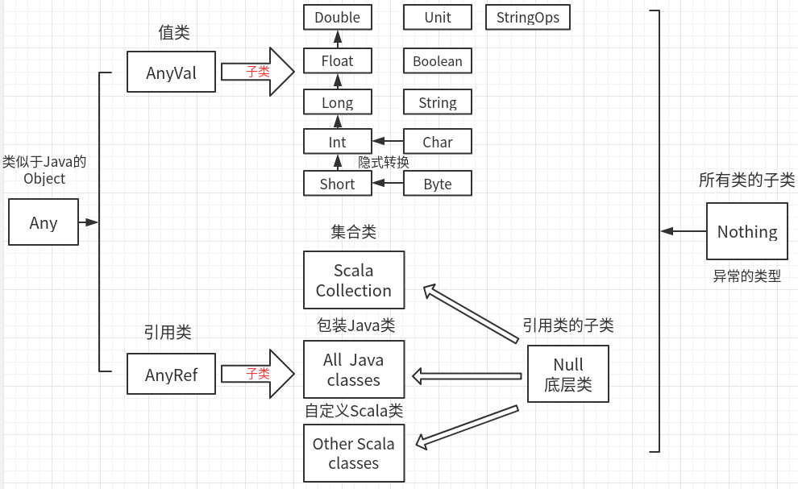

# Scala

## Hello World

要运行一个Scala程序，必须提供一个独立对象名称

执行方法：

1. scalac 编译—》scala 执行
2. scala 直接执行

```scala
object HelloWorld {
  def main(args: Array[String]): Unit = {
    System.out.println("Hello World")
  }
}
```

## 数据类型

- AnyVar值类型：Byte、Short、Int、Long、Float、Double、Char、String、Boolean、Unit( )
- AnyRef引用类型：Scala Collection(集合类)、Java classes(包装Java类)、用户自定义类

可以直接赋值，也可以声明类型

```scala
scala> var c:Int = 1
c: Int = 1
scala> var c = 1
c: Int = 1
```

### 数据体系一览



- Scala有一个根类型—Any；可以理解为Java的Object
- Scala一切皆为对象：
  - AnyVal（值类型）：支持隐式转换：低精度向高精度值；
  - AnyRef（引用类型）
- Null类型，只有一个值—null；Null是所有AnyRef类型的子类，是一个底层类
- Nothing类：底层类，是所有类的子类；可以将Nothing类的值，返回给任意变量或者函数，多用于抛出异常；

### 整形

- 字面量默认Int类型，其他需要声明

- 支持十进制和十六进制

- Long：L结尾

```scala
scala> val hex = 0xff
hex: Int = 255

scala> val pro = 0xADL
pro: Long = 173

scala> var litt : Short = 123
litt: Short = 123

scala> var be : Byte = 13
be: Byte = 13
```

### 浮点数

- 默认Double类型，Float类型需要声明：小数点后6位，超过四舍五入；

- 支持科学计数法：整数+小数+E

```scala
scala> val big = 11.23e2
big: Double = 1123.0
```

### 字符类型

- 2字节
- 赋值整数，输出对应'Unicode'码

```scala
scala> var ch :Char = 97
ch: Char = a

scala> var b:Char=97+1
b: Char = b
scala> var b:Char='a'+1
b: Char = b
```

### 字符串插值和格式化

插值器：s(" ")

表示s内部是一个表达式

```scala
scala> var name = "rea"
scala> println(s"hello,$name!")
hello,rea!

scala> s"answer is ${9*9}"
res2: String = answer is 81
```

### 操作符即方法


## Object

Scala把Java的静态对象和实例对象分离开来。

Object文件，即静态对象。

Class文件，即普通对象。

HelloWorld.Scala称为伴生对象，即一个对象。可以理解为Java静态对象。

```scala
object HelloWorld {
  def main(args: Array[String]): Unit = {
    System.out.println("Hello  World")
  }
}
```

```shell
$ scalac HelloWorld.scala
```

文件会被编译为两个.class文件HelloWorld.scala和HelloWorld$.class

这两个文件，可以反编译为Java文件

运行流程：

1. 先从HelloWorld.scala中的main方法执行
2. main方法调用HelloWorld$.class中的类方法：HelloWorld$.MODULE$。main

反编译：

```java
// HelloWorld.scala
public class HelloWorld{
    public static void main(String[] paramArrayOfString){
        HelloWorld.MODULE$.main(paramArrayOfString);
    }
}
// HelloWorld$.class
final class HelloWorld${
    public static final HelloWorld MODULE$;
    static{
        MODULE$ = new HelloWorld$();
    }
    public void main(String[] args){
        System.out.println("Hello  World")
    }
}
```

- Object HelloWorld 对应是一个HelloWorld$的一个静态对象；
- 可以认为是HelloWorld$的单例；


# Scala下划线总结

https://blog.csdn.net/qq_41455420/article/details/79440164


