# Spark

## Spark角色

### Driver

创建SparkContext（spark上下文对象）的应用程序（或者说main函数）称为Driver；

功能：创建RDD、进行RDD的转化操作、行动操作代码的运行。（除了算子操作，Driver都干）

- 将用户程序转化为job；
- 跟踪Executor的运行状况；
- 为执行器节点调度任务；
- UI显示运行状况；

### Executor

所有算子的执行，都由Executor执行；

并且：仅执行算子操作，其余都由Driver执行。

- 负责运行Spark应用的某一个任务，结果返回给Driver；
- 可以为RDD提供内存存储；

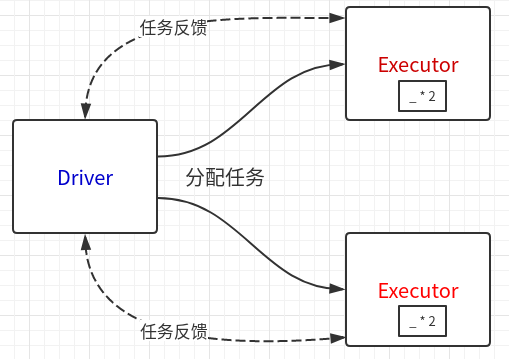

## Spark三种模式

|    模式    | Spark安装机器数 |  需启动的进程  | 所属者 |
| :--------: | :-------------: | :------------: | :----: |
|   Local    |        1        |       无       | Spark  |
| Standalone |        3        | Master、Worker | Spark  |
|    Yarn    |        1        |   Yarn、HDFS   | Hadoop |

### local模式：

- local[k]：自定义k个线程数；
- local[*]：根据Cpu数量自行定义；

不需要配置环境，直接解压执行 自带的实例jar包

local模式：计算Pi

```shell
$ bin/spark-submit --class org.apache.spark.examples.SparkPi --executor-memory 1G --total-executor-cores 2 examples/jars/spark-examples_2.11-2.3.1.jar 
100
```
### yarn模式
有下面两种模式,，通过`--deploy-mode`参数配置

- yarn-client
- yarn-cluster

如果是集群，下面配置，每台机器都要改；（配置完重启hadoop集群！）

（1）修改hadoop下的yarn-site.xml，添加下面两个配置：

```xml
<property>
    <name>yarn.nodemanager.pmem-check-enabled</name>
    <value>false</value>
</property>
<property>
    <name>yarn.nodemanager.vmem-check-enabled</name>
    <value>false</value>
</property>
```

（2）修改spark-env.sh，添加如下配置

```shell
YARN_CONF_DIR=/home/whr/workbench/hadoop/etc/hadoop
```

yarn-client模式执行wordcount

```shell
$ bin/spark-submit --class org.apache.spark.examples.SparkPi --master yarn --deploy-mode client examples/jars/spark-examples_2.11-2.3.1.jar 100
```

Spark提交任务到Yarn流程：

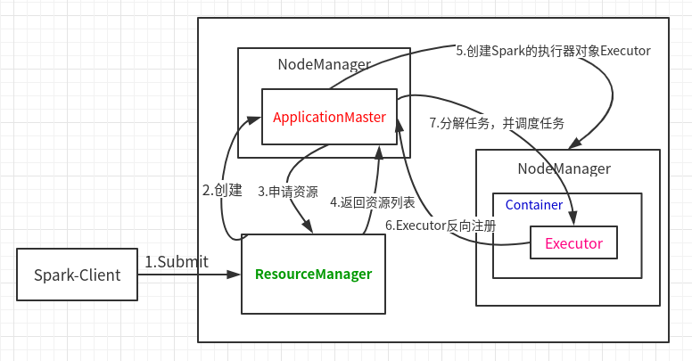

- Spark-Client提交任务到Yarn的ResourceManager

- ResourceManager在某一个或几个NodeMagager中创建ApplicationMaster

- ApplicationMaster被创建出来，就向ResourceManager申请任务的资源

  （**这里资源就是我需要Container来虚拟内存、Cpu来执行任务，需要创建Executor来执行任务**）

- ResourceManager就返回可以执行任务的资源列表；

- 然后ApplicationMaster就找到一个或多个NodeManager来创建Spark的执行器Executor；

- Executor被创建出来，就向ApplicationMaster反向注册，表示自己准备完毕；

- ApplicationMaster分解任务，分配给Executor执行；

### Standalone模式：

独立部署模式，只用Spark，不用Yarn，可以说是Spark的集群模式；

构建一个由Master+Slave构成的Spark集群，任务在集群中运行；

需要如下配置：（三台机器都要配置）

（1）spark-env.sh

```SHELL
# YARN_CONF_DIR=/home/whr/workbench/hadoop/etc/hadoop
export JAVA_HOME=/home/whr/workbench/jdk1.8
export SCALA_HOME=/home/whr/workbench/scala
export SPARK_MASTER_IP=178.168.3.47	# 注意，这里最好配ip，不然可能UI界面看不到Worker
SPARK_MASTER_HOST=178.168.3.47
SPARK_MASTER_PORT=7077
export SPARK_WORKER_CORES=2
export SPARK_WORKER_MEMORY=1g
```

（2）slaves

```shell
slave1
slave2
```

然后启动集群，不需要hadoop

```shell
~/workbench/spark/sbin$ ./start-all.sh
```

可以用jps命令查看进程：

master节点在运行过程中的进程如下：（因为slaves文件中，也配置了master，所以也有Worker）

```shell
17633 org.apache.spark.executor.CoarseGrainedExecutorBackend	# executor
15845 org.apache.spark.deploy.worker.Worker	# Worker
17549 org.apache.spark.deploy.SparkSubmit	# SparkSubmit
```

slave1、slave2：

```shell
$ jps
1371 Jps
1326 Worker
```

案例启动：

```shell
$ bin/spark-submit \
--class org.apache.spark.examples.SparkPi \
--master spark://master:7077 \
--executor-memory 1G \
--total-executor-cores 2 \
examples/jars/spark-examples_2.11-2.3.1.jar 100
```

图解各个步骤：

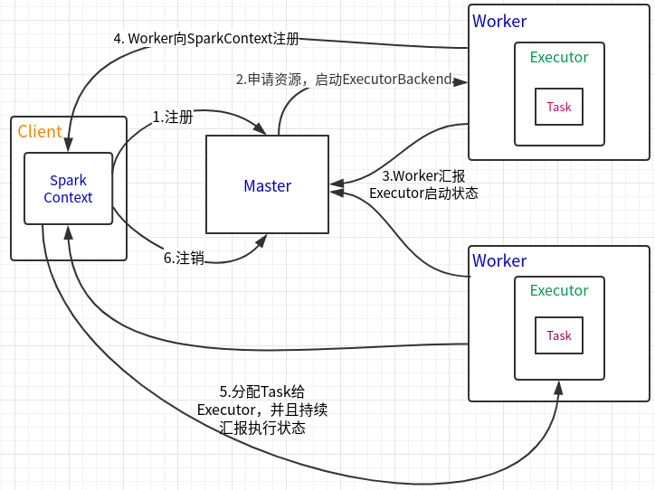

### WordCount

在spark-shell下用scala写WordCount（Local模式）

如果用集群模式：textFile需要写HDFS地址

```scala
sc		// org.apache.spark.SparkContext上下文对象
.textFile("input")		// [String]读取本地数据，返回String，即每行的字符串
.flatMap(_.split(" "))	// [String]分割上一步，每行以空格分割（扁平化）
.map((_,1))			// [(String, Int)]生成（key-value）分割后的每个单词，计次<"hello",1>
.reduceByKey(_+_)	// [(String, Int)]相同key聚合<"hello",5>
.collect				
// 最后结果：Array[(String, Int)] = Array((scala,1), (world,1), (hello,5), (spark,3))
```

wordcount流程：

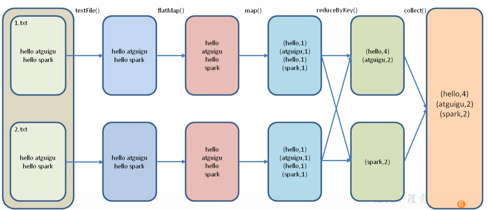

scala的WordCount

```scala
import org.apache.spark.rdd.RDD
import org.apache.spark.{SparkConf, SparkContext}
/**
  * Spark下scala写wordcount
  * local模式
  */
object WordCount {
  def main(args: Array[String]): Unit = {
    /**
      * SparkConf对象，配置spark框架的部署环境
      * master：ip，默认local
      * AppName：app id
      */
    val config: SparkConf = new SparkConf().setMaster("local[*]").setAppName("WordCount")
    /**
      * 1.创建Spark上下文对象sc
      * 2.testFile:读取文件
      * 3.flatMap:扁平化：分解每行String
      * 4.map:数据转化为tuple(key,value)形式
      * 5.reduceByKey:相同key聚合
      */
    val sc = new SparkContext(config)
    val lines: RDD[String] = sc.textFile("src/main/scala/Spark/WordCount/input/")
    val words: RDD[String] = lines.flatMap(_.split(" "))
    val wordToOne: RDD[(String, Int)] = words.map((_, 1))
    val wordToSum: RDD[(String, Int)] = wordToOne.reduceByKey(_ + _)
    val result: Array[(String, Int)] = wordToSum.collect()
    result.foreach(println)
  }
}
```

## Spark数据结构

- RDD：分布式数据集

- 广播变量（BroadcastVariable）：分布式**只读**共享变量

  所有Executor都可以读的共享变量；

- 累加器（Accumulator）：分布式**只写**共享变量

  所有Executor都可以写的共享变量；并且该变量只能够增加；

  只有Driver可以获得累加器的值，Executor只能对其执行增加操作，

### 累加器

为什要用累加器？

如果想在Task计算的时候，统计某些数量，使用累加器是一个方便的方法；

让Partition的数据返回Driver

累加器对象：sc.longAccumulator返回一个累加器对象；

```scala
val accumulator: LongAccumulator = sc.longAccumulator
```

### 广播变量

共享只读变量，是一种调优策略；

高效分发较大的对象给所有的工作节点；

# RDD

装饰者模式

JavaIO—装饰者模式的体现

```java
InputStream in = new FileInputStream("xxxxxxxx")
Reader reader = new BufferReader(new InputStreamReader( in , "UTF-8"))
```

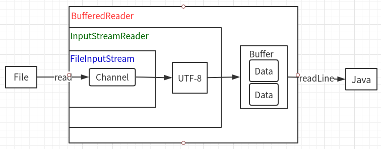

同样，RDD也运用了装饰者模式

```scala
val sc = new SparkContext(config)
val lines: RDD[String] = sc.textFile("input")
val words: RDD[String] = lines.flatMap(_.split(" "))
val wordToOne: RDD[(String, Int)] = words.map((_, 1))
val wordToSum: RDD[(String, Int)] = wordToOne.reduceByKey(_ + _)
val result: Array[(String, Int)] = wordToSum.collect()
```

**RDD的封装逻辑**：

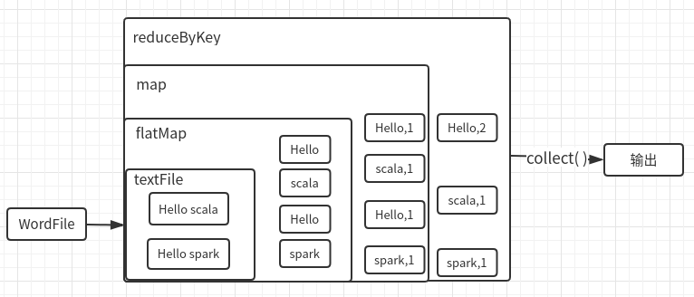

## RDD概述

RDD（Resilient Distributed Dataset）—**弹性分布式数据集**；

它将Spark的计算过程进行了抽象封装；

代表着一个**不可变**（数据在处理过程中不可修改），**可分区**（将数据分区，分配给不同Executor执行，为并行计算提供前提），内部元素可以**并行计算**的集合；

#### RDD属性

- RDD数据集的基本组成单位：一组分区；（分区是为了能够分配给不同的任务，并行计算）

- 每个分区有一个计算函数；

- RDD存在依赖关系；比如WordCount的封装逻辑，层层封装，依次依赖；（血缘）

- 分片函数：Partitioner；有两种：基于哈希的HashPartitioner；基于范围的RangePartitioner。

  分片函数决定了RDD的分片数量；

- 有一个列表，存储着每个分区的**优先位置**；

  比如说：存在多个Executor，现在有一个任务，应该先分配给谁，这里就存在优先级，

  如果分区的数据在DataNode1中，那么会优先讲此分区任务分配给DataNode1的Executor；

  **移动数据不如移动计算原则**：尽量不移动数据的位置，数据在哪就把计算任务给最近的位置的Executor

#### RDD特点

- RDD表示只读分区的数据集，不可变；

- 对RDD的改动，只能通过RDD的转换操作（参照WordCount），即由一个RDD得到一个新的RDD；
- 数据按key进行分区；

- RDDs之间存在有依赖关系，可以说是血缘关系；

- 但是如果血缘关系太长，即层层依赖过长，可以通过持久化操作（持久到磁盘）切断血缘关系；

#### 缓存

如果进程中，多次使用同一个RDD，可以将该RDD缓存起来；

之后要用到该RDD时，直接从缓存中取数据，不需要再从上层血缘计算得到。

缓存在HDFS；

## RDD创建

创建的三种方式：

1. 从集合中创建RDD；

   提供两个函数：parallelize、makeRDD

   ```scala
   // makeRDD底层调用了parallelize方法
   def makeRDD[T: ClassTag](
       seq: Seq[T],
       numSlices: Int = defaultParallelism): RDD[T] = withScope {
       parallelize(seq, numSlices)
   }
   // defaultParallelism是有默认值的
   ```

   ```scala
   def parallelize[T: ClassTag](
       seq: Seq[T],
       numSlices: Int = defaultParallelism): RDD[T] = withScope {
       assertNotStopped()
       new ParallelCollectionRDD[T](this, seq, numSlices, Map[Int, Seq[String]]())
   }
   ```

   defaultParallelism到底是多少？

   ```scala
   override def defaultParallelism(): Int = {
       conf.getInt("spark.default.parallelism", math.max(totalCoreCount.get(), 2))
   }
   // 可以知道，分区数，是并行线程数决定的 。
   ```

2. 从外部存储中创建RDD；

   比如：WordCount从文件中读取数据创建RDD：textFile（"xxxxx", 3）

   这里"xxxxxx"为文件地址；3：为分区数；本质上是Hadoop的MR操作

   这里的分区，是与Hadoop的MapReduce的切片规则一致的。

   ```scala
   def textFile(
       path: String,
       minPartitions: Int = defaultMinPartitions): RDD[String] = withScope {
       assertNotStopped()
       hadoopFile(path, classOf[TextInputFormat], classOf[LongWritable], classOf[Text],
                  minPartitions).map(pair => pair._2.toString).setName(path)
   }
   ```

3. 从其他RDD创建新的RDD；

## RDD任务划分

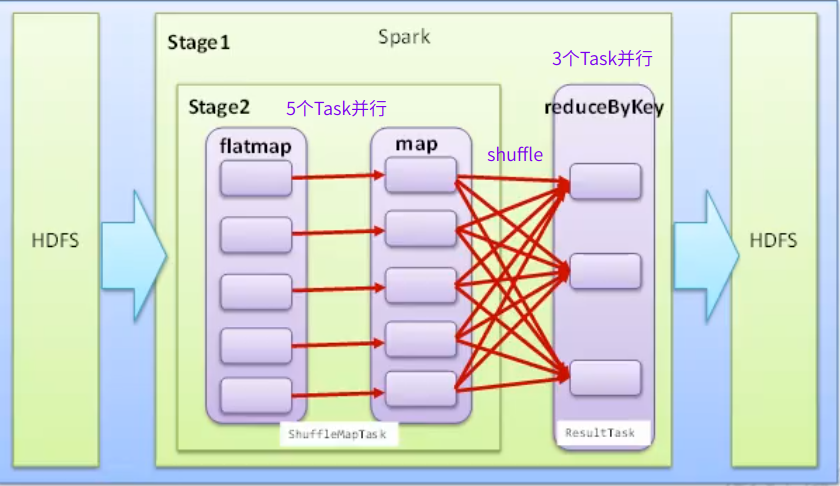

- Application：初始化一个SparkContext，即生成一个Application；

- Job：一个Action生成一个Job；

- Stage：根据RDD的依赖关系不同，将Job划分成不同的Stage，每遇到一个宽依赖，划分一个Stage；

  stage（阶段）= 1 + （shuffle个数）

  shuffle是一种宽依赖；shuffle是需要等待所有分区一起shuffle完成，才能进入下一个阶段的。

  窄依赖不需要等待，一对一；

- Task：一个Stage是一个TaskSet（任务集）

  Task任务个数，取决于当前Stage的最后阶段的分区个数；

```
每层任务都是1对多的关系：
Application-->Job-->Stage-->Task
一个Application有多个Job；一个Job有多个Stage；一个Stage有多个Task；
```

可以从UI界面看到Stage的有向无环图；

## RDD缓存

RDD通过persist方法或cache方法（这是两个缓存算子），将计算结果缓存；

默认persist会把数据以序列化的形式缓存在JVM的Heap中；

#### 缓存级别

默认缓存级别是在内存中存一份；

Spark的缓存级别在StorageLevel类中定义：

```scala
object StorageLevel {
  val NONE = new StorageLevel(false, false, false, false)	// 不缓存
  val DISK_ONLY = new StorageLevel(true, false, false, false)	// 只放到磁盘
  val DISK_ONLY_2 = new StorageLevel(true, false, false, false, 2) // _2 表示存两份
  val MEMORY_ONLY = new StorageLevel(false, true, false, true)	// 只放到内存
  val MEMORY_ONLY_2 = new StorageLevel(false, true, false, true, 2)	
  val MEMORY_ONLY_SER = new StorageLevel(false, true, false, false)	//序列化
  val MEMORY_ONLY_SER_2 = new StorageLevel(false, true, false, false, 2)	//
  val MEMORY_AND_DISK = new StorageLevel(true, true, false, true)	// 
  val MEMORY_AND_DISK_2 = new StorageLevel(true, true, false, true, 2)	//
  val MEMORY_AND_DISK_SER = new StorageLevel(true, true, false, false)	//
  val MEMORY_AND_DISK_SER_2 = new StorageLevel(true, true, false, false, 2)	//
  val OFF_HEAP = new StorageLevel(true, true, true, false, 1)	
    // 使用堆外内存，即OS内存，释放速度快，因为GC不一定马上释放内存
```

#### RDD缓存容错

通过缓存，防止数据丢失或者Task失败；可以从缓存中拿到数据，重新计算

```scala
val sRDD=sc.makeRDD(List("scala"))
val mRDD=sRDD.map((_.toString+System.currentTimeMillis)).cache	// 拼接系统时间
scala> mRDD.collect
res5: Array[String] = Array(scala1570090360570)	// 缓存下来的数据，是固定的
```

打印血缘关系，发现，在makeRDD和map之间多了一个CachedPartitions

将中间结果，存在了Cache，可以提高效率；

- 此Cache是在内存中，不会打断血缘；**内存不被认为是安全的**；

```scala
scala> mRDD.toDebugString	
res6: String =
(4) 
MapPartitionsRDD[5] at map at <console>:25 [Memory Deserialized 1x Replicated]
 | CachedPartitions: 4; MemorySize: 152.0 B; ExternalBlockStoreSize: 0.0 B;DiskSize:0.0 B
 | ParallelCollectionRDD[3] at makeRDD at <console>:24 [Memory Deserialized 1x Replicated]
```

#### RDD CheckPoint

检查点：持久化到磁盘操作；打断血缘

持久化之后的数据，比较安全，就会删除之前的血缘；

```scala
sc.setCheckpointDir("/RDD/checkpoint")				// 设置持久化地址，这里是持久化到HDFS
val rdd =sc.makeRDD(Array("hello","scala","hello"))	//生成RDD
val mapRDD=rdd.map((_,1))							// map
mapRDD.checkpoint()									// 将sRDD持久化
val resRDD=mapRDD.reduceByKey(_+_)					// 将持久化后的RDD继续转换
// 查看血缘关系
scala> resRDD.toDebugString							
res3: String =
(4) ShuffledRDD[2] at reduceByKey at <console>:25 []
 +-(4) MapPartitionsRDD[1] at map at <console>:25 []
    |  ReliableCheckpointRDD[3] at collect at <console>:26 []
// 这里血缘关系已经被打断了，只记录了map和reduce
//CheckpointRDD这里替代了makeRDD
```

## RDD数据分区器

Spark支持Hash分区（默认分区）和Range分区；

并且只有Key-Value类型RDD才有分区器；

分区器直接决定了

1. 分区个数
2. shuffle之后，每条数据归于哪个分区
3. Reduce的个数

```scala
scala> resRDD.partitioner
res12: Option[org.apache.spark.Partitioner] = Some(org.apache.spark.HashPartitioner@4)
```

#### Hash分区

存在分区弊端：

可能导致数据倾斜；某些分区数据量大大超过别的分区，别的分区执行完毕，还要等待大分区执行；

#### Range分区

使用此分区，前提：数据可排序比较；

会尽量保证数据量的均匀，并且分区之间是有序的：1分区：{a,b,c}，2分区：{d,e,f}；分区之间是排序的；

#### 自定义分区

自定义类实现org.apache.spark.Partitioner，并实现三个方法：

- numPartitions：[Int]：返回创建的分区数
- getPartition(Key : Any)：[Int]：返回给定Key的分区编号；
- equals( )：分区器对象的equals方法，spark内部会比较两个分区是否一样；

# RDD算子

Spark中的所有RDD方法，称为算子。

分为：

- 转换算子（Transformation）：完成作业中间过程的处理，还可以细分为两类：
  - Value数据Transformation
  - （Key-Value）数据Transformation
- 行动算子（Action）：会触发SparkContext提交job作业

## 转换算子Transform

### Value类型

按输入的分区，输出的分区数量的差异划分：

（1）一对一

- map
- flatMap
- mapPartitions
- glom

（2）多对一

- union：求多个数据集的并集，不去重；去重用subtract

  ```scala
  val listRDD_1: RDD[Int] = sc.makeRDD(List(1, 2, 3, 4, 5))
  val listRDD_2: RDD[Int] = sc.makeRDD(List(4, 8, 3, 4, 7))
  val unionRDD: RDD[Int] = listRDD_1.union(listRDD_2)
  ```

- cartesian：笛卡尔乘积；少用

（3）多对多

- groupBy

（4）输出分区为输入分区的子集

- filter
- distinct
- subtract：返回两个RDD求差集；
- sample
- takeSample

（5）Cache型(RDD缓存算子)

- cache：底层调用persist；
- persist：把数据以序列化的形式缓存在JVM的Heap中；

### Key-Value类型

（1）一对一

- mapValues

（2）对单个RDD聚合

- combineByKey
- reduceByKey：按key聚合，存在shuffle，在shuffle之前存在预聚合
- partitionBy：重新分区

（3）对两个RDD聚合

- Cogroup

（4）链接

- join
- leftOutJoin
- rightOutJoin

## 行动算子Action

collect算子的源码：

```scala
def collect(): Array[T] = withScope {
    val results = sc.runJob(this, (iter: Iterator[T]) => iter.toArray)
    Array.concat(results: _*)
}
```

Action算子一定会触发sc.runJob

按输入输出位置和结果类型来分类

（1）无输出

- foreach

（2）HDFS

- saveAsTextFile
- saveAsObject

（3）Scala集合类型

- collect 
- collectAsMap
- reduceByKeyLocally
- lookup
- count
- top
- reduce
- fold
- aggregate

##　foreach算子

如果需要将RDD的数据存入数据库：

错误代码（1）：

```scala
dstream.foreachRDD { rdd =>
  val connection = createNewConnection()  // executed at the driver
  rdd.foreach { record =>
    connection.send(record) // executed at the worker
  }
}
```

- 上面代码，在每一个RDD中进行创建连接，是创建在了Driver中，每个woker节点中并没有连接对象

错误代码（2）：

```scala
dstream.foreachRDD { rdd =>
  rdd.foreach { record =>
    val connection = createNewConnection()
    connection.send(record)
    connection.close()
  }
}
```

- 在每一个RDD下的每条记录中创建Connection是极其耗费资源的；

正确代码：使用`foreachPartition`

```scala
dstream.foreachRDD { rdd =>
  rdd.foreachPartition { partitionOfRecords =>
    val connection = createNewConnection()	 
    partitionOfRecords.foreach(record => connection.send(record))
    connection.close()
  }
}
```

- 针对每一个RDD下的每一个Partition，创建Connection对象，即：在每一个Worker中创建连接；

```scala
dstream.foreachRDD { rdd =>
  rdd.foreachPartition { partitionOfRecords =>
    val connection = ConnectionPool.getConnection()
    partitionOfRecords.foreach(record => connection.send(record))
    ConnectionPool.returnConnection(connection)
  }
}
```

# SparkSQL

早期统计数据的方式：MapReduce、SQL

但是MR弊端太多，实现复杂，SQL方便，但是面对关系型数据库受限；

Hive的出现，使用类SQL语言（HQL）封装了MR的复杂逻辑，极大简化了MR的复杂度，提升了开发速度；

但是，Spark觉得MR还是太慢，于是Spark模仿Hive执行MR，出现了SparkSQL执行RDD。

------

RDD没有数据结构，为了能够使用类SQL处理RDD数据，Spark进一步将RDD进行封装，提供了两个抽象结构：

- DataFrame
- DataSet

也就是说DataFrame、DataSet底层都是RDD，执行方式是：**将SparkSQL转换成RDD，提交集群**；

三者的关系：

RDD(底层数据)===封装数据结构===>DataFrame===封装类和属性===>DataSet

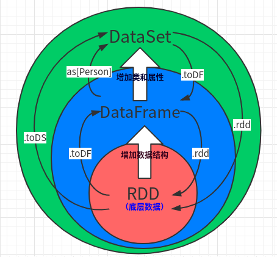

## DataFrame

RDD还是那个RDD，DataFrame为RDD提供了一个**Schema视图**；为RDD的数据提供了结构

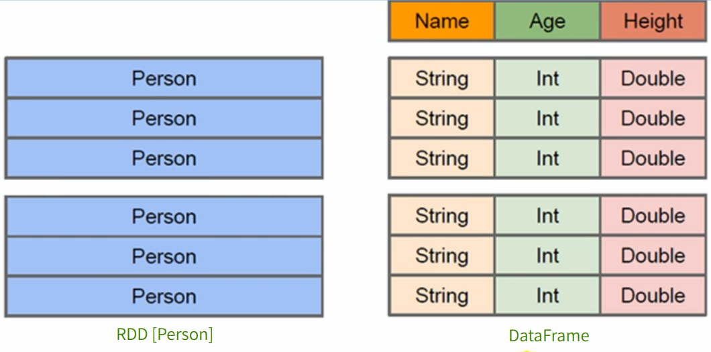

### 转换

三种结构的相互转换：

```scala
/**
    * rdd,DF,DS之间的转换
    * 转换需要隐式转换对象(扩展功能)
    */
def main(args: Array[String]): Unit = {
    val sparkConf = new SparkConf().setMaster("local[*]").setAppName("SparkSQL")
    val ss: SparkSession = SparkSession.builder().config(sparkConf).getOrCreate()
    // 引入隐式转换对象
    import ss.implicits._
    // SparkSession也能创建RDD,因为DataFrame底层就是RDD
    val rdd: RDD[(Int, String, Int)] = ss.sparkContext.makeRDD(List((1,"zhangsan",12),(2,"lisi",17),(3,"quin",17)))
    // rdd===>DF
    val df: DataFrame = rdd.toDF("id","name","age")
    // DF====>DS：需要一个与表名对应的class，类似于JavaBean
    val ds: Dataset[User] = df.as[User]
    // DS====>DF
    val df_1: DataFrame = ds.toDF()
    // DF===>rdd
    val rdd_1: RDD[Row] = df_1.rdd
    /**
      *转换成RDD之后，通过访问索引，访问字段
      */
    rdd_1.foreach(
        row=>{
            println(row.getString(1))
            /*
  返回结果：quin
          zhangsan
          lisi
           */
        }
    )
    ss.stop
}
```

# Spark Streaming

Hadoop的MapReduce及Spark SQL等只能进行离线计算，无法满足实时性要求较高的业务需求，例如实时推荐，实时网站性能分析等，流式计算可以解决这些问题。

目前三种流式计算框架：storm,spark Streaming和Samza

将输入源的数据，通过Spark的抽象方法：mao、reduce、join、window等进行计算；

结果可以保存入HDFS、数据库等；

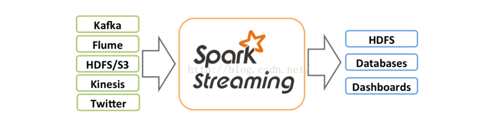

## DStream

DStream高度抽象的离散流；

DStream本质上表示RDD的序列。任何对DStream的操作都会转变为对底层RDD的操作。

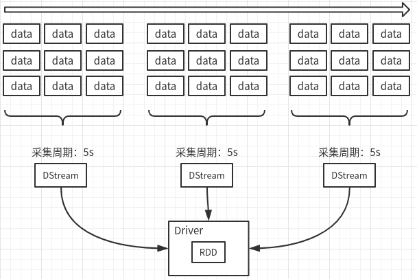

## SS整合Flume

### （1）Push

Flume从netcat中读到数据，通过sink传递给SparkStreaming

1. 导入依赖

   ```xml
   1. spark-core
   2. flume
   3. spark-streaming-flume_2.11 
   4. spark-streaming-flume-sink_2.11
   ```

2. Flume配置：

   ```properties
   # Flume push到Streaming
   a1.sources = r1
   a1.channels = c1
   a1.sinks = k1
   # nc localhost 9999输入数据
   a1.sources.r1.type=netcat
   a1.sources.r1.bind=localhost
   a1.sources.r1.port=9999
   # sink将数据从8888端口输出给SparkStreaming
   a1.sinks.k1.type = avro
   a1.sinks.k1.hostname = master
   a1.sinks.k1.port = 8888
   a1.channels.c1.type = memory
   a1.channels.c1.capacity = 1000
   a1.channels.c1.transactionCapacity=100
   a1.sources.r1.channels=c1
   a1.sinks.k1.channel=c1
   ```

3. 编写代码

   ```scala
   object FlumePushWordCount {
     def main(args: Array[String]): Unit = {
       val sparkConf: SparkConf = new SparkConf().setMaster("local[*]").setAppName("FlumePushWordCount")
       val ssc = new StreamingContext(sparkConf,Seconds(5))
       val flumeStream: ReceiverInputDStream[SparkFlumeEvent] = FlumeUtils.createStream(ssc,"master",8888)
       flumeStream.map(x=> new String(x.event.getBody().array()).trim)
           .flatMap(_.split(" ")).map((_,1)).reduceByKey(_+_).print()
       ssc.start()
       ssc.awaitTermination()
     }
   }
   ```

4. 先启动SparkStreaming程序，再启动Flume，再启动netcat，从netcat输入数据

   Flume的RpcClient启动前提，对应端口要先被监听，所以需要先启动应用程序
   
   ```shell
   ./bin/flume-ng agent --conf conf --conf-file ./conf/demo/flume-push-SparkStreaming.conf --name a1 -Dflume.root.logger=INFO,console
   ```

### （2）Pull

1. Flume配置

   ```properties
   # Flume push到Streaming
   a1.sources = r1
   a1.channels = c1
   a1.sinks = k1
   # nc localhost 9999输入数据
   a1.sources.r1.type=netcat
   a1.sources.r1.bind=localhost
   a1.sources.r1.port=9999
   # 使用SparkSink
   a1.sinks.k1.type = org.apache.spark.streaming.flume.sink.SparkSink
   a1.sinks.k1.hostname = master
   a1.sinks.k1.port = 8888
   a1.channels.c1.type = memory
   a1.channels.c1.capacity = 1000
   a1.channels.c1.transactionCapacity=100
   a1.sources.r1.channels=c1
   a1.sinks.k1.channel=c1
   ```

2. 编写scala代码

   ```scala
   FlumeUtils的 createStream改为createPollingStream
   ```

3. 先启动Flume，后启动SparkStreaming，再启动netcat

   ```shell
   ./bin/flume-ng agent --conf conf --conf-file ./conf/demo/flume-pull-SparkStreaming.conf --name a1 -Dflume.root.logger=INFO,console
   ```
   
   
   
   