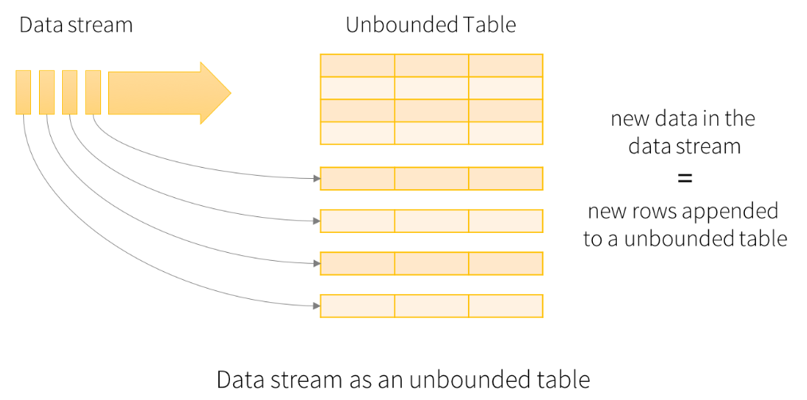
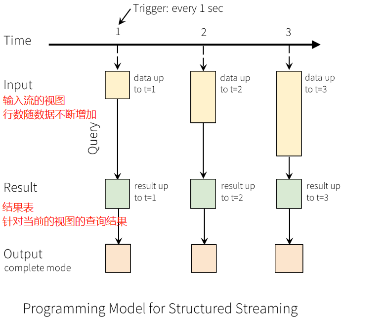
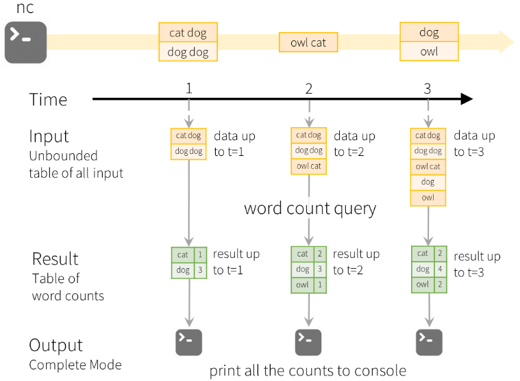

# Spark

## Spark运行流程


### SparkContext

Spark 应用程序的入口，负责调度各个运算资源，协调各个 Worker，Node 上的 Executor

### Driver

创建SparkContext（spark上下文对象）的应用程序（或者说main函数）称为Driver；

功能：创建RDD、进行RDD的转化操作、行动操作代码的运行。（除了算子操作，Driver都干）

- 将用户程序转化为job；
- 跟踪Executor的运行状况；
- 为执行器节点调度任务；
- UI显示运行状况；

### Executor

所有算子的执行，都由Executor执行；

并且：仅执行算子操作，其余都由Driver执行。

- 负责运行Spark应用的某一个任务，结果返回给Driver；
- 可以为RDD提供内存存储；

### Worker Node

集群中任何可以运行Application代码的节点，运行一个或多个Executor进程

## Spark Application

### Stage

Spark任务会根据**RDD之间的依赖关系，形成一个DAG有向无环图**，DAG会提交给DAGScheduler，DAGScheduler会把DAG划分相互依赖的多个stage，划分stage的依据就是RDD之间的宽窄依赖。**遇到宽依赖就划分stage**,每个stage包含一个或多个task任务。然后将这些task以taskSet的形式提交给**TaskScheduler运行**。 

### Task

一个分区对应一个Task，Task执行RDD中对应Stage中包含的算子。Task被封装好后放入Executor的线程池中执行

## Spark三种模式

|    模式    | Spark安装机器数 |  需启动的进程  | 所属者 |
| :--------: | :-------------: | :------------: | :----: |
|   Local    |        1        |       无       | Spark  |
| Standalone |        3        | Master、Worker | Spark  |
|    Yarn    |        1        |   Yarn、HDFS   | Hadoop |

### local模式：

- local[k]：自定义k个线程数；
- local[*]：根据Cpu数量自行定义；

不需要配置环境，直接解压执行 自带的实例jar包

local模式：计算Pi

```shell
$ bin/spark-submit --class org.apache.spark.examples.SparkPi --executor-memory 1G --total-executor-cores 2 examples/jars/spark-examples_2.11-2.3.1.jar 
100
```
### yarn模式
有下面两种模式,，通过`--deploy-mode`参数配置

- yarn-client
- yarn-cluster

如果是集群，下面配置，每台机器都要改；（配置完重启hadoop集群！）

（1）修改hadoop下的yarn-site.xml，添加下面两个配置：

```xml
<property>
    <name>yarn.nodemanager.pmem-check-enabled</name>
    <value>false</value>
</property>
<property>
    <name>yarn.nodemanager.vmem-check-enabled</name>
    <value>false</value>
</property>
```

（2）修改spark-env.sh，添加如下配置

```shell
YARN_CONF_DIR=/home/whr/workbench/hadoop/etc/hadoop
```

yarn-client模式执行wordcount

```shell
$ bin/spark-submit --class org.apache.spark.examples.SparkPi --master yarn --deploy-mode client examples/jars/spark-examples_2.11-2.3.1.jar 100
```

Spark提交任务到Yarn流程：


- Spark-Client提交任务到Yarn的ResourceManager

- ResourceManager在某一个或几个NodeMagager中创建ApplicationMaster

- ApplicationMaster被创建出来，就向ResourceManager申请任务的资源

  （**这里资源就是我需要Container来虚拟内存、Cpu来执行任务，需要创建Executor来执行任务**）

- ResourceManager就返回可以执行任务的资源列表；

- 然后ApplicationMaster就找到一个或多个NodeManager来创建Spark的执行器Executor；

- Executor被创建出来，就向ApplicationMaster反向注册，表示自己准备完毕；

- ApplicationMaster分解任务，分配给Executor执行；

### Standalone模式：

独立部署模式，只用Spark，不用Yarn，可以说是Spark的集群模式；

构建一个由Master+Slave构成的Spark集群，任务在集群中运行；

需要如下配置：（三台机器都要配置）

（1）spark-env.sh

```SHELL
export JAVA_HOME=/home/whr/workbench/jdk1.8
export SCALA_HOME=/home/whr/workbench/scala
export SPARK_MASTER_IP=178.168.3.47	# 注意，这里最好配ip，不然可能UI界面看不到Worker
export SPARK_MASTER_PORT=7077
export SPARK_WORKER_CORES=2
export SPARK_WORKER_MEMORY=1g
```

（2）slaves

```shell
slave1
slave2
```

然后启动集群，不需要hadoop

```shell
~/workbench/spark/sbin$ ./start-all.sh
```

可以用jps命令查看进程：

master节点在运行过程中的进程如下：（因为slaves文件中，也配置了master，所以也有Worker）

```shell
17633 org.apache.spark.executor.CoarseGrainedExecutorBackend	# executor
15845 org.apache.spark.deploy.worker.Worker	# Worker
17549 org.apache.spark.deploy.SparkSubmit	# SparkSubmit
```

slave1、slave2：

```shell
$ jps
1371 Jps
1326 Worker
```

案例启动：

```shell
$ bin/spark-submit \
--class org.apache.spark.examples.SparkPi \
--master spark://master:7077 \
--executor-memory 1G \
--total-executor-cores 2 \
examples/jars/spark-examples_2.11-2.3.1.jar 100
```

### WordCount

在spark-shell下用scala写WordCount（Local模式）

如果用集群模式：textFile需要写HDFS地址

```scala
sc		// org.apache.spark.SparkContext上下文对象
.textFile("input")		// [String]读取本地数据，返回String，即每行的字符串
.flatMap(_.split(" "))	// [String]分割上一步，每行以空格分割（扁平化）
.map((_,1))			// [(String, Int)]生成（key-value）分割后的每个单词，计次<"hello",1>
.reduceByKey(_+_)	// [(String, Int)]相同key聚合<"hello",5>
.collect				
// 最后结果：Array[(String, Int)] = Array((scala,1), (world,1), (hello,5), (spark,3))
```

wordcount流程：


scala的WordCount

```scala
import org.apache.spark.rdd.RDD
import org.apache.spark.{SparkConf, SparkContext}
/**
  * Spark下scala写wordcount
  * local模式
  */
object WordCount {
  def main(args: Array[String]): Unit = {
    /**
      * SparkConf对象，配置spark框架的部署环境
      * master：ip，默认local
      * AppName：app id
      */
    val config: SparkConf = new SparkConf().setMaster("local[*]").setAppName("WordCount")
    /**
      * 1.创建Spark上下文对象sc
      * 2.testFile:读取文件
      * 3.flatMap:扁平化：分解每行String
      * 4.map:数据转化为tuple(key,value)形式
      * 5.reduceByKey:相同key聚合
      */
    val sc = new SparkContext(config)
    val lines: RDD[String] = sc.textFile("src/main/scala/Spark/WordCount/input/")
    val words: RDD[String] = lines.flatMap(_.split(" "))
    val wordToOne: RDD[(String, Int)] = words.map((_, 1))
    val wordToSum: RDD[(String, Int)] = wordToOne.reduceByKey(_ + _)
    val result: Array[(String, Int)] = wordToSum.collect()
    result.foreach(println)
  }
}
```

## Spark数据结构

- RDD：分布式数据集

- 广播变量（BroadcastVariable）：分布式**只读**共享变量

  所有Executor都可以读的共享变量；

- 累加器（Accumulator）：分布式**只写**共享变量

  所有Executor都可以写的共享变量；并且该变量只能够增加；

  只有Driver可以获得累加器的值，Executor只能对其执行增加操作，

### 累加器

为什要用累加器？

如果想在Task计算的时候，统计某些数量，使用累加器是一个方便的方法；

让Partition的数据返回Driver

累加器对象：sc.longAccumulator返回一个累加器对象；

```scala
val accumulator: LongAccumulator = sc.longAccumulator
```

### 广播变量

共享只读变量，是一种调优策略；

高效分发较大的对象给所有的工作节点；

### RDD

## RDD任务划分


- Application：初始化一个SparkContext，即生成一个Application；

- Job：一个Action生成一个Job；

- Stage：根据RDD的依赖关系不同，将Job划分成不同的Stage，每遇到一个宽依赖，划分一个Stage；

  stage（阶段）= 1 + （shuffle个数）

  shuffle是一种宽依赖；shuffle是需要等待所有分区一起shuffle完成，才能进入下一个阶段的。

  窄依赖不需要等待，一对一；

- Task：一个Stage是一个TaskSet（任务集）

  Task任务个数，取决于当前Stage的最后阶段的分区个数；

```
每层任务都是1对多的关系：
Application-->Job-->Stage-->Task
一个Application有多个Job；一个Job有多个Stage；一个Stage有多个Task；
```

可以从UI界面看到Stage的有向无环图；

# SparkSQL

早期统计数据的方式：MapReduce、SQL

但是MR弊端太多，实现复杂，SQL方便，但是面对关系型数据库受限；

Hive的出现，使用类SQL语言（HQL）封装了MR的复杂逻辑，极大简化了MR的复杂度，提升了开发速度；

但是，Spark觉得MR还是太慢，于是Spark模仿Hive执行MR，出现了SparkSQL执行RDD。

------

RDD没有数据结构，为了能够使用类SQL处理RDD数据，Spark进一步将RDD进行封装，提供了两个抽象结构：

- DataFrame
- DataSet

也就是说DataFrame、DataSet底层都是RDD，执行方式是：**将SparkSQL转换成RDD，提交集群**；

三者的关系：

RDD(底层数据)===封装数据结构===>DataFrame===封装类和属性===>DataSet


## DataFrame

RDD还是那个RDD，DataFrame为RDD提供了一个**Schema视图**；为RDD的数据提供了结构


### 转换

三种结构的相互转换：

```scala
/**
    * rdd,DF,DS之间的转换
    * 转换需要隐式转换对象(扩展功能)
    */
def main(args: Array[String]): Unit = {
    val sparkConf = new SparkConf().setMaster("local[*]").setAppName("SparkSQL")
    val ss: SparkSession = SparkSession.builder().config(sparkConf).getOrCreate()
    // 引入隐式转换对象
    import ss.implicits._
    // SparkSession也能创建RDD,因为DataFrame底层就是RDD
    val rdd: RDD[(Int, String, Int)] = ss.sparkContext.makeRDD(List((1,"zhangsan",12),(2,"lisi",17),(3,"quin",17)))
    // rdd===>DF
    val df: DataFrame = rdd.toDF("id","name","age")
    // DF====>DS：需要一个与表名对应的class，类似于JavaBean
    val ds: Dataset[User] = df.as[User]
    // DS====>DF
    val df_1: DataFrame = ds.toDF()
    // DF===>rdd
    val rdd_1: RDD[Row] = df_1.rdd
    /**
      *转换成RDD之后，通过访问索引，访问字段
      */
    rdd_1.foreach(
        row=>{
            println(row.getString(1))
            /*
  返回结果：quin
          zhangsan
          lisi
           */
        }
    )
    ss.stop
}
```

# Spark Streaming

Hadoop的MapReduce及Spark SQL等只能进行离线计算，无法满足实时性要求较高的业务需求，例如实时推荐，实时网站性能分析等，流式计算可以解决这些问题。

目前三种流式计算框架：storm,spark Streaming和Samza

将输入源的数据，通过Spark的抽象方法：mao、reduce、join、window等进行计算；

结果可以保存入HDFS、数据库等；


## DStream

DStream高度抽象的离散流；

DStream本质上表示RDD的序列。任何对DStream的操作都会转变为对底层RDD的操作。


## SS整合Flume

### （1）Push

Flume从netcat中读到数据，通过sink传递给SparkStreaming

1. 导入依赖

   ```xml
   1. spark-core
   2. flume
   3. spark-streaming-flume_2.11 
   4. spark-streaming-flume-sink_2.11
   ```

2. Flume配置：

   ```properties
   # Flume push到Streaming
   a1.sources = r1
   a1.channels = c1
   a1.sinks = k1
   # nc localhost 9999输入数据
   a1.sources.r1.type=netcat
   a1.sources.r1.bind=localhost
   a1.sources.r1.port=9999
   # sink将数据从8888端口输出给SparkStreaming
   a1.sinks.k1.type = avro
   a1.sinks.k1.hostname = master
   a1.sinks.k1.port = 8888
   a1.channels.c1.type = memory
   a1.channels.c1.capacity = 1000
   a1.channels.c1.transactionCapacity=100
   a1.sources.r1.channels=c1
   a1.sinks.k1.channel=c1
   ```

3. 编写代码

   ```scala
   object FlumePushWordCount {
     def main(args: Array[String]): Unit = {
       val sparkConf: SparkConf = new SparkConf().setMaster("local[*]").setAppName("FlumePushWordCount")
       val ssc = new StreamingContext(sparkConf,Seconds(5))
       val flumeStream: ReceiverInputDStream[SparkFlumeEvent] = FlumeUtils.createStream(ssc,"master",8888)
       flumeStream.map(x=> new String(x.event.getBody().array()).trim)
           .flatMap(_.split(" ")).map((_,1)).reduceByKey(_+_).print()
       ssc.start()
       ssc.awaitTermination()
     }
   }
   ```

4. 先启动SparkStreaming程序，再启动Flume，再启动netcat，从netcat输入数据

   Flume的RpcClient启动前提，对应端口要先被监听，所以需要先启动应用程序
   
   ```shell
   ./bin/flume-ng agent --conf conf --conf-file ./conf/demo/flume-push-SparkStreaming.conf --name a1 -Dflume.root.logger=INFO,console
   ```

### （2）Pull

1. Flume配置

   ```properties
   # Flume push到Streaming
   a1.sources = r1
   a1.channels = c1
   a1.sinks = k1
   # nc localhost 9999输入数据
   a1.sources.r1.type=netcat
   a1.sources.r1.bind=localhost
   a1.sources.r1.port=9999
   # 使用SparkSink
   a1.sinks.k1.type = org.apache.spark.streaming.flume.sink.SparkSink
   a1.sinks.k1.hostname = master
   a1.sinks.k1.port = 8888
   a1.channels.c1.type = memory
   a1.channels.c1.capacity = 1000
   a1.channels.c1.transactionCapacity=100
   a1.sources.r1.channels=c1
   a1.sinks.k1.channel=c1
   ```

2. 编写scala代码

   ```scala
   FlumeUtils的 createStream改为createPollingStream
   ```

3. 先启动Flume，后启动SparkStreaming，再启动netcat

   ```shell
   ./bin/flume-ng agent --conf conf --conf-file ./conf/demo/flume-pull-SparkStreaming.conf --name a1 -Dflume.root.logger=INFO,console
   ```
# Structured Streaming
spark2.0 将要代替DStream的structured streaming

以下内容摘自 spark2.3.1官方文档；



- Structured Streaming将输入数据流视为"输入表"。流上到达的每个数据项都像是将新行附加到输入表中；表的行数随着数据量的增大而增加；


- 对输入的查询将生成"结果表"。 在每个触发间隔（例如，每1秒钟），新行将附加到输入表中，并最终更新结果表。 无论何时更新结果表，我们都希望将更改后的结果行写入外部接收器。
  


- 上图例子

## Input Sources
- File source：读取写入目录的文件作为数据流。 支持的文件格式为text，csv，json，orc，parquet。
- Kafka source：从kafka中读数据
- 


## output mode
参考源码
- Append：每次只将"输入表"中的新行，写入sink，这种模式不能用于聚合；
- Complete：每次都将"输入表"所有行，写入sink，这种方法用于聚合的查询；
- Update：说是，不使用聚合，就跟Append一样，没太懂；