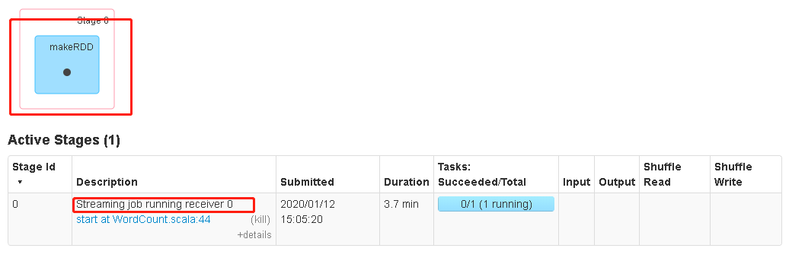
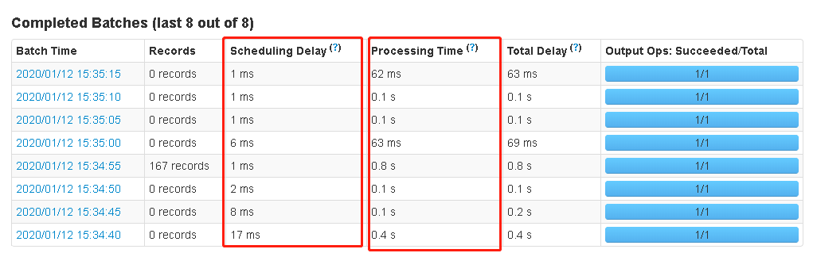

# Spark Streaming

Hadoop的MapReduce及Spark SQL等只能进行离线计算，无法满足实时性要求较高的业务需求，例如实时推荐，实时网站性能分析等，流式计算可以解决这些问题。

目前三种流式计算框架：storm,spark Streaming和Samza

将输入源的数据，通过Spark的抽象方法：mao、reduce、join、window等进行计算；

结果可以保存入HDFS、数据库等；


## DStream

DStream高度抽象的离散流；

DStream本质上表示RDD的序列。任何对DStream的操作都会转变为对底层RDD的操作。


## WordCount

SparkStreaming WordCount例子：

```scala
object WordCount {
  def main(args: Array[String]): Unit = {
    val sparkConf: SparkConf = new SparkConf().setMaster("local[*]").setAppName("sparkstreaming")
    /**
     * streamingContext:两个参数
     * sparkConf,Duration(采集周期):每过5s采集一次，仅记录当前的5s的数据
     */
    val ssc = new StreamingContext(sparkConf, Seconds(5))
    /**
     * 从指定端口采集数据
     * socketTextStream:监听tcp端口，接收utf8字节流，并以\n分割，接收
     */
    val socketDS = ssc.socketTextStream("hadoop001", 9999)
    /**
     * 这里是WordCount处理逻辑
     */
	...............
    // 启动
    ssc.start()
    // 等待计算终止
    ssc.awaitTermination()
  }
}
```

### 内部原理



其中`ssc.start()`会在一个Executor上启动一个接收Receiver线程，

- 所以：这里的master("local[*]")最好大于1，这样一个线程进行接收数据，其他线程进行处理Task

- 本质是一个RDD，不断接收数据，makeRDD，交由SparkStreaming处理；

- `new StreamingContext(sparkConf, Seconds(5))`SS会按时间间隔，make一个RDD，即一个batch interval；

- batch内又分为块（block），默认200ms生成一个block，一个batch内有多少block，就意味着一个RDD内有多少分区；

- 每个block存储在Executor的内存中，并且会存储2个副本！

  socketTextStream源码中，会村两个副本`StorageLevel.MEMORY_AND_DISK_SER_2`

  ```scala
  def socketTextStream(
      hostname: String,
      port: Int,
      storageLevel: StorageLevel = StorageLevel.MEMORY_AND_DISK_SER_2
  ): ReceiverInputDStream[String] = withNamedScope("socket text stream") {
      socketStream[String](hostname, port, SocketReceiver.bytesToLines, storageLevel)
  }
  ```

## updateStateByKey

保存状态—累加统计（此函数，已经被`mapWithState`替代了，效率更高）

- 普通的WordCount是计算每一个批次的单词词频；

  仅统计当前batch的数据

  ```
  -------------------------------------------
  Time: 1578832040000 ms
  -------------------------------------------
  (spark,1)
  (hadoop,1)
  -------------------------------------------
  Time: 1578832045000 ms
  -------------------------------------------
  (spark,1)
  (hadoop,1)
  ```

- updateStateByKey：可以统计从一开始，到最后的一个累加的值；

  记录状态，进行累加统计

  ```
  -------------------------------------------
  Time: 1578832040000 ms
  -------------------------------------------
  (spark,1)
  (hadoop,1)
  -------------------------------------------
  Time: 1578832045000 ms
  -------------------------------------------
  (spark,2)
  (hadoop,2)
  ```

updateStateByKey：

```scala
def updateStateByKey[S: ClassTag](
    updateFunc: (Seq[V], Option[S]) => Option[S]
): DStream[(K, S)] = ssc.withScope {
    updateStateByKey(updateFunc, defaultPartitioner())
}
```

两个参数：

- Seq[V]：一个集合，存着RDD的多个value。即：<hello,(1,1,1,1)>
- Option[S]：是key的状态信息，可有可无，所以是Option类型，使用getOrElse获取

## Window Operation

窗口函数：统计最近一段时间的数据的状态信息；

- window interval必须是batch interval的整数倍；

**本质window就是，比batch更大的时间范围，一次统计多个batch**

两个概念：

1. 窗口大小：一次统计多少个batch；
2. 滑动大小：可能与上个窗口有重叠，默认值是：batch interval，这样就可能两个窗口处理的数据存在重复；

```scala
// 滑动，就是这个的间隔
// 两次间隔，可能统计的数据，重复
-------------------------------------------
Time: 1578835800000 ms
-------------------------------------------
(spark,2)
(hadoop,2)
(kafka,2)
-------------------------------------------
Time: 1578835805000 ms
-------------------------------------------
(spark,2)
(hadoop,2)
(kafka,2)
```

场景：

最近20分钟，各个区域，外卖订单的数量的统计；

reduceByKeyAndWindow：

```scala
def reduceByKeyAndWindow(
      reduceFunc: (V, V) => V,
      windowDuration: Duration,
      slideDuration: Duration
): DStream[T]={ }
```

- reduceFunc：实际处理数据的函数；
- windowDuration：窗口大小
- slideDuration：滑动大小，默认值是：batch interval

## foreachRDD

如果业务需要将SS中的数据，保存到Redis，Hbase，MySQL中，可以用到此函数；

如果需要将RDD的数据存入数据库：

错误代码（1）：

```scala
dstream.foreachRDD { rdd =>
  val connection = createNewConnection()  // executed at the driver
  rdd.foreach { record =>
    connection.send(record) // executed at the worker
  }
}
```

- 上面代码，在每一个RDD中进行创建连接，是创建在了Driver中，每个woker节点中并没有连接对象

错误代码（2）：

```scala
dstream.foreachRDD { rdd =>
  rdd.foreach { record =>
    val connection = createNewConnection()
    connection.send(record)
    connection.close()
  }
}
```

- 在每一个RDD下的每条记录中创建Connection是极其耗费资源的；

正确代码：使用`foreachPartition`

```scala
dstream.foreachRDD { rdd =>
  rdd.foreachPartition { partitionOfRecords =>
    val connection = createNewConnection()	 
    partitionOfRecords.foreach(record => connection.send(record))
    connection.close()
  }
}
```

- 针对每一个RDD下的每一个Partition，创建Connection对象，即：在每一个Worker中创建连接；

```scala
dstream.foreachRDD { rdd =>
  rdd.foreachPartition { partitionOfRecords =>
    val connection = ConnectionPool.getConnection()
    partitionOfRecords.foreach(record => connection.send(record))
    ConnectionPool.returnConnection(connection)
  }
}
```

## SS整合Flume

### （1）Push

Flume从netcat中读到数据，通过sink传递给SparkStreaming

1. 导入依赖

   ```xml
   1. spark-core
   2. flume
   3. spark-streaming-flume_2.11 
   4. spark-streaming-flume-sink_2.11
   ```

2. Flume配置：

   ```properties
   # Flume push到Streaming
   a1.sources = r1
   a1.channels = c1
   a1.sinks = k1
   # nc localhost 9999输入数据
   a1.sources.r1.type=netcat
   a1.sources.r1.bind=localhost
   a1.sources.r1.port=9999
   # sink将数据从8888端口输出给SparkStreaming
   a1.sinks.k1.type = avro
   a1.sinks.k1.hostname = master
   a1.sinks.k1.port = 8888
   a1.channels.c1.type = memory
   a1.channels.c1.capacity = 1000
   a1.channels.c1.transactionCapacity=100
   a1.sources.r1.channels=c1
   a1.sinks.k1.channel=c1
   ```

3. 编写代码

   ```scala
   object FlumePushWordCount {
     def main(args: Array[String]): Unit = {
       val sparkConf: SparkConf = new SparkConf().setMaster("local[*]").setAppName("FlumePushWordCount")
       val ssc = new StreamingContext(sparkConf,Seconds(5))
       val flumeStream: ReceiverInputDStream[SparkFlumeEvent] = FlumeUtils.createStream(ssc,"master",8888)
       flumeStream.map(x=> new String(x.event.getBody().array()).trim)
           .flatMap(_.split(" ")).map((_,1)).reduceByKey(_+_).print()
       ssc.start()
       ssc.awaitTermination()
     }
   }
   ```

4. 先启动SparkStreaming程序，再启动Flume，再启动netcat，从netcat输入数据

   Flume的RpcClient启动前提，对应端口要先被监听，所以需要先启动应用程序

   ```shell
   ./bin/flume-ng agent --conf conf --conf-file ./conf/demo/flume-push-SparkStreaming.conf --name a1 -Dflume.root.logger=INFO,console
   ```

### （2）Pull

1. Flume配置

   ```properties
   # Flume push到Streaming
   a1.sources = r1
   a1.channels = c1
   a1.sinks = k1
   # nc localhost 9999输入数据
   a1.sources.r1.type=netcat
   a1.sources.r1.bind=localhost
   a1.sources.r1.port=9999
   # 使用SparkSink
   a1.sinks.k1.type = org.apache.spark.streaming.flume.sink.SparkSink
   a1.sinks.k1.hostname = master
   a1.sinks.k1.port = 8888
   a1.channels.c1.type = memory
   a1.channels.c1.capacity = 1000
   a1.channels.c1.transactionCapacity=100
   a1.sources.r1.channels=c1
   a1.sinks.k1.channel=c1
   ```

2. 编写scala代码

   ```scala
   FlumeUtils的 createStream改为createPollingStream
   ```

3. 先启动Flume，后启动SparkStreaming，再启动netcat

   ```shell
   ./bin/flume-ng agent --conf conf --conf-file ./conf/demo/flume-pull-SparkStreaming.conf --name a1 -Dflume.root.logger=INFO,console
   ```

## SS整合kafka

场景：

应用系统A 产生的 用户访问数据和订单数据：10000条/秒

SparkStreaming处理数据：1000条/秒

这就需要消息系统：kafka

- 生产者推送消息：producer push消息进消息队列；
- 消费者拉取消息：SparkStreaming pull消息出来；

### 两种方式

#### push

Flume/Kafka将数据推送给SS

这种方式下，是存在Receivers的，Receivers被动接收数据；

存在问题：

```
如果blocks内的数据还没处理完，SS 应用停止了，再次启动，blocks里的数据会丢失；
```

#### pull

SS主动拉取Flume Sink / Kafka Topic 内的消息；

这种方式，是没有Receivers的！！

这种情况不会出现数据丢失的情况；

```
SS处理数据，只有处理完之后，才会去向Kafka更新offset，如果没有处理完，就不更新offset，下次还从未处理完的数据开始处理；
```

注意分区对应关系：

SS的一个batch生成的RDD，即kafka的一个Topic

kafka Topic有几个partitions，RDD就有几个partitios


# Structured Streaming

spark2.0 将要代替DStream的structured streaming

以下内容摘自 spark2.3.1官方文档；


- Structured Streaming将输入数据流视为"输入表"。流上到达的每个数据项都像是将新行附加到输入表中；表的行数随着数据量的增大而增加；


- 对输入的查询将生成"结果表"。 在每个触发间隔（例如，每1秒钟），新行将附加到输入表中，并最终更新结果表。 无论何时更新结果表，我们都希望将更改后的结果行写入外部接收器。


- 上图例子

## Input Sources

- File source：读取写入目录的文件作为数据流。 支持的文件格式为text，csv，json，orc，parquet。
- Kafka source：从kafka中读数据

## output mode

参考源码

- Append：每次只将"输入表"中的新行，写入sink，这种模式不能用于聚合；
- Complete：每次都将"输入表"所有行，写入sink，这种方法用于聚合的查询；
- Update：说是，不使用聚合，就跟Append一样，没太懂；

# 高可用

对于实时流式计算来说，在企业中通常要求7 * 24 小时运行；

不会出错，哪怕出错了，重新运行的时候，应该接着以前的状态继续运行，而不是重新开始运行。

所以在读取Kafka的时候需要注意：

- 记录每次读取数据的offset；
- 记录数据的state，下次启动，能继续处理；
- 设置checkpoint，

## checkpoint的使用

```scala
object CheckPointExample {
  val sparkConf: SparkConf = new SparkConf()
    .setMaster("local[*]")
    .setAppName("sparkstreaming")
  val checkpointPath = "./checkPointExample/"
  /**
   * 创建checkpoint，高可用函数
   */
  def functionToCreateContext(): StreamingContext = {
    val ssc = new StreamingContext(sparkConf, Seconds(5)) // new context
    /**
     * 业务处理逻辑
     */
    // set checkpoint directory
    ssc.checkpoint(checkpointPath)
    // 返回ssc
    ssc
  }

  def main(args: Array[String]): Unit = {
    /**
     * 主函数：
     * 创建或者拿到 ssc
     * 而不是直接创建，如果已存在ssc，直接从checkpoint中获得之前的ssc的状态，
     */
    val ssc: StreamingContext = 
      StreamingContext.getOrCreate(checkpointPath, functionToCreateContext)
    ssc.start()
    ssc.awaitTermination()
  }
}
```

- 将业务逻辑，封装进一个函数中，返回ssc；

- 在主函数中，调用`StreamingContext.getOrCreate`方法，创建或得到一个ssc

- 第一次运行，会创建 `create`

  ```
  // 第一次运行
  -------------------------------------------
  Time: 1578834040000 ms
  -------------------------------------------
  (spark,3)
  (hadoop,4)
  (kafka,3)
  (kafkaspark,1)
  ```

- 之后的运行，会`get`而不是`create`，如果已经有checkpoint，那么会从checkpoint获取ssc的状态，继续`ssc.start()`执行业务逻辑；

- 停止此函数，之后在启动，会接着上次的执行结果，继续执行；

  ```
  // 第二次运行
  -------------------------------------------
  Time: 1578834045000 ms
  -------------------------------------------
  (spark,3)
  (hadoop,4)
  (kafka,3)
  (kafkaspark,1)
  ```

# 优化

## Execution Time



批次的数据处理的执行顺序，是按batch完成的，一个batch完成，才会处理下一个batch；

如果batch的执行时间（Execution Time）过久，会导致下一个batch等待，数据来不及处理，越积越多；

### 如果监控Execution Time

`Execution Time = Scheduling Delay + Processing Time`

即：一个batch执行总时间=延迟时间+执行时间；

如果`Scheduling Delay + Processing Time > batch interval`就说明：后续batch会等待执行；

### 出现延迟如何优化

`分区数 = Receivers *（ batch interval / block interval）`

一个批次的分区数 = 总的Reciever线程数 * （batch间隔 / 生成block间隔）

**优化**：

1. 增加RDD的分区数，增加计算的并行度；

batch interval不变，减少生成block interval，默认200ms，减少为100ms，就会将partition个数增加一倍；

`官方：block interval不能小于50ms`


