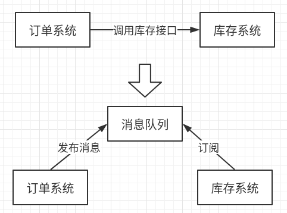
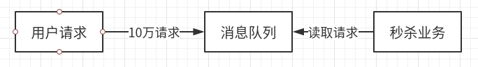
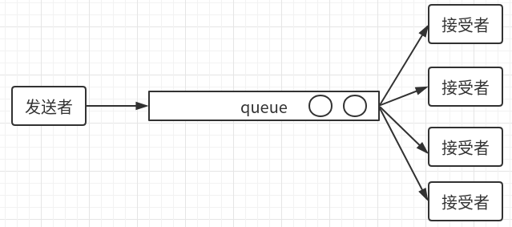

# 消息队列

## 应用场景

### 应用解耦

用微服务的方式，抽取出服务；

只要消息队列有订单消息，库存系统就会收到此信息，对库存进行操作；

如果没有库存了，库存系统会异步返回给订单系统—失败；

### 流量削峰

秒杀系统

秒杀数量只有1万，其余请求无法进入队列，直接相应秒杀失败；

消息队列里的请求，就秒杀成功，进行秒杀业务处理；

## 两种模式

### 队列（queue）

点对点通信

发送者将消息发送到队列中，接受者从队列中，取出消息

- 消息只能被消费一次，即：同一个消息，只能被一个接受者接收；

### 主题（topic）

发布订阅