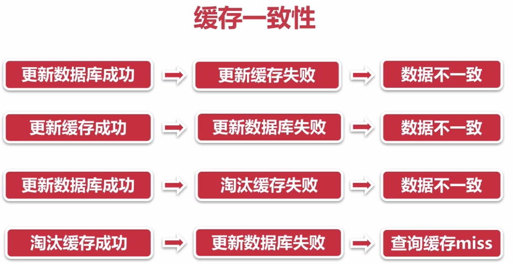

# 缓存常见问题

## 缓存一致性

缓存不一致的四种情况：

## 缓存并发问题

## 缓存穿透问题

也称作：缓存击穿

高并发下，对一个key发起了多个请求，并且没有查询到；

此时，多个请求同时向数据库进行查询，也没有查询到，这种情况称为缓存穿透；

解决方法：

1. 缓存空对象—避免请求穿透到后端数据库；
2. 过滤处理—对所有可能为空的key进行同一存放，并在查询前，进行拦截请求，避免穿透到后端数据库；

## 缓存雪崩现象

