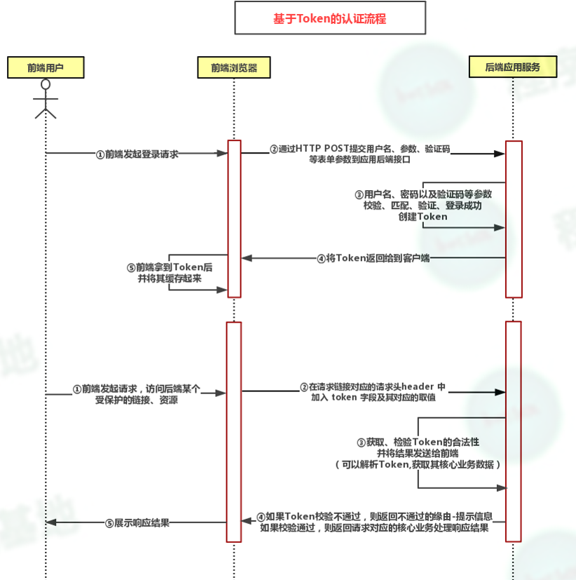
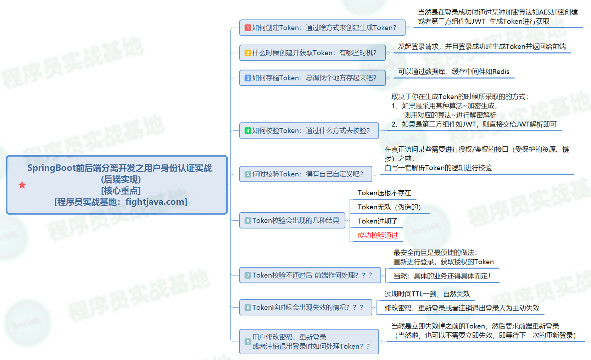

# 准备

## 登录状态

### 有状态：session

有状态登录流程：

- 客户端发送请求，账号密码在服务端认证；
- 认证通过，服务端会生成session对象，对象内保存着**登录凭证**和**用户信息**，并返回session_id给浏览器，浏览器将其保存进cookie；
- 后续请求，浏览器会自动携带session_id，服务端通过session_id得到用户信息，判断session是否过期，没有过期，则不需要登录，一般会刷新session的有效时间；
- 用户如果主动退出，服务端主动将session对象里面的登录凭证清除；

缺陷：

-  服务端保存大量数据，增加服务端压力
-  只能在一个服务器保存session，无法水平，集群服务器扩展
- 跨域解决方案：**单点登陆**

### 无状态：Token

无状态登录的流程：

- 首先客户端发送账户名/密码到服务端进行认证
- 认证通过后，服务端将用户信息加密并且编码成一个token，返回给客户端
- 以后客户端每次发送请求，都需要携带认证的token
- 服务端对客户端发送来的token进行解密，判断是否有效，并且获取用户登录信息

特点：

- 服务端不保存用户信息，服务器压力减少；
- 每次请求都要自带用户信息（token，jwt），就不存在不同服务器无法识别用户信息的情况；
- 符合REST请求的风格：服务的无状态性；

无状态登录的关键在于：保证token的安全性

- 解决：JWT+非对称加密（如：RSA），对称加密（AES），不可逆加密（MD5）

## JWT

JWT（ Json Web Token）是无状态登录Token下的一种解决方案；

实现方案：

- 客户端发送请求时，会先向授权服务器请求授权 ，对用户信息进行签名，封装，加密，返回给客户端；
- 客户端登陆完成之后，后续请求都会携带JWT信息，服务器集群通过JWT信息，拿到用户的信息，来判断是否有权限，获取权限资源；（用户携带JWT访问受保护资源）

JWT存在问题：

- ​	

## 跨域

- URL协议（HTTP，HTTPS）
- 域名（www.xx.com，yyy.xx.com）
- 端口（8081，8082）

以上的任一信息，与当前的URL不同，则视为跨域；

# Token+JWT+Redis认证

### Token认证流程



流程：

### 登录认证

1. 通过POST请求，拿到userName，password，验证用户信息；

2. 验证通过后，使用JWT**创建Token**；

3. 将Token存入Redis

   key：带有userName，id的字符串

   value：token

   expire：自定义时长

   TimeUnit：时长单位

4. 将Token和失效时长，返回前端（封装为一个约定好的对象）；

### 访问受保护资源

1. 自定义拦截器`JwtTokenRedisInterceptor implements HandlerInterceptor `

   preHandle：对于想要访问受保护资源的URL的请求，都会被强制先进入preHandle方法，进行逻辑判断，实现身份校验的业务逻辑；校验通过返回`true`，否则返回`false`

   postHandle：preHandle返回`true`才会执行postHandle。用于判断响应码为500，404的响应进行处理，返回异常页面；
   afterCompletion：该方法也是需要当前对应的Interceptor的preHandle方法的返回值为true时才会执行。该方法将在整个请求完成之后，也就是DispatcherServlet渲染了视图， 这个方法的主要作用是用于清理资源的;

2. 向SpringBoot注册拦截器

   ```java
   /**
    * 1. 向SpringBoot注册所有的Interceptor
    * 2. 实现跨域
    */
   @Configuration
   public class InterceptorConfig implements WebMvcConfigurer {
   
   	// 手动注入各个拦截器的bean
   
       @Bean
       public JwtTokenRedisInterceptor jwtTokenRedisInterceptor(){ return new JwtTokenRedisInterceptor();}
       // 添加拦截器
       @Override
       public void addInterceptors(InterceptorRegistry registry) {
           // 需要拦截的URL
           final String[] inPatterns=new String[]{"/jwtRedis/token/auth"};
           registry.addInterceptor(jwtTokenRedisInterceptor())
                   .addPathPatterns(inPatterns);
       }
       /**
        * 访问静态资源
        */
       @Override
       public void addResourceHandlers(ResourceHandlerRegistry registry) {
           registry.addResourceHandler("/statics/**")
                   .addResourceLocations("classpath:/statics/");
       }
       /**
        * 跨域的设置
        */
       @Override
       public void addCorsMappings(CorsRegistry registry) {
           registry.addMapping("/**"). /*可以跨域的路径*/
                    allowedMethods("*").   /*允许所有方法跨域：POST，GET等等*/
                   allowedOrigins("*").     /*允许所有的请求访问跨域资源*/
                   allowedMethods("*");     /*允许所有的请求头（header）访问*/
       }
   }
   ```

### 解析验证Token

在用户登录完成之后的后续请求，每次都会携带Token进行请求；

解析：Token内存放的用户信息，需要我们解析Token获取；

验证：这两个概念基本一致，解析了才能验证，比对解析出来的id，username判断用户

**解析之前，判断Token是否和Redis的Token一致，一致是否过期**

没有过期，使用JWT进行解析：

```java
//解析token，返回Claims
public static Claims parseJWT(final String accessToken) throws Exception{
    SecretKey key=generalKey();
    return Jwts.parser().setSigningKey(key).parseClaimsJws(accessToken).getBody();
}
```

### 失效Token

在退出登录，修改密码之后，需要失效掉之前的Token

失效流程：

1. 解析token，从token中获取用户信息
2. 查找redis的缓存的token，删除

### 项目总结



总结：

- JWT是一种完全无状态的Token认证模式；JWT+Redis即半有状态的认证模式；
- 单独使用JWT，Token发送出去，存放在客户端，服务端不能令其失效，只能等待时间结束；
- JWT+Redis就可以实现，令其token失效，即使客户端仍然存放有token，但是服务端的Redis将其对应的Token失效，每次验证都需要经过redis，可以认为是在服务端失效Token了；

# Session用户认证

## session概述

session的创建：

- 服务端调用：` HttpServletRequest.getSession(true) `的时候创建完成；
- sessionId由Tomcat通过特殊算法生成：随机数+时间+JVM的id

session的销毁：

- 客户端会把session，存放在Cookie中，客户端无法销毁session；
- 服务端只能通过invalidate方法来销毁，或者session超时自动销毁；

session的存放：

- session存放在服务器的内存中；

## session一致性

在需要均衡负载的情况下，多个web容器，分布式部署；

就会导致session存在不一致的问题，用户访问其中一台webServer，这台webServer就创建了session，其他server并灭有创建session；

解决方案方法分类（**分布式session的实现方法**）：

1. session复制（同步）

   - 简单，webServer天然支持；
   - 占用内网带宽，互相之间不停传输数据；
   - 冗余：会根据服务器数量增加副本数量；

2. 客户端存储（那不如直接用Token了）

   - 每次请求携带session，占用网络；
   - 不安全，存在被篡改的风险；

3. 反向代理hash一致性（**通过反向代理，让统一用用户的请求，落在同一台服务器上**）

   （1）用ip来进行hash，同一个ip的请求，落在同一台服务器；（推荐）

   （2）用用户信息（user_id等等）进行hash，根据具体业务；

   - 配置简单，只需要改动Nginx配置；并且能均衡负载，支持webServer的水平扩展；（不存在session冗余，没有副本）
   - 缺点：webServer重启宕机，都会导致session丢失；水平扩展，reHash之后，用户也会找不到session；

4. 在后端统一存储session（Redis，数据库）

   - 没有安全隐患，可以水平扩展，服务器宕机，也不会丢失session
   - 增加了一次网络的调用；

## ShiroRedisSession

- Shiro接替了SpringSession的HttpSession，并将session存入Redis当中，实现session共享；

### SpringBoot整合Shiro+Redis

 https://www.cnblogs.com/caichaoqi/p/8900677.html 

#### 1. 注入Bean：securityManager

用于管理shiri的subject

```java
@Bean
public SecurityManager securityManager(UserRealm userRealm){
    DefaultWebSecurityManager securityManager=new DefaultWebSecurityManager();
    securityManager.setRealm( userRealm);
    securityManager.setRememberMeManager(null);
    //自定义缓存管理器-redis
    securityManager.setCacheManager(cacheManager());
    //自定义一个存储session的管理器
    securityManager.setSessionManager(sessionManager());
    return securityManager;
}
```

#### 2. 注入Bean：cacheManager返回RedisCacheManager实例

也就是使用Redis来作为内存管理；

自然就需要redisManager，再注入redisManager

```java
@Bean
public RedisCacheManager cacheManager(){
    RedisCacheManager cacheManager=new RedisCacheManager();
    cacheManager.setRedisManager(redisManager());
    return cacheManager;
}
@Bean
public RedisManager redisManager(){
    RedisManager redisManager=new RedisManager();
    redisManager.setHost(env.getProperty("spring.redis.host"));
    redisManager.setPort(6379);
    redisManager.setTimeout(0);
    redisManager.setExpire(60000);
    return redisManager;
}
```

### 登录认证

1. 通过POST请求，拿到userName，password，认证的逻辑交由给shiro

2. 通过`UsernamePasswordToken token=new UsernamePasswordToken(userName,password);`获取Token；

3. `Subject subject= SecurityUtils.getSubject();`

   `subject.login(token);`

4. 这里login方法，会调用自定义的`public class UserRealm extends AuthorizingRealm`类下的` doGetAuthenticationInfo`方法，在此方法内部，实现自定义的验证逻辑（查询数据库）

### 访问受保护资源

1. 受保护资源的controller下只需要写业务逻辑，不需要管理权限；
2. 权限的管理，放在shiroFilter中去实现；

```java
@Bean("shiroFilter")
public ShiroFilterFactoryBean shiroFilter(SecurityManager securityManager){
    ShiroFilterFactoryBean shiroFilter=new ShiroFilterFactoryBean();
    shiroFilter.setSecurityManager(securityManager);
    shiroFilter.setLoginUrl("/error/unauth");
    Map<String, String> filterChainDefinitionMap=new HashMap<>();
    filterChainDefinitionMap.put("/shiro/login","anon");
    filterChainDefinitionMap.put("/shiro/unauth","anon");
    filterChainDefinitionMap.put("/shiro/logout","anon");
    filterChainDefinitionMap.put("/**","authc");
    return shiroFilter;
}
```

#### shiroFilter

shiro的拦截器配置

（1）设置`securityManager`

（2）


### 失效session

交给shiro，只需要`subject.logout()`

```java
Subject subject=SecurityUtils.getSubject();
if (subject!=null){
    subject.logout();
}
```


# 技巧

## lombok

IDea的lombok插件

在需要log的类上加上@Slf4j，就可以不用实例化logger对象

```java
@RestController
@RequestMapping("base")
@Slf4j
public class BaseController {
    //private static final Logger log = LoggerFactory.getLogger(BaseController.class);
    @RequestMapping("info")
    public BaseResponse info()
    {
        log.info("---------请求响应数据测试---------");
   		....
    }
}
```

## 热部署

热部署开发工具Devtools

1. 引入Spring-boot-devtools的依赖

   ```xml
   <!-- 引入热部署jar包 -->
   <dependency>
       <groupId>org.springframework.boot</groupId>
       <artifactId>spring-boot-devtools</artifactId>
       <!-- optional=true,依赖不会传递，该项目依赖devtools；之后依赖该项目的项目如果想要使用devtools，需要重新引入 -->
       <optional>true</optional>
   </dependency>
   ```

2. 开启IDEA自动编译及automake功能

   勾选：Compiler—>Compiler independent modules in parallel

   勾选：Compiler—>Build project automatically

   ctrl+shift+alt+/—>registry—>勾选：compiler.automake.allow.when.app.running


