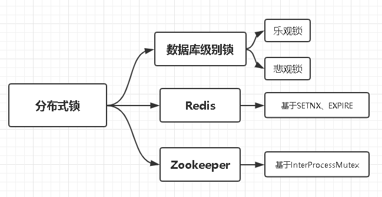
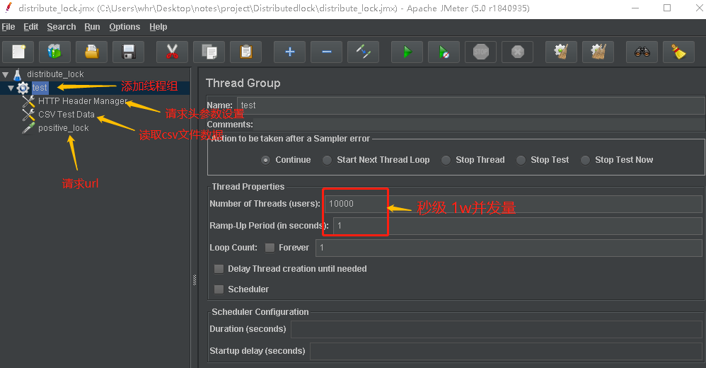
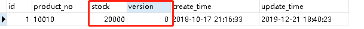
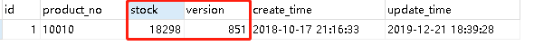
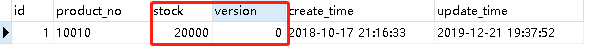
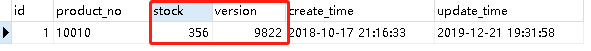
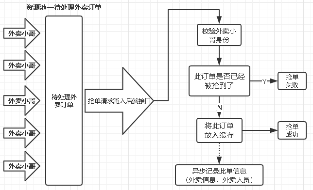

# 分布式锁



## JMeter测试工具



- 需要创建一个心的工程；
- 添加一个线程组—这里面设置秒级并发数；
- 添加一个请求—这里设置压力测试的接口；参数使用:`${ }`可以从csv文件中获取数据
- 请求头管理—添加需要修改的请求头信息；
- CSV文件—可以将请求的参数，以变量的形式，从csv文件中获取，模拟多种请求数据；

具体怎么用，百度

## 测试场景

测试场景为：请求对应商品，减少对应库存；

高并发量：秒级1w请求；

数据库级别锁：均没有采取补救措施，请求操作失败，直接丢弃，单纯测试两种锁的写性能；

# 数据库级别锁

## 不加锁

Controller就不写了，但是要测试，需要通过Request测试

Mapper：直接更新stock库存数量

```java
int updateStock(ProductLock lock);

<update id="updateStock" parameterType="com.example.lock.entity.ProductLock">
    update product_lock
    set stock = stock-#{stock,jdbcType=INTEGER}
	where id = #{id,jdbcType=INTEGER}
    AND
    stock > 0
</update>
```

Service：先查询到商品详情，判断库存是否充足，更新库存数量

```java
@Transactional(rollbackFor = Exception.class)
public int updateStock(ProductLockDto dto) throws Exception{
    int res=0;
    ProductLock entity=productLockMapper.selectByPrimaryKey(dto.getId());
    // 判断：要更新的库存 > 当前库存
    if (entity!=null && entity.getStock().compareTo(dto.getStock())>=0){
        entity.setStock(dto.getStock());
        return productLockMapper.updateStock(entity);
    }
    return res;
}
```

通过JMeter测试（秒级1w并发量），出现问题：

1. 库存剩余数 > 应该剩余数，出现少卖现象

## 乐观锁—版本号

修改表结构：

1. 添加字段：版本号version

修改Mapper：

```sql
<update id="updateStock_2" parameterType="com.example.lock.entity.ProductLock">
    update product_lock
    set stock = stock-#{stock,jdbcType=INTEGER},version = version + 1
    where
    id = #{id,jdbcType=INTEGER}
    AND
    version = #{version,jdbcType=INTEGER}
    AND
    stock > 0
</update>
```

#### 测试

依然秒级并发1w请求测试：（1w个请求，每个请求减少库存数=2）

测试前数据：库存2w，version=0



测试数据后：库存18298，version=851



#### 分析

首先，真正请求通过，并修改了库存的请求数应该等于version的增量；

即：`version * 2 = 减少库存数`（因为每个version修改，库存减少2）

`851 * 2 = 1702` 也就等于 `20000 - 19298 = 1702` 说明：后端数据修改是没有问题的；

但是：version修改次数，可以认为是成功响应请求次数：851个；

1w请求，响应了851个，不太象话；

#### 结论

1. 不存在超卖，少卖的情况；
2. 高并发下，不能响应所有请求，只能响应少部分请求；
3. 因为乐观锁的机制，version字段，判断失败，直接不做操作，导致大部分请求，无法成功；

**在高并发写入的情况下，不应该使用乐观锁！，后面悲观锁效果更好**

## 悲观锁—for update

添加Mapper：

```sql
<!--悲观锁实现 for update 锁表-->
<select id="selectByIdNegative" parameterType="java.lang.Integer" resultMap="BaseResultMap">
    select
    <include refid="Base_Column_List" />
    from product_lock
    where id = #{id}
    for update
</select>
<update id="updateStock_3" parameterType="com.example.lock.entity.ProductLock">
    update product_lock
    set stock = stock-#{stock,jdbcType=INTEGER},version = version+1
    where
    id = #{id,jdbcType=INTEGER}
    AND
    stock > 0
</update>
```

Service层：@Transactional注解，保证上面两个方法，是一个事务，才能实现`for update` 锁表

```java
@Transactional(rollbackFor = Exception.class)
public int updateStock_3(ProductLockDto dto){
    int res =0;
    // select-for update 查询
    ProductLock entity = productLockMapper.selectByIdNegative(dto.getId());
    // 判断version字段，库存是否充足
    if (entity!=null && entity.getStock().compareTo(dto.getStock())>=0){
        entity.setStock(dto.getStock());
        res = productLockMapper.updateStock_3(entity);
    }
    if (res > 0) {
        log.info("减少库存=>{}",dto.getStock());
    }
    return res;
}
```

#### 测试

依然秒级并发1w请求测试：（1w个请求，每个请求减少库存数=2）

测试前数据：库存2w，version=0



测试数据后：库存356，version=9822



#### 分析

与之前一样：`version*2 = 减少库存数`（因为每个version修改，库存减少2）

`9822 * 2 = 19644` 也就等于 `20000 - 356 = 19644 ` 说明：后端数据修改是没有问题的；

同样：并没有响应所有的请求，但是从version的修改次数看，

1w请求，**响应了9822个请求**，**失败178个**

#### 结论

1. 不存在超卖，少卖的情况；
2. 高并发下，不能响应所有请求，但是响应绝大部分请求；
3. **在写方面，悲观锁优于乐观锁；**

# Redis分布式锁

通过Redis的原子操作—SETNX、EXPIRE

- SETNX：指定的 key 不存在时，为 key 设置指定的值。
- EXPIRE：设置过期时间，防止宕机无法消除key

## 实现方式

1. 当key不存在的时候，SETNX会成功，相当于对此key加了锁，其他线程再进行set，无法成功；
2. 操作完毕，一定要释放掉，也就是消除此key，其他线程就可以再次拿到这个锁；

保证不丢失请求：

```java
int res =0;
// 拼装key,value
final String key = String.format(prefix+dto.getId());
Boolean flag = true;
while (flag) {
    String value = UUID.randomUUID().toString() + System.nanoTime();
    // 设置锁：SETNX
    flag = stringRedisTemplate.opsForValue().setIfAbsent(key, value);
    if (flag){
        // 拿到锁
        stringRedisTemplate.expire(key,5, TimeUnit.SECONDS);//被动释放锁，防止宕机无法释放锁
        stringRedisTemplate.opsForValue().increment(countKey,1L);//记录请求数
        try{
            flag = false;
            // TODO: 这里业务逻辑
            
            }
        }catch (Exception e){
            log.error("分布式锁失败:{}",e.getMessage());
        }finally {
            // TODO: finally释放锁
            String redisValue = stringRedisTemplate.opsForValue().get(key);
            if (!StringUtils.isNullOrEmpty(redisValue) && redisValue.equals(value)) 
            {
                stringRedisTemplate.delete(key);
            }
        }
    }else {
        // 没有拿到锁，保证不丢失请求
        flag=true;
        Thread.sleep(1000);
    }
}
return res;
}
```

- 能够做到，完全原子操作，数据安全，且不丢失请求！

缺点：

- 消耗性能，没有获得锁的线程，会不断的尝试获取锁，比较消耗性能；
- 如果某个服务器宕机，就需要等待redis的expire超时，才能释放锁；

# Zookeeper分布式锁

底层：采用Wathcher机制；

使用高度封装CuratorFrameWork、InterMutexProcess等组件实现

### SpringBoot注入

```java
@Configuration
public class ZkConfig {
    @Autowired
    private Environment env;
    @Bean
    public CuratorFramework curatorFramework(){
        /**
         * 1. 设置host
         * 2. 设置namespace
         * 3. retryPolicy重试策略：重试5词，间隔1000ms
         */
        CuratorFramework client=CuratorFrameworkFactory
                                    .builder()
                                    .connectString(env.getProperty("zk.host"))
                                    .namespace(env.getProperty("zk.namespace"))
                                    .retryPolicy(new RetryNTimes(5,1000))
                                    .build();
        client.start();
        return client;
    }
}
```

### 使用

```java
private final static String zk_prefix = "/stock_lock_";
@Autowired
private CuratorFramework client;
@Transactional(rollbackFor = Exception.class)
public int updateStock_5(ProductLockDto dto) throws Exception {
    int res =0;
    // 创建临时节点
    InterProcessMutex mutex=new InterProcessMutex(client,zk_prefix+dto.getId());
    try {
        if (mutex.acquire(10L,TimeUnit.SECONDS)){
            // TODO: 业务逻辑
            }
        }else {
            throw new RuntimeException("zookeeper分布式锁获取失败");
        }
    } catch (Exception e) {
        log.error("zookeeper分布式锁失败:{}",e.getMessage());
    }finally {
        // TODO：释放锁，删除临时节点
        mutex.release();
    }
    return res;
}
```

特点：

- 拿到锁，即创建临时节点，释放锁，即删除节点；
- zk分布式锁，获取不到锁，注册个监听器即可，不需要不断主动尝试获取锁，性能开销较小；
- 服务器挂了，节点自动就没了，即：释放锁，不需要像Redis一样，设置EXPIRE；
- 适合量级较少的场景，频繁watch，集群压力很大；

# Redisson分布式锁

官方文档：[https://github.com/redisson/redisson/wiki/%E7%9B%AE%E5%BD%95](https://github.com/redisson/redisson/wiki/目录)


https://www.cnblogs.com/mengchunchen/p/9647756.html

# 分布式锁场景

## 重复提交

用户多次发送同一个请求；

这里用：注册的场景，演示；

### 不加锁

- 最普通的查询是否存在用户，不存在插入，存在返回自定义响应；

```java
try{
    log.info("user info:{}",userDto);
    // 查询此用户名是否存在
    User user = userMapper.selectByUserName(userDto.getUserName());
    if (user!=null){
        // 用户已存在
        return new BaseResponse(StatusCode.UserNameExist);
    }else {
        // 用户不存在，新增用户
        int res = userService.registerV1(userDto);
    }
}catch (Exception e){
	
}
```

结果：

- 数据库插入了多条相同数据；

### 数据库级别锁

为字段设置唯一索引—userName或者；

## 抢单逻辑

- 外卖人员抢单，如何保证有且仅有一个人抢到单；

### 分析



这里为了简化业务，将抢单中的订单，简化为订单人员手机号；（感觉应该通过订单号抢）

- 同一时间，有且只有一个人拿到这个手机号；
- 抢到手机号之后，存入缓存，即：加上分布式锁；
- 后续人员的请求进来，再次查询，缓存中存在手机号，即：此单已被人抢了；

