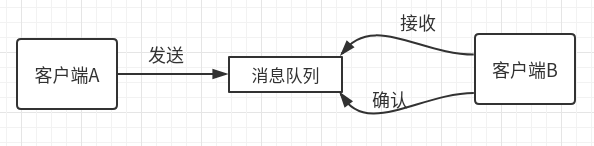
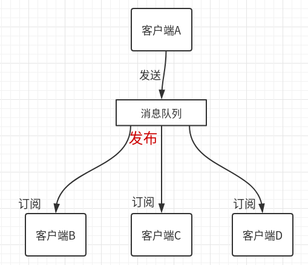

# 消息队列

顾名思义，存储消息的队列，因为并不一定，生产出消息，就一定第一时间被消费，所以需要队列，提高系统性能。常用的消息队列：ActiveMQ，RabbitMQ，Kafka，RocketMQ

消息队列作用：

1. 通过异步处理提高系统性能。
2. .降低系统耦合性。
3. 提高峰值处理能力。
4. 数据是冗余的。
5. 提供一个缓冲

## 消息队列模型

#### 1. 点对点模式（一对一）

即：只有一个消费者和生产者；消费者主动拉取消息；消息收到后，返回确认信息，队列清除消息。

- 需要线程实时监控队列中是否有数据。
- 拉取速度，由客户端B控制。

#### 2. 发布订阅（一对多）

消息产生后，进入队列，主动推送给所有的订阅者。

- 推送速度统一。

