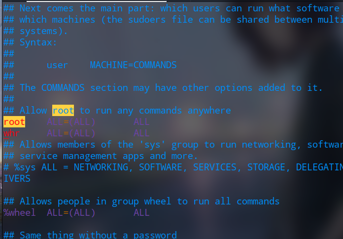
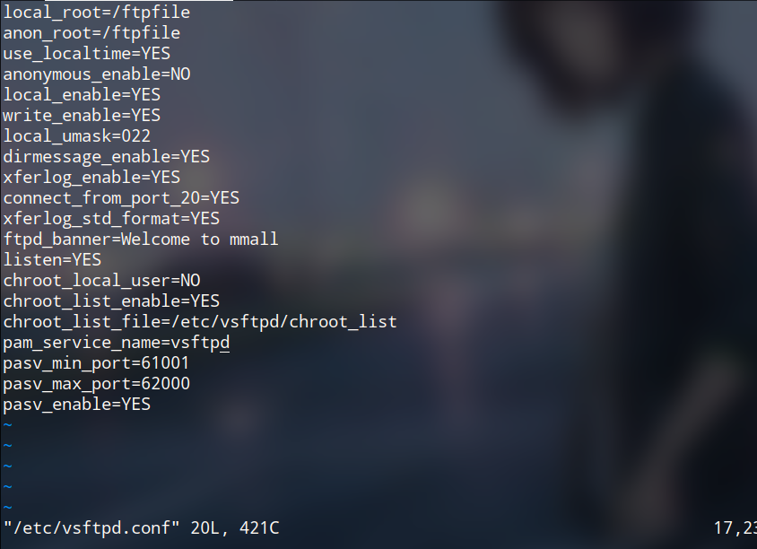
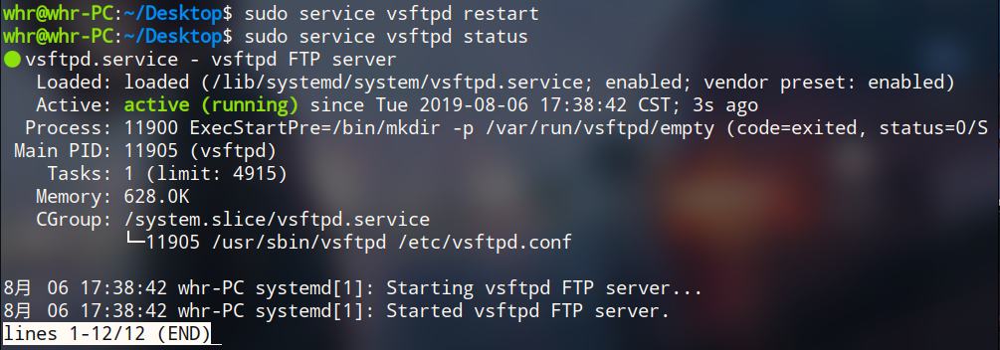
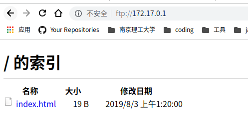

## 部署云服务器

**先看一下CentOS 7 比较CentOS 6.x的较大改动**：

参考：<https://www.cnblogs.com/JiangLe/p/7040744.html>

7中，服务不再使用service来启动与停止，也不再使用chkconfig来设置自启动。

所有的服务管理，都集中到了systemctl当中，通过配置文件来完成对服务的管理。

在后续，配置mysql中，会使用到这些东西。


## 准备

购买云服务器之后

ssh登录，并添加新的用户，设置密码，赋予sudo权限

```bash
whr@whr-PC:~/Desktop$ ssh root@39.96.46.195
root@39.96.46.195's password: 
Last login: Tue Aug  6 15:20:04 2019 from 219.230.75.163

Welcome to Alibaba Cloud Elastic Compute Service !
[root@iZ2zej550xmzquhe5nmo4tZ ~]# useradd -d /usr/whr -m whr
[root@iZ2zej550xmzquhe5nmo4tZ whr]# sudo vim /etc/sudoers
```



添加新用户进去，并设置为root权限。

:wq!	强制保存


本地传文件到云服务器：

scp命令：是用来进行远程文件拷贝的。数据传输使用 ssh，并且和ssh 使用相同的认证方式。

缺点：慢

```bash
$ scp -r /usr/local/lib/jdk1.8.0_211/ root@39.96.46.195:/developer/setup
```

**为了与本地开发环境匹配，都使用了scp指令，直接传输本地的开发工具到云服务器**


## 更换yum源

```shell
# 备份
$ sudo mv /etc/yum.repos.d/CentOS-Base.repo /etc/yum.repos.d/CentOS-Base.repo.backup
# 下载阿里云的yum源
$ sudo wget -O /etc/yum.repos.d/CentOS-Base.repo http://mirrors.aliyun.com/repo/Centos-7.repo
# 清理缓存
$ sudo yum clean all
# 生成新缓存
$ sudo yum makecache
```


## 修改安全策略

安全策略：通过定义策略来控制哪些域可以访问哪些上下文。

避免出一些不必要的麻烦，可以使网络应用不会出现问题。

```shell
$ sudo vim /etc/selinux/config
# 设置：SELINUX=disabled
# 也可以直接输入指令:
$ sudo setsebool -P ftp_home_dir 1
```

## 安装JDK、Tomcat

不再赘述

配置  /etc/profile文件：


Tomcat无法正常启动，参考了下面的地址，修改了java.security文件，才能正常启动，不知道为什么。。。

<https://blog.csdn.net/qq_36659177/article/details/83688485>

## 配置Nginx

需要很多依赖，批量安装：

```shell
$ sudo yum -y install gcc zlib zlib-devel pcre-devel openssl openssl-devel
```

开始安装nginx

```shell
# 解压、
$ sudo tar -zxvf nginx-1.13.12.tar.gz
$ sudo ./configure
$ sudo make
$ sudo make install
```

配置：

```shell
$ cd nginx/conf
$ sudo vim nginx.conf
# 添加 include vhost/*.conf； 必须有分号 
# 创建vhost目录，将反向代理配置文件，添加在此目录下
$ sudo mkdir vhost
```


## vsftpd文件系统搭建

本地环境；deepin

创建本地目录，作为文件系统的根目录

```bash
$ sudo yum -y install vsftpd
$ sudo mkdir /product/ftpfile
```

配置：



创建/etc/vsftpd/chroot.list文件并追加

```shell
# 新创建用户组用户 ftpuser 用于登录ftp
$ sudo useradd ftpuser -d /product/ftpfile -s /sbin/nologin
$ cd /etc/vsftpd/
$ sudo vim chroot.list
# 创建 并 添加登录ftp的用户"ftpuser"
```

然后重启，查看service状态：



我们可以在  /vsftp/下创建一个index.html试一下

访问<ftp://172.17.0.1/>，初次登录，需要账号，密码




## MySql

查看有没有安装mysql，有卸载

```bash
$ rpm -qa|grep mysql
```

直接执行：

```shell
$ sudo yum -y update
# 下载MySql安装包,建议使用下面的版本
$ sudo rpm -ivh http://dev.mysql.com/get/mysql-community-release-el7-5.noarch.rpm
# 安装mysql
$ sudo yum -y install mysql-server
```

出现Complete! 即安装成功

然后配置字符集

```bash
$ sudo vim /etc/my.cnf
# 添加：
character-set-server=utf8
default-character-set=utf8
```

配置自启动（云服务器启动，mysql服务自启动）：

```bash
$ systemctl enable mysqld.service
# 查看服务状态
$ systemctl list-unit-files | grep mysqld
mysqld.service                                enabled 
```

如果发现无法登陆mysql，比如报错：ERROR 1045 (28000): Access denied for user 'root'@'localhost' (using password: NO)

就在配置文件中添加：

```
skip-grant-tables
```

然后重启服务，就可以登入了，在进行修改密码

用户就在 mysql.user 表中

```sql
mysql> set password for root@localhost = password('123456');
mysql> select user,host,authentication_string from mysql.user;
+---------------+-----------+-------------------------------------------+
| user          | host      | authentication_string                     |
+---------------+-----------+-------------------------------------------+
| root          | localhost | *6BB4837EB74329105EE4568DDA7DC67ED2CA2AD9 |
| mysql.session | localhost | *THISISNOTAVALIDPASSWORDTHATCANBEUSEDHERE |
| mysql.sys     | localhost | *THISISNOTAVALIDPASSWORDTHATCANBEUSEDHERE |
+---------------+-----------+-------------------------------------------+
```

添加一个新的用户：

```sql
mysql> create user 'mmall'@'localhost'identified by '123456';
```

这句还有可能报错，就是无法更新：

ERROR 1290 (HY000): The MySQL server is running with the --skip-grant-tables option so it cannot execute this statement

执行一次下面语句，就可以了继续执行上面的语句。

```sql
flush privileges
```

创建我们项目需要的库：mmall

并给mmall用户，赋予mmall库的所有权限

```sql
mysql> grant all privileges on mmall.* to mmall@'localhost' identified by '123456';
```

执行sql文件

```sql
mysql> source /developer/mmall.sql
```

**卸载mysql**

参考：<https://blog.csdn.net/zjh_746140129/article/details/79017628>

```shell
# 查看安装的mysql
$ rpm -qa | grep -i mysql
mysql-community-common-5.6.45-2.el7.x86_64
mysql-community-release-el7-5.noarch
mysql-community-libs-5.6.45-2.el7.x86_64
mysql-community-server-5.6.45-2.el7.x86_64
mysql-community-client-5.6.45-2.el7.x86_64
# 依次卸载所有组件：
$ sudo yum remove mysql-community-common-5.6.45-2.el7.x86_64
# 删除文件目录
$ sudo find / -name mysql
/usr/share/mysql
/var/lib/mysql
/var/lib/mysql/mysql
$ sudo rm -rf /usr/share/mysql /var/lib/mysql /var/lib/mysql/mysql
```

## Git

解压git包之前，先安装依赖：

```shell
sudo yum -y install zlib-devel openssl-devel cpio expat-devel gettext-devel curl-devel perl-ExtUtils-CBuilder perl-ExtUtils- MakeMaker
```

解压git

```shell
$ sudo tar -zxvf git-v2.8.0.tar.gz
# 编译安装
$ sudo make prefix=/usr/local/git all
$ sudo make prefix=/usr/local/git install
```

配置：

```shell
# 如果输入下面指令，没有返回，就配置环境变量
$ git --version
# 配置环境变量
$ sudo vim /etc/profile
# 将git路径，放入export PATH=中
export PATH=$PATH:$JAVA_HOME/bin:/usr/local/git/bin
$ source /etc/profile
```

配置用户名和ssh key

```shell
$ git config –global user.name " "
$ git config –global user.email " "
$ ssh-keygen -t ras -C " email " 
```

```shell
$ eval `ssh-agent`
$ ssh-add ~/.ssh/id_rsa
# 查看公钥
$ cat ~/.ssh/id_rsa.pub
```


## 防火墙配置

CentOS 7 的防火墙相比于6.x进行了升级，指令也不一样了

默认使用firewall来配置防火墙

系统级配置目录在：`/usr/lib/firewalld/`

用户级配置目录在：`/etc/firewalld/zones/public.xml `

CentOS 7 防火墙相关命令参考：

<https://www.cnblogs.com/cleven/p/11040143.html>


## 自动化脚本

```shell
echo "===========进入git项目mmall目录============="
cd /developer/git-repository/mmall

echo "==========git切换分之到mmall-v1.0==============="
git checkout mmall-v1.0

echo "==================git fetch======================"
git fetch

echo "==================git pull======================"
git pull

echo "===========编译并跳过单元测试===================="
mvn clean package -Dmaven.test.skip=true

echo "============删除旧的ROOT.war==================="
rm /developer/apache-tomcat-7.0.73/webapps/ROOT.war

echo "======拷贝编译出来的war包到tomcat下-ROOT.war======="
cp /developer/git-repository/mmall/target/mmall.war  /developer/apache-tomcat-7.0.73/webapps/ROOT.war

echo "============删除tomcat下旧的ROOT文件夹============="
rm -rf /developer/apache-tomcat-7.0.73/webapps/ROOT

echo "====================关闭tomcat====================="
/developer/apache-tomcat-7.0.73/bin/shutdown.sh

echo "================sleep 10s========================="
for i in {1..10}
do
	echo $i"s"
	sleep 1s
done

echo "====================启动tomcat====================="
/developer/apache-tomcat-7.0.73/bin/startup.sh
```

执行，自动化部署。