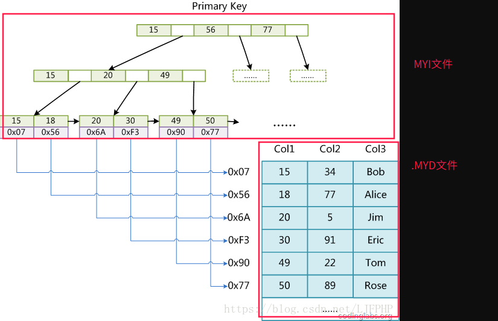
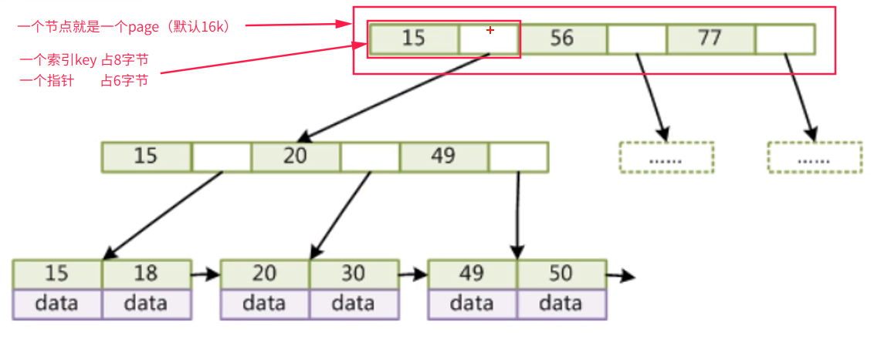
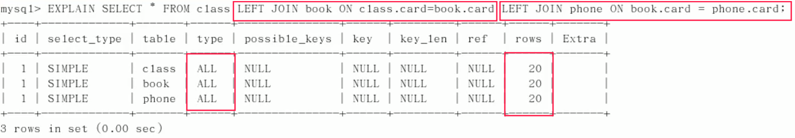
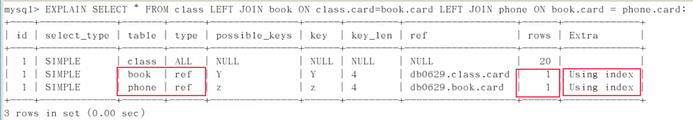
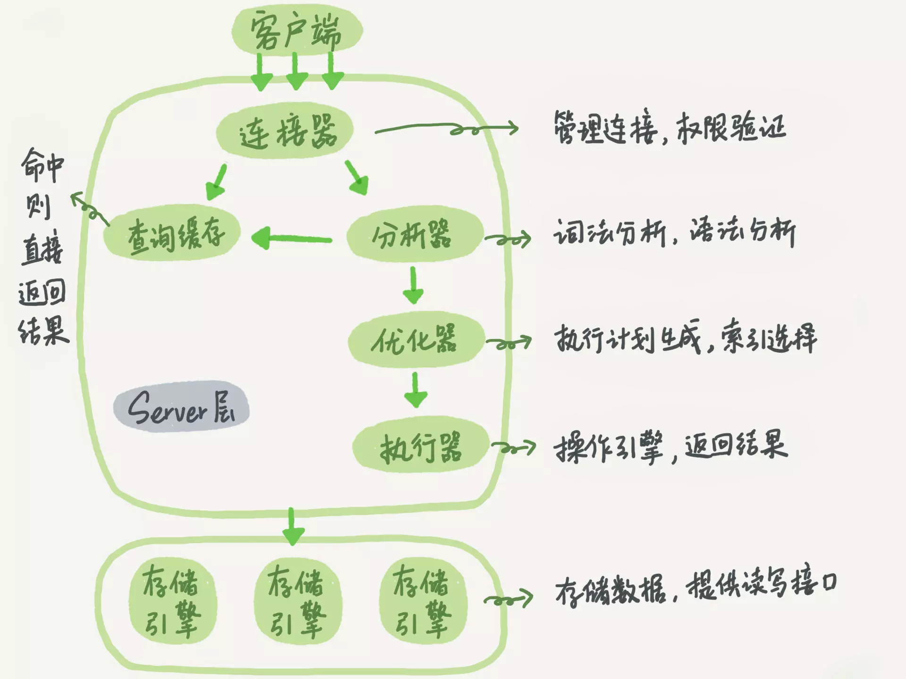

# MySQL引擎

## MyISAM

### MyISAM索引实现



### 数据形式

- user.frm：表结构定义文件
- user.MYD：数据文件（B树的节点的data数据存储在这个文件）
- user.MYI ：索引文件（B树存在这个文件，data数据中存储的是数据文件的地址指针）

### 特点

- 不支持事务
- 表级锁定（读锁，写锁），更新时锁整个表
- 读写互相阻塞
- 只会缓存索引（key_buffer_size），以大大提高访问性能减少磁盘IO，但是不会缓存数据
- 读取速度较快，占用资源相对少
- 不支持外键约束，但支持全文索引

## InnoDB

InnoDB是默认的事务型存储引擎

### InnoDB索引实现



### 数据形式

使用InnoDB时，会将数据表分为.frm 和 .idb两个文件进行存储；

- .frm：定义表结构
- .idb：存储数据（B+树存储在这个文件，包括索引和叶子节点的data数据）

### 特点

- 支持事务，默认的事务隔离级别为**可重复读**，通过MVCC（并发版本控制）来实现的；

  遵循ACID

- 行级锁（共享锁，排他锁），可以支持更高的并发

  （仅仅在命中索引时，行锁生效，如果是全表扫描，依然会锁住整张表）；

- 支持外键；

- 存在缓冲管理，通过缓冲池，将索引和数据全部缓存起来，加快查询的速度；

### 查看引擎状态

```sql
> show engine innodb status\G;
```

分块来显示信息：着重看BUFFER POOL AND MEMORY缓存池信息：

```sql
---
LOG
---
----------------------
BUFFER POOL AND MEMORY
----------------------
Total memory allocated 140574720; in additional pool allocated 0
Total memory allocated by read views 88
Dictionary memory allocated 75143
Buffer pool size        8191
Buffer pool size, bytes 134201344
Free buffers            7993
Database pages          198
Old database pages      0
Modified db pages       0
Percent of dirty pages(LRU & free pages): 0.000
Max dirty pages percent: 75.000
Pending reads 0
```

- Total memory allocated：缓存池总内存；
- Dictionary memory allocated：分配给InnoDB数据字典的总内存；
- Buffer pool size：分配给缓冲池的页面总数量（数量*页面大小=缓冲池大小），默认每个Page为16k；
- Free buffers：未使用的页面总数；
- Database pages：已使用的页面总数；（LRU LIST大小）；
- Modified db pages：缓存池中修改了的页面，即脏页(脏数据)；

## 对比

- 存储文件结构不同

- 存储空间：

  MyISAM内数据可被压缩，存储空间较小，并且缓存仅缓存索引，不缓存数据；

  InnoDB需要更多的存储空间和内存，会建立缓存池同时缓存索引和数据；

- 事务支持：

  MyISAM不支持事务，强调性能，执行速度块；

  InnoDB支持事务，具备ACID特性；

- 锁粒度：

  MyISAM表级锁；

  InnoDB行级锁；并发度更高；

- 外键

  MyISAM不支持；

  InnoDB支持；

# MySQL锁

https://www.cnblogs.com/wintersoft/p/10787474.html

分类：

- 全局锁
- 表级锁（MyISAM）
  - 读锁
  - 写锁
- 行锁（InnoDB）
  - 共享锁
  
    ```sql
    select * from table where id = ? lock in share mode;
    ```
  
    会对查询行，添加共享锁；
  
  - 排他锁
  
    ```sql
    select * from table where id = ? for update
    ```
  
    会对查询行，添加排它锁（悲观锁），其他线程无法操作此行；
  
  - 间隙锁（隔离级别为RR以上，才会有间隙锁）
  
    顾名思义：锁住一个范围；
  
    比如查询1-10，如果不存在2记录，也会把2给锁住，无法插入；

## 读锁

```sql
LOCK TABLE table_1 read;
UNLOCK TABLES；
```

当前session：

- 可以查询`table_1`记录；
- 不能查询未锁定的其他表的记录；
- 插入或更新`table_1`记录，会报错；

其他session：

- 可以查询`table_1`记录；
- 可以查询未锁定的其他表的记录；
- 插入或更新`table_1`记录，会阻塞，一直等待锁被释放；

## 写锁

```sql
LOCK TABLE table_1 write;
UNLOCK TABLES；
```

当前session：

- 查询、更新、插入`table_1`记录都可以执行；
- 不能查询未锁定的其他表的记录；

其他session：

- 如果是表锁，查询`table_1`会阻塞，需要等待锁释放；（测试的时候有可能因为缓存，能正常读取）
- 插入或更新`table_1`记录，会阻塞，一直等待获得锁，直到锁被释放；
- 可以查询未锁定的其他表的记录；

## 行锁

偏向InnoDB引擎；

- 开销大，加锁慢，会出现死锁；
- 锁粒度最小，发生锁冲突的概率最低，并发度最高；

InnoDB默认实现了行级锁，使用`set autocommit = 0`来手动提交；

当前session修改某行：`update emp set age = 28 where id = 3;`

- 自动将此行锁住，但不锁表；
- 直到`commit`进行提交，才解锁；

其他session：

- 不能操作同一行，会阻塞，直到释放锁；
- 可以操作其他行；
- 在持锁线程提交之前，查不到修改的信息，即当前的隔离级别，隔离了脏读；


## 乐观锁

数据库不支持实现乐观锁，需要开发者**自己实现**

#### 版本号实现

1. 在创建表的时候，增加version字段

2. 修改数据之前，先把version字段查询出来，修改的时候判断查出来的version与数据库version是否一致；

3. 一致：表明数据没有被其他用户修改；

   不一致：表明这条数据中途被修改了，此时回滚；

## 悲观锁

每次查询都认为数据在查询期间

在事务中，在不使用update的情况下，使用`for update`来锁住一行

```sql
select username from emp where id =3 for update;
-- 执行完上述语句，就自动锁定此行，直到commit提交完毕，才解锁此行；
```

## 死锁


这样互相占用资源，并等待对方释放资源，产生死锁；

## 注意

1. 索引失效，会导致行锁变表锁；

   ```sql
   -- 索引列：age，并且是varchar类型
   set autocommit = 0;
   update emp set username = 'king' where age = 24; -- 这里进行了隐式类型转换，导致索引失效
   -- 此时通过另一个session来修改此表的另一条记录
   -- 这里会被阻塞；因为索引失效已经导致行锁升级为表锁(写锁)
   update emp set username = 'kkk' where id = '3';
   ```

2. 间隙锁—防止幻读

   符合条件，但并不存在的记录，为间隙；

   如果范围为1-10，但是并没有第2条记录，在操作的时候，会同时把2给锁住，即无法插入2号记录；

## ACID

- **原子性**（atomicity）

  一个事务必须被视为一个不可分割的最小工作单元，整个事务中的所有操作要么全部提交成功，要么全部失败回滚，对于一个事务来说，不可能只执行其中的一部分操作，这就是事务的原子性；

- **一致性**（consistency）

  数据库总是从一个一致性的状态转换到另一个一致性的状态。

- **隔离性**（isolation）

  通常来说，一个事务所做的修改在最终提交以前，对其他事务是不可见的。

- **持久性**（durability）

  一旦事务提交，则其所做的修改不会永久保存到数据库。

## 隔离级别

脏读：一个事务对数据进行增删改，但并没有提交，另一个事务却能读到未提交的数据；

不可重复读：一事务对数据进行了更新或删除操作，另一事务中多次读取同一个数据，结果不一致；

幻读：第一个事务对一个表中的数据进行了修改，这种修改涉及到表中的全部数据行。同时，第二个事务也修改这个表中的数据，这种修改是向表中插入一行新数据。那么，以后就会发生操作第一个事务的用户发现表中还有没有修改的数据行，就好象发生了幻觉一样；

- **隔离级别就是通过锁，来避免出现上面的问题，而实现的**

|            隔离级别             |      级别      |  脏读  | 不可重复读 |  幻读  |
| :-----------------------------: | :------------: | :----: | :--------: | :----: |
| **Read Uncomitted（读未提交）** |     无保证     |  存在  |    存在    |  存在  |
|  **Read Comitted（读已提交）**  |     语句级     | 不存在 |    存在    |  存在  |
| **Repeatable Read（可重复读）** |     事务级     | 不存在 |   不存在   |  存在  |
|  **Serializable（可串行化）**   | 最高级，效率低 | 不存在 |   不存在   | 不存在 |

# MySQL缓存

在优化sql无法解决问题的情况下，才考虑搭建缓存。毕竟你使用缓存的目的，就是将复杂的、耗时的、不常变的执行结果缓存起来，降低数据库的资源消耗。 

### 缓存机制

MySQL缓存机制即缓存sql 文本及缓存结果，用KV形式保存再服务器内存中，如果运行相同的sql，服务器直接从缓存中去获取结果，不需要再去解析、优化、执行sql；

### 缓存失效

- 表结构或数据发生变化，缓存失效；
- INSERT、UPDATE、 DELETE、TRUNCATE、ALTER TABLE、DROP TABLE或DROP DATABASE会导致缓存数据失效

### 缓存使用场景

- 对于频繁更新的表，查询缓存不合适；
- 对于一些不变的数据且有大量相同sql查询的表，查询缓存可以大大提高查询的性能；

### 缓存相关配置

#### 缓存状态

通过查询缓存的状态（命中率，次数，可用内存等等），来调整缓存配置；

```sql
> show status like 'Qcache%';
+-------------------------+----------+
| Variable_name           | Value    |
+-------------------------+----------+
| Qcache_free_blocks      | 1        | --空闲状态的内存块数量
| Qcache_free_memory      | 16759656 |
| Qcache_hits             | 0        |
| Qcache_inserts          | 0        |
| Qcache_lowmem_prunes    | 0        |
| Qcache_not_cached       | 1        |
| Qcache_queries_in_cache | 0        |
| Qcache_total_blocks     | 1        |
+-------------------------+----------+
```

- Qcache_free_blocks：空闲状态的内存块数量

  此值太大：表示内存碎片过多；

- Qcache_free_memory：还有多少缓存可以用

- Qcache_hits：查询缓存的次数，此值不断递增；

- Qcache_inserts：表示一共缓存过多少个查询结果集；

- Qcache_lowmem_prunes：表示因为缓存满了，而删除掉的查询的个数；

  如果此值，很大，说明缓存不够用，建议增加缓存；

- Qcache_not_cached：表示没有进入缓存的查询的个数；

- Qcache_total_blocks：查询缓存总块数；

#### 缓存配置

```sql
> show variables like '%query_cache%'
+------------------------------+----------+
| Variable_name                | Value    |
+------------------------------+----------+
| have_query_cache             | YES      | --是否支持缓存
| query_cache_limit            | 1048576  | --单数据，缓存的最大值
| query_cache_min_res_unit     | 4096     | --内存块的最小单位
| query_cache_size             | 16777216 | --缓存大小（字节）
| query_cache_strip_comments   | OFF      |
| query_cache_type             | ON       |	--缓存开关
| query_cache_wlock_invalidate | OFF      |
+------------------------------+----------+
```

- query_cache_type：是否打开缓存

  - ON（1）：打开

  - OFF（0）：关闭

  - DEMAND（2）：按需使用，明确写有SQL_CACHE的查询才会写入缓存

    （SELECT SQL_CACHE * FROM my_table WHERE condition）

- query_cache_size：缓存使用的总内存空间

  设置缓存大小：SET GLOBAL query_cache_size = 134217728

- query_cache_min_res_unit：分配内存块的最小单位

  查询缓存，是按块来给数据分配空间；

  块设置大，可能内存浪费；设置小，可能内存碎片；

- query_cache_limit：单个查询能够缓存的最大值，如果将要缓存的数据超过了此值，将不会缓存；

- query_cache_wlock_invalidate：如果存在行级排他锁，是否仍然从缓存中返回数据；

  0默认：表示存在行级排他锁时，缓存仍然有效；

  1：表示存在行级排他锁时，缓存失效，即缓存不可用；

#### InnoDB缓存池

InnoDB缓存池是提升InnoDB性能的核心，InnoDB引擎的特性就是缓存既存储索引，又存储数据；

InnoDB缓存池流程：

1. InnoDB将数据库文件按页读取到缓存池中（通过innodb_page_size设置每页大小—16k，32k，64k，只能吃实话MySql实例之前配置，一旦设置，不能再修改）
2. 基于LRU缓存淘汰算法，来维护缓存

```sql
> show variables like 'innodb%pool%'; -- 查看InnoDB缓存池配置
+-------------------------------------+----------------+
| Variable_name                       | Value          |
+-------------------------------------+----------------+
| innodb_additional_mem_pool_size     | 8388608        |
| innodb_buffer_pool_dump_at_shutdown | OFF            |
| innodb_buffer_pool_dump_now         | OFF            |
| innodb_buffer_pool_dump_pct         | 100            |
| innodb_buffer_pool_filename         | ib_buffer_pool |
| innodb_buffer_pool_instances        | 8              |
| innodb_buffer_pool_load_abort       | OFF            |
| innodb_buffer_pool_load_at_startup  | OFF            |
| innodb_buffer_pool_load_now         | OFF            |
| innodb_buffer_pool_populate         | OFF            |
| innodb_buffer_pool_size             | 134217728      |
+-------------------------------------+----------------+
```

- innodb_additional_mem_pool_size：缓存池大小；


# MySQL索引

详细：https://www.cnblogs.com/rjzheng/p/9915754.html

索引是一种排好序的快速查找的数据结构；

索引优势：

1. 将随机I/O变为顺序I/O，提高数据检索效率,降低磁盘IO成本；
2. 可以通过索引，对数据进行排序，降低了排序的成本；
3. 降低CPU的消耗；

索引劣势：

1. 索引是要占用空间的；
2. 提高查询速度的同时，降低了更新表的速度（INSERT，UPDATE，DELETE）因为数据修改，索引要动态维护；

### B+树

- 有几个索引，就有几颗b+树
- 聚簇索引的叶子节点为磁盘上的真实数据。
- 非聚簇索引的叶子节点还是索引，指向聚簇索引B+树。

结构：有序数组链表+平衡多叉树


B树的变种B+树的特性：

- 非叶子节点不存储data，只存储索引，这样就可以放更多的索引；
- B+树的data信息只存在于叶子节点；

- 每一个节点就是1页内存，不存储data信息可以使得查询范围更大；

- 叶子节点用指针连接，提高区间访问的性能；

- 粗略算一下：一个高度为3的B+树可以存放记录数：1170×1170×16=21,902,400条记录

  假设一行记录大小为1k，一个叶子节点存储16条记录；

为什么B+树，适合作为索引？——磁盘预读

- B+树每个节点可以存储多个关键字，节点的大小就是磁盘页的大小，磁盘预读的大小为1页(4k)，B+树的一个节点就设置为1页，充分利用了磁盘预读，尽可能地减少了磁盘IO的次数；
- 也就是因为每个节点可以存储多个关键字，树的深度就会很小，磁盘IO就更少了；
- B+树的查询主要在内存中，二叉树的查询主要在磁盘中；

B+ 树索引主要分为**聚簇索引**，**辅助索引**，**联合索引**，**覆盖索引**

- 聚簇索引：是根据每张表的主键建造的一棵B+ 树，**叶子节点中存放的是整张表的行记录**。一张表只能有一个聚集索引。因为聚集索引在逻辑上是连续的，所以它对于主键的排序查找和范围查找速度非常快。
- 辅助索引：辅助索引不是唯一的，它的**叶子节点只包含行记录的部分数据**以及对应聚集索引的节点位置；通过辅助索引来查找数据时，先遍历辅助索引找到对应主键索引，再通过主键索引查找对应记录。
- 联合索引：索引通过多个列建立的；查询条件指定多个列，比较常用，但要注意最左原则；
- 覆盖索引：不是一种实际索引，如果查询到的索引中就包含结果集，就是用到了覆盖索引；大大减少了IO；

### 索引的分类：

- 单值索引(普通索引)：仅加速查询；

- 唯一索引：加速查询，且列值唯一，允许有空值；

- 主键索引：表的主键，自动建立唯一索引，不允许NULL；

- 复合索引：一个索引包含多个列，用于组合搜索；

  https://www.cnblogs.com/refuge/p/9139628.html

  最左原则：idx_a_b_c：此索引支持(a),(a,b),(a,b,c)三种组合的查找，不支持(b,c)查找，所以最常用列要放在最左侧；

- 全文索引：对文本的内容进行分词，进行搜索；

- 覆盖索引：select的数据列只用从索引中就能够取得，不必从数据表中读取；

  **如果要使用覆盖索引，不能用select  ***

### 索引的种类：

- FULLTEXT：全文索引，只有MyISAM引擎支持

- HASH：哈希索引（一次定位）；

  用每一行数据的索引列的数据，生成一个哈希值，此值表内唯一，所以能做到一次定位；

  必须使用精准匹配，`in`，`=`才可以实现高效查询，范围查询，排序效率不高；

- BTREE：BTree索引（最常用）

- RTREE：RTree索引（很少用）

### 索引的创建：

```sql
-- 创建[唯一索引]普通索引
CREATE [UNIQUE] INDEX indexName ON tableName(columnName);
-- 添加索引
ALTER tableName add [UNIQUE] INDEX [indexName] on (columnName);
-- 创建表的时候，指定索引
CREATE TABLE tableName(
    ...
    INDEX indexName (columnName)
);
```

删除索引：

```sql
DROP INDEX [indexName] on tableName;
```

查看索引：

```sql
SHOW INDEX FROM tableName\G;
```

强制索引查询 indexed by

```sql
select * from salaries
indexed by idx_emp_no
where emp_no = '10005'
```

### 创建索引的时机

1. 频繁作为查询条件的字段，应该创建索引；
2. 排序字段，通过索引排序，能大大提高排序速度；
3. 查询中的统计和分组字段

### 不适合创建索引的情况

1. 频繁更新的字段，每次更新，会同时更新记录和索引；
2. 对于小表，全表扫描比建立索引更快，中到大型表，索引非常有效；
3. 类似于性别的字段，男或者女，不要建索引，没有意义；

### 索引失效

1. 复合索引的最左原则

   比如索引：idx_a_b_c：

   此索引支持(a),(a,b),(a,b,c)三种组合的查找，不支持(b)，(c)，(b,c)查找，所以最常用列要放在最左侧；

2. 对索引列的任何操作（计算，函数，**隐式类型转换**，手动类型转换），都会导致索引失效，而变成全表扫描

   ```sql
   -- 全表扫描
   select * from article where id  + 1 = 5
   -- 走索引
   select * from article where id = 4
   -- varchar类型id——隐式类型转换，全表扫描
   select * from article where id = 100
   -- 走索引
   select * from article where id = '100'
   -- 使用函数，索引失效
   select * from article left(name, 4) = 'Tile'
   ```

3. 使用`!=`、`<>`不等于的时候，索引失效，导致全表扫描

4. `is null`，`is not null`无法使用索引

5. 通配符开头的模糊查询，使索引失效

   ```sql
   -- 全表扫描
   select * from article where author like '%李'
   -- 走索引
   select * from article where author like '李%'
   -- 走索引
   select * from article where author like 'k%kk%'
   ```

   解决办法：

   使用覆盖索引：

   ```sql
   -- 已经建立了username的索引
   explain select username from emp where username like '%li%';
   +------+-------------+-------+-------+---------------+
   | id  | type  | possible_keys | ref  | rows | Extra 			
   +------+-------------+-------+-------+---------------+
   |   1 | index | NULL          | NULL |   6  | Using where; Using index 
   +------+-------------+-------+-------+---------------+
   ```

6. or连接，索引失效

# Explain执行计划

```sql
-- 使用
Explain + SQL
```

分析执行计划：

- id：表示此表的执行优先级

  - id相同，表的执行顺序依次从上往下；

    

  - id不同，并且递增，id值越大执行优先级越高，越先被执行；

    

- select_type：读取一张表的操作类型

  - SIMPLE：简单SELECT查询，并且整个语句中的查询不包含<子查询>和<联合查询UNION>
  - PRIMARY：复杂查询中最外层查询，即PRIMARY
  - SUBQUERY：子查询
  - DERIVED：衍生，FROM后面跟的子查询；`select * from (select * from t1 where id = 1) d1`
  - UNION：联合查询
  - UNION RESULT：UNION合并的结果集；

- table：表示这一行操作，是哪一张表的

- **type**：表示此条查询的检索方式（7种，下面是按照效率由高到低排列）

  - system：基本用不到，表示一张表，只有一条记录；
  - const：`where id = 1`指定的常量查询；
  - eq_ref：唯一索引扫描；对于某个索引键，表中只有一条记录与之匹配；（比如id主键索引）
  - ref：非唯一索引扫描；`where name = 'ZhangSan'`，如果ZhangSan不止一个人，且name字段建有索引，那么就是ref检索；（部分扫描）
  - range：`where id between 30 and 60`或者类似`where id in (1,3,5)`或者`comments  > 1`
  - index：`select id from user`其中id是主键索引；（仍然全表扫描）
  - ALL：表明检索方式为全表扫描；出ALL类型检索，需要优化。
  - NULL：使用`is null`的时候

- possible_keys：可能用到的索引

- **key**：实际使用的索引

- key_len：索引中使用的字节数

  

- ref：ref是指用来与key中所选索引列比较的常量(const)或者连接查询列；

  可以看上面key_len的例子；

- rows：大致估算出每张表有多少行记录被查询了

- **Extra**：额外信息

  - Using filesort：文件排序，在无法通过索引来进行排序的情况下，就会默认使用文件排序；如果出现此信息，表示需要优化；

  - Using temporary：使用临时表，表示在排序时，使用了临时表；也是提示我们，此语句需要优化；

  - Using index：表明相应的查询操作中，使用了**覆盖索引**；

    如果同时伴有Using where：表明索引被用来执行索引键值的查找；

    

    如果不带有Using where：表明索引用来读取数据，而非查找动作；

    

  - impossible where：表示错误的where，比如`where name = 'lisi' and name = 'zhangsan'`

  - distinct：自动优化distinct关键字，在找到第一条匹配项后停止

Explain例子


表的执行顺序：

1. 【select name, id from t2】
2. 【select id, name from t1 where other_column = ' '】子查询
3. 【select id, from t3 】衍生查询
4. 【select d1.name ...】最外层查询
5. UNION操作

# 优化实例

https://blog.csdn.net/zzti_erlie/article/details/87898784

### 单表优化


分析sql，可以看出

- type类型是ALL全表扫描，查询类型里最坏情况；
- Extra：Using filesort文件排序；Extra里面的最坏的情况；

优化：

```sql
WHERE category_id = 1 AND comments > 1 ORDER BY views DESC LIMIT 1;
```

如果建立3列的索引：

comments  > 1条件范围值，会是一个range的检索方式，同时会导致后续索引失效；

所以：应该跳过范围值，建立2列索引

```sql
CREATE index idx_article_cv on article(category_id, views);
```


### 两表优化


连接中，两个表的查询都是ALL全文扫描；

对于左连接，右连接，**主表是要全表扫描，而子表则是部分扫描，即使给主表加索引，也是全索引扫描**

主表加索引：


子表加索引：


所以：

- 无论左连接，还是右连接，尽量索引建立在子表；

### 三表优化



三条查询，全是ALL全表扫描；

其中，主表：class；子表：book，phone

对子表，建立索引：

```sql
ALTER TABLE 'phone' ADD index z('card');
ALTER TABLE 'book' ADD index Y('card');
```



### 尽量使用覆盖索引

即：尽量减少`select *`，而是查询列和索引列保持一致；

这样Extra信息，会增加Using index（覆盖索引）


# SQL优化的一般步骤

1. 通过show status命令了解各种SQL的执行频率

   

2. 定位执行效率较低的SQL语句

   通过慢查询日志定位哪些sql执行效率低下（查询结束后记录日志）

   show processlist 显示当前mysql执行的线程

3. 通过EXPLAIN分析较低SQL的执行计划

4. 通过show profile分析SQL

   ```sql
   > set profiling=1; -- 开启profile
   > show profiles; -- 获取执行sql的时间
   +----------+------------+--------------------------+
   | Query_ID | Duration   | Query                    |
   +----------+------------+--------------------------+
   |       10 | 0.00248673 | select * from sys_user   |
   |       11 | 0.00251482 | select * from mail_send1 |
   |       12 | 0.00258033 | select * from mail_send2 |
   |       13 | 0.00018917 | select * from mail_dict  |
   |       14 | 0.00256290 | select * from mst_dict   |
   +----------+------------+--------------------------+
   ```

   show profile for query 10

   ```sql
   > show profile for query 10; --获取执行过程和每一步的耗时
   +--------------------------------+----------+
   | Status                         | Duration |
   +--------------------------------+----------+
   | starting                       | 0.000016 |
   | Waiting for query cache lock   | 0.000004 |
   | init                           | 0.000014 |
   ...
   | Waiting for query cache lock   | 0.000003 |
   | updating status                | 0.000002 |
   | storing result in query cache  | 0.000005 |
   | cleaning up                    | 0.000003 |
   +--------------------------------+----------+
   ```

5. 通过trace分析优化器如何选择执行计划

   跟踪sql的执行细节；

6. 确定问题并采取相应的优化措施

# MVCC

Multi-Version Concurrency Control—乐观锁实现

### 为什么用


### InnoDB下MVCC实现

- 在每一行数据中额外保存两个隐藏的列：当前行创建时的版本号和删除时的版本号；
- 在事务中，修改数据，会Copy出当前版本的数据，进行修改；
- 修改完毕，版本号就会改变；
- 在提交的时候，会比较版本号


# 分库分表

分库分表的原因都是太大，但是这个大，有很多歌原因：

1. 用户请求太大，需要分散请求到多个服务器上；
   - 增加主机来分担请求；
2. 单库太大，单个数据库的处理能力优先，磁盘空间不足，IO瓶颈等问题，需要切分为多个小库；
   - 表太多了，**垂直切分**，切成不同的库；
3. 单表太大，索引膨胀，查询超时，需要且分为多个更小的表；
   - 单张表数据量太大，**水平切分**，把单张表的数据，分成多张表；

### 垂直拆分

1. 垂直分表

   一般是表中的字段过多，将不常用的字段，拆分到"扩展表"中；

2. 垂直分库

   一般根据业务来进行拆分，将一个数据库中的多个库，放在不同的服务器上，根据不同的业务，来选择性访问不同的服务器，分担单库的处理能力；

### 水平拆分

1. 水平分表

   单纯将表数据拆分，仍然放在同一个库中，对于一台机器来说，毫无意义，无法分担压力；

2. 水平分库分表

   将单张表的数据切分到多个服务器上去，每个服务器具有相应的库与表，只是表中数据集合不同。 水平分库分表能够有效的缓解单机和单库的性能瓶颈和压力，突破IO、连接数、硬件资源等的瓶颈。

3. 拆分原则：

   - 可以按照顺序拆分：从0到10000一个表，10001到20000一个表；
   - Hash取模拆分：取用户id，然后hash取模，分配到不同的数据库上；
   - 按地区拆分：比如按照华东，华南，华北这样来区分业务；
   - 按时间拆分：将6个月前，甚至一年前的数据切出去放到另外的一张表，因为随着时间流逝，这些表的数据 被查询的概率变小，所以没必要和“热数据”放在一起，这个也是“冷热数据分离”。

# 读写分离主从复制


# SQL执行过程



主体分为三部分：

- 客户端
- 服务端
- 存储引擎

### 发送SQL

- 客户端发送SQL到服务端

### 查询缓存（不建议）

一个查询请求进入服务端，首先查询缓存，如果命中，直接返回；

否则：查询数据库，再更新缓存；

- 缓存中，以Key-Value存储着查询语句为Key，结果集为Value的形式；
- 不建议开启查询缓存，

### 分析器

两个任务：

1. 词法解析

   识别SQL关键字，区分非关键字；

2. 语法解析

   对SQL语法进行解析，判断客户端传入的SQL语句是否满足Mysql语法；

   语法不对，返回ERROR

3. 获得锁

   当语法、语义都正确后，系统就会对我们需要查询的对象加锁。这主要是为了保障数据的一致性，防止我们在查询的过程中，其他用户对这个对象的结构发生改变。

### 优化器

目的：选取最优的执行计划；

1. 当涉及到多个索引时，决定用哪个索引
2. 多表关联时，决定连接顺序

### 执行器

根据执行计划，操作存储引擎，逐步执行sql语句；

- 首先，判断是否对表有权限；
- 

```sql
SELECT `name`,COUNT(`name`) AS num 
FROM student 
WHERE grade < 60 
GROUP BY `name` 
HAVING num >= 2 
ORDER BY num DESC,`name` ASC 
LIMIT 0,2;
```

1. 首先执行的是`FROM student `，把数据库的表文件加载到内存中；如果有`join`，则`from`后执行`join`
2. 然后`WHERE grade < 60 `，对表中的数据进行过滤，生成一张临时表；
3. `GROUP BY name`
4. `HAVING num >= 2`对上面的临时表的数据再次进行过滤；
5. `ORDER BY num DESC,name ASC `将临时表进行排序；
6. `LIMIT 0,2`取排序后的前两个；


# 面试

