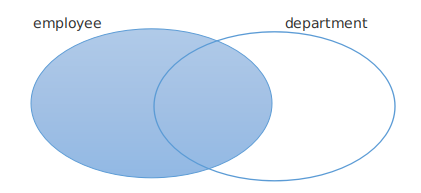
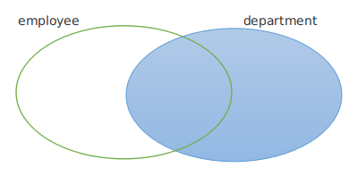

# MySql

## 配置

**deepin清理残留mysql**

```shell
$ sudo apt-get remove mysql-*
$ dpkg -l |grep ^rc|awk '{print $2}' |sudo xargs dpkg -P	# 查看残留mysql
```

**安装：**

```shell
$ sudo apt-get install mysql-server mysql-client
$ cat /etc/mysql/debian.cnf		# 查看用户名密码
$ mysql -u[user] -p	# 登录
# 设置密码
$ update user set plugin="mysql_native_password",authentication_string=password('新密码') where user="root";
```

**添加新用户**

```sql
mysql> select host,user,authentication_string from mysql.user;
mysql> create user 'mmall'@'localhost' identified by '123456';
mysql> flush privileges
```

**给某用户赋予某数据库权限**

```sql
mysql> grant all privileges on mmall.* to mmall@'localhost' identified by '123456';
```

**执行sql文件**

```sql
mysql> source /developer/mmall.sql
```

**查看版本号**

```
$ mysql --version
$ mysql -V
```

**登录同时打开数据库**

```
$ mysql -uroot -p -D db_name
```

**锁表**

如果发现锁表，通过查看进程id，杀死对应进程

```sql
MariaDB [(none)]> show full processlist;
MariaDB [(none)]> kill 131;
```

**添加新用户：user@host by 密码**

```sql
mysql> create user 'mmall'@'localhost'identified by '123456';
```

**给某用户，赋予某库的所有权限：**

```sql
mysql> grant all privileges on mmall.* to mmall@'localhost' identified by '123456';
```

**MySql配置文件：**

```shell
/etc/mysql/mysql.conf.d/mysqld.cnf
# 或
/etc/mysql/my.cnf
```

**本地远程访问Mysql：**

```sql
-- 首先在服务器端配置：先登录mysql
mysql> grant all privileges on *.* to 'root'@'%' identified by 'password';
mysql> flush privileges; 
-- *.*:某库某表；'user_name'@'ip地址'；'password'：设置远程登录的密码
-- 然后修改my.cnf,注释掉 bind-address = 127.0.0.1

-- 重启，生效
$ systemctl restart mysql
```

## 数据库操作

**创建数据库**

```sql
mysql> CREATE DATABASE [IF NOT EXISTS] db_name;
mysql> CREATE SCHEMA db_name;
-- 添加编码方式
mysql> CREATE DATABASE IF NOT EXISTS db_name DEFAULT CHARACTER SET UTF8;
```

**查看数据库的编码方式**

```sql
mysql> SHOW CREATE DATABASE db_name;
-- 修改数据库的编码方式
mysql> ALTER DATABASE db_name [DEFAULT] CHARACTER SET UTF8;
```

**查看、打开数据库**

```sql
mysql> SHOW DATABASES;
mysql> USE db_name;
-- 查看当前的数据库名
mysql> SELECT DATABASE();
```

**删库**

```sql
mysql> DROP DATABASE [IF EXISTS] db_name;
```

**在数据库下直接执行sql文件**

```sql
mysql> source /developer/setup/mmall.sql
```

## 数据表操作

数据表由行（row）和列（column）组成。

每个表，至少有一列，零行或多行。

#### MySql数据类型

#### 整型

| 整数型       | 字节                                        |
| ------------ | ------------------------------------------- |
| TINYINT      | 1（范围： -128~127）                        |
| SMALLINT     | 2（范围：  -32768~32767）                   |
| MEDIUMINT    | 3（范围： -8388608~8388607）                |
| INT          | 4（范围： -2147483648~2147483647）          |
| BIGINT       | 8                                           |
| BOOL,BOOLEAN | 1                                           |
| **浮点型**   | 自动四舍五入                                |
| FLOAT(M,D)   | 4（M：数字总位数；D：小数点后位数）         |
| DOUBLE(M,D)  | 8                                           |
| **定点数**   | 四舍五入会警告，若不声明(M,D)，默认保留整数 |
| DECIMAL(M,D) | 8（同DOUBLE，但是以字符串的形式存储）       |

#### 字符型

| 字符串类型 |                         |
| ---------- | ----------------------- |
| CHAR       | 固定长度（255个字符）   |
| VARCHAR    | 固定长度（65535个字符） |
| TINYTEXT   | 可变长度（255个字符）   |
| TEXT       | 可变长度（65535个字符） |
| MEDIUMTEXT | 可变长度                |
| LONGTEXT   | 可变长度                |

#### 时间

| 时间类型  |                                 |
| --------- | ------------------------------- |
| TIME      | 时间（14::00:30）               |
| DATE      | 日期（2019-7-26）               |
| DATETIME  | 日期时间（2019-7-26 14::00:30） |
| TIMESTAMP | 自动存储记录修改时间            |
| YEAR      | 1901~2155                       |

#### Enum和Set

- 都会默认删除多余空格；
- Enum字段，只能选取一个值；
- Set字段，可以选取多个值；

**建表**

```sql
mysql> CREATE TABLE IF NOT EXISTS tb_name(
	   字段名称 字段类型 [约束条件]，
	   字段名称 字段类型 [约束条件]，
       ...
       );
```

**约束条件**

- UNSIGNED：无符号；
- ZEROFILL：零填充，当显示长度不够，高位补0；默认自带UNSIGNED
- NOT NULL：非空约束，即此字段，不可以为NULL；
- DEFAULT：默认值，可以在赋值的时候，则使用DEFAULT；
- PRIMARY KEY：主键，标识一行的唯一性；一个表只能有一个主键（可以复合主键，多个字段组合为一个主键PRIMARY KEY（id,courseId））；
- UNIQUE KEY：唯一性，
- AUTO_INCREMENT：自动增长，在已有编号的基础上，进行增1；
- FOREIGN KEY：外键约束。

#### 选取合适的数据类型

比如我们建一张表：

用户编号id：【int】根据用户数量来定，数量比较大用

用户名username：【VARCHAR(20)】唯一

年龄 age：【TINYINT】 无符号

邮箱 email：【VARCHAR(50)】唯一

电话 tel：【CHAR(11)】11位，唯一

薪水 salary：【FLOAT(8,2)】总共8为，小数点后2位

是否结婚 married：【TINYINT(1)】布尔型 0未婚，1结婚

**创建一张表**

```sql
mysql> CREATE TABLE IF NOT EXISTS user(
    -> id INT UNSIGNED AUTO_INCREMENT COMMENT '用户编号',
    -> username VARCHAR(20) NOT NULL UNIQUE COMMENT '用户名',
    -> email VARCHAR(50) NOT NULL COMMENT '邮箱',
    -> age TINYINT NOT NULL DEFAULT 18 COMMENT '年龄',
    -> tel CHAR(11) NOT NULL UNIQUE COMMENT '电话',
    -> salary FLOAT(8,2) NOT NULL COMMENT '薪水',
    -> married TINYINT(1) NOT NULL DEFAULT 0 COMMENT '0未婚，1已婚',
    -> PRIMARY KEY(id)
    -> )ENGINE=INNODB CHARSET=utf8;
+----------+------------------+------+-----+---------+----------------+
| Field    | Type             | Null | Key | Default | Extra          |
+----------+------------------+------+-----+---------+----------------+
| id       | int(10) unsigned | NO   | PRI | NULL    | auto_increment |
| username | varchar(20)      | NO   | UNI | NULL    |                |
| email    | varchar(50)      | NO   |     | NULL    |                |
| age      | tinyint(4)       | NO   |     | 18      |                |
| tel      | char(11)         | NO   | UNI | NULL    |                |
| salary   | float(8,2)       | NO   |     | NULL    |                |
| married  | tinyint(1)       | NO   |     | 0       |                |
+----------+------------------+------+-----+---------+----------------+
```

**查看表结构**

```sql
-- 两种方式：查看表结构（列）
mysql> DESC user;
-- 查看表的详细信息
mysql> SHOW COLUMNS FROM user;
```

**查看表详细信息**

```sql
mysql> SHOW CREATE TABLE tb_name;
```

**插入记录**

```sql
mysql> INSERT INTO user(id,username,email,age,tel,salary,married)
	   VALUES(1,'zhang','222@qq.com',18,'13939393939','88888.88',0);
```

**查询表中所有记录**

```sql
mysql> SELECT * FROM user;
```

**枚举字段**

```sql
mysql> CREATE TABLE test_enum(
    -> sex ENUM('男','女','保密')
    -> );
-- 插入数据，下面两句，效果相同
mysql> INSERT test_enum(sex) VALUES('男');
mysql> INSERT test_enum(sex) VALUES(1);
```

**Set字段**

```sql
mysql> CREATE TABLE test_set(
    -> a SET('A','B','C','D')
    -> );
-- 插入数据，一个字段可以插入多个数据
mysql> INSERT test_set(a) VALUES('A');
mysql> INSERT test_set(a) VALUES('A,B');
+------+
| a    |
+------+
| A    |
| A,B  |
+------+
```

**时间类型**

```sql
--TIME类型
mysql> CREATE TABLE test_time(
    -> a TIME
    -> );
-- 下面两个形式，效果相同
mysql> INSERT INTO test_time(a) VALUES('12:23:22');
mysql> INSERT INTO test_time(a) VALUES('122322');

--DATE类型
mysql> CREATE TABLE test_date(
    -> a DATE
    -> );
-- 下面两个形式，效果相同，可以自由指定分隔符
mysql> INSERT test_date(a) VALUES('2019-7-25');
mysql> INSERT test_date(a) VALUES('2019#7#25');
-- 当前时间：
mysql> INSERT test_date(a) VALUES(now());

```

### 表结构操作

**修改表名**

RENAME TO关键字或者RENAME AS

```sql
mysql> ALTER TABLE user RENAME TO[AS] user1 
```

**添加、删除字段**

```sql
-- 添加字段到最后
mysql> ALTER TABLE user ADD username VARCHAR(20) NOT NULL;
-- 添加字段到某个位置 after
mysql>  ALTER TABLE user ADD password VARCHAR(20) NOT NULL AFTER id;
-- 添加字段到起始位置 first
mysql>  ALTER TABLE user ADD id INT UNSIGNED AUTO_INCREMENT COMMENT '用户编号' FIRST;
```

```sql
-- 删除字段
mysql> ALTER TABLE user DROP username;
```

**为字段添加、删除默认值**

```sql
-- 添加默认值
mysql> ALTER TABLE user ALTER email SET DEFAULT '222@qq.com';
-- 删除默认值
mysql> ALTER TABLE user ALTER email DROP DEFAULT;
```

**修改字段类型、属性 MODIFY**

MODIFY 不能修改表名，修改表名需要CHANGE

```sql
-- 修改字段属性用MODIFY
mysql> ALTER TABLE user MODIFY username VARCHAR(30) NOT NULL;
-- 添加FIRST，修改并放到表的第一列
mysql> ALTER TABLE user MODIFY username VARCHAR(30) NOT NULL FIRST;
```

**修改字段名称**

```sql
-- 如果同时修改表名，需要用CHANGE 
mysql> ALTER TABLE user CHANGE username user VARCHAR(20) NOT NULL; 
mysql> ALTER TABLE user CHANGE email userEmail VARCHAR(20) NOT NULL; 
```

**添加主键**

```sql
-- 也可以用MODIFY修改字段的属性来添加主键
mysql> ALTER TABLE user ADD PRIMARY KEY(id);
```

**删除主键**

如果此字段有AUTO_INCREMENT属性，应该先删除此属性，再删除PRIMARY KEY

```sql
+----------+------------------+------+-----+---------+----------------+
| Field    | Type             | Null | Key | Default | Extra          |
+----------+------------------+------+-----+---------+----------------+
| id       | int(10) unsigned | NO   | PRI | NULL    | auto_increment |

-- 上面字段，删除主键，先删除auto_increment
mysql> ALTER TABLE user MODIFY id INT UNSIGNED;

+----------+------------------+------+-----+---------+-------+
| Field    | Type             | Null | Key | Default | Extra |
+----------+------------------+------+-----+---------+-------+
| id       | int(10) unsigned | NO   | PRI | NULL    |       |

-- 删除auto_increment之后，再删除PRIMARY KEY
mysql> ALTER TABLE user DROP PRIMARY KEY;
```

**添加、删除唯一UNIQUE**

```sql
-- 删除username字段的唯一索引(这里要写索引名称而非字段名)
mysql> ALTER TABLE DROP INDEX username;

-- 添加唯一索引（通过字段名称添加）
mysql> ALTER TABLE ADD UNIQUE KEY(username);
-- 通过索引名称添加
mysql> ALTER TABLE ADD UNIQUE INDEX uni_username(username);
```

## 数据记录操作

#### MySql视图：

https://blog.csdn.net/hxnlyw/article/details/81669964

先建一张测试表：

```sql
mysql> CREATE TABLE IF NOT EXISTS user(
    -> id INT UNSIGNED AUTO_INCREMENT KEY COMMENT '用户编号',
    -> username VARCHAR(20) NOT NULL UNIQUE COMMENT '用户名',
    -> email VARCHAR(50) NOT NULL COMMENT '邮箱',
    -> age TINYINT NOT NULL DEFAULT 18 COMMENT '年龄',
    -> )ENGINE=INNODB CHARSET=utf8;
```

#### （1）添加记录

```sql
-- 不指定字段名称，必须给每一个字段赋值,NULL和DEFAULT都可以自动增长
mysql> INSERT INTO user VALUES(1,'zhang','222@qq.com',17);
mysql> INSERT INTO user VALUES(NULL,'Li','222@qq.com',17);
mysql> INSERT INTO user VALUES(DEFAULT,'wang','222@qq.com',17);

-- 列出指定字段
mysql> INSERT INTO user(username,email) VALUES('zhao','333@qq.com');

-- 一次添加多条记录
mysql> INSERT INTO user VALUES('liu','44@qq.com'),('z','44@qq.com'),('s','44@qq.com')

-- INSERT...SET...插入
mysql> INSERT INTO user SET username='a',email='55@qq.com';

-- 从别的表拿到数据，再插入
mysql> INSERT INTO user SELECT 字段名称 FROM tb_name;

-- 数据有可能已现在,IGNORE
mysql> INSERT IGNORE INTO user VALUES();
```

#### （2）修改记录

UPDATE.....WHERE

```sql
mysql> UPDATE user SET username='LiTao' WHERE username='Li';
-- 全表的记录所有年龄+10
mysql> UPDATE user SET age=age+10;
```

#### （3）删除记录

DELETE  FROM  tb_name......WHERE.....

```sql
mysql> DELETE FROM user WHERE id =4;
-- 不加WHERE，删除所有记录
mysql> DELETE FROM user;
```

**这样删除有一个问题：自增长的id字段，不会被维护**。

```sql
-- 删除，添加记录之前，使用此句
mysql> ALTER TABLE user AUTO_INCREMENT = 1;
```

#### （4）彻底清空表

删除表中的所有记录，并重置AUTO_INCREMENT

```sql
mysql> TRUNCATE user;
```

#### （5）查询记录、别名

SELETE.....FROM....

```sql
-- 查询所有记录
mysql> SELECT * FROM user;
-- 选中字段查询
mysql> SELECT username,age FROM user;
-- 给字段起别名
mysql> SELECT id AS '编号',username AS '用户名' FROM user;
-- 给表起别名
mysql> SELECT id,username FROM user AS u;
```

**\G 格式化操作**

```sql
mysql> select * from mmall_user\G
-- 按每条记录格式化输出
*************************** 1. row ***************************
         id: 1
   username: admin
   password: 427338237BD929443EC5D48E24FD2B1A
      email: admin@happymmall.com
      phone: 13800138000
   question: 问题
     answer: 答案
       role: 1
create_time: 2016-11-06 16:56:45
update_time: 2017-04-04 19:27:36
*************************** 2. row ***************************
         id: 13
   username: geely
   password: 08E9A6EA287E70E7E3F7C982BF7923AC
      email: geely@happymmall.com
      phone: 13800138000
   question: 问题
     answer: 答案
       role: 0
create_time: 2016-11-19 22:19:25
update_time: 2016-11-19 22:19:25
```

#### （6）WHERE条件

可以作为WHERE的条件：

1. 比较运算符 < , > , = , >= , <= , != , <> , <=>（检测NULL）

   ```sql
   mysql> SELECT id,username,age,email FROM user WHERE id=1;
   -- 所有id<9的age设置为10
   mysql> UPDATE user SET age=10 WHERE id<9; 
   -- 检测NULL值用：<=>、is NULL。null值不能直接用=检测
   mysql> SELECT id,username,age,email FROM user WHERE email <=> NULL; 
   mysql> SELECT id,username,age,email FROM user WHERE email IS [NOT] NULL; 
   ```

2. BETWEEN...AND...

   ```sql
   mysql> SELECT id,username,age,email FROM user WHERE age [NOT] BETWEEN 10 ADN 30; 
   ```

3.  IN(......)在此范围内

   ```sql
   mysql> SELECT id,username,age,email FROM user WHERE age IN (10,11,12,13);
   ```

4. 逻辑运算符 ADN、OR

   ```sql
   mysql> SELECT id,username,age,email FROM user WHERE age=10 AND id <10;
   mysql> SELECT id,username,age,email FROM user WHERE age=10 OR id <10;
   ```

#### （7）Like模糊查询

配合通配符来使用：（**默认忽略大小写**）

%（任意长度的字符串）

_（任意一个字符）

```sql
-- 查询所有username含有a的用户
mysql> SELECT id,username,age FROM user WHERE username LIKE '%a%';
-- 查询用户名长度为3的用户,三个下划线，表示长度三位的username
mysql> SELECT id,username,age FROM user WHERE username LIKE '___';
-- 查询开头为zh，且三个字符以上的username
mysql> SELECT id,username,age FROM user WHERE username LIKE 'zh_%';
```

**创建相同结构的表**：

```sql
-- 创建一个和user1表结构相同的表user2
mysql> CREATE TABLE user2 LIKE user1;
```

#### （8）GROUP BY分组 

```sql
-- 通过年龄分组
mysql> SELECT id,username,age,sex FROM user GROUP BY sex;
```

**GROUP_CONCAT( )函数**

```sql
-- 最后的sex可以改为3，表示按第三列sex分组
mysql> SELECT GROUP_CONCAT(username),age,sex FROM user1 GROUP BY sex;
-- 查询结果：将男女分类，并把username放在一起
+------------------------+-----+-----+
| GROUP_CONCAT(username) | sex | age |
+------------------------+-----+-----+
| Li                     | 女  |  17 |
| zhang,zhan,zha         | 男  |  17 |
+------------------------+-----+-----+
```

**GROUP BY配合聚合函数**：

1. COUNT（）
2. SUM()
3. MAX（）
4. MIN（）
5. AVG（）
6. CONCAT（）拼接或者 ||

```sql
-- COUNT：
mysql> SELECT GROUP_CONCAT(username) AS users,COUNT(*) AS '人数',age,sex FROM user1 GROUP BY sex;
+----------------+--------+-----+-----+
| users          | 人数   | age | sex |
+----------------+--------+-----+-----+
| Li             |      1 |  17 | 女  |
| zhang,zhan,zha |      3 |  17 | 男  |
+----------------+--------+-----+-----+

-- AVG：求平均值
mysql> SELECT GROUP_CONCAT(username) AS users,COUNT(*) AS '人数',AVG(age) AS 'averageAge' ,sex FROM user1 GROUP BY sex;
+----------------+--------+------------+-----+
| users          | 人数   | averageAge | sex |
+----------------+--------+------------+-----+
| Li             |      1 |    17.0000 | 女  |
| zhang,zhan,zha |      3 |    17.0000 | 男  |
+----------------+--------+------------+-----+
```

**HAVING子句，对分组结果进行二次筛选**

```sql
-- 二次筛选，只列出总人数大于2的行。
mysql> SELECT GROUP_CONCAT(username) AS users,COUNT(*) AS '人数',age,sex FROM user1 GROUP BY sex HAVING COUNT(*) > 2;

+----------------+--------+-----+-----+
| users          | 人数   | age | sex |
+----------------+--------+-----+-----+
| zhang,zhan,zha |      3 |  17 | 男  |
+----------------+--------+-----+-----+
```

#### （9）ORDER BY 排序

```sql
-- 按照age升序排列，ASC可以不写
mysql> SELECT * FROM user1 ORDER BY age ASC;
-- 按照age，降序排列
mysql> SELECT * FROM user1 ORDER BY age DESC;
-- 按照多个字段排序，先按照age，age相同，按照id升序
mysql> SELECT * FROM user1 ORDER BY age ASC,id ASC ;
```

实现随机查询记录

```sql
-- 顺序随机
mysql> SELECT * FROM user1 ORDER BY RAND();
```

#### （10）LIMIT分页

限制结果集显示条数，实现分页的核心

1. LIMIT n：显示结果集的前n条记录；

   ```sql
   -- 显示前5条记录
   mysql> SELECT * FROM user1 LIMIT 5;
   ```

2. LIMIT n , offset（分页核心）

   ```sql
   -- 偏移量显示
   -- 第一页：从第1条开始，显示2条记录
   mysql> SELECT * FROM user1 LIMIT 0,2;
   -- 第二页：从第3条开始，显示2条记录
   mysql> SELECT * FROM user1 LIMIT 2,2;
   -- 第三页：从第5条开始，显示2条记录
   mysql> SELECT * FROM user1 LIMIT 4,2;
   ```


#### （11）IFNULL内置函数

在MyBatis中，如果需要返回一个sum总和，并用int接受，我们可以用到IFNULL函数

```java
int getCartProductCount(Integer userId);
```

不使用IFNULL，如果查询结果为空，就会返回NULL，int值是接收不到的。

IFNULL函数可以将NULL值替换成0返回。

```xml
<select id="getCartProductCount" parameterType="int">
    select
    IFNULL(sum(quantity),0)
    from mmall_cart
    where user_id = #{userId}
</select>
```

#### （12）distinct

找出所有员工当前(to_date='9999-01-01')具体的薪水salary情况，对于相同的薪水只显示一次,并按照逆序显示

distinct：去除重复

```sql
select distinct salary-- 去除重复
from salaries
where to_date = '9999-01-01'
order by
salary
desc
```

#### （13）触发器trigger

在向employees_test表中插入一条数据的时候，触发插入相关的数据到audit中

1. 用 BEFORE或AFTER 来指定在执行后面的SQL语句之前或之后来触发TRIGGER
2. 触发器执行的内容写出 BEGIN与END 之间

参考https://www.runoob.com/sqlite/sqlite-trigger.html

```sql
create trigger audit_log after insert on employees_test
begin
     insert into audit values(new.id,new.name);
end;
```

## 多表查询

笛卡尔积、外连接、内连接

演示多表查询，新建两个表：

```sql
-- 员工表
CREATE TABLE IF NOT EXISTS emp(
id INT UNSIGNED AUTO_INCREMENT KEY COMMENT '用户编号',
username VARCHAR(20) NOT NULL UNIQUE COMMENT '用户名',
age TINYINT NOT NULL DEFAULT 18 COMMENT '年龄',
sex VARCHAR(10) NOT NULL COMMENT '性别',
addr VARCHAR(20) NOT NULL DEFAULT '北京',
depId tinyint unsigned not null comment '对应部门编号'
)ENGINE=INNODB CHARSET=utf8;
+----+----------+-----+-----+--------+-------+
| id | username | age | sex | addr   | depId |
+----+----------+-----+-----+--------+-------+
|  1 | king     |  24 | 男  | 北京   |     3 |
|  2 | qing     |  24 | 男  | 北京   |     2 |
|  3 | liu      |  24 | 女  | 北京   |     1 |
|  4 | sao      |  24 | 女  | 北京   |     4 |
|  5 | zhao     |  24 | 男  | 北京   |     2 |
|  6 | que      |  24 | 男  | 北京   |     4 |
|  7 | wang     |  24 | 女  | 北京   |     1 |
+----+----------+-----+-----+--------+-------+
-- 部门表
CREATE TABLE IF NOT EXISTS dep(
id tinyint unsigned auto_increment KEY comment '部门编号',
depName varchar(50) not null unique comment '部门名称',
depDesc varchar(100) not null default '' comment '部门职责'
)ENGINE=INNODB CHARSET=utf8;
+----+---------+------------+
| id | depName | depDesc    |
+----+---------+------------+
|  1 | PHP     | php研发    |
|  2 | JAVA    | JAVA研发   |
|  3 | C++     | C++研发    |
|  4 | JS      | JS研发     |
+----+---------+------------+
-- 然后 插入若干记录
```

#### （1）笛卡尔积

会出现重复查询的结果。

```sql
mysql> select emp.username,emp.age,emp.sex,dep.depDesc from emp,dep;
-- 这条查询结果为24条，是两个表的总记录的积。
```

#### （2）INNER JOIN 内连接（用的最多）

取交集（可以省略INNER）

```sql
-- 内连接的ON条件，是查询的条件
-- 即：emp的depId，在dep中对应找到id
mysql> SELECT e.id,e.username,e.age,d.depName 
    -> FROM emp AS e
    -> JOIN dep AS d
    -> ON e.depId = d.id;
+----+----------+-----+---------+
| id | username | age | depName |
+----+----------+-----+---------+
|  1 | king     |  24 | C++     |
|  2 | qing     |  24 | JAVA    |
|  3 | liu      |  24 | PHP     |
|  4 | sao      |  24 | JS      |
|  5 | zhao     |  24 | JAVA    |
|  6 | que      |  24 | JS      |
|  7 | wang     |  24 | PHP     |
+----+----------+-----+---------+
```

#### （3）OUTER JOIN外连接

分为：左外连接（LEFT JOIN）、右外连接（RIGHT JOIN）

为了显示出效果，我们添加一条新记录：**部门id：7是不存在的**

```sql
mysql> INSERT emp values(NULL,'niu',20,'女','上海',7);
```

1. **LEFT JOIN**（可以省略OUTER）

   以左表为主，显示所有数据，补充右表的交集数据。

   

   ```sql
   mysql> SELECT e.id,e.username,e.age,
       -> d.depName,d.depDesc
       -> FROM emp AS e
       -> LEFT OUTER JOIN dep AS d
       -> ON e.depId = d.id;
   +----+----------+-----+---------+------------+
   | id | username | age | depName | depDesc    |
   +----+----------+-----+---------+------------+
   |  3 | liu      |  24 | PHP     | php研发    |
   |  7 | wang     |  24 | PHP     | php研发    |
   |  2 | qing     |  24 | JAVA    | JAVA研发   |
   |  5 | zhao     |  24 | JAVA    | JAVA研发   |
   |  1 | king     |  24 | C++     | C++研发    |
   |  4 | sao      |  24 | JS      | JS研发     |
   |  6 | que      |  24 | JS      | JS研发     |
   |  8 | niu      |  20 | NULL    | NULL       |
   +----+----------+-----+---------+------------+
   -- 发现：左表数据全部查出来了，在左表数据的基础上，查询右表，不存在的，显示NULL
   ```

2. **RIGHT JOIN**

   以右表为主，显示所有数据，补充左表的交集数据。

   

   ```sql
   mysql> SELECT e.id,e.username,e.age,
       -> d.depName,d.depDesc
       -> FROM emp AS e
       -> RIGHT OUTER JOIN dep AS d
       -> ON e.depId = d.id;
   +------+----------+------+---------+------------+
   | id   | username | age  | depName | depDesc    |
   +------+----------+------+---------+------------+
   |    1 | king     |   24 | C++     | C++研发    |
   |    2 | qing     |   24 | JAVA    | JAVA研发   |
   |    3 | liu      |   24 | PHP     | php研发    |
   |    4 | sao      |   24 | JS      | JS研发     |
   |    5 | zhao     |   24 | JAVA    | JAVA研发   |
   |    6 | que      |   24 | JS      | JS研发     |
   |    7 | wang     |   24 | PHP     | php研发    |
   +------+----------+------+---------+------------+
   -- 发现：以右表为主，左表的数据并没有全部显示(少了第8条数据)！
   ```

#### 小练习（实际不要用，多表查询效率低）

我们的表中，地址一列，建议新建一张表；比如上面的emp表中的地址，北京要修改为首都，那么要改7条记录。

如果我们的地址单独一张表，将地址表中的id放入emp表，那么只需要修改地址表中的北京为首都，这一条记录，就可以了。

**为了提高修改和查询效率，我们通常把大表，分割成多个小表，这样就会经常用到多表联查的情况**

建这样四个表

```sql
-- 省份
CREATE TABLE provinces(
id TINYINT UNSIGNED AUTO_INCREMENT KEY,
proName VARCHAR(10) NOT NULL UNIQUE
);
-- admin表
CREATE TABLE admin(
id TINYINT UNSIGNED AUTO_INCREMENT KEY,
username VARCHAR(20) NOT NULL UNIQUE,
email VARCHAR(50) NOT NULL DEFAULT '2312@qq.com',
proId TINYINT UNSIGNED NOT NULL
);
-- cate表，分类
CREATE TABLE cate(
id TINYINT UNSIGNED AUTO_INCREMENT KEY,
cateName VARCHAR(40) NOT NULL UNIQUE,
cateDesc VARCHAR(100) NOT NULL DEFAULT ''
);
-- 商品表
CREATE TABLE products(
id INT UNSIGNED AUTO_INCREMENT KEY,
productName VARCHAR(50) NOT NULL UNIQUE,
price FLOAT(8,2) NOT NULL DEFAULT 0,
cateId TINYINT UNSIGNED NOT NULL,
adminId TINYINT UNSIGNED NOT NULL
);
```

1. **三表联查**

   ```sql
   mysql> SELECT p.id,p.productName AS '产品',p.price AS '价格',
   		c.cateName AS '分类',a.username AS '管理员'
       -> FROM products AS p
       -> JOIN admin AS a
       -> ON p.adminId = a.id
       -> JOIN cate AS c
       -> ON c.id = p.cateId;
   +----+---------+---------+--------+-----------+
   | id | 产品     | 价格     | 分类   | 管理员     |
   +----+---------+---------+--------+-----------+
   |  1 | iphone9 | 9888.00 | 电子   | king      |
   |  2 | nike    |  888.00 | 服装   | queen     |
   |  3 | adidas  |  999.00 | 服装   | queen     |
   |  4 | 奶瓶     |  288.00 | 母婴   | king      |
   +----+---------+---------+--------+-----------+
   ```

2. **四表联查**

   ```sql
   mysql> SELECT p.id,p.productName AS '产品',p.price AS '价格',
   		c.cateName AS '分类',a.username AS '管理员', pro.proName AS '城市'
       -> FROM products AS p
       -> JOIN cate AS c
       -> ON c.id = p.cateId
       -> JOIN admin AS a
       -> ON p.adminId = a.id
       -> JOIN provinces AS pro
       -> ON a.proId=pro.id;
   +----+---------+---------+--------+-----------+--------+
   | id | 产品     | 价格    | 分类    | 管理员     | 城市   |
   +----+---------+---------+--------+-----------+--------+
   |  1 | iphone9 | 9888.00 | 电子   | king      | 北京   |
   |  2 | nike    |  888.00 | 服装   | queen     | 上海   |
   |  3 | adidas  |  999.00 | 服装   | queen     | 上海   |
   |  4 | 奶瓶     |  288.00 | 母婴   | king      | 北京   |
   +----+---------+---------+--------+-----------+--------+
   ```


## 外键约束

#### 为什么要使用外键？

**保证数据的一致性和完整性**。

在不使用外键的情况下，两个相关联的表，有可能出现脏数据，就比如下面的两个表，没有外键，可以插入脏数据。

只有 InnoDB支持外键，子表的外键，必须关联主表的主键。

先建两张表：news（子表）和 new_cate（主表）

```sql
-- 新闻分类表new_cate
CREATE TABLE news_cate(
id 	TINYINT UNSIGNED AUTO_INCREMENT KEY,
cateName VARCHAR(50) NOT NULL UNIQUE,
cateDesc VARCHAR(100) NOT NULL DEFAULT ''
);
INSERT news_cate(cateName) values('国内新闻'),('国际新闻'),('娱乐新闻'),('体育新闻');

-- 新闻表news
CREATE TABLE news(
id INT UNSIGNED AUTO_INCREMENT KEY comment '新闻编号',
title VARCHAR(100) NOT NULL UNIQUE COMMENT '新闻标题',
cateId TINYINT NOT NULL COMMENT '新闻分类'
);
INSERT news(title,cateId) values('aa',1),('bb',2),('cc',1),('dd',4),('ee',3),('ff',4);

-- 在没有外键关联的情况下，是可以插入脏数据的，如：插入了新闻id为10的数据，但是新闻分类没有10
INSERT news(title,cateId) values('zz',10);
```

#### 外键的两种添加方式

1. **创建表时指定外键**

   CONSTRAINT 外键名 FOREIGN KEY(cateId)  REFERENCES  news_cate(id)

```sql
-- 新闻表news，添加外键
CREATE TABLE news(
id INT UNSIGNED AUTO_INCREMENT KEY comment '新闻编号',
title VARCHAR(100) NOT NULL UNIQUE COMMENT '新闻标题',
cateId TINYINT NOT NULL COMMENT '新闻分类',
[CONSTRAINT fk_news_cate]FOREIGN KEY(cateId) REFERENCES news_cate(id)
);
-- 加入外键后，尝试插入脏数据，会插入失败
INSERT news(title,cateId) values('aa',10);
```

2. **动态添加外键（有脏值无法添加成功）**

```sql
-- 同样创建两张表,不在表内关联   
mysql> alter table news ADD [constraint fk_news_cate] foreign key(cateId) references 			news_cate(id);
```

3. **动态删除外键**

```sql
mysql> alter table news drop foreign key fk_news_cate;
```

4. **外键约束的参照操作：**

就是说，当主表更新、删除的时候，子表怎么办？这里有几个选项：

**CASCADE**：级联操作（当主表更新，子表跟着更新）

```sql
-- 在添加外键的时候，指定操作
mysql> alter table news 
    -> ADD constraint fk_news_cate foreign key(cateId) references news_cate(id)
    -> ON DELETE CASCADE ON UPDATE CASCADE;
-- 这样我们修改主表的记录，子表跟着更新
-- 我们将国内新闻id，修改为10，子表会自动修改
+----+-------+--------+
| id | title | cateId |
+----+-------+--------+
|  2 | aa    |     10 |
|  3 | bb    |      2 |
|  4 | cc    |     10 |
|  5 | dd    |      4 |
|  6 | ee    |      3 |
|  7 | ff    |      4 |
+----+-------+--------+
```

**SET NULL**：从主表删除更新记录，子表对应位置设置为NULL（前提子表外键没有NOT NULL）

**NO ACTION 【RESTRICT】**：拒绝对主表进行更新或删除操作

## 特殊查询

### 子查询（待完善）

内层查询语句的结果，作为外层查询的条件。

子查询必须放在括号内。

可以使用IN、比较远算符、EXISTS、ANY SOME ALL

还是使用emp、dep两个表来举例：

```sql
mysql> select * from emp where depId not in (select id from dep);
+----+----------+-----+-----+--------+-------+
| id | username | age | sex | addr   | depId |
+----+----------+-----+-----+--------+-------+
|  8 | niu      |  20 | 女  | 上海   |     7 |
+----+----------+-----+-----+--------+-------+
```

**表和表之间的插入操作**

将一个表的记录，加入到另一个表：

```sql
-- ①：在建表的同时，插入了另一个表的记录
CREATE TABLE user_1(
id TINYINT UNSIGNED AUTO_INCREMENT KEY,
username VARCHAR(20) NOT NULL
)SELECT id,username FROM emp;

-- ②：INSERT SELECT(将已有表的内容插入到另一张表)
mysql> INSERT user_1(username) SELECT username FROM emp;
-- 将emp表中id=5的记录，插入user_1表
mysql> INSERT user_1 SET username = (SELECT username FROM emp WHERE id = 5);
```

### 联合查询

UNION（自动去除重复数据）、UNION ALL（简单合并，不采取其他操作）

多个表一起查询

```sql
-- UNION 会自动合并完重复的数据
SELECT * FROM user_1
UNION
SELECT * FROM emp;
```

### 自身连接查询（无限极分类）

淘宝的导航，就是无限极分类的实现。

## MySql存储引擎

### MyISAM

MyISAM的表在磁盘中产生三个文件：.frm（表结构文件）、.MYD（数据文件）、.MYI（索引文件）

单表最大数据量：2的64次方的记录量。

每个表最多可以建立64个索引。

### InnoDB

1. 遵循ACID模型、支持事务、具有从服务崩溃中恢复的能力、能够最大限度保护用户数据

2. ACID：

   原子性（Atomic）

   一致性（Consistency）

   隔离性（Isolation）

   持久性（Durability）

3. 支持行级锁，提升多用户并发的读写性能。

4. 支持外键，保证数据的一致性和完整性

5. InnoDB拥有独立的缓冲池，常用的数据和索引都在缓存中。

6. 创建InnoDB表之后，会产生两个文件：.frm（表结构文件）、.ibd（数据和索引存储表空间中）

### Myisam和Innodb的区别

##### Myisam

非事务的存储引擎，适合用于频繁查询的应用.(表锁,不会出现死锁)

- 适合小数据，小并发

##### Innodb

持事务的存储引擎，合于插入和更新操作比较多的应用.(行锁)

- 适合大数据，大并发

### 如何Sql优化

##### 1.**选择正确的存储引擎**

##### 2.**优化字段的数据类型**

- 数据类型越小的列会越快,可以用TINYINT / SMALLINT / MEDIUMINT 代替INT

##### 3.**为搜索字段添加索引**

- 索引并不一定就是给主键或是唯一的字段。如果在你的表中，有某个字段你总要会经常用来做搜索，那么最好是为其建立索引，除非你要搜索的字段是大的文本字段，那应该建立全文索引。

##### 4.**避免使用Select  *从数据库里读出多余的数据**

- 尽量不要使用通配符

##### 5.使用 ENUM 而不是 VARCHAR

##### 6.尽可能的使用 NOT NULL

##### 7.固定长度的表会更快

- 固定长度的表会提高性能，因为MySQL搜寻得会更快一些，因为这些固定的长度是很容易计算下一个数据的偏移量的，所以读取的自然也会很快。

- 固定长度的字段会浪费一些空间，因为定长的字段无论你用不用，他都是要分配那么多的空间。

