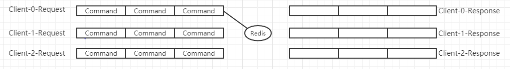
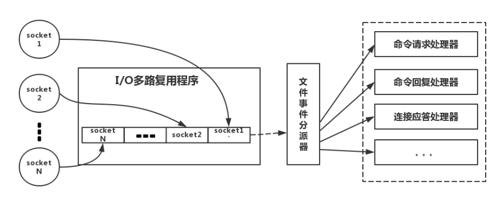
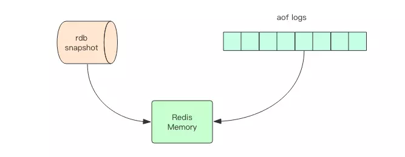
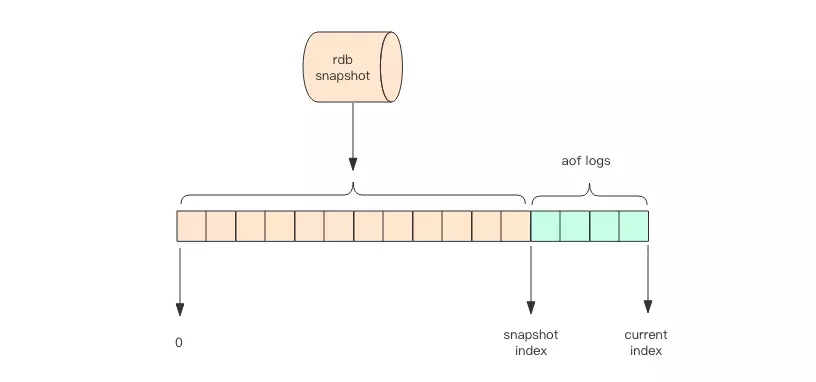

# Redis :)

 https://www.cnblogs.com/rjzheng/p/9096228.html 

# 概述

1. 安装

```bash
# 解压
$ tar zxvf redis-4.0.14.tar.gz
$ cd redis-4.0.14/
$ make
# Hint: It's a good idea to run 'make test' ;)
$ cd src/
$ sudo make install
```

2. 后台启动

```bash
vim redis.conf
daemonize yes
$cd src/
$./redis-server
# 指定配置文件启动
$./redis-server ../redis.conf
```

3. 客户端交互

```bash
$./redis-cli -h host -p port -a passwd
127.0.0.1:6379> auth 123456  # 输入密码
```

4. 关闭

```bash
$./src/redis-cli shutdown
```

5. 清空数据

```bash
127.0.0.1:6379> flushdb   # 清空当前库
127.0.0.1:6379> flushall  # 清空整个redis
```

## 为什么用Redis

 主要是从两个角度去考虑:**性能**和**并发** 

### 1. 性能

- 有些sql执行时间太久，并且不需要经常变动；这样的查询结果就比较适合放入缓存；后续请求，就不要进数据库；大大提高响应速度；
- 操作缓存就是直接操作内存，所以速度相当快。

~~~
响应用户体验：
页面跳转——1ms
页内操作——0.5ms
超过5s的操作，要有进度条提示，并且可随时中止取消
~~~

### 2. 并发

- 直接操作缓存能够承受的请求是远远大于直接访问数据库的

- 大量的请求要进入数据库，数据库性能不足以支撑；

  让请求先访问缓存，不能直接命中的，再查询数据库；

## Redis单线程模型

Redis使用单线程+多进程的方案；

### 模型



- Redis每个客户端都有一个指令队列，同一队列的指令顺序执行，响应类似；
- 不同队列之间由Redis的单线程Epoll多路复用切换处理；
- 一个Redis实例同一时刻只会处理一个命令或响应；

实际的Redis线程模型：



- Client产生不通过事件类型的socket；
- 服务端（Redis实例）的I/O多路复用程序，会将socket置入队列之中；
- 文件事件派分器，依次从队列中取出socket转发到不同的事件处理器中；

### 高性能

Redis的单线程如何保证其高性能？

#### 1. 纯内存访问

正是因为Redis是基于内存，CPU不是限制Redis速度的瓶颈，内存大小才是限制Redis的瓶颈，所以直接采用单线程即可，而且实现简单；

#### 2. 避免了线程切换

线程切换一定有性能损耗，避免线程切换；

避免竞态（加锁降低性能）的资源消耗；

#### 3. I/O多路复用

采用非阻塞I/O的Epoll多路复用技术—即：让单线程处理多个连接请求；

多路-指的是多个socket连接，复用-指的是复用一个线程 

## Redis基本命令

1. exists：查看是否存在

   返回1：存在；0：不存在

   ```shell
   master:6379> exists key1
   (integer) 1
   ```

2. ttl：查看key剩余有效时间

   -1：永久有效；

   -2：已经失效；

   ```shell
   master:6379> ttl key1
   (integer) -1
   ```

3. expire：设置key的过期时间

   ```shell
   master:6379> expire key1 10
   (integer) 1	# 设置成功
   master:6379> ttl key1
   (integer) 8	# 还剩8秒
   master:6379> ttl key1
   (integer) -2	# 永久失效
   master:6379> get key1
   (nil)
   ```

4. PX：set的同时，设置过期时间

5. NX：只在键不存在时，才对键进行设置操作。 

6. persist：移除key的过期时间；变成永久key

7. del key：删除key

# Redis数据类型

### String

set/get

```bash
127.0.0.1:6379> select 0
OK
127.0.0.1:6379> set key_1 value_1
OK
127.0.0.1:6379> get key_1
"value_1"
```

批处理mget/mset

```bash
127.0.0.1:6379> mset name gdx age 17 data 9102-1-1
OK
127.0.0.1:6379> mget name age data
1) "gdx"
2) "17"
3) "9102-1-1"
```

incr/decr

```bash
127.0.0.1:6379> incr age   # 自增1
(integer) 18
127.0.0.1:6379> decr age   # 自减1
(integer) 17
```

#### 场景

String应用于常规key-value缓存应用； 常规计数：微博数，粉丝数等。

### Hash

（无序散列表）

【key field value】 存储结构化数据（相当于mysql中的一个table）

key：表名；

field：字段名；

hget / hset

```bash
127.0.0.1:6379> hset user name ly
(integer) 1
127.0.0.1:6379> hget user name
"ly"
```

hmset  /  hmget  /  hgetall

```bash
127.0.0.1:6379> hmset user age 17 gender male
OK
127.0.0.1:6379> hmget user age gender	# fields
1) "17"
2) "male"
127.0.0.1:6379> hgetall user	# key
1) "age"
2) "17"
3) "gender"
4) "male"
```

hexists(查看是否存在某key下的field)  /  hlen（查看user表数据量）

```bash
127.0.0.1:6379> hexists user age
(integer) 1
127.0.0.1:6379> hlen user
(integer) 2
```

#### 场景

- hash 特别适合用于存储对象、
- 比如我们可以使用hash 数据结构来存储用户信息，商品信息等等。
- 可以在单点登陆的时候，用hash存储用户信息，模拟session

### List

List的实现为一个双向链表，即可以支持反向查找和遍历；

多用于实现双端出入的队列；

【list key vlaue】

**rpush（**从list右侧依次插入）

**lpush**（从左侧依次插入）

**lrange**（输出所有list下的所有key）

**rpop**（从右侧弹出一个key）

```bash
127.0.0.1:6379> rpush fruit apple banana pear
(integer) 3
127.0.0.1:6379> lpush fruit orange  
(integer) 4
127.0.0.1:6379> lrange fruit 0 -1    # 遍历全部
1) "orange"
2) "apple"
3) "banana"
4) "pear"
127.0.0.1:6379> rpop fruit            # 弹出pear
"pear"
127.0.0.1:6379> lrange fruit 0 -1     
1) "orange"
2) "apple"
3) "banana"
```

#### 场景

- 多数的列表场景，粉丝列表，消息列表，关注列表等结构，都可以使用List实现
- 可以用range命令，做基于Redis的分页，性能极好；

### set

无序集合，用于全局去重，通过交集，差集，并集等计算公共喜好；

【set1  member 】

无序集合 集合成员唯一 

```bash
127.0.0.1:6379> sadd nums_1 1 2 1
(integer) 2
127.0.0.1:6379> smembers nums_1        # 查看成员
1) "1"
2) "2"
127.0.0.1:6379> sinter nums_1 nums_2   # 查看交集
1) "1"
127.0.0.1:6379> sunion nums_1 nums_2	 # 求并集
1) "1"
2) "2"
3) "3"
127.0.0.1:6379> sdiff nums_1 nums_2	 # 求差集 nums_1有，nums_2 没有
1) "2"
```

#### 场景

和List的场景类似，但是set自动去重；

- 当需要存储列表数据，又不希望有重复数据的时候，使用set；
- 可以通过set的交集，实现共同关注，共同喜好等功能；

### sorted set

（有序集合类型，增加了score权重参数）

有序集合 集合成员唯一 （按score排序）

```bash
127.0.0.1:6379> zadd nums 100 a   # 添加'a'，score为100
(integer) 1
127.0.0.1:6379> zadd nums 99 b
(integer) 1
127.0.0.1:6379> zrange nums 0 -1
1) "b"
2) "a"
127.0.0.1:6379> zrange nums 0 -1 withscores
1) "b"
2) "99"
3) "a"
4) "100"
127.0.0.1:6379> zrangebyscore nums 99 100  # 查找分数在【99-100】内的成员
1) "b"
2) "a"

```

#### 场景

- 在直播场景中，实时的粉丝排行，礼物排行等等需要排序的场景，可以使用Sorted Set；

## Redis数据结构

# Redis过期策略

Redis采用：**定期删除+惰性删除**来对过期的key进行处理；

### 定期删除

首先在设置key的时候，都可以给定一个expire time（过期时间），指定key的存活时间；

但是：Redis并不会监控这些key，到期就删除，

而是：Redis回每隔100ms**随机抽取**一些具有过期时间的key，进行检测是否过期，如果过期就删除；

存在问题：既然是随机抽取，就会出现很多到期的key，并没有被抽到，从而没有被删除；

这就需要惰性删除了；

### 惰性删除

每当获取某个key的时候，Redis都会进行检查是否设置了过期时间，是否过期；

存在问题：仍然有可能过期的key，既没有定期删除，也没有被请求访问，导致过期key一直占用内存，就会有内存耗尽的可能；

这就需要内存淘汰机制了；

# Redis内存淘汰机制

过期策略存在无法解决的key，可能导致redis内存耗尽；

这时候就需要：内存淘汰策略（多种淘汰策略）

~~~shell
# 配置内存淘汰策略
maxmemory-policy volatile-lru
~~~

- noeviction：当内存不足以容纳新写入数据时，新写入操作会报错；（不推荐）
- allkeys-lru：当内存不足以容纳新写入数据时，在键空间中，移除最近最少使用的key；（推荐）
- volatile-lru：当内存不足以容纳新写入数据时，在设置了过期时间的键空间中，移除最近最少使用的key（不推荐）
- allkeys-random：当内存不足以容纳新写入数据时，在键空间中，随机移除某个key；（不推荐）
- volatile-random：当内存不足以容纳新写入数据时，在设置了过期时间的键空间中，随机移除某个key（不推荐）
- volatile-ttl：当内存不足以容纳新写入数据时，在设置了过期时间的键空间中，有更早过期时间的key优先移除；（不推荐）

# Redis持久化机制

redis持久化功能可以避免进程退出造成的数据丢失问题，可以利用持久化的文件实现数据恢复

redis支持两种持久化：RDB（快照），AOF（日志），4.0之后引入混合持久化



### RDB

- 快照是一次性全量备份
- 快照是内存数据的二进制序列化形式，存储上紧凑；

如何保证Redis在响应请求的情况下，还能进行文件IO操作进行持久化？

- Redis通过操作系统的COW（Copy On Write）机制，启动一个子进程来完成持久化的操作；
- 子进程和父进程共享内存数据，主进程继续处理请求；

### AOF

特点：

- 日志是连续的增量备份，写入操作时append；
- 日志记录的触发策略：（1）每秒同步（2）每次修改同步—修改自动触发同步，安全效率低；
- Redis宕机，重启则重放日志的指令，完成数据恢复；

实现：

修改配置文件：

```
appendonly：三个值（no，always，everysec）对应（不开启，修改同步，每秒）
appendfilename "appendonly.aof"	# 日志文件位置
```


如何解决AOF日志扩大？—AOF重写

### 混合持久化



RDB和AOF的缺点：

# Redis事务

https://www.cnblogs.com/DeepInThought/p/10720132.html

### 概念

Redis事务本质是一系列命令的集合；

一个事务的所有命令都会序列化，事务执行过程中，会串行化执行命令；

- 一次性，顺序性，排他性的执行一个队列中的一系列命令；
- Redis事务没有隔离级别的概念；
- 单个Redis实例在执行事务期间，不会响应其他客户端；
- 

### 执行过程

1. 开始事务—multi
2. 命令入队—多条命令
3. 放弃事务—discard
4. 执行事务—exec

### 执行成功条件

- 命令正确—执行成功

- 命令性错误（不存在此命令）—exec执行失败

  ```shell
  127.0.0.1:6379> multi
  OK
  127.0.0.1:6379> set k2 v2
  QUEUED
  127.0.0.1:6379> setget
  (error) ERR unknown command 'setget'
  127.0.0.1:6379> exec
  (error) EXECABORT Transaction discarded because of previous errors.
  ```

- 命令语法错误（命令正确，无法执行）—执行成功

  ```shell
  127.0.0.1:6379> multi
  OK
  127.0.0.1:6379> set name kit
  QUEUED
  127.0.0.1:6379> incr name	# 此命令不会执行，自动被忽略
  QUEUED
  127.0.0.1:6379> exec
  1) OK
  2) (error) ERR value is not an integer or out of range
  127.0.0.1:6379> get name	# 事务依然成功
  "kit"
  ```

# 缓存和数据库双写一致性问题

 https://www.cnblogs.com/rjzheng/p/9041659.html 

# 缓存雪崩问题

缓存雪崩：同一时间缓存大面积失效，导致大量请求进入数据库，导致数据库崩溃；

解决方法：

1. 在设置缓存的失效时间，加上一个随机值，避免集体失效；
2. 

# 缓存击穿问题 

缓存击穿：恶意用户故意模拟大量的缓存中不存在的数据，导致大量请求进入数据库，导致数据库异常；

解决方法：

#### 使用互斥锁：

在请求某key没有命中的时候，锁上，再进行后续的数据库操作；（分布式环境使用分布式锁）

虽然一定程度上降低了数据库的压力，但是吞吐量降低了；（此方法高并发不可用）

#### 接口限流、降级、熔断

重要接口做好限流策略；做好降级准备；当某些服务不可用的时候，进行熔断；

#### 布隆过滤器


# 缓存的并发竞争问题 

出现问题：多个子系统对同一个redis-server进行set一个key；

对这个key的操作如果不要求顺序：

可以加一个分布式锁，大家抢锁，进行操作；

要求顺序：

多个子系统顺序设置此key，利用时间戳，每次set设置一个时间戳；

# Redis高可用

 https://blog.csdn.net/weixin_42711549/article/details/83061052 

## Redis主从

分为：

- **全量同步**：slave初始化阶段，将master上所有的数据复制一份；
- **增量同步**：初始化完成之后，master发生的写操作，都会同步到slave

同步策略：

- 如果**增量同步**不成功，slave可以在任何时间发起**全量同步**；

- slave重启，自动发起**全量同步**

  （如果多个slave宕机，重启，会导致master IO剧增，可能宕机）

slave添加如下配置：

```shell
# slaveof <masterip> <masterport>
```

然后重启即可；

缺陷：

- 一旦主节点宕机，需要手动将slave提升为master，各个应用要更新主节点地址；（致命）

## Redis哨兵


## Redis集群


# Redis场景

参考：

<https://github.com/doGdx/CS-Notes/blob/master/docs/notes/Redis.md>

# 面试

- 为什么要用 redis / 为什么要用缓存（高性能、高并发）

  - 见`为什么使用Redis`

- redis 常见数据结构以及使用场景分析（**String、Hash、List、Set、Sorted Set**）

  - 见`Redis数据类型`

- redis 设置过期时间

  - `expire key`设置过期时间
  - 见`Redis基本命令`

- redis 内存淘汰机制（**MySQL里有2000w数据，Redis中只存20w的数据，如何保证Redis中的数据都是热点数据？**）

  - 意思就是：redis满了，怎么去淘汰key，即`Redis内存淘汰机制`

- redis 持久化机制（**怎么保证 redis 挂掉之后再重启数据可以进行恢复**）

  **未完善！！！！！**

- redis 事务

- Redis 常见异常及解决方案（**缓存穿透、缓存雪崩、缓存预热、缓存降级**）

- 分布式环境下常见的应用场景（**分布式锁、分布式自增 ID**）

- Redis 集群模式（**主从模式、哨兵模式、Cluster 集群模式**）

- 如何解决 Redis 的并发竞争 Key 问题

- 如何保证缓存与数据库双写时的数据一致性？