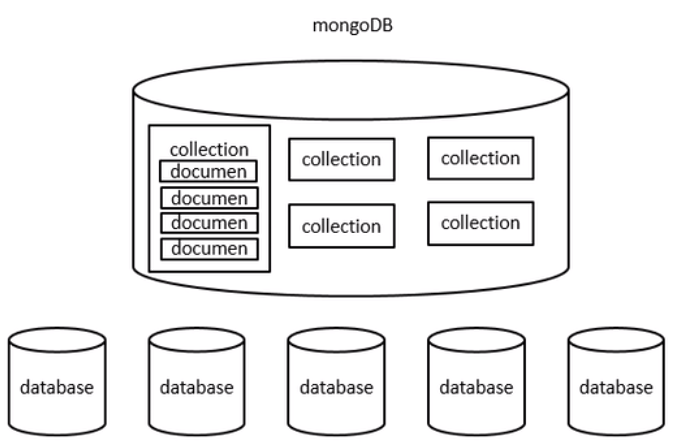

# MongoDB

##### 启动

```bash
# 需要 /data/db/mongod.log 文件
$ mkdir -p /data/db/log
# 启动需要参数 --logpath
# 后台启动 --fork
$ mongod --logpath=/data/db/mongod.log --fork
about to fork child process, waiting until server is ready for connections.
forked process: 12651
child process started successfully, parent exiting
```

##### 停止

```shell
$ mongod -shutdown
2019-05-18T21:24:25.061+0800 I CONTROL  [main] Automatically disabling TLS 1.0, to force-enable TLS 1.0 specify --sslDisabledProtocols 'none'
killing process with pid: 12651
```

##### 远程访问

mongo 远程主机ip或DNS:MongoDB端口号/数据库名 -u user -p password

```shell
$ mongo 192.168.1.200:27017/test -u root -p root
```

##### 配置文件

```shell
/etc/mongod.conf
```

##### 进入交互

```shell
# 启动服务之后
$ mongo
MongoDB shell version v4.0.9
connecting to: mongodb://127.0.0.1:27017/?gssapiServiceName=mongodb
Implicit session: session { "id" : UUID("aab96866-d42b-4b0a-b66a-611d4e95815f") }
MongoDB server version: 4.0.9
>
```

##### 创建账号密码

```sql
> use admin
switched to db admin
> db.createUser({user:"admin",pwd:"password",roles: [{ role: "root", db: "test" }]})

# 认证登录
> db.auth("admin", "password")

# 删除用户，需要先切换到要删除用户所管理的数据库
> use test
switched to db admin
> db.dropUser("admin")
true
```


### 一些概念

**数据库**(database)

​     |-**集合**(collection)

​	   |-**文档**(document)




#### 命令

参考官方文档

https://docs.mongodb.com/manual/reference/method/

##### 创建数据库

```sql
> use test            # 创建并进入数据库（会自动生成同名集合test）
switched to db test 
> db
test
> db.stats()         # 显示数据库信息
{
	"db" : "test",
	"collections" : 1,
	"views" : 0,
	"objects" : 1,
	"avgObjSize" : 50,
	"dataSize" : 50,
	"storageSize" : 16384,
	"numExtents" : 0,
	"indexes" : 1,
	"indexSize" : 16384,
	"fsUsedSize" : 72252510208,
	"fsTotalSize" : 235198033920,
	"ok" : 1
}
```

**集合操作**

```sql
> db.stu.insert({name:"ly"});      # 自动生成集合stu
WriteResult({ "nInserted" : 1 })
> show collections;				  # 创建数据库会自动生成同名集合test
stu
test
> db.stu.insert([
... {name:'wong'},
... {name:'li'},
... {name:'liu'}
... ]);
> db.stu.drop()		# 删除集合
> db.stu.renameCollection("student")    # 重命名集合

```

##### find（查询）

"_id" 根据时间戳自动生成的id
可以自己指定id属性，就不会自动生成

```sql
> db.stu.find()    # 查询全部（返回的是一个数组）
{ "_id" : ObjectId("5ce01a271d5043c5b05bb1c8"), "name" : "ly" }
{ "_id" : ObjectId("5ce01ae21d5043c5b05bb1c9"), "name" : "wong" }
{ "_id" : ObjectId("5ce01b371d5043c5b05bb1ca"), "name" : "li" }
{ "_id" : ObjectId("5ce01b371d5043c5b05bb1cb"), "name" : "liu" }

> db.stu.find({})[0]   # 可以索引
{ "_id" : ObjectId("5ce01a271d5043c5b05bb1c8"), "name" : "ly" }

> db.stu.find({name:'ly'})
{ "_id" : ObjectId("5ce01a271d5043c5b05bb1c8"), "name" : "ly" }

> db.stu.findOne({})   # 返回第一个对象

> db.stu.findOne({name:'ly'}).name   # 可以查询对象属性
ly

> db.stu.find({}).count()  
4
```

##### updata（修改）

db.表名.update({...},{...}) 默认是替换

所以需要修改操作符

$set  添加属性

$unset 删除属性

```sql
> db.stu.update(            
... {name:'ly'},
... {$set:{age:17,gender:'male'}}         # set添加
...	);

> db.stu.find({name:'ly'});
{ "_id" : ObjectId("5ce01a271d5043c5b05bb1c8"), "name" : "ly", "age" : 17, "gender" : "male" }

> db.stu.update( {name:'ly'}, {$unset:{gender:'male'}})      # unset删除
> db.stu.find({name:'ly'});
{ "_id" : ObjectId("5ce01a271d5043c5b05bb1c8"), "name" : "ly", "age" : 17 }

```

- **如果update查询到多个匹配项，默认只会修改第一项**
- **updateMany() 可以修改多个匹配项**

##### update官方文档

```
db.collection.update(
   <query>,					  # 索引项
   <update>,
   {
     upsert: <boolean>,		  # 未找到匹配项，自动创建文档
     multi: <boolean>,        # 为true，修改多个匹配项
     writeConcern: <document>,
     collation: <document>,
     arrayFilters: [ <filterdocument1>, ... ]
   }
)
```

#### 备份与恢复

```
mongodump -h 服务器地址 -d 需要备份的数据库 -o 指定备份存放的位置（需要提前创建）
$ mongodump -h localhost -d test -o /data/test
```

```
mongorestore -h 服务器地址 -d 数据库　--drop(恢复时先删除当前数据) --dir（指定备份的目录）
$ mongorestore -h localhost -d test --dir /data/test
```

## Java Api

```java
package MongoDB;

import com.mongodb.MongoClient;
import com.mongodb.client.FindIterable;
import com.mongodb.client.MongoCollection;
import com.mongodb.client.MongoCursor;
import com.mongodb.client.MongoDatabase;
import com.mongodb.client.model.Filters;
import org.bson.Document;
import java.util.ArrayList;
import java.util.List;

/*
数据库(database)
     |-集合(collection)
	   |-文档(document)
 */
public class MongoDB_Test {

    public static final String HOST = "localhost";
    public static final int PORT = 27017;

    static MongoClient mongoClient = null;
    static MongoDatabase mongoDatabase;

    static {
        // 无密码 连接数据库
        mongoClient = new MongoClient(HOST, PORT);
        System.out.println("Connected to MongoDB successfully");
    }

    /*
    调用MongoDB的find方法来查询集合的全部信息
     */
    public static void findAll(String database, String collection) {

        // 获得数据库对象
        mongoDatabase = mongoClient.getDatabase(database);
        // 获取集合(返回的是一个文档的list)
        MongoCollection<Document> mongoCollection = 
            mongoDatabase.getCollection(collection);
        // 获取文档迭代器对象
        FindIterable<Document> findIterable = mongoCollection.find();
        // 获取游标对象
        MongoCursor<Document> mongoCursor = findIterable.iterator();
        System.out.println(database + "--" + collection + ":");
        while (mongoCursor.hasNext()) {

            System.out.println(mongoCursor.next());
        }
    }

    /*
    插入单个信息
     */
    public static void insertOne(String database, String collection, Document document) {

        // 获得数据库对象
        mongoDatabase = mongoClient.getDatabase(database);
        // 获取集合(返回的是一个文档的list)
        MongoCollection<Document> mongoCollection = 
            mongoDatabase.getCollection(collection);
        // 直接插入参数传入的文档对象document
        mongoCollection.insertOne(document);
        System.out.println("插入成功 :");
        System.out.println(document);
    }

    /*
    插入多个信息
    需要创建一个List<Document>
     */
    public static void insertMany(String database, String collection, List documents) {

        // 获得数据库对象
        mongoDatabase = mongoClient.getDatabase(database);
        // 获取集合(返回的是一个文档的list)
        MongoCollection<Document> mongoCollection = 
            mongoDatabase.getCollection(collection);
        mongoCollection.insertMany(documents);
        System.out.println("插入成功 :");
        System.out.println(documents);
    }


    /*
    update
    $set
    匹配方式:  Filters.eq("name", "zhao")
     */
    public static void update(String database, String collection) {

        // 获得数据库对象
        mongoDatabase = mongoClient.getDatabase(database);
        // 获取集合(返回的是一个文档的list)
        MongoCollection<Document> mongoCollection = 
            
            mongoDatabase.getCollection(collection);
        // 用集合的update方法,添加document对象,Filters查询条件
        mongoCollection.updateOne(
                Filters.eq("name", "zhao"),
                new Document("$set",
                        new Document("age", 16))
        );
        System.out.println("update successfully");

    }

    /*
    删除文档
    flag=true--->删除多个匹配项
    flag=false-->删除第一个匹配项
    匹配方式:  Filters.eq("name", "zhao")
     */
    public static void delet(String database, String collection, boolean flag) {

        // 获得数据库对象
        mongoDatabase = mongoClient.getDatabase(database);
        // 获取集合(返回的是一个文档的list)
        MongoCollection<Document> mongoCollection = 
            mongoDatabase.getCollection(collection);
        if (flag==false) {
            mongoCollection.deleteOne(Filters.eq("name", "zhao"));
        }else
            mongoCollection.deleteMany(Filters.eq("name","zhao"));
        System.out.println("delete successfully");
        findAll(database,collection);
    }


    public static void main(String[] args) {


        // 创建一个文档对象
        Document document = new Document("name", "zhao");
        insertOne("test", "stu", document);
        // 插入多个,这里一个document代表一个文档
        Document document1 = 
            new Document("name", "liu")
            .append("age", 15)
            .append("gender", "male");
        List<Document> documents = new ArrayList<Document>();
        // add多个document,代表多个文档
        documents.add(document1);
        insertMany("test", "stu", documents);
        //更新
        update("test", "stu");
        //查询全部
        findAll("test", "stu");
        delet("test","stu",true);

    }
}
```

