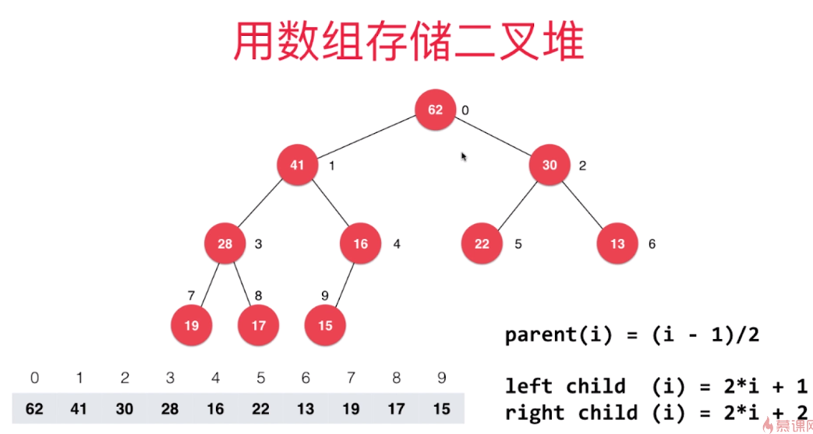
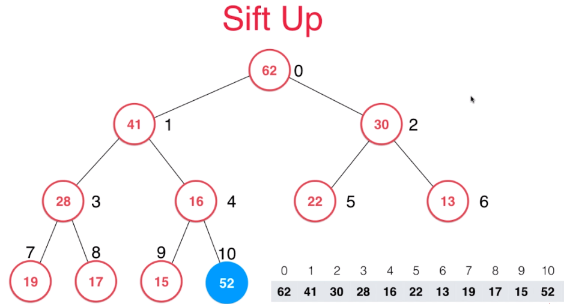
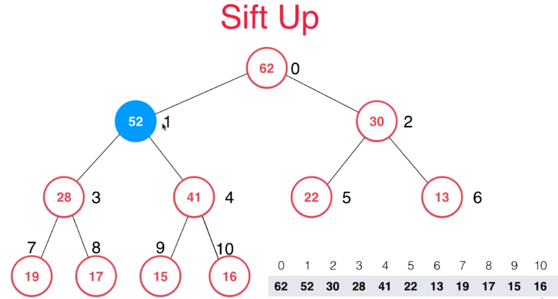
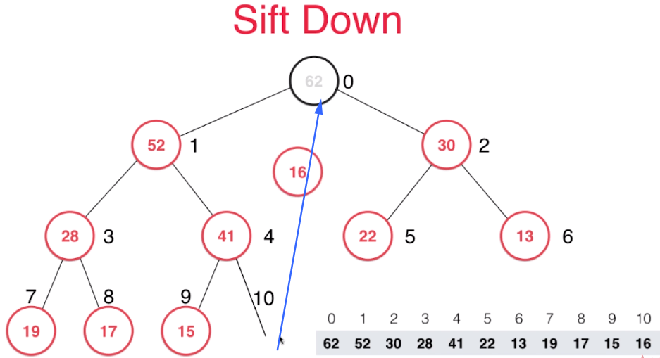
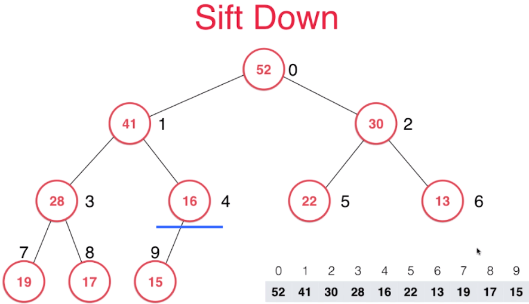
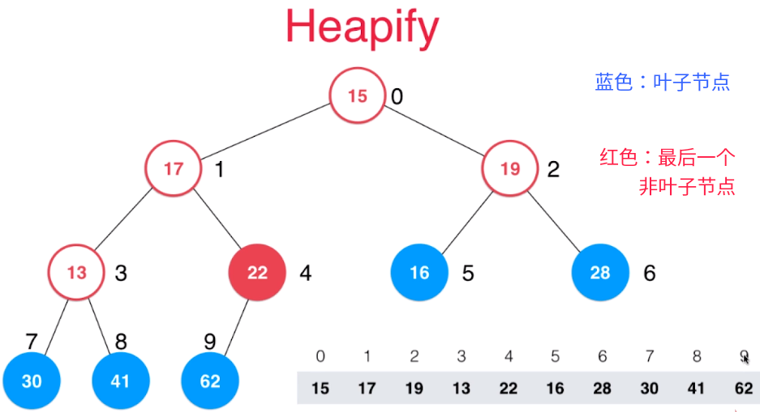
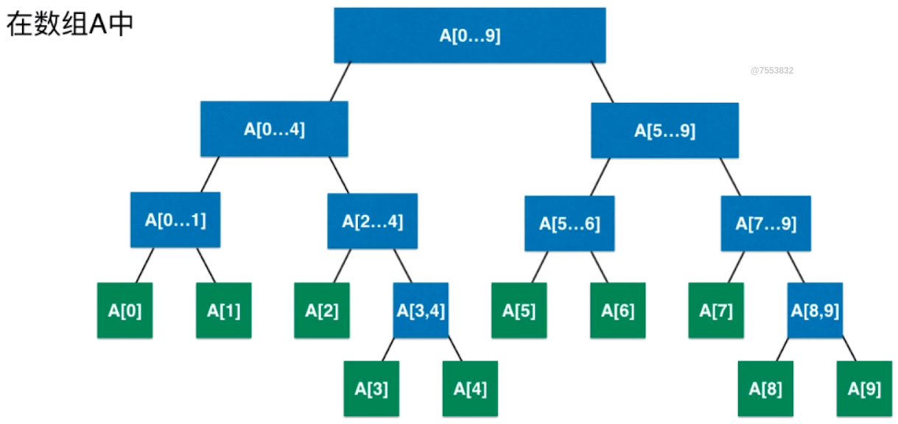
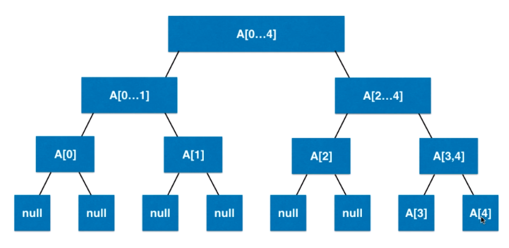
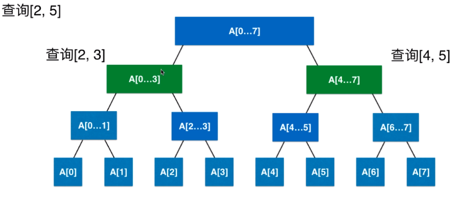

# 树结构

二叉树：每个结点最多有两个子树的树结构。常用于实现二叉查找树和二叉堆。

满二叉树：每层节点都是满的。（可以用数组表示）；h层，共有2^h-1个节点；每层有2^(h-1)个节点；

完全二叉树（二叉堆）：倒数第二层是满的，且最后一层节点总是在左边。（可以用数组表示）

平衡二叉树（AVL树、线段树）：每个节点的左右两棵子树的高度差不超过1。

## 二分搜索树（二分查找树）

详见 JavaCode-DataStructure.Tree.BinarySearchTree

## 二叉堆

参考图解：

<https://www.cnblogs.com/henry-1202/p/9307927.html>

二叉堆：是一棵完全二叉树。

最大堆：每个节点都比左右子节点大。（用于每次取出，只取出最大的元素，可以做到O（1）复杂度）

最小堆：每个节点都比左右子节点小。

### 数组实现二叉堆

**就是一个数组，没有节点概念。**

代码为慕课网课程代码。mnhjhkgyuihaa



用数组的方式，从1按层标注每个节点，可以快速查找到左右子节点的位置。（因为二叉堆是完全二叉树，很适合索引标注）

比如索引为1的节点41的左子节点：1×2+1=3；右子节点：1×2+2=4；父节点：（1-1）/2=0；

按照这个规律，可以先声明几个方法：

```java
public class MaxBinaryHeap<E extends Comparable<E>> {
    // 声明数组，作为存储结构
    private Array<E> data;
    // 构造函数
    public MaxBinaryHeap(int capacity) {
        data = new Array<>(capacity);
    }
    public MaxBinaryHeap() {
        data = new Array<>();
    }

    public int size() {
        return data.getSize();
    }

    public boolean isEmpty() {
        return data.isEmpty();
    }
    // 通过传入index，下标，找到父亲节点的索引
    private int parent(int index) {
        if (index == 0)
            throw new IllegalArgumentException("No parent!");
        return (index - 1) / 2;
    }

    // 找到此节点下的leftChild的索引
    private int leftChild(int index) {
        return index * 2 + 1;
    }
    // 找到右孩子
	private int rightChild(int index) {
        return index * 2 + 2;
    }	
```

#### 添加元素Sift Up

1. 添加的元素，会放在数组的最后，也就是放在树的最右下端。



2. 此时的索引为10的元素，并不满足二叉堆的性质，需要进行上浮的操作，将52放在合适的位置，根据最大堆的性质，每个节点，都应该比左右子节点大，所以52应该向上移动。与parent节点，交换位置。

   也就是 52与16交换，再与41交换，就可以满足最大堆的性质。



代码实现：

```java
public void add(E element) {
    // 数组的添加操作
    data.addLast(element);
    siftUp(data.getSize() - 1);
}
// 上浮
private void siftUp(int k) {
    // 循环比较，直到不大于父节点
    while (k > 0 && data.get(parent(k)).compareTo(data.get(k)) < 0) {
        // 父亲节点小，则交换值（swap自行定义）
        data.swap(k, parent(k));
        // 将index设为换过位置的父类，继续与上层比较
        k = parent(k);
    }
}
```

#### 取出元素Sift Down

最大堆的应用场景，就是每次只取出最大的元素，也就是堆顶元素。

1. 还是使用上面的哪个堆，将堆顶的62取出之后，0索引会空出来。把最小的元素，放到0索引位置，并把10索引的16删除掉。



2. 然后进行下沉SiftDown操作，把16一步一步向下交换。交换规则：与较大的孩子节点，进行交换，才能满足二叉堆的性质。



代码实现：

```java
//返回最大元素的值
public E findMax() {
    if (data.getSize() == 0)
        throw new IllegalArgumentException("heap is empty!");
    return data.get(0);
}

// 取出最大元素并删除（交换最小元素，然后删除队尾元素）
public E extractMax() {
    E ret = findMax();
    data.swap(0, data.getSize() - 1);
    data.removeLast();
    // 将第一个元素开始下沉
    siftDown(0);
    return ret;
}

private void siftDown(int k) {
    /*
    1.先判断，左孩子的索引小于最大值，即左孩子存在（判断左，是因为完全二叉树从左开始）
    2.无论左右谁大，将最大的节点的索引给 j ，最后只需要交换k，j 的值
    3.如果k大于等于j，跳出循环，结束
    4.交换k，j，进行下一轮
    */
    while (leftChild(k) < data.getSize()) {
        int j = leftChild(k);
        if (j + 1 < data.getSize() && data.get(j + 1).compareTo(data.get(j)) > 0) {
            j = rightChild(k);
        }
        if (data.get(k).compareTo(data.get(j)) >= 0) {
            break;
        }
        data.swap(k, j);
        k = j;
    }
}
```

#### 替换操作replace

取出最大值，并添加一个新的元素；也就是将最大值替换为新元素，然后返回最大值。

```java
/*
replace替换操作：（取出最大元素，替换为元素e）
直接将e赋值给root，再SiftDown
*/
public E replace(E e) {
    E ret = findMax();
    data.set(0, e);
    siftDown(0);
    return ret;
}
```

#### 堆化操作Heapify

参考：慕课课程

将任意的一个数组，整理为最大堆的形式。

方法：找到最后一个非叶子节点，也就是下图的22，从22节点开始依次进行SiftDown，然后是13进行SiftDown，19、17、15，这样，就完成了堆化操作。

找到最后一个非叶子节点：最后一个元素的parent即可



```java
/*
    Heapify:(传入数组，构造二叉堆)
    1.堆化（将任意数组排列成二叉堆的形式） 复杂度O（n）
    2.过程：从最后一个非叶子节点开始，每个节点不断下沉SiftDown
    如果单纯将数据从头到尾构造成二叉堆的话：复杂度为O（nlogn）
*/
public MaxBinaryHeap(E[] arr) {
    data = new Array<>(arr);
    // i为最后一个非叶子节点，从此节点，开始递减执行SiftDown
    for (int i = parent(arr.length - 1); i >= 0; i--) {
        siftDown(i);
    }
}
```


## 优先队列

基于最大堆上，构造优先队列，可以复用很多接口。

首先，优先队列，要实现一个Queue接口：

```java
public interface Queue<E> {
    int getSize();
    boolean isEmpty();
    void enQueue(E element);	// 入队
    E deQueue();	// 出队
    E getFront();	// 返回队首
}
```

将最大堆作为优先队列的内部实现；

```java
public class PriorityQueue<E extends Comparable<E>> implements Queue<E> {
	// 最大堆
    private MaxBinaryHeap<E> maxBinaryHeap;
    public PriorityQueue(){
        maxBinaryHeap =new MaxBinaryHeap<>();
    }
    @Override
    public int getSize() {
        return maxBinaryHeap.size();
    }
    @Override
    public boolean isEmpty(){
        return maxBinaryHeap.isEmpty();
    }
    @Override
    public E getFront() {
        return maxBinaryHeap.findMax();
    }
    /*
    入队：通过二叉堆的add方法入队 O（n）
     */
    @Override
    public void enQueue(E element) {
        maxBinaryHeap.add(element);
    }
    /*
    出队:将最大元素，即优先级最大的节点出队
     */
    @Override
    public E deQueue() {
        return maxBinaryHeap.extractMax();
    }
}
```

### Java标准库中的PriorityQueue

util包下的优先队列PriorityQueue的常用方法：做题可以直接拿来用。默认最小堆

**具体这个队列，优先级是怎么定义？按最大，还是最小，是根据E的CompareTo方法。**

```java
PriorityQueue<E> priorityQueue = new PriorityQueue<>();
```

| 返回值   | 方法               |                                                              |
| -------- | ------------------ | ------------------------------------------------------------ |
| boolean  | add(E e)           | 入队。（队列已满抛出异常）                                   |
| boolean  | contains(Object o) | 如果此队列包含指定的元素，则返回 true。                      |
| boolean  | offer(E e)         | 入队。（队列已满不抛出异常，而是返回flase）                  |
| E        | peek()             | 出队不删除，如果此队列为空，则返回 null 。                   |
| E        | poll()             | 出队并删除，如果此队列为空，则返回 null 。                   |
| boolean  | remove()           | 出队，返回布尔（如果存在）。                                 |
| int      | size()             | 返回此集合中的元素数。                                       |
| Object[] | toArray()          | 返回一个包含此队列中所有元素的数组。                         |
| <T> T[]  | toArray(T[] a)     | 返回一个包含此队列中所有元素的数组; 返回的数组的运行时类型是指定数组的运行时类型。 |

#### 构造方法

PriorityQueue默认是一个最小堆。

**构造器需要传入一个Comparator接口**

1. 无参构造器：默认容量11，Comparator为null

```java
private static final int DEFAULT_INITIAL_CAPACITY = 11;
public PriorityQueue() {
    this(DEFAULT_INITIAL_CAPACITY, null);
}
```

2. 有参构造器：自定义容量

```java
public PriorityQueue(int initialCapacity) {
    this(initialCapacity, null);
}
```

3. 有参构造器：传入容量和Comparator接口

```java
public PriorityQueue(int initialCapacity,
                     Comparator<? super E> comparator) {
    if (initialCapacity < 1)
        throw new IllegalArgumentException();
    this.queue = new Object[initialCapacity];
    this.comparator = comparator;
}
```

#### 通过重写Comparator接口下的compare方法实现最大最小堆

```java
public class People{
    int salary;
    public People(int salary){
        this.salary=salary;
    }
}
public static void main(String[] args) {
    PriorityQueue<People> priorityQueue = new PriorityQueue<People>(
        (p1,p2)-> p1.salary-p2.salary	// 默认最小堆，逆序p2-p1最大堆
    );
}
```

#### 使用无参构造器

队列元素必须实现Comparable接口！

```java
public static class People implements Comparable<People>{
    int salary;
    public People(int salary){
        this.salary=salary;
    }
    @Override
    public int compareTo(People o) {
        return this.salary-o.salary;
    }
}
public static void main(String[] args) {
    PriorityQueue<People> priorityQueue = new PriorityQueue<People>();
}
```

## 线段树（区间树）—空间换时间

LeetCode上303题目，是一个可以用线段树的题目，但是可以用其他方法简单求解，线段树的优势，主要在于更新操作，构建一个线段树的代价是很大的，如果没有特别的需求，不需要使用线段树。



比如：需要查询4～7的数据，只需要查询A[4...7]这一个节点即可

需要查询2~5的数据，需要查询A[2...3]和A[4...5]这两个节点的数据即可。

#### 线段树特点：

1. 以区间为节点。根节点，是总区间，叶子节点是区间的每一个元素。
2. 所以：**线段树不是完全二叉树，是一个平衡二叉树**
3. **为了能使用数组索引的方式来遍历线段树，需要将线段树（平衡二叉树）补充为满二叉树**，如下图：空着的位置，补充一个null节点，就可以将线段树像二叉堆一样，用数组来索引。
4. **如果要用数组来表示线段树，势必要产生更多的空间来存储区间。大概是4倍的数组空间。**
5. **需要用户自行定义每个区间的计算方式**：求和、平均数等等
6. Java没有原生线段树的类。



代码实现：类似二叉堆

1. 初始化：

```java
public class SegmentTree<E> {
    private E[] data;	// 四倍空间的线段树数组
    private E[] tree;	// 单个元素的数组
    private Merger<E> merger;	// 自定义分区方式：求和、平均数....

    public SegmentTree(E[] arr, Merger<E> merger) {
        this.merger=merger;
        data = (E[]) new Object[arr.length];
        for (int i = 0; i < arr.length; i++) {
            data[i] = arr[i];
        }
        tree = (E[]) new Object[4 * arr.length];	// 初始化四倍空间
        // 从索引0为节点构造线段树，区间为0～data.length-1
        buildSegmentTree(0,0,data.length-1);	
    }
    public int getSize() {
        return data.length;
    }
    public E get(int index) {
        if (index < 0 || index >= data.length)
            throw new IllegalArgumentException("Index is illegal!");
        return data[index];
    }
    // 找到此节点下的leftChild的索引
    private int leftChild(int index) {
        return index * 2 + 1;
    }
    // 找到此节点下的rightChild的索引
    private int rightChild(int index)
    {
        return index * 2 + 2;
    }
}
```

2. buildSegmentTree方法：

```java
// 在treeIndex位置创建区间【l-r】的线段节点
private void buildSegmentTree(int treeIndex,int l,int r){
    // 只有一个元素
    if (l==r){
        tree[treeIndex] = data[l];
        return;
    }
    // 找到左右子孩子
    int leftTreeIndex = leftChild(treeIndex);
    int rightTreeIndex = rightChild(treeIndex);

    // 递归创建区间
    int mid = l+(r-l)/2;
    // 在左孩子节点，创建l～mid区间
    buildSegmentTree(leftTreeIndex,l,mid);
    // 在右孩子节点，创建mid+1～r区间
    buildSegmentTree(rightTreeIndex,mid+1,r);
    // 分区方法
    tree[treeIndex] = merger.merge(tree[leftTreeIndex],tree[rightTreeIndex]);
}
```
3. 需要声明一个接口，来决定以什么样的方式，来计算区间；

   这里创建了Merger接口和一个抽象方法，在构造SegmentTree的时候，需要实现merge方法，来确定区间的计算方式

```java
public interface Merger<E> {
    E merge(E a,E b);
}
```

4. 至此，可以简单创建一个线段树了：再添加一个toString方法，方便输出

```java
@Override
public String toString() {
    StringBuilder res = new StringBuilder();
    res.append('[');
    for (int i = 0; i < tree.length; i++) {
        if (tree[i]!=null)
            res.append(tree[i]);
        else
            res.append("null");
        if (i!=tree.length-1)
            res.append(',');
    }
    res.append(']');
    return res.toString();
}
public static void main(String[] args) {
    Integer[] nums = {1, 2, 3, 4};
    SegmentTree<Integer> st = new SegmentTree<>(nums, (a, b) -> a + b);
    System.out.println(st);
}
// 结果：
[10,3,7,1,2,3,4,null,null,null,null,null,null,null,null,null]
```

5. 查询操作



这样的结构，很适合递归。

```java
// 返回区间【queryl～queryr】的值
public E query(int queryL, int queryR) {
    if (queryL < 0 || queryL >= data.length 
        || queryR < 0 || queryR >= data.length || queryL > queryR)
        throw new IllegalArgumentException("非法参数");
    return query(0, 0, data.length, queryL, queryR);
}
// 在根节点0，从0～data,length开始查找 区间【queryl～queryr】的值
private E query(int treeIndex, int l, int r, int queryL, int queryR) {
    // 找到了要查的节点，则返回
    if (queryL == l && queryR == r) {
        return tree[treeIndex];
    }
    int mid = l + (r - l) / 2;
    int leftTreeIndex = leftChild(treeIndex);
    int rightTreeIndex = rightChild(treeIndex);
    /**
     * 分为三种情况：
     * 1.全在当前节点的左孩子
     * 2.全在当前节点的右孩子
     * 3.当前节点左右都有
     */
    if (queryL >= mid + 1) {
        return query(rightTreeIndex, mid + 1, r, mid + 1, queryR);
    } else if (queryR <= mid) {
        return query(leftTreeIndex, l, mid, queryL, mid);
    } else {
        E rightResult = query(rightTreeIndex, mid + 1, r, mid + 1, queryR);
        E leftResult = query(leftTreeIndex, l, mid, queryL, mid);
        return merger.merge(rightResult, leftResult);
    }
}
```

6. 更新操作

   对数组，进行更新，之后，再对线段树进行更新，更新复杂度O（logN）

```java
/**
 * 更新操作
 * 更新数组的某个值，就需要更新这个线段树
 */
public void set(int index, E e) {
    if (index < 0 || index >= data.length) {
        throw new IllegalArgumentException("非法数组");
    }
    // 更新数组的值
    data[index] = e;
    // 开始更新线段树
    set(0, 0, data.length - 1, index, e);
}
// 类似构建一个线段树，只不过是从index构建，而不是从0开始
private void set(int treeIndex, int l, int r, int index, E e) {
    if (l == r) {
        tree[treeIndex] = e;
        return;
    }
    int mid = l + (r - l) / 2;
    int leftTreeIndex = leftChild(treeIndex);
    int rightTreeIndex = rightChild(treeIndex);
    // 以index作为分割点
    if (index>=mid+1){
        set(rightTreeIndex,mid+1,r,index,e);
    }
    else
        set(leftTreeIndex,mid+1,r,index,e);
    tree[treeIndex] = merger.merge(tree[leftTreeIndex], tree[rightTreeIndex]);
}
```

## B+Tree

更高效的查询性能

