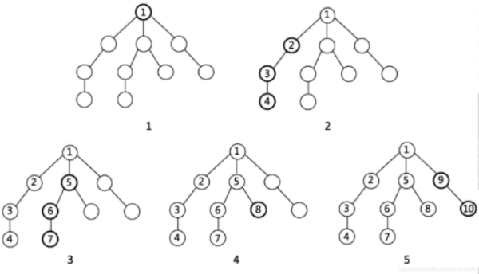

# 树

## 遍历

```javascript
// 首先二叉树：
public class TreeNode {
  int val;
  TreeNode left;
  TreeNode right;
  TreeNode(int x) { val = x; }
}
```

参考：https://blog.csdn.net/Gene1994/article/details/85097507

### 前序遍历

```java
private void preOrder(Node root) {
    /*
    1.处理：遍历到最后返回空
    2.遍历：左走到头，右走到头
     */
    if (root == null) {
        return;
    }
    System.out.println(root.e);
    preOrder(node.left);
    preOrder(node.right);
}
```

### 中序遍历

```java
private void inOrder(Node root) {

    if (root == null) {
        return;
    }
    inOrder(node.left);
    System.out.println(root.e);
    inOrder(node.right);
}
```

### 后序遍历

```java
private void postOrder(Node root) {

    if (root == null) {
        return;
    }
    postOrder(node.left);
    postOrder(node.right);
    System.out.println(root.e);
}
```

### BFS（广度优先遍历）

首先想到—队列


**具体例子见算法题—5.层次遍历树**

```java
public void BFSWithQueue(TreeNode root) {
    Queue<TreeNode> queue = new LinkedList<>();
    if (root != null)
        queue.add(root);
    while (!queue.isEmpty()) {
        TreeNode treeNode = queue.poll();
 
        //在这里处理遍历到的TreeNode节点

        if (treeNode.left != null)
            queue.add(treeNode.left);
        if (treeNode.right != null)
            queue.add(treeNode.right);
    }
}
```

### DFS（深度优先遍历）

首先想到—递归和栈



#### 递归

有点像前序遍历

```java
public void DFSWithRecursion(TreeNode root) {
    if (root == null)
        return;
 
    //在这里处理遍历到的TreeNode节点
        
    if (root.left != null)
        DFSWithRecursion(root.left);
    if (root.right != null)
        DFSWithRecursion(root.right);
}
```

#### 栈

```java
public void DFSWithStack(TreeNode root) {
     if (root != null)
         return;
     Stack<TreeNode> stack = new Stack<>();
     stack.push(root);
 
     while (!stack.isEmpty()) {
         TreeNode treeNode = stack.pop();
 
         //在这里处理遍历到的TreeNode
             
         if (treeNode.right != null)
             stack.push(treeNode.right);
         if (treeNode.left != null)
             stack.push(treeNode.left);
     }
}
```

## 算法题

### 1. 判断两二叉棵树是否相同

递归判断

```java
public boolean isSameTree(TreeNode p, TreeNode q) {

    if (p==null&&q==null)
        return true;
    if (p != null && q != null && p.val == q.val) {
        if (isSameTree(p.left, q.left) && isSameTree(p.right, q.right))
            return true;
    }
    return false;
}
```

### 2. 判断对称二叉树

使用队列

```java
import java.util.LinkedList;
import java.util.Queue;
public boolean isSymmetric(TreeNode root) {
    Queue<TreeNode> q = new LinkedList<>();
    q.add(root);
    while (!q.isEmpty()) {
        TreeNode t1 = q.poll();
        TreeNode t2 = q.poll();	// 如果为空，返回null
        if (t1 == null && t2 == null) continue;
        if (t1 == null || t2 == null) return false;
        if (t1.val != t2.val) return false;
        q.add(t1.left);
        q.add(t2.right);
        q.add(t1.right);
        q.add(t2.left);
    }
    return true;1211
}
```

java递归：

```java
public boolean isSymmetric(TreeNode root) {
    return match(root,root);
}
private boolean match(TreeNode l, TreeNode r) {
    if (l==null&&r==null)
        return true;
    else if (l==null||r==null)
        return false;
    else{
        return l.val == r.val && match(l.left, r.right) && match(l.right, r.left);
    }
}
```

### 3. 求二叉树最大深度

java递归

leetcode 104

```java
public int maxDepth(TreeNode root) {
    if (root == null) return 0;
    int leftDepth = maxDepth(root.left) + 1;
    int rightDepth = maxDepth(root.right) + 1;
    return Math.max(leftDepth, rightDepth);
}
```

### 4. 求二叉树最小深度

不能完全与最大深度相反：

```java
  1
 /
2
// 这棵树，不能返回1，需要返回2，空树要特殊对待
```

```java
public int minDepth(TreeNode root) {

    if (root == null) {
        return 0;
    }
    int left = minDepth(root.left);
    int right = minDepth(root.right);
    if (left == 0)	// 表明当前节点，左树为空，直接返回右树深度
        return right + 1;
    if (right == 0)
        return left + 1;
    else
        return Math.min(left, right) + 1;
}
```

### 4. 判断是否为平衡二叉树

利用上题的思路，求出每个节点的最大深度，左右节点的深度差来判断是否平衡

leetcode 110

```java
public class Num_110_tree {
    boolean res = true;
    public boolean isBalanced(TreeNode root) {
        search(root);
        return res;
    }
    private int search(TreeNode root) {
        if (root == null) return 0;
        int left = search(root.left) + 1;
        int right = search(root.right) + 1;
        if (Math.abs(right - left) > 1) res = false;
        return Math.max(left, right);
    }
}
```

### 5. 层次遍历树(BFS)

```
    3
   / \
  9  20
    /  \
   15   7
输出：
[
  [15,7],
  [9,20],
  [3]
]
```

java队列：

```java
public List<List<Integer>> levelOrderBottom(TreeNode root) {
    LinkedList<List<Integer>> result = new LinkedList<>();
    if (root == null)
        return result;
    Queue<TreeNode> queue = new LinkedList<>();
    queue.add(root);
    while (!queue.isEmpty()) {
        List<Integer> oneLevel = new ArrayList<>();
        // 每次都取出一层的所有数据
        int count = queue.size();
        for (int i = 0; i < count; i++) {
            TreeNode node = queue.poll();
            oneLevel.add(node.val);
            if (node.left != null)
                queue.add(node.left);
            if (node.right != null)
                queue.add(node.right);
        }
        // 每次都往队头塞
        result.addFirst(oneLevel);
    }
    return result;
}
```

### 6. 将有序数组转换为二叉搜索树

```
给定有序数组: [-10,-3,0,5,9]
      0
     / \
   -3   9
   /   /
 -10  5		高度差不超过1
```

java二分查找+递归

```java
public TreeNode sortedArrayToBST(int[] nums) {
    int high = nums.length - 1;
    int low = 0;
    return createTree(nums, low, high);
}
private static TreeNode createTree(int[] nums, int low, int high) {
    if (nums.length == 0 || low > high) {
        return null;
    }
    int mid = low + (high - low) / 2;
    TreeNode res = new TreeNode(nums[mid]);
    res.right = createTree(nums, mid + 1, high);
    res.left = createTree(nums, low, mid - 1);
    return res;
}
```

### 7. DFS求和

找出树中的一条路径和，等于给定的target；

路径必须是root-to-leaf

```java
public class solution_22 {
    private ArrayList<ArrayList<Integer>> list = new ArrayList<>();
    private ArrayList<Integer> level = new ArrayList<>();

    public ArrayList<ArrayList<Integer>> FindPath(TreeNode root, int target) {
        if (root == null)
            return list;
        target -= root.val;
        level.add(root.val);
        // 满足和==target，并且是叶子节点
        if (target == 0 && root.left == null && root.right == null) {
            list.add(new ArrayList<>(level));
        }
        FindPath(root.left, target);
        FindPath(root.right, target);
        level.remove(level.size() - 1);	// 这里要维护
        list.sort((o1, o2) -> o2.size() - o1.size());	//根据题目要求
        return list;
    }
}
```


