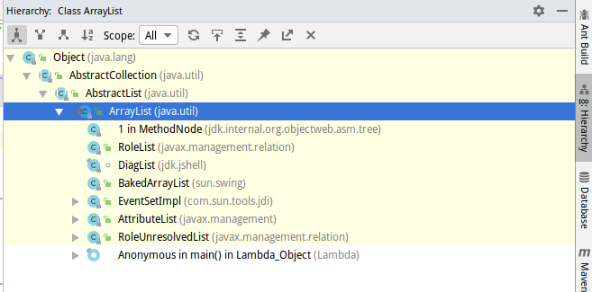

# ArrayList

参考

<https://www.cnblogs.com/zhangyinhua/p/7687377.html>

- ArrayList可以存放null
- ArrayList本质上就是一个elementData数组
- ArrayList区别于数组的地方在于能够自动扩展大小，其中关键的方法就是gorw()方法
- ArrayList由于本质是数组，所以它在数据的查询方面会很快，而在插入删除这些方面，性能下降很多，有移动很多数据才能达到应有的效果
- ArrayList实现了RandomAccess，所以在遍历它的时候推荐使用for循环


继承结构



以下代码经过删减，只留有部分核心代码

```java
package java.util;
import java.util.function.Consumer;
import java.util.function.Predicate;
import java.util.function.UnaryOperator;
import jdk.internal.misc.SharedSecrets;

public class ArrayList<E> extends AbstractList<E>
        implements List<E>, RandomAccess, Cloneable, java.io.Serializable
{	
// 一些属性:
	// 版本号
    private static final long serialVersionUID = 8683452581122892189L;

    /**初始容量
     * Default initial capacity.
     */
    private static final int DEFAULT_CAPACITY = 10;

     // 一个空Object数组
    private static final Object[] EMPTY_ELEMENTDATA = {};

    private static final Object[] DEFAULTCAPACITY_EMPTY_ELEMENTDATA = {};
 	// 最大数组容量,因为数组长度最少要8,所以起始位置要-8
	private static final int MAX_ARRAY_SIZE = Integer.MAX_VALUE - 8;
	
    transient Object[] elementData; 
    /**
     * The size of the ArrayList (the number of elements it contains).
     * 实际元素大小，默认为0
     * @serial
     */
    private int size;
    // 几率改变大小的次数,如果modCount改变的不符合预期，那么就会抛出异常
    // 用于检测混乱的情况
    protected transient int modCount = 0;
    
    
// 构造器:
    /**
     * 构造器：传入数组长度
     */	
    public ArrayList(int initialCapacity) {
        if (initialCapacity > 0) {
            this.elementData = new Object[initialCapacity];
        } else if (initialCapacity == 0) {
            this.elementData = EMPTY_ELEMENTDATA;
        } else {
            throw new IllegalArgumentException("Illegal Capacity: "+
                                               initialCapacity);
        }
    }

    /**
     * 无参构造器，默认构造一个空Object[] 数组，初始化elementData
     */
    public ArrayList() {
        this.elementData = DEFAULTCAPACITY_EMPTY_ELEMENTDATA;
    }

    /**
     * 此方法不常用，传入一个泛型Collection对象，转换为ArrayList
     */
    public ArrayList(Collection<? extends E> c) {
    	// 先将c转化为数组
        elementData = c.toArray();
        // 数组长度赋值给size
        if ((size = elementData.length) != 0) {
            if (elementData.getClass() != Object[].class)
            // 通过Arrays方法构造一个数组
                elementData = Arrays.copyOf(elementData, size, Object[].class);
        } else {
            // 数组长度为0,直接用空数组代替
            this.elementData = EMPTY_ELEMENTDATA;
        }
    }

// 核心方法:    
	// 返回数组长度
    public int size() {
        return size;
    }
	// 判断是否为空
    public boolean isEmpty() {
        return size == 0;
    }
    // 查询某一个对象的索引值(遍历查询)
    public int indexOf(Object o) {
        return indexOfRange(o, 0, size);
    }
    int indexOfRange(Object o, int start, int end) {
        Object[] es = elementData;
        if (o == null) {
            for (int i = start; i < end; i++) {
                if (es[i] == null) {
                    return i;
                }
            }
        } else {
            for (int i = start; i < end; i++) {
                if (o.equals(es[i])) {
                    return i;
                }
            }
        }
        return -1;
    }
    
	// 是否存在,利用indexOf的返回值
    public boolean contains(Object o) {
        return indexOf(o) >= 0;
    }

    // 查询某个值出现的最后一个索引(与上面方法一致,只不过遍历从后向前)
    public int lastIndexOf(Object o) {
        return lastIndexOfRange(o, 0, size);
    }

    int lastIndexOfRange(Object o, int start, int end) {
        Object[] es = elementData;
        if (o == null) {
            for (int i = end - 1; i >= start; i--) {
                if (es[i] == null) {
                    return i;
                }
            }
        } else {
            for (int i = end - 1; i >= start; i--) {
                if (o.equals(es[i])) {
                    return i;
                }
            }
        }
        return -1;
    }
    /**
     * set/get方法
     * get拿到索引的值
     * set替换索引位置的值
     */
    public E get(int index) {
        Objects.checkIndex(index, size);
        return elementData(index);
    }

    public E set(int index, E element) {
        Objects.checkIndex(index, size);
        E oldValue = elementData(index);
        elementData[index] = element;
        return oldValue;
    }
        
    /**
     * 一系列的扩容方法
     */
    
    private Object[] grow() {
    	// 容量+1
        return grow(size + 1);
    }
    private Object[] grow(int minCapacity) {
    	// 通过Arrays.copyOf构造一个新的数组返回
        return elementData = Arrays.copyOf(elementData,
                                           newCapacity(minCapacity));
    }     
    
    private int newCapacity(int minCapacity) {
        // 
        int oldCapacity = elementData.length;
        // 右移运算,相当于除以2,等于扩容1.5倍
        int newCapacity = oldCapacity + (oldCapacity >> 1);
        // 如果1.5倍扩容还不能满足需要,那么返回minCapacity这个长度
        if (newCapacity - minCapacity <= 0) {
            if (elementData == DEFAULTCAPACITY_EMPTY_ELEMENTDATA)
                return Math.max(DEFAULT_CAPACITY, minCapacity);
            if (minCapacity < 0) // overflow
                throw new OutOfMemoryError();
            return minCapacity;
        }
        // 判断新扩容,不大于最大限制的容量,就返回新扩容长度newCapacity
        return (newCapacity - MAX_ARRAY_SIZE <= 0)
            ? newCapacity
            : hugeCapacity(minCapacity);
    }

    private static int hugeCapacity(int minCapacity) {
        if (minCapacity < 0) // overflow
            throw new OutOfMemoryError();
        // 将我们需要的容量,和最大容量进行比较,
        return (minCapacity > MAX_ARRAY_SIZE)
            ? Integer.MAX_VALUE
            : MAX_ARRAY_SIZE;
    }
    
    /**
     * add方法
     * 这里有一个modCount,代表了元素个数
     */
    public boolean add(E e) {
        modCount++;
        add(e, elementData, size);
        return true;
    }
    private void add(E e, Object[] elementData, int s) {
    	// 如果已经达到最大容量,进行扩容
        if (s == elementData.length)
            elementData = grow();
        // 扩容完毕,在s处增加新元素
        elementData[s] = e;
        // 长度+1
        size = s + 1;
    }
    
    // 指定位置插入
    public void add(int index, E element) {
    	// 检查越界,抛出异常
        rangeCheckForAdd(index);
        // 元素个数+1
        modCount++;
        final int s;
        Object[] elementData;
        // 如果此时数组已达到最大容量,进行扩容
        if ((s = size) == (elementData = this.elementData).length)
            elementData = grow();
        //System.arraycopy将elementData在插入位置后的所有元素往后面移一位
        System.arraycopy(elementData, index,
                         elementData, index + 1,
                         s - index);
        // 赋值,size++              
        elementData[index] = element;
        size = s + 1;
    }
    // 越界抛出异常
    private void rangeCheckForAdd(int index) {
        if (index > size || index < 0)
            throw new IndexOutOfBoundsException(outOfBoundsMsg(index));
    }
    
    

    /**
     * remove方法
     */
    
    public E remove(int index) {
        Objects.checkIndex(index, size);
        final Object[] es = elementData;

        @SuppressWarnings("unchecked") E oldValue = (E) es[index];
        fastRemove(es, index);

        return oldValue;
    }
    public boolean remove(Object o) {
        final Object[] es = elementData;
        final int size = this.size;
        int i = 0;
        found: {
            if (o == null) {
                for (; i < size; i++)
                    if (es[i] == null)
                        break found;
            } else {
                for (; i < size; i++)
                    if (o.equals(es[i]))
                        break found;
            }
            return false;
        }
        fastRemove(es, i);
        return true;
    }
    
    // 将elementData中每个元素都赋值为null，等待垃圾回收将这个给回收掉
    public void clear() {
        modCount++;
        final Object[] es = elementData;
        for (int to = size, i = size = 0; i < to; i++)
            es[i] = null;
    }
    
    
     public boolean equals(Object o) {
        if (o == this) {
            return true;
        }

        if (!(o instanceof List)) {
            return false;
        }
        boolean equal = root.equalsRange((List<?>)o, offset, offset + size);
        checkForComodification();
        return equal;
    }
    

    // 返回一个迭代器对象
    public Iterator<E> iterator() {
        return new Itr();
    }
    // 私有内部类:迭代器的操作
    private class Itr implements Iterator<E> {
    .....
    }
    
    // 静态内部类 对子数组的操作
    private static class SubList<E> extends AbstractList<E> implements RandomAccess {
    ......
    }
    
}
```
