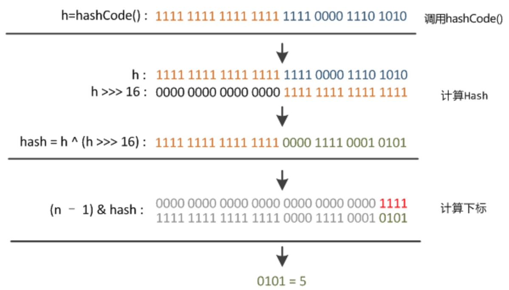

# HashMap

个人认为：要了解HashMap，首先弄清楚equals和hashCode的搭配运作原理！

参考:

<https://www.cnblogs.com/xiaoxi/p/7233201.html>

<https://github.com/CyC2018/CS-Notes/blob/master/docs/notes/Java%20%E5%AE%B9%E5%99%A8.md>

<https://zhuanlan.zhihu.com/p/21673805>（建议）

数组：存储空间连续，占用内存严重，空间复杂度大，时间复杂度小，**寻址容易，插入删除困难**

链表：存储区间离散，占用内存宽松，空间复杂度小，时间复杂度大，**寻址困难，插入删除简单**

哈希表：有多种实现方式。HashMap使用过**拉链法**（解决了哈希冲突的问题）实现，有一种链表数组的结合体的感觉。

- JDK1.8之后，HashMap的底层数据结构为：**数组+链表+红黑树**。


### 一些概念

图中一个格子代表一个Node结点（也可以叫bin）。

table表示一个Node数组。table的每一个格子横向延伸，表示一个桶。

#### capacity和size

capacity即table的大小，也就是桶的个数，即：数组长度；

（**桶的总数总是2的幂，这是由于临界值算法tableSizeFor得到的）**

size就是所有的结点的总和，即图中的所有格子（K-V对的数量）

#### loadFactor（装载因子）

衡量HashMap满的程度。默认值0.75f，

#### threshold（门槛）

当size > threshold，则进行resize操作（扩容）

## HashMap的属性和构造方法：

```java
static final int DEFAULT_INITIAL_CAPACITY = 1 << 4; // 默认初始容量16（左移四位）
static final int MAXIMUM_CAPACITY = 1 << 30;		// 最大容量
static final float DEFAULT_LOAD_FACTOR = 0.75f;		// default负载因子
static final int TREEIFY_THRESHOLD = 8;				// 当桶上的结点数大于此值,转成红黑树
static final int UNTREEIFY_THRESHOLD = 6;			// 当桶上的结点数小于此值,转成链表
static final int MIN_TREEIFY_CAPACITY = 64;			// 
transient Node<K,V>[] table;	// table,一个结点数组
transient Set<Map.Entry<K,V>> entrySet;		// 存放具体元素的set
transient int size;		//元素个数
transient int modCount;		//扩容和更改的计数器
// 临界值,当实际大小超过threshold(容量*填充因子),就会扩容。threshold=capacity*loadFactor
int threshold;		
final float loadFactor;		// 负载因子
```

HashMap的构造方法：

```java
public HashMap() {
    this.loadFactor = DEFAULT_LOAD_FACTOR; // 使用default负载因子
}
public HashMap(int initialCapacity) {
    this(initialCapacity, DEFAULT_LOAD_FACTOR);	// 调用第四个构造器
}  
// 暂时不想看这个构造器
public HashMap(Map<? extends K, ? extends V> m) {
    this.loadFactor = DEFAULT_LOAD_FACTOR;
    putMapEntries(m, false);
}
public HashMap(int initialCapacity, float loadFactor) {
    // 初始容量<0 
    if (initialCapacity < 0)
        throw new IllegalArgumentException("Illegal initial capacity: " +
                                           initialCapacity);
    // 大于最大值,则调整为最大值
    if (initialCapacity > MAXIMUM_CAPACITY)
        initialCapacity = MAXIMUM_CAPACITY;
    // 负载因子不能小与0,不能为非数字
    if (loadFactor <= 0 || Float.isNaN(loadFactor))
        throw new IllegalArgumentException("Illegal load factor: " +
                                           loadFactor);
    // 初始化负载因子
    this.loadFactor = loadFactor;
    // 初始化临界值
    this.threshold = tableSizeFor(initialCapacity);
}
```

临界值算法：

```java
// 返回传入的容量的最接近的一个2的正数次幂数:
// 比如initialCapacity=10,则返回16
static final int tableSizeFor(int cap) {
    int n = cap - 1;	// 0100
    n |= n >>> 1;	// 1101
    n |= n >>> 2;	// 1111
    n |= n >>> 4;	// 1111
    n |= n >>> 8;	// 1111
    n |= n >>> 16;	// 1111
    return (n < 0) ? 1 : (n >= MAXIMUM_CAPACITY) ? MAXIMUM_CAPACITY : n + 1;// 00010000
}
```

具体的算法原理参考：

<https://www.cnblogs.com/loading4/p/6239441.html>

<https://segmentfault.com/a/1190000012926722>

### 为什么HashMap的数组长度一定要是2的n次方？

为了优化HashMap的锁定桶的速度（计算桶索引）。

原本：计算元素放在哪个桶，是用Hash值对length取模得到的。但是效率太低。

现在：因为length总是2的n次方，那么（length-1）&hash值 就可以直接得到桶的索引。提高了计算效率。

本质：&运算比%运算块。

## Hash算法

取模运算，在符号相同等同于取余运算。

```java
static final int hash(Object key) {
    int h;
    return (key == null) ? 0 : (h = key.hashCode()) ^ (h >>> 16);
}
```

**Hash算法就是用来定位桶，即table中的哪一个结点，具体，定位之后，再找子节点与hash值没有关系**

定位桶的位置是通过：key的hash值和数组（table）长度取模来得到的。

图中的hash值，就是上面算法得到的。

最后锁定了此元素要放在table数组的索引位置。

**图解Hash算法**：



#### Hash冲突

也就是拉链法的工作原理：

当插入的两个Key的HashCode相同，定位在了一个桶中，那么，就会构造链表，每次有元素插入，就在链表的尾部新建结点。（JDK1.6是在首部插入结点，且Entry内部类不见了，更换为了Node类）


## 内部类

- HashMap的链表的构造：Node内部类

  提供了key、value、hash、 Node<K,V> next、并且重写equals和HashCode方法

```java
/** 
  * HashMap的内部类,键值对的实现
  * 是一个单向链表,实现了Map.Entry接口
  */
static class Node<K,V> implements Map.Entry<K,V> {
    final int hash;	// 哈希值,用来定位索引位置
    final K key;	// key-value
    V value;
    Node<K,V> next;	// next节点
    Node(int hash, K key, V value, Node<K,V> next) {
        this.hash = hash;
        this.key = key;
        this.value = value;
        this.next = next;
    }
    public final K getKey()        { return key; }
    public final V getValue()      { return value; }
    public final String toString() { return key + "=" + value; }
    public final V setValue(V newValue) {
        V oldValue = value;
        value = newValue;
        return oldValue;
    }
    // 重写equals
    public final boolean equals(Object o) {
        if (o == this)
            return true;
        if (o instanceof Map.Entry) {
            Map.Entry<?,?> e = (Map.Entry<?,?>)o;
            // Object下的一个equals方法
            if (Objects.equals(key, e.getKey()) &&	
                Objects.equals(value, e.getValue()))
                return true;
        }
        return false;
    }
    // key,value哈希值异或--->node哈希值
    public final int hashCode() {
        return Objects.hashCode(key) ^ Objects.hashCode(value);
    }
}    
```

- HashMap的红黑树的构造：TreeNode内部类

  只拿出了很少一部分

  主要内部实现四个节点

```java
static final class TreeNode<K,V> extends LinkedHashMap.Entry<K,V> {
    TreeNode<K,V> parent;  
    TreeNode<K,V> left;
    TreeNode<K,V> right;
    TreeNode<K,V> prev;    
    boolean red;
    TreeNode(int hash, K key, V val, Node<K,V> next) {
        super(hash, key, val, next);
    }
    final TreeNode<K,V> root() {
        for (TreeNode<K,V> r = this, p;;) {
            if ((p = r.parent) == null)
                return r;
            r = p;
        }
    }
    .....
}
```


## 常用方法

tableSizeFor、get、put、size、containsKey、remove、

#### tableSizeFor

此方法是计算比当前容量大的且最小的2的整数次幂数。（全部使用位运算计算，效率高）

比如传入cap=10，返回16（0001 0000）。

```java
static final int tableSizeFor(int cap) {
    int n = cap - 1;	// 0100
    n |= n >>> 1;	// 1101
    n |= n >>> 2;	// 1111
    n |= n >>> 4;	// 1111
    n |= n >>> 8;	// 1111
    n |= n >>> 16;	// 1111
    return (n < 0) ? 1 : (n >= MAXIMUM_CAPACITY) ? MAXIMUM_CAPACITY : n + 1;// 00010000
}
```

#### get方法

```java
public V get(Object key) {
    Node<K,V> e;
    // 返回找到的节点的value
    return (e = getNode(hash(key), key)) == null ? null : e.value;
}
// 返回找到的节点
final Node<K,V> getNode(int hash, Object key) {
    // first即桶
    Node<K,V>[] tab; Node<K,V> first, e; int n; K k;
    /** ① 赋值，基础判断，并且找到桶的位置
     * 这里的tab[(n - 1) & hash])即：找到k的桶位置（取代了 取模的方式）
     */
    if ((tab = table) != null && (n = tab.length) > 0 &&
        (first = tab[(n - 1) & hash]) != null) {
        // ② 判断第一个结点是不是要找的,是：直接返回此节点
        if (first.hash == hash &&
            ((k = first.key) == key || (key != null && key.equals(k))))
            return first;
        // ③ 继续判断下一个结点；e为当前判断的节点
        if ((e = first.next) != null) {
            // ④ 判断这个桶是不是红黑树
            if (first instanceof TreeNode) 
                // 如果是，通过红黑树的遍历方法，找key
                return ((TreeNode<K,V>)first).getTreeNode(hash, key);
            // ⑤ 不是红黑树，不断判断下一个节点
            do {
                // 判断结点的hash和key是否满足，遍历链表
                if (e.hash == hash &&
                    ((k = e.key) == key || (key != null && key.equals(k))))
                    return e;
            } while ((e = e.next) != null);
        }
    }
    return null;
}
```

**first = tab[(n - 1) & hash]：通过hash值找到桶（first）在哪（也就是计算数组索引值）**

n-1：因为n一定是2的幂（10\100\1000.....），也就是说n-1一定是最高位=0，其余位=1（01\011\0111....）

hash：通过hash算法得到的hash值

按位与结果：首位=0，其余为hash值

#### put方法：

```java
public V put(K key, V value) {
    return putVal(hash(key), key, value, false, true);
}
// onlyIfAbsent = true 不会覆盖已存在的值
final V putVal(int hash, K key, V value, boolean onlyIfAbsent,
               boolean evict) {
    Node<K,V>[] tab; Node<K,V> p; int n, i;
    // ① table为空或者length=0，就resize（扩容或初始化）
    if ((tab = table) == null || (n = tab.length) == 0)
        n = (tab = resize()).length;
    // ②根据key的hash计算table的中索引位置（桶的位置）
    // 如果桶还没有结点，就新建一个
    if ((p = tab[i = (n - 1) & hash]) == null)
        tab[i] = newNode(hash, key, value, null);
    else { // 如果已有桶：
        Node<K,V> e; K k;
        // 1.判断第一个结点，是不是我们要找的key，如果是，直接覆盖节点
        if (p.hash == hash &&
            ((k = p.key) == key || (key != null && key.equals(k))))
            e = p;
        // 2.判断这个桶是不是红黑树
        else if (p instanceof TreeNode)
            // 如果是，调用红黑树put方法
            e = ((TreeNode<K,V>)p).putTreeVal(this, tab, hash, key, value);
        else { 
            // 3.不是红黑树，就是普通链表，每一个结点为一个bin，
            for (int binCount = 0; ; ++binCount) {
                // 遍历找到最后一个节点，然后在后面新建结点，并判断如果节点数>=8，就转化为红黑树
                if ((e = p.next) == null) {
                    p.next = newNode(hash, key, value, null);
                    if (binCount >= TREEIFY_THRESHOLD - 1) // -1 for 1st
                        treeifyBin(tab, hash);
                    break;
                }
                // 如果找到相同结点，直接break
                if (e.hash == hash &&
                    ((k = e.key) == key || (key != null && key.equals(k))))
                    break;
                // 指向下一个结点
                p = e;
            }
        }
        // 4.更新已存在的key的value
        if (e != null) { 
            V oldValue = e.value;	// 保存旧值
            if (!onlyIfAbsent || oldValue == null)
                e.value = value;	// 覆盖新值
            afterNodeAccess(e);		// 这里是空方法，为LinkedHashMap提供方便的
            return oldValue;
        }
    }
    // 记录修改次数
    ++modCount;
    // size超过阀值，扩容
    if (++size > threshold)
        resize();
    afterNodeInsertion(evict);	// 空方法
    return null;
}
```

#### resize方法：

用于初始化（第一次创建，table并没有初始化），或者扩容

```java
final Node<K,V>[] resize() {
    // 用oldTab引用当前要扩容的table
    Node<K,V>[] oldTab = table;
    int oldCap = (oldTab == null) ? 0 : oldTab.length;
    // threshold：临界值,当实际大小超过threshold,就会扩容
    int oldThr = threshold;	// 初始容量为8
    int newCap, newThr = 0;
    if (oldCap > 0) {
        // 扩容前已经达到最大容量
        // 直接修改threshold阈值为最大，以后此hashmap就不会再扩容了
        if (oldCap >= MAXIMUM_CAPACITY) {
            threshold = Integer.MAX_VALUE;
            return oldTab;
        }
        // 没超过最大值，扩充为原来的2倍
        else if ((newCap = oldCap << 1) < MAXIMUM_CAPACITY &&
                 oldCap >= DEFAULT_INITIAL_CAPACITY)
            newThr = oldThr << 1; 
    }
    // oldCap<=0 就是还没初始化
    else if (oldThr > 0) 
        newCap = oldThr;	// 这里初始化table为8
    // oldCap<=0，oldThr阈值<=0
    else {
        // 使用默认的初始大小 16
        newCap = DEFAULT_INITIAL_CAPACITY;
        newThr = (int)(DEFAULT_LOAD_FACTOR * DEFAULT_INITIAL_CAPACITY);
    }
    if (newThr == 0) {
        float ft = (float)newCap * loadFactor;
        newThr = (newCap < MAXIMUM_CAPACITY && ft < (float)MAXIMUM_CAPACITY ?
                  (int)ft : Integer.MAX_VALUE);
    }
    threshold = newThr;
    @SuppressWarnings({"rawtypes","unchecked"})
    Node<K,V>[] newTab = (Node<K,V>[])new Node[newCap];
    table = newTab;
    if (oldTab != null) {
        // 把每个桶都转移到新的桶中
        for (int j = 0; j < oldCap; ++j) {
            Node<K,V> e;
            if ((e = oldTab[j]) != null) {
                oldTab[j] = null;
                if (e.next == null)
                    newTab[e.hash & (newCap - 1)] = e;
                else if (e instanceof TreeNode)
                    ((TreeNode<K,V>)e).split(this, newTab, j, oldCap);
                else { // preserve order
                    Node<K,V> loHead = null, loTail = null;
                    Node<K,V> hiHead = null, hiTail = null;
                    Node<K,V> next;
                    do {
                        next = e.next;
                        if ((e.hash & oldCap) == 0) {
                            if (loTail == null)
                                loHead = e;
                            else
                                loTail.next = e;
                            loTail = e;
                        }
                        else {
                            if (hiTail == null)
                                hiHead = e;
                            else
                                hiTail.next = e;
                            hiTail = e;
                        }
                    } while ((e = next) != null);
                    if (loTail != null) {
                        loTail.next = null;
                        newTab[j] = loHead;
                    }
                    if (hiTail != null) {
                        hiTail.next = null;
                        newTab[j + oldCap] = hiHead;
                    }
                }
            }
        }
    }
    return newTab;
}
```

#### 三个空方法

```java
void afterNodeAccess(Node<K,V> p) { }
void afterNodeInsertion(boolean evict) { }
void afterNodeRemoval(Node<K,V> p) { }
```

这三个方法在HashMap的子类LinkedHashMap中进行了实现

LinkedHashMap直接调用HashMap的put方法，不需要重写put方法。提供了方便。