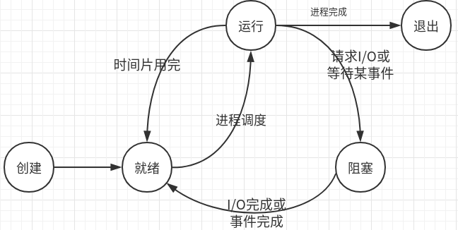

# 计算机操作系统

参考：

GitHub仓库CS-Notes

<https://github.com/CyC2018/CS-Notes/blob/master/docs/notes/%E8%AE%A1%E7%AE%97%E6%9C%BA%E6%93%8D%E4%BD%9C%E7%B3%BB%E7%BB%9F%20-%20%E7%9B%AE%E5%BD%95.md>

## 进程与线程

### 进程

---

进程是资源分配的基本单位，多进程交替并发执行。

#### 进程的基本状态

1. 就绪状态：等待被调度，通常在队列中，以优先级排队等待。
2. 运行状态
3. 阻塞状态

#### 进程调度算法

不同环境的调度算法目标不同，因此需要针对不同环境来讨论调度算法。

1. **批处理系统**（该系统的调度算法目标是：**保证吞吐量和周转时间**）

   1.1 先来先服务

   1.2 短作业优先

   1.3 最短剩余时间优先

2. **交互式系统**（**保证快速地响应**）

   交互式系统，是最常见的系统设计：比如IOS的3DTouch，能够保证优先级和快速响应。

   2.1 **时间片轮转**

   ​	每次调度，CPU将时间分配给队首的进程，该进程执行一个时间片，时间片用完，计时器发出中断，停止该进程，将该进程送至队列末尾，继续下一次的调度。

   ​	时间片不可太长，是实时性就无法保证；也不可太短，频繁切换进程，浪费太多时间。

   2.2 优先级调度

   ​	为每个进程分配优先级，按优先级进行调度。随着时间的推移，低优先级的进程会被提高优先级，防止永远不会被执行。

   2.3 多级反馈队列（时间片和优先级算法的结合，UNIX系统采用的调度算法）	

3. **实时系统**

   3.1 硬实时调度算法：任务必须在确定时间内完成。

   3.2 软实时调度算法：大部分任务必须在确定时间内完成。允许一定的超时

#### 进程间通信（IPC InterProcess Communication）

IPC方式：

1. 管道（无名管道、命名管道FIFOs）

   （1）无名管道：

   - 半双工：数据只能一个方向流动，固有读端和写端

   - 只能用于**父子进程**或者**兄弟进程**

   - 是一中只存在于内存当中的特殊文件

     

   （2）FIFOs（命名管道）

   - 可以在无关的进程之间交换数据。
   - 通信方式类似于在进程中使用文件来传输数据，FIFO文件同时具有管道特性
   - 在从管道中读出数据时，FIFO管道会同时清除数据，并且先进先出

2. 消息队列

   - 存放在内核中。每个消息队列由一个队列ID（标识符）来标识
   - 消息队列面向记录，消息有其特定的格式，特定的优先级。
   - 消息队列是独立的，跟两个通信的进程无关，进程终止，消息队列不会被删除。
   - 消息队列不一定以先进先出的次序。

3. 信号量

   - 是一个计数器，用于实现进程金互斥、同步，不用于进程通信传递数据，如果需要传递数据，要结合共享内存。

4. 共享内存

   - 指两个或多个进程共享一个给定的存储区。
   - 共享内存是速度最快的一种IPC
   - 因为多个进程，同时操作一片内存，所以需要进行同步。
   - 信号量和共享内存 经常结合使用，信号量用来同步对共享内存的访问。

5. Socket

   可用于不同机器间的进程通信。

#### 进程互斥（进程之间争抢共享资源的排他性，竞争性）

#### 进程同步（多个进程之间存在的一种时序关系）

进程同步有四种方法可以保障

1. 临界区：不允许多个并发进程交叉执行的一段程序称为临界区。临界区是一段程序，此程序用于访问临界资源。

   临界资源：只允许一个进程使用的资源成为临界资源。

### 线程

---

线程是独立调度的基本单位

一个进程中可以有多个线程，这些线程共享进程资源

#### Java线程调度

指系统为线程分配处理器使用权的过程。

主要调度方式有两种：

- **协同式：**线程的执行时间由线程本身来控制，线程自己的工作执行完毕，主动通知系统切换到另一个线程上。

  优点：实现简单。切换线程的操作是线程自己控制的，所以不存在线程同步的问题。

  缺点：不可控制。如果线程出了问题，就会一直阻塞。

- **抢占式：**每个线程将由系统来分配执行时间，系统决定线程的切换。

Java使用的线程调度方式为**抢占式**，线程调度是由系统自动完成的。但是用户程序可以给出“建议”：比如设置线程优先级。

但是，java线程优先级，与操作系统的优先级，并不匹配。

### 进程、线程的区别

---

1. 资源

进程是资源分配的基本单位，但是线程不拥有资源，线程可以访问隶属进程的资源。

2. 调度

线程是独立调度的基本单位，在同一进程中，线程的切换不会引起进程切换，从一个进程中的线程切换到另一个进程中的线程时，会引起进程切换。

3. 系统开销

进程创建和撤销线程时的开销，远远大于线程的开销。

4. 通信

线程可以直接读写统一进程中的数据进行通信，但是进程通信需要借助IPC。

## 死锁

