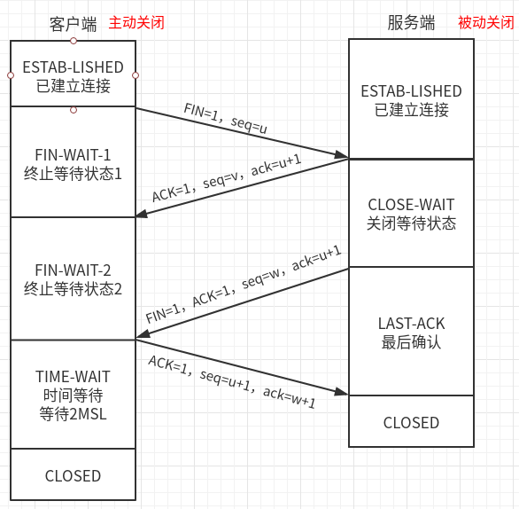

# HTTP

参考：

<https://www.cnblogs.com/zhengbin/p/5607500.html>

《图解HTTP》

## 什么是HTTP

每个服务器都有一个服务器进程，它不断地监听TCP的端口80，以便发现是否有浏览器向它发出连接建立请求。一旦监听到连接建立请求并建立了TCP连接之后，浏览器就向万维网服务器发出浏览某个页面的请求，服务器接着就返回所请求的页面作为响应。最后，TCP连接就被释放了。

HTTP协议的底层传输默认使用的是可靠的TCP协议。

**在浏览器和服务器之间的请求和响应的交互，必须按照规定的格式和遵循一定的规则。这个规则就是HTTP（超文本传输协议）。**

HTTP协议是应用层协议，在TCP/IP协议接收到数据之后需要通过HTTP协议来解析才可以使用。

## HTTP报文

用于 HTTP 协议交互的信息被称为 HTTP 报文。

- 请求端(客户端)的HTTP 报文叫做请求报文
- 响应端(服务器端)的叫做响应报文

报文结构：

1. 请求行：请求方法（GET、POST....）+ URL  +  HTTP1.1（协议版本）

2. 报文首部（请求头/响应头）

   Accept

   Accept-Encoding

   Accept-Language

   Cache-Control

   Connection: keep-alive

   Cookie

   Host

   Upgrade

   User-Agent

3. 空行（协议规定，以空行隔开，\r\n）

4. 报文主体（请求体/响应体）

来看一个请求百度的报文：

## TCP/IP

### TCP/IP 的分层管理

1. 应用层

应用层决定了向用户提供应用服务时通信的活动。

HTTP 协议也处于该层。

2. 传输层（进程间的通信）

传输层对上层应用层,提供处于网络连接中的两台计算机之间的数据传输。

3. 网络层（主机间的通信）

网络层用来处理在网络上流动的数据包。数据包是网络传输的最小数据单位。该层规定了通过怎样的路径(所谓的传输路线)到达对方计算机,并把数据包传送给对方。

4. 链路层(网络接口层)

为网络层提供数据传输服务。规定了帧的开始和结束；添加物理地址（MAC地址）；实现透明传输、差错校验（错的帧扔掉，不纠错，传输层纠错。）

5. 物理层

用来处理连接网络的硬件部分。包括控制操作系统、硬件的设备驱动及光纤等物理可见部分

#### TCP/IP通信传输流(封装)


我们用 HTTP 举例来说明

- 首先作为发送端的客户端在应用层(HTTP 协议)发出一个想看某个 Web 页面的 HTTP 请求。

- 接着,为了传输方便,在传输层(TCP 协议)把从应用层处收到的数据(HTTP 请求报文)进行分割,并在各个报文上打上标记序号及端口号后转发给网络层。

- 在网络层(IP 协议),增加作为通信目的地的 MAC 地址后转发给链路层。这样一来,发往网络的通信请求就准备齐全了。

- 接收端的服务器在链路层接收到数据,按序往上层发送,一直到应用层。当传输到应用层,才能算真正接收到由客户端发送过来的 HTTP请求。

- 

- 发送端在层与层之间传输数据时,每经过一层时必定会被打上一个该层所属的首部信息。反之,接收端在层与层传输数据时,每经过一层时会把对应的首部消去。

  这种把数据信息包装起来的做法称为封装.


### 与HTTP关系密切的协议:IP/TCP/DNS

---

#### IP:负责传输

IP(Internet Protocol)网际协议位于网络层

IP 协议的作用是把各种数据包传送给对方。

要保证确实传送到对方那里,则需要满足各类条件:

- IP地址：指明了节点被分配到的地址
- MAC地址：指网卡所属的固定地址（物理地址）

#### TCP：确保可靠性

TCP 位于传输层,提供可靠的字节流服务。

- 字节流服务(Byte Stream Service)是指：为了方便传输,将大块数据分割成以报文段(segment)为单位的数据包进行管理。
- 可靠的传输服务是指：能够把数据准确可靠地传给对方。

**先看一下TCP的状态（SYN, FIN, ACK, PSH, RST, URG）**

- SYN：synchronize

  连接建立时用于同步序号。当SYN=1，ACK=0时表示：这是一个连接请求报文段。若同意连接，则在响应报文段中使得SYN=1，ACK=1。因此，SYN=1表示这是一个连接请求，或连接接受报文。SYN这个标志位只有在TCP建产连接时才会被置1，握手完成后SYN标志位被置0。

- FIN：finish

  用来释放一个连接。FIN=1表示：此报文段的发送方的数据已经发送完毕，并要求释放运输连接

- ACK：acknowledgement

  表示响应；占1位，仅当ACK=1时，确认号字段才有效。ACK=0时，确认号无效。

- PSH：push，表示有数据传输

  提示接收端应用程序立即从TCP缓冲区把数据读走。

- RST：reset，表示重置

  对方要求重新建立连接，复位。

- Seq：sequence数据包序号

  占4个字节，期待收到对方下一个报文段的第一个数据字节的序号；序列号表示报文段携带数据的第一个字节的编号；而确认号指的是期望接收到下一个字节的编号；因此当前报文段最后一个字节的编号+1即为确认号。

为了准确无误地将数据送达目标处,TCP 协议采用了**三次握手(three-way handshaking)策略**

```
TCP 协议把数据包送出去后,TCP不会对传送后的情况置之不理,它一定会向对方确认是否成功送达。
握手过程中使用了 TCP 的标志(flag) —— SYN(synchronize) 和ACK(acknowledgement)
```


- 第一次握手：建立连接时，客户端发送syn包（syn=j）到服务器，并进入**SYN_SENT**状态，等待服务器确认；SYN：同步序列编号
- 第二次握手：服务器收到syn包，必须确认客户的SYN（ack=j+1），同时自己也发送一个SYN包（syn=k），即SYN+ACK包，此时服务器进入**SYN_RECV**状态；
- 第三次握手：客户端收到服务器的SYN+ACK包，向服务器发送确认包ACK(ack=k+1），此包发送完毕，客户端和服务器进入**ESTABLISHED**（TCP连接成功）状态，完成三次握手。

**为什么要三次握手**

```
假如老外迷路:
老外： Excuse me，Can you Speak English?
小明： yes 。
老外： OK,I want ...
至此,开始交流(发送http请求)
```

三次握手的目的：主要是为了同步client和server的连接建立。防止server一直等待，浪费资源。

#### 四次挥手

<https://blog.csdn.net/qq_38950316/article/details/81087809>

为什么要四次？

因为TCP的连接是全双工的，所以连接的拆除需要单独将两个通道分别拆除，而四次挥手所做的事情就是**拆除两条通道**和**释放资源**。



1.首先客户端请求断开连接：两次挥手

- Client主动发起一个Req给Server，里面包含标志位FIN=1，CLient的Seq序列号u（**请求关闭连接**）,

  此时客户端进入**FIN-WAIT-1状态**

- Server端在收到这个含有FIN的Req消息之后，校验无误之后会立马回复ACK消息给CLient端，消息内部包含ACK标志位=1，同时ack=u+1，并附上自己的序列号seq=v，表示统一关闭连接。服务端进入**CLOSE-WAIT状态**

- 客户端收到服务端的确认信息之后，客户端进入**FIN-WAIT-2状态**，等待服务端发送连接释放报文。

2.服务端请求断开连接：两次挥手

- Server会主动发起FIN的Req消息给Client端。消息内部带有，FIN=1的结束符标识位，ack=u+1，服务端的seq序列=w，服务器进入**LAST-ACK最后确认状态**
  - Client端在收到对应的FIN消息之后，会主动通知应用层程序，告知这个连接现在需要关闭了.然后,Client会回复ACK=1，ack=w+1，和自己的序列号seq=u+1，之后客户端进入**TIME-WAIT时间等待状态**，此时的连接并没有被释放，需要等待2MSL时间。之后，如果没有意外，就进入**CLOSED状态**。
- 服务端收到确认信息，就进入**CLOSED状态**，结束了此次TCP连接。

#### 为什么TIME-WAIT等待2MSL，2MSL是多长？

MSL：报文最大生存时间。一般是2分钟，实际常用30s、1分钟

这样等待之后才进入CLOSED状态的目的是：第四次握手的确认信号，服务端如果没有收到，服务端在等待确认超时后，会再次发送第三次握手的请求包，客户端收到了，再继续发送确认信号。

#### DNS:负责域名解析

DNS(Domain Name System)服务是和 HTTP 协议一样位于应用层的协议。它提供域名到 IP 地址之间的解析服务

​	用户通常使用主机名或域名来访问对方的计算机,而不是直接通过 IP地址访问。因为与 IP 地址的一组纯数字相比,用字母配合数字的表示形式来指定计算机名更符合人类的记忆习惯。

```
为了解决上述的问题,DNS 服务应运而生。DNS 协议提供通过域名查找 IP 地址,或逆向从 IP 地址反查域名的服务。
```


#### IP地址分类：

A类地址：以0开头，第一个字节范围：0~127；

B类地址：以10开头，第一个字节范围：128~191；

C类地址：以110开头，第一个字节范围：192~223；

D类地址：以1110开头，第一个字节范围为224~239；

E类地址：以1111开头，网络号取值于240~255之间。

#### UDP和TCP区别

- **UDP**：在传送数据之前不需要先建立连接，远地主机在收到UDP报文后，不需要给出任何确认。虽然UDP不提供可靠交付，但在某些情况下UDP确是一种最有效的工作方式（一般用于即时通信），比如： QQ语音 QQ视频 、直播（实时性要求高）等等
  - 面向无连接的；
  - 基于数据报的；
  - 不保证数据正确性和数据顺序；
- **TCP**：提供面向连接的服务。在传送数据之前必须先建立连接，数据传送结束后要释放连接。TCP一般用于文件传输、发送和接收邮件、远程登录等场景。
  - 面向连接的；
  - 面向字节流的；
  - 保证数据正确性和数据顺序；

底层区别：

UDP和TCP的包头区别：


TCP中的序号：就确保了数据到达的顺序。相当于给每一个包进行了排序；

确认序号：确保了数据的正确性；

IP协议是不可靠的，就会出现这样的问题：1. 数据包发送不成功；2.数据包在传输过程中被丢弃；3. 接收端收不到数据包；

TCP为了解决这样的问题，采用了：1.ACK回复机制；2. 重新发送的机制（没有收到ACK回复，就重新发送）

## 一次完整的HTTP请求

#### 1.域名解析

- 首先浏览器搜索自身的DNS缓存
- 如果浏览器没有缓存,则会搜索系统的DNS缓存
- 如果还没有,就从hosts文件中找
- 还没有,就递归地去域名服务器查找

`DNS优化：两个方面：DNS缓存、DNS负载均衡`

#### 2.TCP连接(三次握手)


#### 3.建立TCP连接后,发送HTTP请求

HTTP请求报文由三部分组成：请求行，请求头和请求正文

- 请求行：用于描述客户端的请求方式，请求的资源名称以及使用的HTTP协议的版本号
- 请求头：用于描述客户端请求哪台主机，以及客户端的一些环境信息等
- 空行
- 请求正文(数据)

```
POST /user HTTP/1.1      //请求行
Host: www.user.com
Content-Type: application/x-www-form-urlencoded
Connection: Keep-Alive
User-agent: Mozilla/5.0.      //以上是请求头
（此处必须有一空行）  //空行分割header和请求内容 
name=world   请求正文
```

#### 4.服务器响应HTTP请求,浏览器获得html代码 

HTTP响应也由三部分组成：状态码，响应头和实体内容

- 状态码
- 若干响应头
- 实体内容

#### 5.浏览器解析html代码,并请求html代码中的资源

览器拿到html文件后，就开始解析其中的html代码，遇到js/css/image等静态资源时，就向服务器端去请求下载

**此时就需要用到`Connection:keep-alive`特性了**,建立一次连接,就可以请求多个资源

针对每个资源,进行多线程请求,页面显示顺序不一定按照代码顺序执行

#### 6 .浏览器对页面进行渲染呈献给用户

浏览器是一个**边解析边渲染**的过程

- 首先浏览器**解析HTML文件构建DOM树**
- 然后**解析CSS文件构建渲染树**
- 等到渲染树构建完成后，浏览器开始布局渲染树并将其绘制到屏幕上

　JS的解析是由浏览器中的JS解析引擎完成的。JS是单线程运行，JS有可能修改DOM结构，意味着JS执行完成前，后续所有资源的下载是没有必要的，所以JS是单线程，会阻塞后续资源下载

**至此,完整的HTTP请求完成**

#### 7.一般服务器发送完数据会关闭TCP连接

​	如果浏览器的请求头信息中有`Connection:keep-alive`,则会保持连接


## HTTP是不保存状态的无状态协议

​	HTTP 协议自身不对请求和响应之间的通信状态进行保存。也就是说在 HTTP 这个级别,协议对于发送过的请求或响应都不做持久化处理。

​	使用 HTTP 协议,每当有新的请求发送时,就会有对应的新响应产生。协议本身并不保留之前一切的请求或响应报文的信息。这是为了更快地处理大量事务,确保协议的可伸缩性,而特意把 HTTP 协议设计成如此简单的。

```
但是这种无限航太协议，对于业务处理不利：不能保存用户状态．于是有了Cookie技术
```


## 几种HTTP方法来告知服务器意图

- GET：获取资源

  GET 方法用来请求访问已被 URI 识别的资源。

- POST：传输实体主体

- PUT：传输文件

  此方法自身不带验证机制，任何人都可以上传文件，因此一般不用

- HEAD：获得报文首部

- DELETE：删除文件

  按请求 URI 删除指定的资源。

- OPTIONS：询问支持的方法

- TRACE：追踪路径

  客户端通过 TRACE 方法可以查询发送出去的请求是怎样被加工修改/ 篡改的。这是因为,请求想要连接到源目标服务器可能会通过代理中转,TRACE 方法就是用来确认连接过程中发生的一系列操作。

- CONNECT：要求用隧道协议连接代理

#### POST和GET

1. GET是从服务器获取数据；POST是向服务器传送数据；

2. GET把参数队列加到URL中，参数在请求头中保存；POST的参数在http请求的请求体中；

3. GET传送数据量小，小于2KB；POST一般不受限制，传输数据量大；

4. GET是安全和幂等的；

   安全：不会修改数据，只是获取资源，像是数据库中的查询操作。

   幂等：每次访问同一个URL，返回同样的结果。

#### 持久连接

特点：只要任意一端没有明确提出断开连接,则保持 TCP 连接状态。

#### 管线化

持久连接使得多数请求以管线化(pipelining)方式发送成为可能。从前发送请求后需等待并收到响应,才能发送下一个请求。管线化技术出现后,不用等待响应亦可直接发送下一个请求。

这样就能够做到同时并行发送多个请求,而不需要一个接一个地等待响应了．


## HTTP状态码

### 2XX:成功

- 200：请求被正常处理

- 204：请求被受理但没有资源可以返回

- 206：客户端只是请求资源的一部分，服务器只对请求的部分资源执行GET方法，相应报文中通过Content-    Range指定范围的资源。


### 3XX:重定向

- 301：永久性重定向

- 302：临时重定向

- 303：与302状态码有相似功能，只是它希望客户端在请求一个URI的时候，能通过GET方法重定向到另一个URI上

- 304：发送附带条件的请求时，条件不满足时返回，与重定向无关

- 307：临时重定向，与302类似，只是强制要求使用POST方法


### 4XX:客户端错误

- 400：请求报文语法有误，服务器无法识别

- 401：请求需要认证

- 403：请求的对应资源禁止被访问

- 404：服务器无法找到对应资源


### 5XX:服务器错误

- 500：服务器内部错误
- 503：服务器正忙

##  Http与Https的区别：

1. HTTP 的URL 以http:// 开头，而HTTPS 的URL 以https:// 开头
2. HTTP 是不安全的，而 HTTPS 是安全的
3. HTTP 标准端口是80 ，而 HTTPS 的标准端口是443
4. 在OSI 网络模型中，HTTP工作于应用层，而HTTPS 的安全传输机制工作在传输层
5. HTTP 无法加密，而HTTPS 对传输的数据进行加密
6. HTTP无需证书，而HTTPS 需要CA机构wosign的颁发的SSL证书

 

## URI和URL的区别

#### URI，是uniform resource identifier，统一资源标识符，用来唯一的标识一个资源。

Web上可用的每种资源如HTML文档、图像、视频片段、程序等都是一个来URI来定位的

URI一般由三部组成:

- 访问资源的命名机制
- 存放资源的主机名
- 资源自身的名称，由路径表示，着重强调于资源。

#### URL是uniform resource locator，统一资源定位器.

它是一种具体的URI，即URL可以用来标识一个资源，**而且还指明了如何locate这个资源。**

URL一般由三部组成

- 协议(或称为服务方式)
- 存有该资源的主机IP地址(有时也包括端口号)
- 主机资源的具体地址。如目录和文件名等


