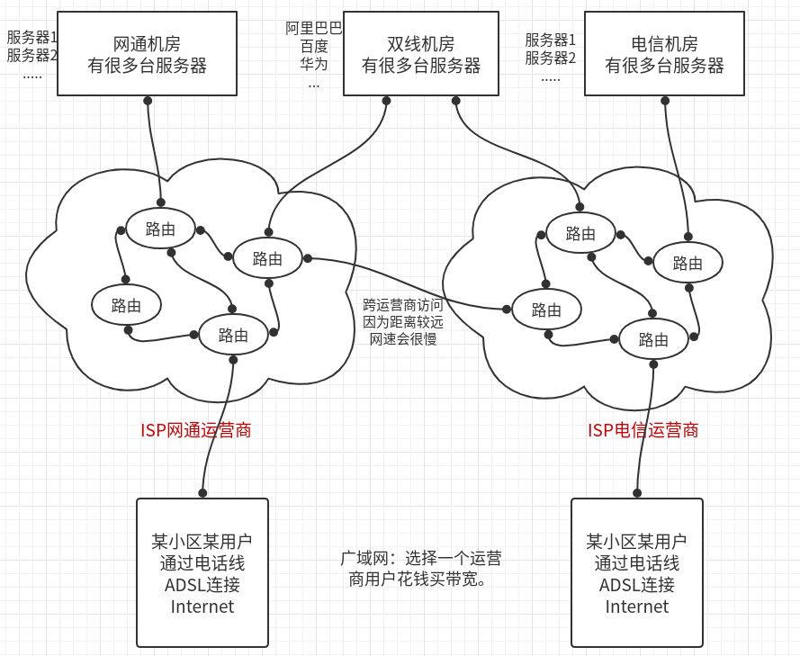
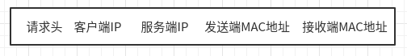
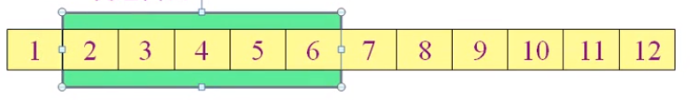

# 0040计算机网络

## 概述

- **局域网**：覆盖范围小，需要一些设备，带宽固定，自己维护。两个电脑接一根网线，就可以说是局域网。

  星型网、总线型（被替代了）、环形网、树型网.....

  下图就是一个局域网


- **广域网**：就是家用宽带（ADSL）。举例较远，花钱买带宽，如100M宽带、200M宽带
- **Internet**：由很多ISP（InternetServiceProvider 运营商）组成。国内有很多运营商，每个运营商都有自己连接Internet的出口。




路由：在不同网段，负责转发数据。

### PC是如何访问一个网站的

首先呢：

- PC、服务器、路由、DNS解析都有自己的IP地址和MAC地址（物理地址）


1. PC1想要访问http://github.com，首先要解析域名，找到对应的IP地址。

   那么PC1会先请求DNS服务器（一般由ISP运营商给用户分配的DNS域名服务器）

   然后，返回给PC1http://github.com的IP地址13.0.0.1。

2. 有了IP地址，就可以发送数据包了，那么数据包大概都包含什么内容？下面是一个数据包；

   请求头：日后再说

   客户端IP：表示发送请求的IP地址，即始发地。

   服务端IP：表示要请求的网页的IP地址，**决定了最终目的地**。

   **MAC：每台计算机或者路由器都有特定的物理MAC地址。决定了数据包下一站发送到哪个路由。比如图中，我们的计算机PC1，将数据包发送给了路由G，而非PC2，就是因为确定了MAC地址**



3. 对应MAC地址的路由器接收到数据包，并将数据包的MAC地址修改，发送到下一个路由器中，这样一直发送下去，直到找到目标IP地址。

   **路由器并不是随意传给下一个路由器，而是根据目标IP地址决定下一个路由器**。

4. **三次握手之后**，服务器开始发送数据；服务器会把网页分割成很多分，陆续放入缓存中，然后陆续发送给客户端，客户端，每收到一次数据包，就回应一个确认信息。服务器就继续发送下一个数据包，并删除已发送的数据包的缓存；

   如果中途丢包，服务器没有收到响应，会重新发送。没有确认信息，是不会进行下次发送的。（这里是传输层的工作）

   这样，发送过程中，客户端就在不断地生成页面，直到全部接受完毕，页面渲染完成。

   这样分割网页发送：节省带宽，还可以部分加密

## OSI七层模型

参考视频：

<https://www.bilibili.com/video/av9876107/?p=7>

**每层都为上一层服务，但是互不影响，但又相互关联。**

- **应用层**：产生网络流量的程序：QQ、微信

- **表示层**：应用层之下，为数据发送之前，做准备：提供了文本压缩、数据加密、解密、数据转换、编码、格式转换、是以二进制传输，还是ASCII码传输等等功能。可以降低需要的带宽。

  乱码就是表示层出现了问题。

  （开发人员需要自行开发的层）

- **会话层**：客户端服务器之间需要建立会话（session）才能通信。

  比如：打开一个网站，看电影，就与服务器建立了会话。快进，暂停，都会与服务器进行通信。

  ​	规定时间内，没有任何交互，会话释放。

  ​		netstat -n 可以查看会话：ESTABLISHED已经建立的会话；TIME_WAIT会话即将关闭

- **传输层**：可以进行可靠传输，不可靠传输，流量控制。发送数据包就是通过传输层。

  客户端打开网页，服务器将网页分割发送，客户端每次收到，返回确认信息，服务端才会发送下一部分的网页。如果包丢了，会进行重发。这就是传输层实现的。

- **网络层**：负责选择路由的最佳路径、规划IP地址。组装数据包

- **数据链路层**：为网络层提供数据传输服务。规定了帧的开始和结束；添加物理地址（MAC地址）；实现透明传输、差错校验（错的帧扔掉，不纠错，传输层纠错。）

- **物理层**：规定了接口标准：比如规定：网线水晶头里面八根线；规定了电压标准；

各种公司，按照这样一个七层模型的规范去生产网络设备，就可以实现通信；

## TCP/IP协议

TCP/IP和OSI七层模型的关系


#### 数据封装过程


- 应用层交互单元：报文；

- 传输层：因为一台主机可以同事运行多个进程，因此传输层有复用和分用功能；

  复用：就是多个应用层进程可以同时使用下面运输层的服务；

  分用：与复用相反，是运输层把收到的信息分别交付给应用层的响应的进程。

  传输层主要有两个协议：TCP、UDP

- 网络层：在发送数据时，网络层把运输层产生的**报文段或用户数据**封装成**数据包**，进行传送；

- 数据链路层：将数据包封装成帧，在网络中的相邻节点的链路上传送帧。

- 物理层：传输单位是比特；

#### 计算机网络的性能指标

1. **速率**

   比特率：计算机网络在主机的数字信道上传送**数据位数**的速率，俗称网速。

   ​		1 bit也就是二进制的一位。1000b/s就是每秒传输1000 bit

   但是，计算机内部，如360测网速，是按照byte字节单位来计算的。比如，所说的4M带宽，是按照bit单位，换算之后，也就是4M/8=512K/s的速率，这里是512kByte/s，理论值是除以8，实际要除以10;

   1 Byte = 8 bits

2. **带宽**

    是指：网络设备所支持的最高传输速度。


3. **吞吐量**

   即：单位时间内通过某个网络的数据量

   按上图来说，就是单位时间内，服务器的吞吐量为400KB/s

4. **时延**

   数据从网络的一段，传送到另一端，需要的时间。在各个阶段，都需要一定的时间

   

   **发送时延**：可能数据包过大，带宽较小，就需要时间来传输出去。数据块大小/信道带宽=发送时延

   **传播时延**：在线路上传播的过程消耗的时间。光纤就比较块，传播时延较小。

   **处理时延**：路由器决定下一个转发，就需要处理时延。

   **排队时延**：如果进入路由器的数据量过大，就要排队了


## 物理层

解决了如何在计算机互相连接的媒体上传输比特流。

主要任务：确定各种媒体接口的一些特性。

如规定了

机械特性：网口的形状大小，引线数目。

电气特性：规定了电压范围（-5～+5）

过程特性：规定建立连接时各个相关部件的工作步骤

......

#### 信道概念

单向通信（**单工通信**）：一个方向的通信，没有反向交互。

双向交替通信（**半双工通信**）：不能同时发送，只能交替。一方发送，一方只能接收。

双向同时通信（**全双工通信**）：可以同时发送和接收消息。

#### 网线

UTP传输：无屏蔽双绞线

STP传输：屏蔽双绞线

网线都是八根线总成的，在水晶头中是有依次的顺序的。

**直通线**用的最多：主机到交换机，路由器到交换机都是用直通线。

10～100M的网络只用3根线通信

1000M网络，使用八根线全部通信。

---


## 数据链路层

**链路**：主机H1到路由R1中的物理网线，就是一个链路，两个节点之间的连接就是。

**数据链路**：添加上数据和各种通信协议来约束通信到链路上。

数据链路层主要使用两种信道：

1. 点对点信道（PPP协议，在广域网使用较多）
2. 广播信道（局域网）

#### 数据链路层解决三个基本问题：

1. **封装成帧**
2. **差错检测**
3. **透明传输**

#### 1. 封装成帧


将网络层的数据包（1500字节），进行包装，加上数据帧头部（存放一些开始符，表示帧的开始），进行数据包的校验，在尾部，添加尾部数据和校验值。

在达到目的地之后，根据头部，尾部，区分每一个数据帧，拆封数据帧，拿到数据包。

**如果说，数据的数据包部分出现了和帧开始符，帧结束符相同的数据（如下图）**：

那么就在前面插入ESC转移字符，代表，这里是数据包，不是结束和开始，如果出现ESC字符，也同样，在前面加上转义字符。


#### 2. 差错检测FCS

在数据的传输过程中，有可能数据包内数据发生变化，出现错误。路由器发现出错了，就会扔掉此帧。

那么，路由过程中，路由器如何判断数据出错了？

数据帧的封装过程，会在尾部添加FCS（**帧检验序列**），校验参数。来确定记录数据。路由器就通过FCS来判断数据是否出错。

FCS是通过**循环冗余检验算法（CRC）**，计算出来的。

路由器进行检测的时候，使用相同的算法，进行检测，只能检测是否出错，不能检测哪里出错。

## 网络层

网络层：向上只提供简单灵活的，无连接的，尽最大努力交付的数据报服务，不提供服务质量的承诺；

- 无连接
- 不可靠

在发送数据前，网络层把运输层产生的**报文段或用户数据**封装成**数据包**（添加IP地址），进行传送；

- 网络层不管数据是否完整，只负责在不同的路由间**转发数据包**，基于数据包的IP地址转发；
- 不负责重传，也不负责转发的顺序；
- 网络层通过路由表来进行转发（静态路由：管理员设置；动态路由：通过IP的多种协议自己学习）；

### IP地址

分为五类：


- A，B，C类地址固定位 { 网络号+主机号 } 

  - A类网络号占1个字节，主机号3字节；规定起始位为0

    即范围：00000001 00000000 00000000 00000001 ～01111111 11111111 11111111 11111110

    一般用十进制表示：1.0.0.1~126.255.255.254

    其中：127.0.0.1为回环地址

  - B类网络号占2个字节，主机号2字节；规定起始位为10

    同上面方法一样，范围：128.0.0.1~191.255.255.254

  - C类网络号占2个字节，主机号1字节；规定起始位为110‘

    范围：192.0.0.1~223.255.255.254

- D类地址用于多播，起始位：1110

  224.0.0.1—239.255.255.254

- E类地址保留今后使用；起始位1111

  240.0.0.1—255.255.255.254

### 网络层协议


#### ARP协议

负责解析目标IP地址的MAC地址；

在通信时，只知道目标IP地址，是不够的，还需要知道目标MAC地址；如何知道目标MAC地址？

ARP协议会发送一个广播数据包，来查询目标IP的MAC地址，查询到了之后，会缓存到本地；

使用arp命令查看；

**只能解析本网段的MAC地址，无法跨路由器**；

ARP欺骗：缓存了错误的MAC地址；

如果缓存了错误的本网段的路由器的MAC地址，那么就无法与外网通信；

#### IP协议

选路协议，使得路由器，学习得到路由表的协议统称为IP协议；

RIP，OSPF等多种协议；

#### ICMP协议

在IP协议之上，用来检测网络层是否有故障；

ping命令就是此协议；

```shell
whr@master:~/Desktop$ ping 14.215.177.39
PING 14.215.177.39 (14.215.177.39) 56(84) bytes of data.
64 bytes from 14.215.177.39: icmp_seq=1 ttl=52 time=28.5 ms
64 bytes from 14.215.177.39: icmp_seq=2 ttl=52 time=29.8 ms
```

TTL：生存周期；防止在路由之间循环；发送端给一个定值比如60，每经过一个路由，减一，为0，则丢弃；

#### IGMP协议

因特网组管理协议，手机TCP/IP协议族中负责IP组播成员管理的协议，它用来在接受者和与其直接相邻的组播路由器之间建立、维护组播组成员关系。

### IP数据包

一个IP数据包由首部和数据两部分构成：（最大65535 字节）


- 首部：固定长度20字节，所有IP数据包固有部分；IPV4存在可变部分，IPV6不存在可变部分，固定20字节；


- 版本：用来表示TCP/IP协议的版本 IPV4，IPV6；（4 bit）

- 首部长度：一般20字节，如果存在可变字段，会用到这个量；
- 区分服务：数据包存在优先级，区分服务用于区分优先级，让优先级高的数据包先传输；（QOS）

- 总长度：整个IP数据包的长度，用2字节表示；在链路层会判断数据包的大小，大于1480字节（加上帧开始符和帧结束符，一共1500字节），会进行数据包的分片；

- 标识：在数据包分片之后，进行编号，有相同标识的分片数据，表明是同一个数据包，根据相同编号，来组装成一个完整的数据包；
- 标志：用来标记，此数据包是分片，还是完整的数据包；（3 bit）

- 偏移量：分片数据包占总数据包的偏移位置；第一个包偏移：0，第二个包偏移：1480，以此类推；
- 生存时间TTL：每经过一个路由，TTL减1，TTL为0，数据包作废；防止数据包在环路路由内循环；windows默认TTL：128，Linux：64，Unix：255；
- 协议号：表明数据部分的协议：TCP（6），UDP（17），ICMP（2），IGMP（1）；

- 首部检验和：判断整个数据包的首部，在传输过程中有没有出现错误，在接受端收到数据包会计算检验和，如果为0，则保留，否则丢弃；

- 源IP地址：占32 bit，发送端IP；
- 目的IP地址：占32 bit，接收端IP；

## 传输层

### TTL、MSL、RTT

TTL：（Time To Live 生存时间）存在与IP头中，每经过一次路由，TTL减一，TTL=0，此数据报将被丢弃；

MSL：（Maximum Segment Lifetime  报文最大生存时间 ）任何报文在网络上存在的最长时间，超过这个时间报文将被丢弃

RTT：（Round-Trip Time） RTT是客户到服务器往返所花时间

### TCP

Transmission Control Protocol，传输控制协议

一个网页，用一个数据包是无法完成传输的，要分成多个数据包，进行传输，并且数据包有可能丢失重传；

这就要求客户端和服务端保持一个会话，**建立可靠传输**，进行流量控制，一直到数据完全传输完成；

比如：QQ传输文件，使用TCP，需要分段，流量控制，丢包重传的可靠传输；

#### TCP特点

- 面向连接的传输层协议

- 每一条TCP连接只能有两个端点（这个点就是套接字），所以TCP只能点对点；

  套接字就是：socket=（IP地址：端口）

  TCP连接 ::= {socket1，socket2}={(IP1：port1)，(IP2：port2)}

- TCP提供可靠交付服务；

- TCP提供全双工通信（通信过程中，一边传输，一遍反馈）；全双工就是打电话，半双工就是呼叫机；

- 面向字节流传输（字符：1个字母1个字节，图片：全是二进制，8位1字节）；

  服务端数据会以字节流的形式，随机切分放入TCP缓存中，再分段加上IP首部进行传输，到达客户端，拆分放入客户端的TCP缓存，再进行重组，即拿到数据；

#### TCP报文首部


- 源端口，目标端口：各占2字节；

- 序号：数据分段的时候，每一段的第一个字节在整个数据中是第几个字节，序号就是几；用于能够准确的分段发送数据；

- 确认号：接收端收到数据之后，返回确认信息；确认号是接收端要接受的下一个数据包的起始字节；

  （就是下一个数据包的序号）

  比如1~4字节发送完成，接收端返回确认信息5，表明要求发送第5个字节起始的数据包；

- 数据偏移：用来记录，TCP首部从开始数，第几个字节开始是数据部分；

  （4位二进制表示，1个1代表4个字节，也就是说最长60字节，以后是数据）

- 保留：6位二进制，没有用；

  - URG：urgent表示紧急数据，此标志位=1，能够在发送端的TCP缓存中插队；比如用Ctrl+C打断数据传输，此命令的数据包会插队到TCP缓存第一位置，进行打断数据传输；

  - ACK，SYN：ACK表示确认号是否有效，SYN表示想要建立会话

    （**三次握手**）客户端想要与服务器建立会话，客户端向服务器发送数据包中序号=0，确认号=0，ACK=0（表示确认号无效，这个包中没有确认号），SYN=1（表示想要建立会话）；

    服务器同意建立会话，返回的数据包中SYN=1（表示可以建立回话），ACK=1（表示确认号有效），序号=0，确认号=1；

  - PSH：PUSH标志位，主要用于数据接收端，此标志位为1的数据包在接收端的TCP缓存中能够插队，优先提交；

  - RST：此值为1，表明会话出现严重问题，需要断开连接重新建立；比如刷新页面，就是RST标志位为1，重新建立会话；

  - FIN：表示释放连接的标志位；比如一个会话的数据传输完毕，后续数据包的FIN为1，表示释放连接；（**四次挥手**）

- 窗口：

- 校验和

- 紧急指针：只有URG为1，此指针才发挥作用，表示紧急数据的结束字节数；（2个字节）

#### TCP可靠传输的工作原理

三次握手建立连接之后，如何进行可靠传输：

##### 停止等待协议

就是没有确认，就停下来等待


- 无差错情况：不确认，就不发送数据；
- 超时重传：数据包丢了，超时（RTT），重新发送；一个来回是一个RTT时间（往返时间）；


- 确认丢失：在确认信息，返回的途中丢失了，A依然重传，B重复确认；
- 确认迟到：确认信息，迟到了，A依然重传，B重复确认；

##### 连续ARQ协议和滑动窗口

停止等待协议有点是简单，但是缺点是信道利用率太低；


连续ARQ协议：


一次发送多个数据包，而不进行等待；

此协议配合**以字节为单位滑动窗口协议**：




发送窗口：表示一次性可发送的数据包的个数，当1收到确认，则窗口右移一位，继续发送6；

#### TCP如何实现可靠传输

看视频：https://www.bilibili.com/video/av9876107/?p=67，很详细

1. 以字节为单位的滑动窗口

   - 不存在丢包的情况
   - 存在丢包的情况

2. 超时重传时间的选择

   A向B发送数据包，等待确认信息，等多久？再重发；（这个等待时间是动态调整的）

   超时重传时间应略大于RTTS(平均往返时间)，RTTS是根据之前的往返时间，加权平均算出来的；

3. 选择确认SACK

   在丢包的情况下，比如1~10字节的6～8字节丢包，可以只重发丢失的数据包，而不是6~10字节全部重发；

#### TCP如何实现流量控制

https://www.bilibili.com/video/av9876107?p=68

为什么要流量控制？

因为客户端和服务器处理数据的速度不相同，不能出现，发送方发送太快，接收方来不及接受，而导致数据丢失的情况，所以需要流量控制，让发送方不要发的太快，接收方能够全部接受；

**利用滑动窗口实现流量控制**

- 一句话总结：修改滑动窗口大小，来实现流量控制！

比如：A为发送方，B为接收方

在建立连接的时候，B会告诉A：B的滑动窗口大小（比如rwnd=400）；

A会根据B的rwnd大小，来调整自己的窗口大小；

B在恢复确认信息的时候，可以动态控制滑动窗口的大小，来给自己处理数据的时间；

比如，B要处理数据，恢复确认信息中rwnd=0，表示我滑动窗口为0，你别发数据了，我先处理完成之前的数据；这时候，A会发送1个字节的零窗口探测报文段给B，B如果处理完数据了，回复的rwnd大于0了，那么就继续传送数据；

#### TCP如何避免网络拥塞

拥塞控制：防止过多的数据注入到网络，使路由器或链路不至过载；

为什么要有拥塞控制？在一个局域网中有多台电脑，那么这些计算机如何避免拥塞？


措施：

（1）**慢开始和拥塞避免算法**：

发送方维持一个叫做拥塞窗口cwnd的状态变量；拥塞窗口的大小会根据网络的拥塞程度动态变化；

**慢开始算法**：


- 在主机开始发送数据的时候，因为不确定网络的畅通情况，会有小到大逐渐增大发送窗口；

  1-2-4-8.....

- 每经过一个轮次，拥塞窗口就加倍；但是不会无限制的加倍；

- 慢开始的慢，不是指增长速度的慢，而是起始大小比较小cwnd=1；

**慢开始门限(ssthresh)**：为了防止拥塞窗口不停增大，设置一个慢开始门限，在到达门限大小之后，**拥塞窗口不会加倍增加，而是以后每次加1**；

**拥塞避免算法**：拥塞窗口每次加1，线性增长；

慢开始和拥塞避免算法的图例：


- 如图说是：起始cwnd=1，通过慢开始算法：不断增加到慢开始门限16；
- 到达慢开始门限，改为拥塞避免算法：cwnd每次加1；
- cwnd不断增加，直到发生丢包现象或超时现象（这就很有可能是网络拥塞），此时：
  1. 先更新ssthresh为当前cwnd=24值的一半（12）,
  2. 拥塞窗口大小cwnd重新设置为1，执行慢开始算法，重复之前的动作；

（2）**快重传和快恢复**

如果发生丢包的情况，怎么处理？

比如第二个包丢了，接收方会将上一个确认信息（第一个包的确认信息），连续重复确认三次，来表示发生丢包现象，要求重传；


这样，发送发就会意识到网络可能出现了拥塞现象，进而采取措施，但是这里不执行慢开始算法，而是执行快恢复算法：

**快恢复算法**：直接设置拥塞窗口cwnd为新的ssthresh值（阻塞发生时的cwnd值的一半），直接开始拥塞避免算法—cwnd线性增加；

如图所示：


- 第一次拥塞之前，与上个算法类似；
- 当收到三次快速重传的确认信息后，判断可能发生拥塞，采取快恢复算法；
- 弃用慢开始算法，而使用快恢复算法，因为：**如果能顺利收到三次重复确认，说明网络还不至于特别拥塞，所以，无需采用慢开始算法**；

#### TCP的传输连接管理

传输连接有三个阶段：连接建立，数据传送，连接释放；

1. 连接建立

   TCP的连接建立都是采用客户服务器方式；

   TCP使用**三次握手**建立连接：（确保网络畅通）

   

   - 客户端A发送连接请求报文给B：SYN=1(表示想要建立会话)，ACK=0(表示无效的确认号，因为在没有真正传输数据的时候，不需要确认号)，seq=x(初始序号为x)；

     TCP规定SYN=1的报文段，不能携带数据，但要消耗掉一个序号；

     A客户机进入SYN-SENT（同步已发送状态）

   - 服务器B如果同意建立连接，则向A发送确认报文段：SYN=1，ACK=1，ack=x+1(确认号：上一个包的seq+1)，seq=Y(选择一个初始序号)，;

     此报文段，也不能携带数据，需要消耗一个序号；

     B服务器进入SYN-RCVD（同步收到状态）

   - A收到B的确认后，还需要向B进行确认，发送确认报文段：ACK=1，ack=y+1(上一个包的seq+1)，seq=x+1(这里的seq仍然是)

     此报文端可以携带数据，也可以不携带数据，不携带数据则不消耗序号，那么seq仍然是x+1；

     A收到B的确认后，状态变为ESTAB-LISHED（已建立连接状态）

     B收到A的确认后，状态变为ESTAB-LISHED（已建立连接状态）

   **明明前两次数据包已经确认了连接，为什么要发第三个数据包？**

   防止A因为迟迟未收到第二次数据包的回复，而发送了多次连接请求报文段，这样B会收到多个请求报文段，而引发错误，所以需要第三次的确认信息；

2. 数据传送

3. 连接释放

   TCP的连接释放：**四次挥手**

   

   - A首先向B发出连接释放报文：FIN=1(连接终止标志位)，seq=u(u等于A最后发送的数据的字节+1)

     然后A进入FIN-WAIT-1（终止等待1状态），等待B确认

     TCP规定：FIN报文段即使不携带数据，也要消耗一个序号；

   - B收到连接释放报文，发出确认并通知应用程序：ACK=1，ack=u+1(上一个seq+1)，seq=v(v等于B发送的数据的最后一个字节+1)；

     B进入**CLOSE-WAIT**（关闭等待状态），到此，A到B的连接就释放了，TCP连接处于半关闭状态；A已经不会向B发送数据了，但是B仍然可以向A发送数据；

   - A收到B的确认后，进入FIN-WAIT-2（终止等待2状态），等待B发出连接释放报文；

   - 若应用程序没有要向A发送的数据，就通知TCP释放连接，发送连接释放报文：

     FIN=1，ACK=1，ack=u+1(重复上次已经发送的确认号)

     seq=w(w仍然是上一个数据包的最后字节+1，在半关闭状态B有可能继续向A发送了数据)

     B进入LAST-ACK（最后确认状态）

   - A收到B的连接释放报文，返回确认：ACK=1，ack=w+1，seq=u+1

     然后A进入TIME-WAIT（时间等待状态），因为此时还需要等待2MSL才能真正释放连接，进入CLOSED状态；

   - B收到A的确认，进入CLOSED状态；

   **为什么要等待2MSL，才能进入CLOSED状态？**

   确保B能收到确认报文，如果B没收到，那么B会超时重传连接释放报文，那么A在2MSL内，就能收到这个重传的报文，再次确认；

### UDP

User Data Protocol 用户数据报协议

一个数据包就能完成数据通信，不需要分段，也不需要建立会话，也不需要流量控制，**进行不可靠传输**；

比如：QQ文字聊天，使用UDP，不考虑可靠性，传输数据量小；

比如：直播，视频，屏幕广播

#### UDP特点

- 无连接，即：发送数据之前不需要建立连接；
- 尽最大努力交付，不保证可靠传输，也不实用拥塞控制；
- 面向报文；
- 支持一对一，一对多，多对一的交互通信；
- 首部开销小，只有8字节；


#### UDP首部


- 伪首部：并不在UDP首部范围内，不向下层传递，也不向上层传递，仅仅是为了计算检验和信息；

### 常见协议使用端口

HTTP：TCP+80

HTTPS：TCP+443

RDP=TCP+3389

FTP=TCP+21

SMIP=TCP+25

DNS=UDP+53

## 应用层

### DNS

域名系统DNS—从域名解析出IP地址

域名结构：mail.cctv.com

- 顶级（一级）域名：com，edu，net，cn，org
- 二级域名：cctv，baidu
- 三级域名：mail


解析域名的流程：

第一种情况：想要访问.org的网站，直接解析

第二种情况：想要访问.com网站，org域名服务器向根DNS服务器查询com域名服务器，com域名服务器返回IP给org服务器，再返回给客户端；

### FTP

File Transfer Protocol

### URL

统一资源定位符：URL—表示从Internet上得到的资源的位置和访问这些资源的方法；

URL一般形式：

<协议>://<主机> : <路径> / <路径>

Http使用的URL：http :// <主机> : <路径> / <路径>

### HTTP

**HyperText Transfer Protocol 超文本传输 **

http是**面向事务，面向文本**的应用层协议，能够可靠的交换文件；

用户访问网站后发生的事件：

1. 浏览器分析连接指向的URL
2. 浏览器向DNS请求解析域名的IP地址；
3. 域名系统DNS解析出IP地址返回给浏览器；
4. 浏览器与服务器建立TCP连接；
5. 浏览器发出取文件命令：GET /index.html
6. 服务器给出相应，把文件发送给浏览器
7. 释放TCP连接
8. 浏览器显示文件index.html中的文本

#### HTTP 1.0

特点：

1. 无连接：

   浏览器每次请求服务器，都需要建立TCP连接，处理完一次请求就断开TCP连接；

2. 无状态：（Cookie技术解决了此问题）

   服务器不跟踪浏览器，也不记录每次请求，即：服务器不记得曾经访问过的用户；

出现的问题：

1. 无连接导致：**无法复用连接**，每次发送请求都需要建立TCP连接，十分费事，使得网络利用率很低；
2. **队头阻塞**：HTTP1.0规定，下一个请求必须等待前一个请求相应到达之后才能发送，前一个请求响应一直不到达，下一个请求无法发送；

#### HTTP 1.1

特点：继承了HTTP 1.0 的简单的特性之外，还具有：

1. **长连接**：HTTP1.1增加了**Connection**字段，通过设置**Keep-Alive**可以保持HTTP连接不断开，避免了每次都要释放连接的开销；
2. 管道化：由于长连接的实现，才有了管道化。管道化使得请求可以"并行"传输；

这里的"并行"传输并不是真正意义上的并行，只是将本来在浏览器的请求队列，迁移到了服务器端（响应队列）；但其实，**管道化并没有被支持的很好，很多浏览器并不支持，也不提倡使用**，因为他并没有解决**队头阻塞**的问题；

实际上，浏览器并行请求的实现：是通过建立多个TCP连接，进行请求而实现的；

#### HTTP 2.0

HTTP2.0通过在应用层和传输层之间增加一个二进制分帧层，突破了HTTP1.1的性能限制、改进传输性能。

#### HTTP报文

HTTP有两类报文：

- 请求报文


红框为请求行

1. 请求行：<method请求方法> <URL资源> <HTTP版本>

2. headers请求头：

   Host，Connection，User-Agent等等都是头部信息；

   **请求头完毕，必须空一行**；

3. 实体主体：即HTTP要传输的内容；请求里可有可无主体；

- 响应报文


1. 响应行：<method请求方法> <URL资源> <HTTP版本>

2. 响应头：

   

3. 实体主体：即：Line-based，响应的html文件；

HTTP是面向文本的，所以报文的每个字段都是ASCII码，因此每个字段的长度不确定；

#### HTTP请求方法

| 序号 |  方法   | 描述                                                         |
| :--: | :-----: | :----------------------------------------------------------- |
|  1   |   GET   | 请求指定的页面信息，并返回实体主体。                         |
|  2   |  HEAD   | 类似于 GET 请求，只不过返回的响应中没有具体的内容，用于获取报头 |
|  3   |  POST   | 向指定资源提交数据进行处理请求（例如提交表单或者上传文件）。数据被包含在请求体中。POST 请求可能会导致新的资源的建立和/或已有资源的修改。 |
|  4   |   PUT   | 从客户端向服务器传送的数据取代指定的文档的内容。             |
|  5   | DELETE  | 请求服务器删除指定的页面。                                   |
|  6   | CONNECT | HTTP/1.1 协议中预留给能够将连接改为管道方式的代理服务器。    |
|  7   | OPTIONS | 返回服务器允许使用的请求方法都有哪些                         |
|  8   |  TRACE  | 回显服务器收到的请求，主要用于测试或诊断。                   |
|  9   |  PATCH  | 是对 PUT 方法的补充，用来对已知资源进行局部更新 。           |

#### HTTP状态码

| 分类 | 分类描述                                       |
| :--- | :--------------------------------------------- |
| 1**  | 信息，服务器收到请求，需要请求者继续执行操作   |
| 2**  | 成功，操作被成功接收并处理                     |
| 3**  | 重定向，需要进一步的操作以完成请求             |
| 4**  | 客户端错误，请求包含语法错误或无法完成请求     |
| 5**  | 服务器错误，服务器在处理请求的过程中发生了错误 |

1XX

- 100：继续，需要客户端继续请求

2XX

- 200：服务器成功返回网页

3XX

- 301：永久重定向
- 302：临时重定向
- 304：表示此页面未修改，那么客户端就可以选择从缓存中，拿取页面；

4XX

- 404：请求网页不存在

5XX

- 503：服务器暂时不可用
- 500：服务器内部错误

### HTTPS

在HTTP的基础上通过传输加密和身份认证保证了传输过程的安全性；

### DHCP

动态主机配置协议

## 面试

**（1）TCP 的四次挥手的详细过程，为什么会有 CLOSE_WAIT 和 TIME_WAIT**

**（2）输入一个 url 并回车，这个过程中涉及到哪些网络协议，具体描述**

1. DNS解析，得到IP地址；
   - 主机查询DNS缓存，如果没有就会给本地DNS发送查询请求；
   - 本地的DNS服务器向根域名服务器发送查询请求，根域名服务器返回该域名的一级域名服务器；
   - 该本地服务器给该一级域名服务器发送查询请求，然后依次类推直到查询到该域名的IP地址；
2. 解析出IP地址后，根据该IP地址和默认端口80，和服务器建立TCP连接；
3. 浏览器发出读取文件(URL中域名后面部分对应的文件)的HTTP请求，该请求报文作为TCP三次握手的第三个报文的数据发送服务器；
4. 服务器对浏览器请求作出响应，并把对应的html文本发送给浏览器；
5. 释放TCP连接(四次挥手断开连接)；
6. 浏览器将该html文本解析并显示内容；

涉及协议：

1. 域名解析时要用到**DNS协议**，DNS服务器是基于UDP的，因此会用到**UDP协议**；
2. 得到IP地址后，浏览器就要与服务器建立一个http连接，会用到**HTTP协议**；
3. http生成一个GET请求报文，将该报文传给TCP层处理，所以会用到**TCP协议**；
4. 如果采用https还会使用**https协议**先对http数据进行加密；
5. TCP的数据包然后会发送给IP层，用到**IP协议**；
6. 需要解析目标IP地址的MAC地址，用到**ARP协议**；

**（3）Cookie 和 Session 的区别，怎样存海量 Session**

1. cookie数据存放在客户的浏览器上，session数据放在服务器上。
2. cookie不是很安全，别人可以分析存放在本地的COOKIE并进行COOKIE欺骗，考虑到安全应当使用session。
3. session会在一定时间内保存在服务器上。当访问增多，会比较占用你服务器的性能，考虑到减轻服务器性能方面，应当使用COOKIE。
4. 单个cookie保存的数据不能超过4K，很多浏览器都限制一个站点最多保存20个cookie。

分布式环境下的session（举例两种）：

1. 服务器session复制

   原理：任何一个服务器上的session发生改变（增删改），该节点会把这个 session的所有内容序列化，然后广播给所有其它节点，不管其他服务器需不需要session，以此来保证Session同步。

   优点：可容错，各个服务器间session能够实时响应。

   缺点：会对网络负荷造成一定压力，如果session量大的话可能会造成网络堵塞，拖慢服务器性能。

2. session共享机制

   使用分布式缓存方案比如memcached、redis，但是要求Memcached或Redis必须是集群。